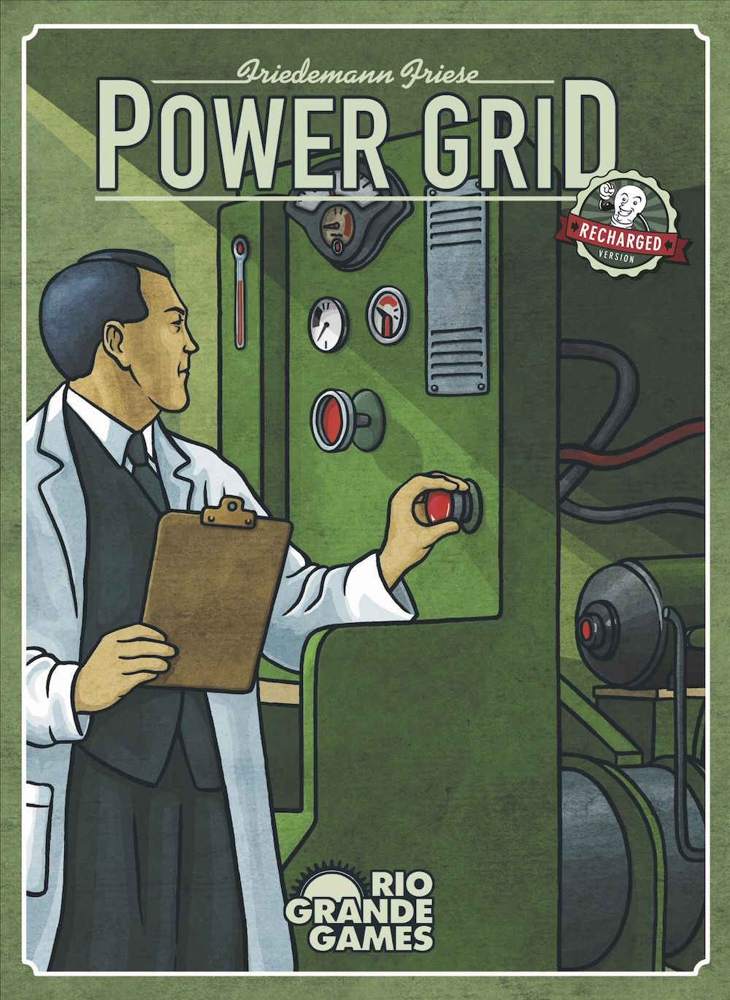
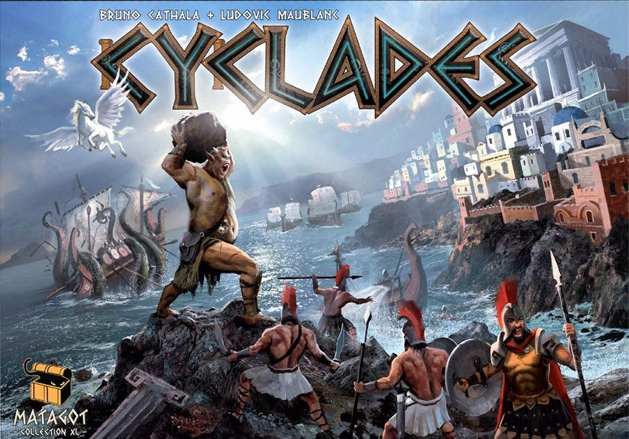
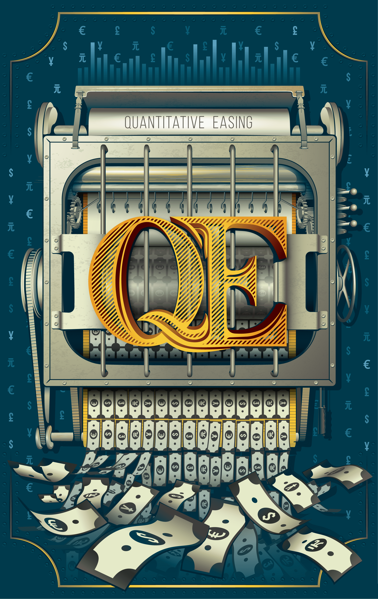
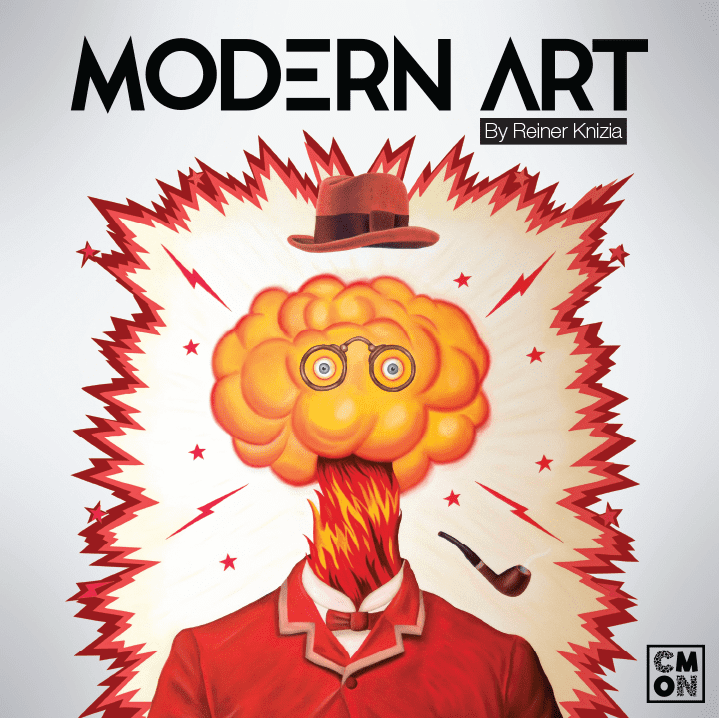
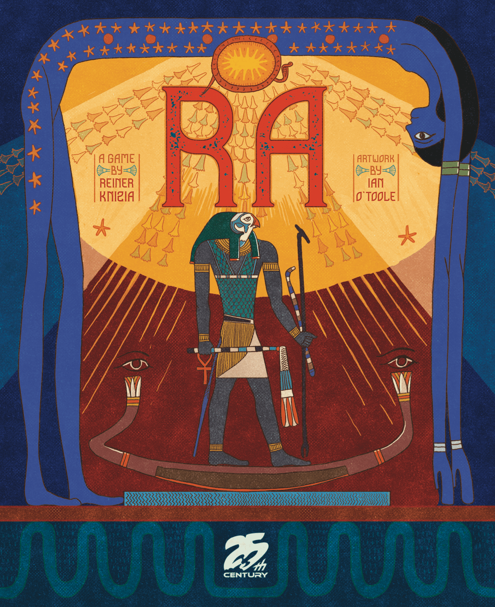
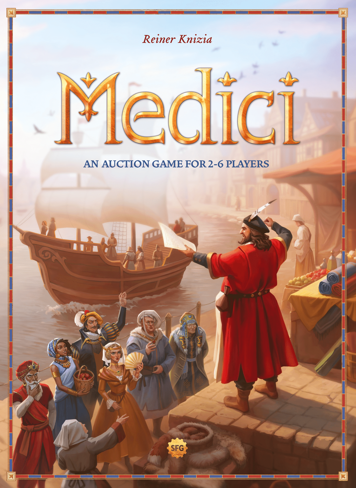
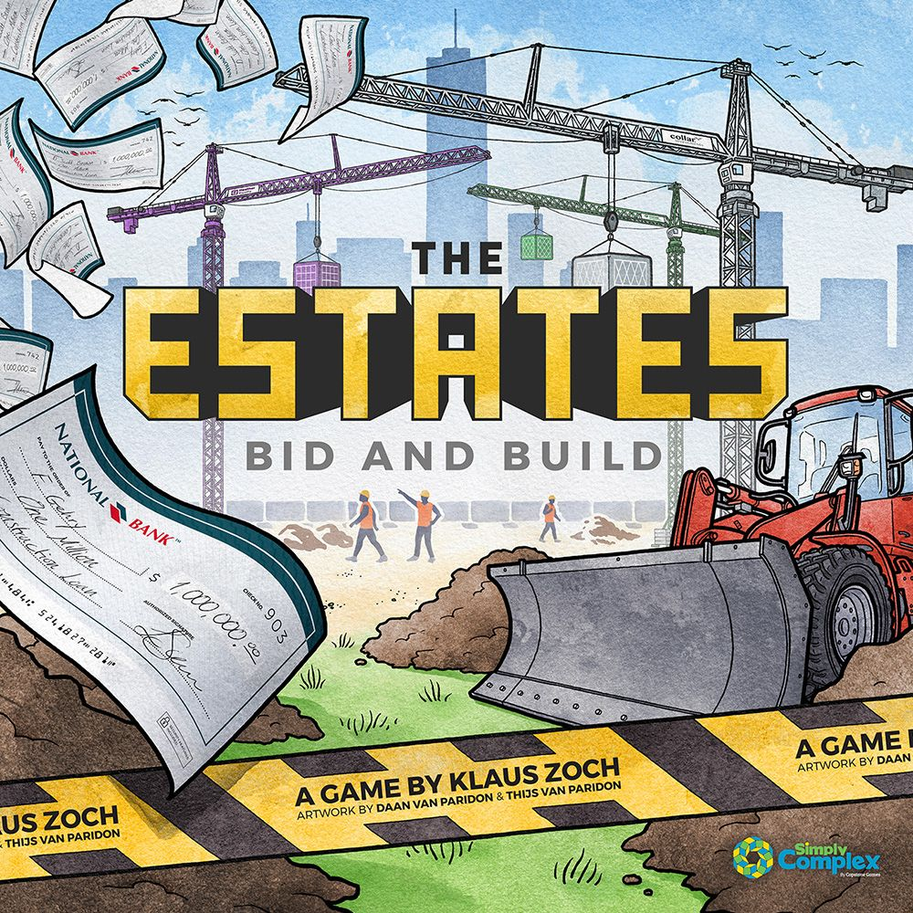
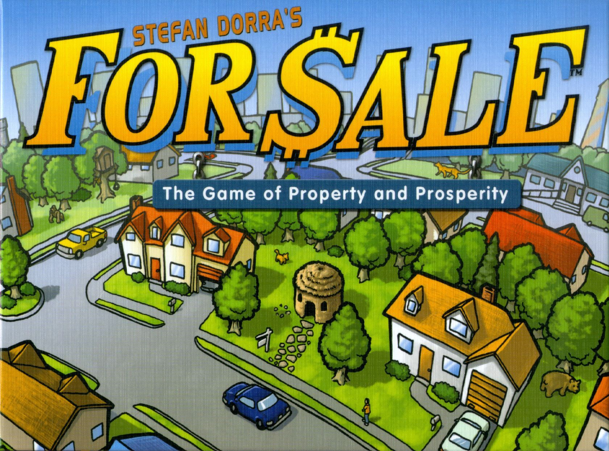
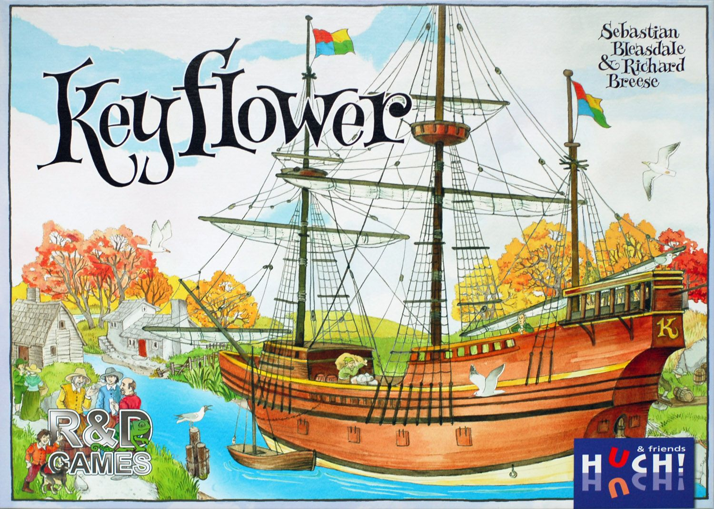
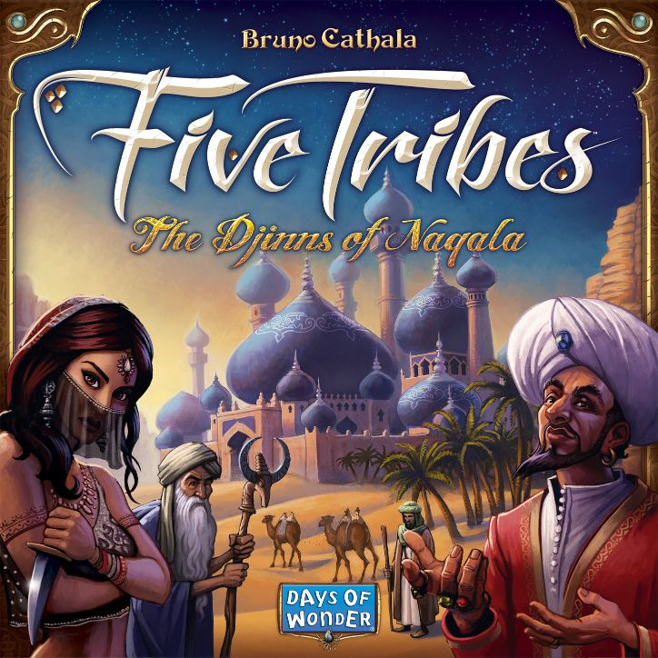

Every board game mechanic is, at some level, a system for making decisions interesting. Worker placement gives you scarcity. Deck building gives you growth curves. Area control gives you territory pressure. But auctions? Auctions give you *people*.

No other mechanic forces you to read the table quite like bidding. There's no optimal play you can calculate in a vacuum  -  every decision depends on what the person across from you is thinking, what they can afford, and whether they're the type to bluff on an empty wallet. It's game theory made visceral.

And yet, auction games are perpetually underrepresented in modern collections. Ask someone to name their favourite mechanic and you'll hear worker placement, engine building, deck construction. Rarely auctions. Which is a shame, because the best auction games produce moments of tension, comedy, and betrayal that no amount of cube-pushing can match.

Let's break down why.

## What Makes an Auction an Auction?

At its core, an auction is any mechanism where players compete for something by committing resources  -  usually money, but sometimes workers, cards, or actions. The key ingredient is that **the price is set by the players, not the game**. That's what separates an auction from a market (where the game sets prices) or a draft (where you pick from a shared pool without competing simultaneously).

This single distinction creates enormous design space. The *type* of auction  -  open, closed, once-around, Dutch, all-pay  -  fundamentally changes what kind of decisions players face.

## The Auction Family Tree

### Open Ascending (English Auction)

The classic. Players take turns raising the bid until everyone else drops out. Simple, dramatic, and the most naturally interactive format.

**[Power Grid](https://boardgamegeek.com/boardgame/2651)** (2004) is the textbook example. Every round, players bid on power plants that fuel their expanding networks. The auction isn't a side mechanism  -  it *is* the game. Every dollar you overspend on a plant is a city you can't build. The genius is that turn order is determined by network size, so the leader picks last  -  meaning the auction is also a catch-up mechanism. At a weight of **3.25** and a BGG rank of **#74**, it remains one of the most respected strategy games ever made.

The open ascending format works beautifully here because information is public. You can see everyone's money. You can see what plants they need. The tension isn't in hidden information  -  it's in the chicken game of *how far will they go?*

### Once-Around Bidding

Each player gets exactly one chance to bid (or pass). Fast, brutal, and eliminates the endless back-and-forth of open auctions.

**[Cyclades](https://boardgamegeek.com/boardgame/54998)** (2009) uses this to devastating effect. Players bid for the favour of Greek gods, each granting different actions. Get outbid on Ares? You're not going to war this round. Period. The once-around format means every bid is a commitment  -  you can't tentatively probe and retreat. At **2.82 weight** and **#268 on BGG**, it's one of the best hybrids of auction and area control in the hobby.

### Closed (Sealed) Bidding

Everyone submits a bid simultaneously. No information, pure reads.

**[QE](https://boardgamegeek.com/boardgame/266830)** (2019) takes this to its logical extreme: you're central bankers bidding on companies, and **there is no spending limit**. You can bid a million. You can bid a billion. The only rule is that whoever spends the most *total* across the game is eliminated  -  even if they'd otherwise win. It's a game about restraint disguised as a game about excess. At just **1.56 weight**, it's accessible to anyone, but the psychological depth is remarkable. Currently **#614 on BGG** and criminally underrated.

### Multiple Auction Types in One Game

The real magic happens when a designer layers different auction formats together.

**[Modern Art](https://boardgamegeek.com/boardgame/118)** (1992) is the masterclass. Reiner Knizia gives each card one of four auction types  -  open, once-around, sealed, and fixed price  -  and the entire game is about selling paintings at the right time using the right format. You're simultaneously an auctioneer and a buyer, trying to inflate the value of artists you've invested in while deflating everyone else's. At **2.28 weight** and **#221 on BGG**, it's been in print for over 30 years for a reason.

## Knizia: The Auction Whisperer

No discussion of auction mechanics is complete without acknowledging that Reiner Knizia essentially *owns* this design space. His auction trilogy  -  **[Ra](https://boardgamegeek.com/boardgame/12)**, **[Medici](https://boardgamegeek.com/boardgame/46)**, and **Modern Art**  -  represents three completely different answers to the question "what can an auction be?"

**Ra** (1999, **#115 on BGG**, weight **2.31**) wraps its auction in a push-your-luck framework. Tiles accumulate in the centre of the table, and any player can call "Ra!" to trigger an auction  -  but you bid with a fixed set of numbered suns, and the sun you spend becomes available to the next winner. It's a closed economy where every bid has a cascading consequence. The brilliance is that calling the auction is itself a strategic weapon: force a bid when your opponents have weak suns and you've essentially stolen from them.

**Medici** (1995, **#718 on BGG**, weight **2.22**) is the leanest of the three. You're Renaissance merchants loading cargo ships  -  whoever has the most valuable cargo wins, but your ship only holds five goods. The auction is simple open bidding, but the decisions layer beautifully: do you bid big for a set of three valuable goods, or let your opponent overpay and snipe cheaper lots later? The constraint of five cargo slots means every purchase crowds out future options.

## The Mean Ones: Auctions as Weapons

Some games use auctions not as resource allocation but as psychological warfare.

**[The Estates](https://boardgamegeek.com/boardgame/249381)** (2018) is perhaps the most aggressively interactive auction game ever designed. Players bid on building pieces for a shared city block. Completed rows score positively; incomplete rows score **negatively**  -  for everyone who built there. The result is a game where you can deliberately tank a row to destroy an opponent's investment. Every auction is loaded with spite, bluffing, and the constant question: *are they building this to score, or building it to bury me?* At **2.31 weight** and **#823 on BGG**, it's a hidden gem that makes Monopoly's property trading look like a friendly handshake.

## The Gateway: Starting with Auctions

If this has piqued your interest but you've never played an auction game, start here:

**[For Sale](https://boardgamegeek.com/boardgame/172)** (1997) is the perfect introduction. Two phases, 30 minutes, zero confusion. First, you bid on property cards. Then, you simultaneously play properties to win cheque cards. That's it. At **1.25 weight**  -  the lightest game in this article by a wide margin  -  it's playable by literally anyone, scales cleanly from 3 to 6 players, and sits at a respectable **#354 on BGG**. It's the game that proves auctions don't need to be heavy to be brilliant.

## The Hybrids: Auctions as Seasoning

Modern designs increasingly use auctions as one element in a larger system, rather than the entire game.

**[Keyflower](https://boardgamegeek.com/boardgame/122515)** (2012) is a worker placement game where the workers *are* the currency. You bid coloured meeples on tiles, but any meeples placed on a tile must match the colour of the first one placed  -  so bidding isn't just about quantity, it's about colour control. Win a tile and the meeples your opponents bid go to *you*. It's an auction wrapped in a resource game wrapped in a spatial puzzle. At **3.33 weight** and **#133 on BGG**, it's the heaviest game here and one of the most original.

**[Five Tribes](https://boardgamegeek.com/boardgame/157354)** (2014) uses a once-around auction purely for turn order  -  but it's a masterstroke. Going first in Five Tribes is *powerful* because the board state changes completely with every move. So how much is first worth? It depends on what you see. It depends on what you think others see. The auction is a single mechanism in a larger mancala game, but it produces more agonising decisions per minute than games built entirely around bidding. At **2.84 weight** and **#95 on BGG**, it remains a modern classic.

## Why Auctions Feel Different

There's a reason auction games produce stories. Not "I built an efficient engine" stories  -  those are satisfying but forgettable. Auction stories are about *people*.

"Remember when Sarah bid 47 on a worthless painting just to bankrupt you?"

"Remember when everyone passed on the nuclear plant and I got it for 3 coins?"

"Remember when you called Ra with nothing in the pot just to waste my good sun?"

These moments happen because auctions create a direct, unmediated connection between players. There's no system buffer. No luck mitigation. No "the game made me do it." You looked across the table, you made a read, and you were right or wrong. That's it.

## The Weight Spectrum

One more thing worth noting: auction games span the entire complexity spectrum. Here's every game in this article ordered by BGG weight:

| Game | Weight | Best For |
|------|--------|----------|
| [For Sale](https://boardgamegeek.com/boardgame/172) | 1.25 | Absolute beginners, families, parties |
| [QE](https://boardgamegeek.com/boardgame/266830) | 1.56 | Non-gamers who like psychology |
| [Medici](https://boardgamegeek.com/boardgame/46) | 2.22 | Knizia fans, medium-light groups |
| [Modern Art](https://boardgamegeek.com/boardgame/118) | 2.28 | Anyone who appreciates elegant design |
| [Ra](https://boardgamegeek.com/boardgame/12) | 2.31 | Push-your-luck lovers, Knizia completists |
| [The Estates](https://boardgamegeek.com/boardgame/249381) | 2.31 | People who enjoy watching friendships burn |
| [Cyclades](https://boardgamegeek.com/boardgame/54998) | 2.82 | Area control fans wanting more interaction |
| [Five Tribes](https://boardgamegeek.com/boardgame/157354) | 2.84 | Puzzlers who like variable turn order |
| [Power Grid](https://boardgamegeek.com/boardgame/2651) | 3.25 | Strategy gamers, network builders |
| [Keyflower](https://boardgamegeek.com/boardgame/122515) | 3.33 | Heavy euro enthusiasts |

From 1.25 to 3.33  -  there's an auction game for every group and every mood. The mechanic doesn't demand complexity. It demands attention to the people you're playing with.

---

*Auction games are the board gaming equivalent of poker: the rules are simple, the depth is infinite, and the real game is always the other players. If your shelf is full of engine builders and worker placers but empty of auctions, you're missing out on the most human mechanic in the hobby.*
