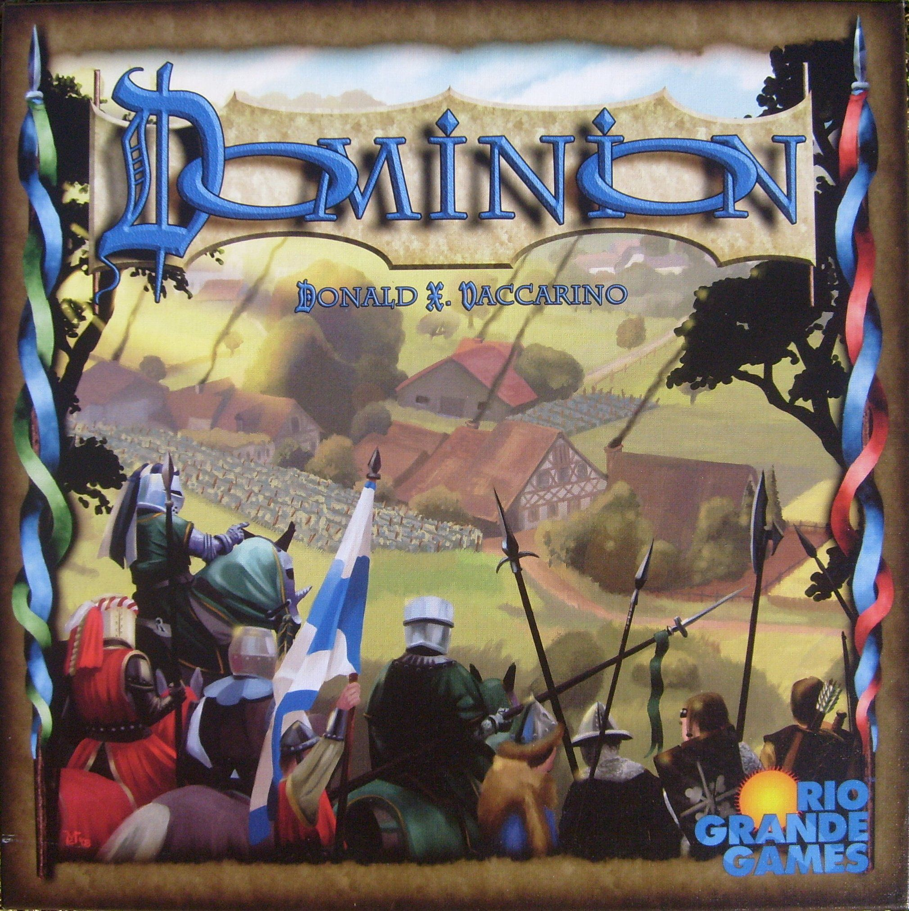
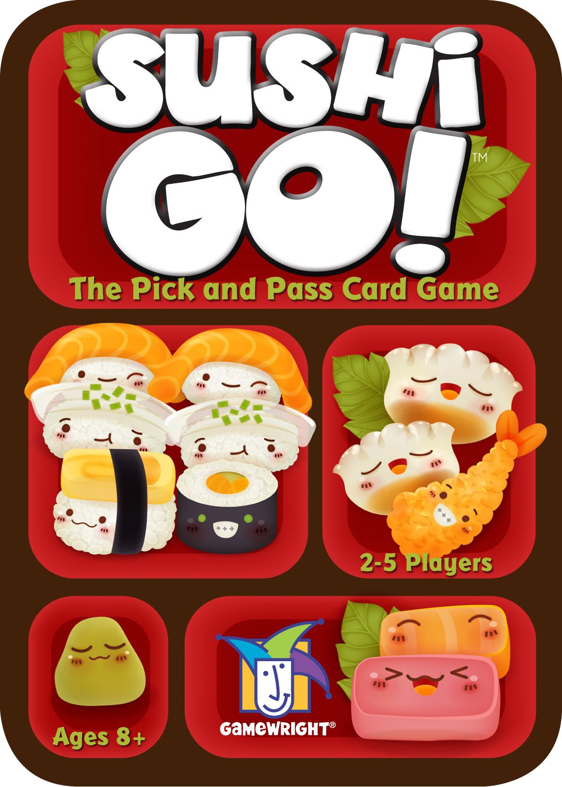
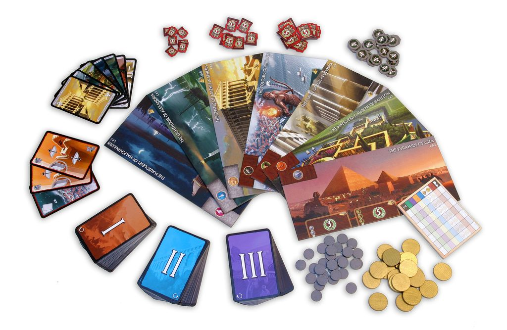

# Drafting in Board Games: Why Passing a Hand of Cards Still Feels So Good

Drafting is one of the cleanest ideas in board games. You get a small menu of options, pick one, and pass the rest along. Cards, tiles, dice, whatever. The core pleasure is the same. You are never fully at the mercy of the draw, but you are also never fully in control. That tension is the whole point.

And yes, this sounds simple. It is simple. That’s why it works.

This article looks at what drafting actually does well, where the modern board game version of it came from, and why the [mechanic](/posts/mechanic-deep-dive-hidden-roles/) has stayed so durable across very different kinds of designs. From the approachable set collection of **[Sushi Go!](https://boardgamegeek.com/boardgame/133473)** to the simultaneous card play of **[7 Wonders](https://boardgamegeek.com/boardgame/68448)**, the spatial puzzle of **[Sagrada](https://boardgamegeek.com/boardgame/107448)**, and the nastier tactical uses in **[Blood Rage](https://boardgamegeek.com/boardgame/170216)** and **[Inis](https://boardgamegeek.com/boardgame/155821)**, the point is not just that drafting appears everywhere. It’s that the same basic structure keeps producing different kinds of tension.

Drafting usually shows up in two forms. **Closed drafting** means you’re picking from a private hand and passing the leftovers. **Open drafting** means everyone sees a shared pool and takes from it. Either way, the mechanic does three beautiful things at once: it smooths randomness, creates indirect interaction, and forces priorities. You can take the card you need. You can hate-draft the card your neighbor desperately wants. You can take something flexible because your plan is falling apart. That’s game.

## Where Drafting Came From

Modern drafting owes a lot to trading card games, especially *Magic: The Gathering* in the 1990s. Booster draft turned random packs into a skill test. You weren’t just opening good stuff. You were reading signals, cutting colors, and building a deck on the fly. That pick-and-pass DNA still runs through board game drafting now.

The reason drafting jumped so cleanly from trading card games into board games is that it solves a problem [designers](/posts/designer-spotlight-vlaada-chvatil/) never stop wrestling with: how do you keep randomness exciting without letting it run the table? A blind draw can create surprise, but too much of it makes players feel like passengers. Drafting fixes that by turning randomness into a menu. The options are still uncertain, but the decision is yours.

That’s why the *Magic* comparison matters beyond trivia. In booster draft, the skill isn’t just spotting the strongest card. It’s reading what the table is doing. If blue cards keep coming around late, maybe nobody near you is taking blue. If the combat tricks dry up, somebody is. That same “read the flow” instinct shows up in board games, just translated into cleaner, faster forms. In hobby game design, the genius move was realizing you could keep the tension of reading signals without asking players to build a full tournament deck.

In tabletop design more broadly, **[Dominion](https://boardgamegeek.com/boardgame/36218)** helped normalize the idea that card selection itself could be the game. But the real board game breakout moment for drafting was **[7 Wonders](https://boardgamegeek.com/boardgame/68448)** in 2010. That game took the pick-and-pass structure and made it simultaneous, fast, and wildly approachable. No waiting around for five other people to finish their turn. Just pick, reveal, pass, repeat. It was a revelation.

[7 Wonders](https://boardgamegeek.com/boardgame/68448) was the turning point because it made drafting feel social instead of procedural. Everybody picks at once. Everybody passes at once. Nobody stares at one player doing accounting for three minutes. That sounds obvious now because half the hobby borrowed it. Back in 2010, it felt fresh. It also solved the classic large-group Euro problem. Most strategy games get slower and sloppier as you add players. [7 Wonders](https://boardgamegeek.com/boardgame/68448), rated **7.66/10 from 112,199 ratings**, somehow supports **2-7 players** in **30 minutes**. That’s absurdly efficient.

Then lighter games like **[Sushi Go!](https://boardgamegeek.com/boardgame/133473)** proved you could strip the whole thing down to “take cute food, make sets, laugh at pudding drama” and still have a real game.

There’s also a deeper historical point here. Drafting became popular in board games right around the moment designers started chasing more interaction without bringing back old-school player elimination or chaos. Eurogames had spent years sanding off direct conflict. Drafting let interaction sneak back in through denial, timing, and table reading. You’re not attacking me. You’re just taking the brick card I needed and passing me a fistful of disappointment. Different wrapper, same pain.

That’s part of why the mechanic has lasted. It scales from family games to nasty tactical contests because the core emotional beats are universal. Relief when the perfect card wheels back. Panic when a lane collapses. The dawning realization that you have spent three rounds feeding your neighbor exactly what they wanted. Every experienced drafter has had that moment. It is character-building. Or at least excuse-building after the game.

## The Simple End of the Spectrum: [Sushi Go!](https://boardgamegeek.com/boardgame/133473)

If you need to teach drafting to someone who’s never touched a hobby game, this is where I’d start.

**[Sushi Go!](https://boardgamegeek.com/boardgame/133473)** is a 2013 release with a **BGG rating of 6.98/10 from 52,052 ratings**, a **weight of 1.16/5**, supports **2-5 players**, and plays in **15 minutes**. That tells the story already. This thing is feather-light.

You draft a hand of adorable sushi cards across **3 rounds**, passing **left, then right, then left**. That alternating direction matters more than it looks. It stops the draft from becoming too predictable and forces you to reassess who you’re feeding with every round. Tempura wants pairs. Sashimi wants triples. Dumplings scale upward. Wasabi begs for a nigiri. Pudding hangs over the whole game like a tiny plastic threat.

What I love here is how clearly it teaches the emotional logic of drafting. You don’t need to know jargon. You just feel it. “Do I take the card that scores now, or the one that completes a bigger set later?” “Do I leave this for my sister and regret it instantly?” That’s drafting in its most approachable form.

It is not the deepest implementation on this list. Obviously. But it’s one of the purest.

## The Breakout Hit: [7 Wonders](https://boardgamegeek.com/boardgame/68448)

If **[Sushi Go!](https://boardgamegeek.com/boardgame/133473)** shows the mechanic at its simplest, **[7 Wonders](https://boardgamegeek.com/boardgame/68448)** shows why it became a pillar of modern design.

**[7 Wonders](https://boardgamegeek.com/boardgame/68448)** is still the game most people point to when they talk about drafting becoming a pillar of modern board game design, and they’re right to do it. Published in **2010**, it sits at a **7.66/10 BGG rating from 112,199 ratings**, with a **weight of 2.31/5**, supports **2-7 players**, and somehow wraps the whole thing in **30 minutes**. That scalability is not normal. That’s part of why the game exploded.

Its draft is **simultaneous closed drafting**. Everyone picks one card from hand, reveals, resolves, and passes the rest. Across three ages, you build resources, commerce, military, science, and points while trying to read both neighbors. That neighbor tension is the secret sauce. You don’t care equally about everyone at the table. You care deeply about the two people feeding you and receiving your leftovers. It creates this tight local interaction inside a big multiplayer game.

This is also where drafting became more than set collection. In **[7 Wonders](https://boardgamegeek.com/boardgame/68448)**, every pick is doing multiple jobs. It advances your tableau. It shapes future turns through chaining. It denies options to neighbors. It signals your lane, or bluffs one. Science players know the pain. Military players know the joy of bullying one side while the other side quietly builds an economy.

If you want a “best in class” answer, this is mine. Not because it’s the most complex. Because it does the most with the fewest moving parts, and because it changed the hobby. Plenty of games have iterated on drafting since. Very few have defined it this clearly.

## Drafting, But with Dice: [Sagrada](https://boardgamegeek.com/boardgame/107448)

Moving from cards to dice makes it easier to see that drafting is a structure, not a component type.

Drafting doesn’t have to mean cards. That’s where **[Sagrada](https://boardgamegeek.com/boardgame/107448)** gets interesting.

**[Sagrada](https://boardgamegeek.com/boardgame/107448)** uses **dice drafting** through a **snake draft**. Dice are rolled into a shared pool, players take turns selecting one, and the order reverses after each pick.

That reversal is brilliant. A normal draft can punish late turn order pretty hard. Snake order softens that without flattening the tension. You still care about being first. You just aren’t doomed.

The other smart twist is how the drafted object interacts with placement restrictions. You’re not just taking “the best die.” You’re taking the die that can actually fit your stained-glass window’s color and number constraints. That turns drafting into a spatial puzzle. A die that looks weak to me might be perfect for you. That asymmetry of value is exactly what good drafting wants.

What makes dice drafting in [Sagrada](https://boardgamegeek.com/boardgame/107448) so effective is that the dice are doing two jobs at once. They are resources, obviously, but they are also shape constraints. A blue 5 is not just “worth a turn.” It is a very specific geometric answer to a very specific problem in your window. That makes every pick much more personal than a normal card draft. The die I’m desperate for might be completely useless to you because your board can’t legally take it.

The snake draft matters here more than people give it credit for. In a standard clockwise draft, going late can feel like eating leftovers. In a snake, the player at the end of the order gets back-to-back picks before the round resets. That creates these lovely tempo swings. Sometimes being last is actually perfect because you can grab two dice that unlock a whole side of your pattern in one go. New players often chase the prettiest die or the highest number. Stronger players draft for future flexibility. A mediocre die that preserves multiple legal placements next round is often better than the “perfect” die that boxes you into a corner.

That’s the tactical lesson [Sagrada](https://boardgamegeek.com/boardgame/107448) teaches better than most drafting games: your pick is only as good as the spaces it leaves alive. If you fill the center of your window too early with awkward values, you can create a slow-motion disaster where every future die is illegal. You won’t notice it immediately. Then three rounds later you’re staring at a pool full of beautiful dice you cannot place, which is a very [Sagrada](https://boardgamegeek.com/boardgame/107448) kind of heartbreak.

It also shows how drafting can work beautifully in an almost non-confrontational game. There’s denial here, but it’s softer than [Blood Rage](https://boardgamegeek.com/boardgame/170216) or [Inis](https://boardgamegeek.com/boardgame/155821). You’re usually not taking a die to ruin someone else. You’re taking it because your own puzzle is screaming. Still, if you’ve played enough, you absolutely notice when the player beside you needs a yellow 6 and there are only two yellow dice left in the pool. Suddenly that “harmless” pick starts feeling a lot sharper.

Compared to [7 Wonders](https://boardgamegeek.com/boardgame/68448), where the value of a card often depends on engine timing and neighbor pressure, [Sagrada](https://boardgamegeek.com/boardgame/107448) makes value spatial and immediate. Compared to [Sushi Go!](https://boardgamegeek.com/boardgame/133473), where combos are visible and intuitive, this is more about board geometry and risk management. Same core mechanism. Completely different brain burn.

## The Weird Middle Ground: [Bunny Kingdom](https://boardgamegeek.com/boardgame/184921)

Between lighter set collection and more openly confrontational designs, there’s a useful middle case: drafting that stays private in the hand but becomes public on the board.

**[Bunny Kingdom](https://boardgamegeek.com/boardgame/184921)** doesn’t get enough credit for how much nonsense it packs into its draft. Published in **2017**, it has a **BGG rating of 7.41/10 from 14,772 ratings**, a **weight of 2.30/5**, supports **2-4 players**, and plays in **40-60 minutes**.

This is still pick-and-pass, but stretched over **4 rounds** and spiced up with direction changes that can feel like someone threw an Uno reverse into your kingdom-building plans. You’re drafting territory, resources, buildings, and opportunities for scoring fiefs on a shared map.

What makes it stand out is the collision between hidden drafting and open board presence. You draft privately, but your choices materialize publicly as area control. So the draft phase has that familiar hand-reading tension, while the board creates long-term positional consequences. Cute rabbit art. Surprisingly sharp elbows.

## Drafting for Violence: [Blood Rage](https://boardgamegeek.com/boardgame/170216)

If **[Bunny Kingdom](https://boardgamegeek.com/boardgame/184921)** shows how drafting can feed map control, **[Blood Rage](https://boardgamegeek.com/boardgame/170216)** shows what happens when the same structure is wired directly into confrontation.

**[Blood Rage](https://boardgamegeek.com/boardgame/170216)** is where drafting gets mean in the best way. Published in **2015**, it has a **BGG rating of 7.90/10 from 51,574 ratings**, a **weight of 2.88/5**, supports **2-4 players**, and runs **60-90 minutes**.

Each round begins with a **mini-draft** of cards that feed directly into combat, quests, upgrades, and clan strategy. This is not a gentle “collect some nice symbols” draft. This is “if I pass this card, Erik becomes a war crime” drafting.

The innovation here is how tightly the draft is fused to asymmetry and confrontation. Your cards are not abstract points. They reshape your clan. They alter battle incentives. They create those glorious **Blood Rage** moments where losing a fight is somehow the plan, because your Loki build is doing deeply annoying things to everyone else at the table. Reddit has had that argument for years, and no, it’s never getting resolved.

What makes this implementation sing is that the draft is not the whole game, but it defines the whole game. The board state, the invasions, the battles, the upgrades, all of it starts in that opening card selection.

The nasty brilliance of [Blood Rage](https://boardgamegeek.com/boardgame/170216) is that the draft does not simply tell you what you can do. It tells you what kind of monster you’re becoming this age. Are you building a quest engine? Leaning into combat tricks? Drafting upgrades that make your clan stronger on the map? Or are you doing the deeply cursed Loki plan where losing fights and getting your figures killed becomes profitable? The card draft is where that identity locks in.

That’s why experienced players treat the opening picks of each age like a blood oath. You are not just taking “good cards.” You are watching for synergies and cutting off archetypes before someone else assembles them. If a rage upgrade appears early, that can shape your whole round because extra rage means extra actions, and extra actions in [Blood Rage](https://boardgamegeek.com/boardgame/170216) are pure oxygen. If a strong battle card is in the pool, passing it is not a neutral act. You are deciding that somebody else can have that threat. Maybe that is fine. Maybe you’ve just armed the person sitting to your left.

One of the funniest table patterns in this game is how often new players overvalue raw strength and undervalue timing. Big numbers in battle look impressive. Veterans know that upgrade cards and quests can quietly outscore flashy wins. The draft rewards people who know the board state that is likely to emerge. If provinces are going to explode in Ragnarök, cards that profit from glorious death get better. If everyone is posturing for Yggdrasil, suddenly mobility and surprise battle effects matter more.

This is also one of the cleanest examples of drafting creating table talk without formal negotiation. Nobody has to say, “Please don’t pass that to Sarah.” The entire room can feel it. Someone drafts quickly. Someone else groans. Somebody starts grinning in a way that should concern the group. You learn a lot from those micro-reactions.

Compared with [7 Wonders](https://boardgamegeek.com/boardgame/68448), where denial is often subtle and local to your neighbors, [Blood Rage](https://boardgamegeek.com/boardgame/170216) makes the consequences louder. The card you pass can absolutely reshape the whole board. Compared with [Bunny Kingdom](https://boardgamegeek.com/boardgame/184921), where a draft pick may pay off several turns later through map control, [Blood Rage](https://boardgamegeek.com/boardgame/170216) is immediate. You feel the effect the moment clans start marching and everyone remembers exactly who passed what.

## Drafting Actions Instead of Stuff: [Inis](https://boardgamegeek.com/boardgame/155821)

If **[Blood Rage](https://boardgamegeek.com/boardgame/170216)** uses drafting to define your strategic package for the round, **[Inis](https://boardgamegeek.com/boardgame/155821)** pushes the idea even further by making the draft determine your actual action set.

**[Inis](https://boardgamegeek.com/boardgame/155821)** might be the most elegant “advanced” drafting game here. Published in **2016**, it holds a **BGG rating of 7.82/10 from 22,911 ratings**, a **weight of 2.94/5**, supports **2-4 players**, and plays in **60-90 minutes**.

Instead of drafting resources or upgrades, you’re drafting the actions you can take. That changes everything.

In **[Inis](https://boardgamegeek.com/boardgame/155821)**, the draft determines your tactical vocabulary for the round. If you don’t take a key action, you may simply not get to do that kind of thing this turn. The pass structure and role selection create a delicious level of brinkmanship. You are not just improving your own position. You are editing the possibility space for everyone else.

That’s why the game feels so sharp. Every drafted card is both permission and denial. Every pass is a message. Every round becomes a little political storm cloud. For area control fans, this is catnip.

What separates [Inis](https://boardgamegeek.com/boardgame/155821) from a lot of drafting games is that the draft is not feeding an engine. It is setting the boundaries of the round. That sounds subtle. It isn’t. In engine builders, a bad draft can often be repaired over time. In [Inis](https://boardgamegeek.com/boardgame/155821), if you let key actions go, you may spend the whole round reacting to a world you helped create.

That makes card valuation incredibly situational. A movement card is not “good” in the abstract. It is good because the map currently rewards surprise positioning. An assembly card is not just a political trick. It can threaten a victory check or force the table to spend precious actions stopping one. This is why the game gets so much love from players who enjoy tactical knife-edge decisions, even if every teach includes that familiar pause where someone asks, “Wait, so we’re drafting the actions we’re allowed to take?” Yes. Exactly. Welcome to the good stuff.

There’s also a special tension in the way [Inis](https://boardgamegeek.com/boardgame/155821) blends public board information with private hand information. Everybody can see who is spread across territories, who is close to a victory condition, who has sanctuaries, who looks threatening. But nobody knows exactly which action cards are in whose hand. That gap between visible position and hidden capability is where the drama lives. You can look safe and be one card away from disaster. You can look dominant and actually be holding a clunky hand that does almost nothing.

A useful tactical principle in [Inis](https://boardgamegeek.com/boardgame/155821) is to draft for leverage, not just effect. The best card is often the one that forces other players to spend their turns answering you. If you can draft an action that threatens a win condition or destabilizes a critical territory, you gain tempo even before playing it. The table starts orbiting your possibilities. That is power.

Compared with [Blood Rage](https://boardgamegeek.com/boardgame/170216), where the draft often pushes you toward a strategic package for the age, [Inis](https://boardgamegeek.com/boardgame/155821) is more surgical. Compared with [Sushi Go!](https://boardgamegeek.com/boardgame/133473), where the pleasures are open and immediate, this one is all about timing, restraint, and implied threat. It’s drafting as brinkmanship. That’s why people bounce off it once, then come back later and suddenly get obsessed. The first play teaches you the cards. The second play teaches you fear.

## What Good Drafting Actually Looks Like

Looking across those examples, the common thread is not component type or complexity. It’s how well the draft creates meaningful, context-sensitive decisions.

The best drafting games do not just hand you options. They make those options context-sensitive.

That means a few things. First, picks should matter for both **personal gain and opponent denial**. Second, randomness should be **input randomness**, not output nonsense. Give me a weird hand and let me solve it. Third, the pass structure should create tension, whether through alternating directions, snake order, or changing round incentives. Fourth, the draft should fit the rest of the design. In **[Sagrada](https://boardgamegeek.com/boardgame/107448)**, dice feel natural because placement restrictions make color and value meaningful. In **[Blood Rage](https://boardgamegeek.com/boardgame/170216)**, the draft matters because every card hooks into conflict and clan identity.

Lazy drafting is easy to spot. The choices feel interchangeable. The pool is bloated. Player count breaks the pacing. Or worst of all, the draft feels stapled on, like the designer wanted a buzzword mechanic instead of a decision engine.

## Where Drafting Is Headed

Drafting is not fading. It’s maturing.

The trend now is hybrids. Dice drafting. Action drafting. Drafting tied to area control, engine-building, asymmetric powers, and shorter round structures. Designers know the basic pick-and-pass template works, so the interesting question is no longer “should this game have drafting?” It’s “what exactly are we drafting, and why does that matter here?”

That’s why **[7 Wonders](https://boardgamegeek.com/boardgame/68448)** remains the benchmark, but not the endpoint. **[Sushi Go!](https://boardgamegeek.com/boardgame/133473)** made it welcoming. **[Sagrada](https://boardgamegeek.com/boardgame/107448)** proved the drafted object could change. **[Blood Rage](https://boardgamegeek.com/boardgame/170216)** made it aggressive. **[Inis](https://boardgamegeek.com/boardgame/155821)** made it tactical and political. **[Bunny Kingdom](https://boardgamegeek.com/boardgame/184921)** pushed it into map control.

Best in class? **[7 Wonders](https://boardgamegeek.com/boardgame/68448)**.

Most interesting innovation? **[Inis](https://boardgamegeek.com/boardgame/155821)**, with **[Sagrada](https://boardgamegeek.com/boardgame/107448)** right behind it.

And that really is what this whole survey has been about: not just that drafting is elegant, but that it is flexible. The same basic pick-and-pass structure can teach new players with **[Sushi Go!](https://boardgamegeek.com/boardgame/133473)**, scale brilliantly in **[7 Wonders](https://boardgamegeek.com/boardgame/68448)**, become spatial in **[Sagrada](https://boardgamegeek.com/boardgame/107448)**, turn confrontational in **[Blood Rage](https://boardgamegeek.com/boardgame/170216)**, and become pure tactical brinkmanship in **[Inis](https://boardgamegeek.com/boardgame/155821)**. Few mechanics create so much tension with so little overhead. Pick one. Pass the rest. Suddenly every decision matters.