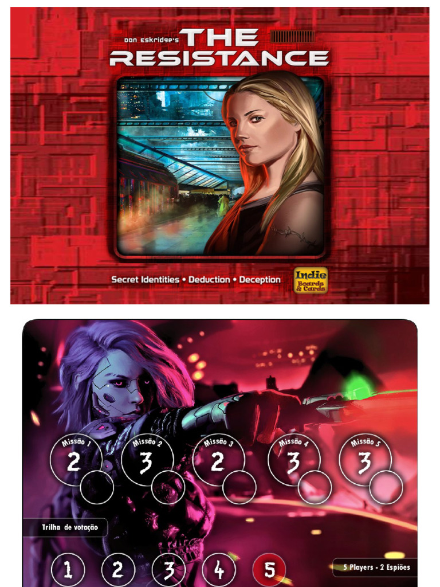

Here's the thing: if you've ever lied to your friend’s face during a game night, you've probably been part of a hidden roles game. This mechanic is the backbone of social deduction games, where players are dealt secret identities or objectives that they must protect or reveal at opportune moments. It's all about deception, bluffing, and those glorious "aha!" moments when alliances crumble.

Now, let's take a stroll down memory lane. The roots of hidden roles dig into those classic parlor games like **Wink Murder**, which had us looking around suspiciously at a wink's notice. But the real breakout star was **Mafia**, crafted by Dimitry Davidoff in 1986 at Moscow State University. In Mafia, a small group of werewolves tries to pick off villagers without getting caught—a delicious blend of strategy and deceit. Andrew Plotkin's reskin as [Werewolf](https://boardgamegeek.com/boardgame/925/werewolf) further cemented this mechanic, ensuring every social deduction game since owes it a debt of gratitude.

But what exactly does hidden roles bring to the table? Players pick roles that define their secret allegiance—usually a battle of good versus evil. Your mission: keep your cool while deducing who’s who. The majority must suss out the traitors through discussion, votes, and, often, a healthy dose of paranoia. The minority? They lie, sabotage, and keep everyone guessing. It's a mechanic that thrives on social interaction and misdirection.

Let's talk about how different games put their spin on this classic mechanic:

- [The Resistance](https://boardgamegeek.com/boardgame/41114/resistance): Here, the challenge lies in proposing teams for missions while spies secretly try to sabotage them. No one gets "killed," but the voting and deduction are intense. It's pure, unadulterated suspicion in a box.

- [Secret Hitler](https://boardgamegeek.com/boardgame/188834/secret-hitler): Adds a layer of political intrigue. Players must navigate government formation while hunting down the hidden Hitler. Elections with bans on repeats keep players on edge. It’s a brilliant blend of distrust and strategy.

- [Blood on the Clocktower](https://boardgamegeek.com/boardgame/240980/blood-clocktower): This one ups the ante with an app-moderated experience and no player eliminations. Even after you're "dead," you can haunt the living with your abilities. It's a grand stage for deception, especially for large groups.

- [Coup](https://boardgamegeek.com/boardgame/131357/coup): It’s more of a bluffing battle. You claim influence over roles to counter or block actions, and quick coups can knock out players indirectly. It's fast, fierce, and often leaves you wondering who you can trust.

- [Deception: Murder in Hong Kong](https://boardgamegeek.com/boardgame/156129/deception-murder-hong-kong): Puts a forensic twist on the hidden roles. The murderer hides among you, but clues and team voting might seal an innocent’s fate. It’s a crime-solving frenzy with a social deduction heart.

- [One Night Ultimate Werewolf](https://boardgamegeek.com/boardgame/147949/one-night-ultimate-werewolf): Takes the classic formula and crams it into a frantic 10 minutes. With role swaps and quick deductions, it's a short burst of hidden roles chaos.

From the days of Mafia's elimination rounds, the mechanic has evolved. [The Resistance](https://boardgamegeek.com/boardgame/41114/resistance) ditched the moderator, and games like [Secret Hitler](https://boardgamegeek.com/boardgame/188834/secret-hitler) added fresh spins like election dynamics. [Blood on the Clocktower](https://boardgamegeek.com/boardgame/240980/blood-clocktower) represents the peak with its expansive role variety and anti-elimination features. It’s a mechanic that continues to morph, staying relevant by embracing player agency and complex interactions.

Hidden roles often pair with voting, bluffing, and traitor mechanics—think of them as the peanut butter and jelly of board gaming. Whether it’s team selection in [The Resistance](https://boardgamegeek.com/boardgame/41114/resistance) or claiming fake roles in [Coup](https://boardgamegeek.com/boardgame/131357/coup), these games thrive on keeping players constantly engaged.

But here's the kicker: not all implementations are created equal. Games that drive interaction with meaningful choices, like mission vetoes or haunting mechanics, shine. But those relying solely on unstructured discussions, leading to early elimination or unbalanced play (looking at you, basic Werewolf), can leave players twiddling their thumbs.

Now, which game does it best? [Blood on the Clocktower](https://boardgamegeek.com/boardgame/240980/blood-clocktower) claims the crown for its sheer breadth and replayability. It combines every trick in the hidden roles book and adds more layers than an onion at a chef's convention.

In the world of hidden roles, the trend is clear: evolve or become a dusty relic. Games like [Blood on the Clocktower](https://boardgamegeek.com/boardgame/240980/blood-clocktower) continue to push boundaries, ensuring the mechanic stays fresh. So, next time you sit down, cards in hand, and lie through your teeth—remember, you're part of a long, storied tradition of deception. And isn't that just a little thrilling?