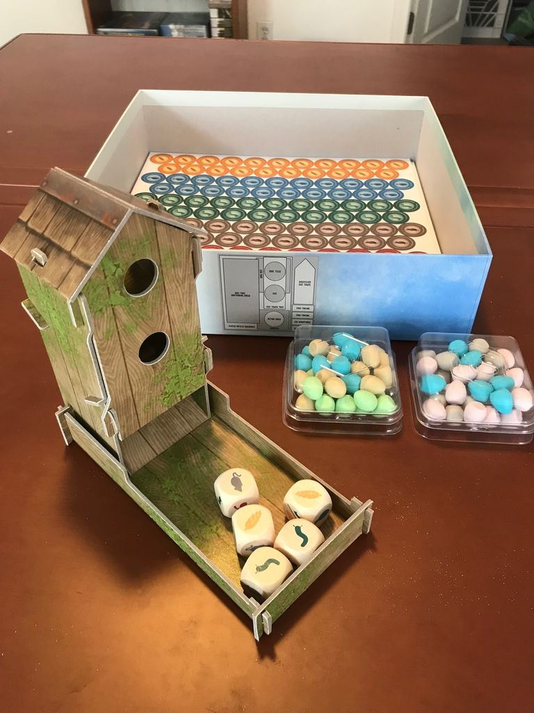

# Tableau Building: Why We Love Watching Our Little Card Engines Wake Up

Tableau building is one of the hobby’s great pleasures. You start with almost nothing, add a card here, a tile there, and two hours later you’re staring at a personal machine that feels weirdly elegant and deeply yours.

At its core, a tableau is your personal display of cards, tiles, or effects in front of you, and the whole point is growth through combinations. Personal ownership. Synergy and layering. Engine building. Strategic depth. You make early choices, those choices keep paying you back, and by the end your tableau tells the story of how you played.

This article looks at what tableau building actually is, how the mechanism developed into a major part of modern board game design, and how that evolution shows up across several standout games. From lean, highly compressed systems to sprawling hybrid designs, the throughline is the same: building something that feels both [mechanically](/posts/mechanic-deep-dive-drafting/) effective and personally expressive.

That’s why this mechanism keeps showing up everywhere. It gives players a sense of authorship. Your neighbor may also be building a scoring engine, but theirs is birds and bonus cards, while yours is egg spam and wetland draw nonsense. Same game. Totally different machine.

And yes, this is one of the most popular mechanisms in modern board gaming for a reason. It feels good. Viscerally good. Put a card down, trigger another card, gain a resource, convert that resource, unlock a scoring condition. Tiny cardboard serotonin factory.

## What Tableau Building Actually Is

A good tableau builder usually has four things working together:

- **A personal play area** that belongs to you
- **Cards or tiles that combo** with each other
- **Repeat value** from early plays, so your engine ramps up
- **Strategic direction**, because not every card belongs in every tableau

That last part matters more than people admit. A pile of good cards is not a tableau. A tableau is a system. If your cards don’t talk to each other, you’re just decorating the table.

The best designs also create tension between **using** cards for immediate value and **positioning** them for endgame scoring. That push and pull is where the mechanism gets interesting instead of merely pleasant.

With that foundation in place, it helps to look at how the mechanism got here.

## The Origin Story: Fuzzy History, Clear Trajectory

The exact first game to popularize tableau building is annoyingly hard to pin down from the available research. Classic hobby problem. Ask ten forum posters, get twelve answers.

What is clear is that tableau building became a defining feature of modern design as games shifted toward personal engines and away from pure conflict or pure efficiency puzzles. The term itself is thematic more than technical. It comes from the visual idea of arranging a display in front of you. Board games grabbed that word and turned it into a mechanical identity.

The arc is easy to see, even if the exact starting line is blurry. Early tableau-heavy games asked, “How do I build a card-based economy?” Later designs asked, “How do I make that economy readable, thematic, and emotionally satisfying?” More recent designs pile on hybrid systems, where the tableau is no longer the whole game but the beating heart inside a larger structure.

That evolution shows up beautifully in five games.

## The Spectrum, From Lean and Mean to Full-On Lifestyle Game

### [Race for the Galaxy](https://boardgamegeek.com/boardgame/28143)

This is still one of the cleanest expressions of tableau building ever made. [Race for the Galaxy](https://boardgamegeek.com/boardgame/28143) came out in **2007**, plays **2-4**, runs **30-60 minutes**, sits at **7.74/10 from 58,713 ratings**, with a **2.99/5** weight, and holds **BGG rank #94**.

Its genius is compression. Cards are worlds, developments, goods, powers, and currency all at once. You build your tableau by spending cards from hand, which means every play hurts a little. Good. It should. That pain is what gives the game texture.

Then there’s role selection. Everyone picks phases simultaneously, and only the chosen phases happen. So your tableau is not just a machine. It’s a machine trying to predict the tempo of the table. That’s a huge innovation. It took tableau building and welded it to timing and player psychology.

This is the kind of game where your first few plays feel like being locked in a washing machine full of icons. The iconography discourse on BGG has been going for years, and both sides are right. The learning curve is brutal. The payoff is incredible.

What makes *Race* special is how little fat it carries. Every card matters. Every synergy matters. Windfall worlds, consume powers, military chains, production loops. You can feel your civilization snapping into shape with terrifying speed.

If tableau building is about making a personal engine from layered effects, *Race* is the stripped-down masterclass.

### [Wingspan](https://boardgamegeek.com/boardgame/266192)

From there, the mechanism becomes much more approachable. [Wingspan](https://boardgamegeek.com/boardgame/266192), published in **2019**, is for **1-5 players**, **40-70 minutes**, rated **8.00/10 from 111,818 ratings**, weight **2.48/5**, **BGG rank #38**.

This is tableau building translated for a much wider audience, and it deserves credit for that. Reddit loves to turn this into a culture war. “Too multiplayer solitaire.” “Too random.” “Overrated because birds.” Counterpoint: the game taught a massive audience what an engine feels like.

That matters.

Your tableau is split into habitats, and activating one row triggers every bird in sequence. That means growth is visible and tactile. Early in the game, taking food gets you food. Late in the game, taking food triggers half a forest and somehow also lays eggs, draws cards, and gives you a worm you forgot you needed.

That’s elegant design. The mechanism is readable in a way *Race* absolutely is not. You can watch your engine improve turn by turn.

Its innovation is accessibility through spatial structure. Instead of asking players to parse a soup of powers, *Wingspan* organizes the tableau into lanes. Forest for food. Grassland for eggs. Wetland for cards. New players grasp it immediately.

The downside is that the interaction is light and some engines can feel a bit autopilot by the end. You know the complaint. “I’m just doing my row again.” Fair. But the row-building itself is so intuitive that it became a blueprint for approachable tableau design.

### [Everdell](https://boardgamegeek.com/boardgame/199792)

The next step is adding more thematic texture and more mechanical layering. [Everdell](https://boardgamegeek.com/boardgame/199792) landed in **2018**, supports **1-4 players**, runs **40-80 minutes**, has a **7.98/10 from 67,622 ratings**, weight **2.83/5**, and sits at **BGG rank #42**.

This one adds warmth and timing. Your tableau is a little woodland city of critters and constructions, and the game’s best idea is pairing specific cards. Build the Inn, maybe the Innkeeper gets in free. Build the School, the Teacher wants in. Suddenly tableau building feels like urban planning with storybook nonsense.

I love this approach because it gives synergy a thematic face. Instead of abstract combo logic, you get relational logic. Cards belong together. The mechanism becomes easier to remember because it makes narrative sense.

It also mixes tableau building with worker placement, which changes the rhythm. You’re not just building an engine. You’re juggling seasonal pacing, hand management, shared spaces, and city size limits. That limit is crucial. You only get so many slots, so your tableau becomes curated instead of bloated.

The catch? The card draw can be swingy, and every *Everdell* discussion eventually turns into someone saying the meadow market betrayed them personally. They are not wrong. Still, as an innovation, *Everdell* showed how tableau building could feel lush, cozy, and characterful without losing strategic teeth.

### [Terraforming Mars](https://boardgamegeek.com/boardgame/167791)

At the larger, more sprawling end of the spectrum, we hit the workhorse. [Terraforming Mars](https://boardgamegeek.com/boardgame/167791) from **2016** plays **1-5**, lasts about **120 minutes**, carries an **8.34/10 from 112,328 ratings**, weight **3.27/5**, and is **BGG rank #9**.

This game blew the door open for sprawling, strategic tableau building in the modern mainstream hobby. Your tableau is a corporation plus a mess of project cards that generate resources, discounts, tags, production boosts, and scoring opportunities. Science builds into Jovian tags. Plant production turns into greenery. Energy becomes heat. Discounts stack. Requirements gate your timing.

It’s glorious.

What *Terraforming Mars* innovated on was scale. It made the tableau not just your engine, but your identity inside a big communal project. You’re all terraforming the same planet, yet your card spread feels deeply personal. One player is a steel-fueled infrastructure monster. Another is chaining microbes and animals for weird late-game points. Another is drowning the board in greenery.

That shared board is important. It stops the tableau from becoming too isolated. Your engine matters because it helps you compete over milestones, awards, map presence, and the tempo of the global parameters.

Yes, the production values of the original box became a meme for years. We all saw the player boards. We all suffered. But mechanically, this game has absurd staying power because it makes card synergy feel consequential over a long arc. You don’t just build an engine. You build a corporation with a whole economic philosophy.

## Best in Class

After that progression from compressed to accessible to thematic to sprawling, it makes sense to end on the game the article argues is the strongest current implementation.

### [Ark Nova](https://boardgamegeek.com/boardgame/342942)

My pick for best in class is [Ark Nova](https://boardgamegeek.com/boardgame/342942).

Published in **2021**, it plays **1-4**, runs **90-150 minutes**, has an **8.54/10 from 60,049 ratings**, a **3.80/5** weight, and sits at **BGG rank #2**. Those numbers are ridiculous, and for once the [hype](/posts/hype-vs-reality-march-2026-edition-2026-03-29/) mostly checks out.

What makes *Ark Nova* the current peak is that it understands tableau building as part of a larger ecosystem of decisions. Your cards are animals, sponsors, conservation projects, universities, kiosks, partnerships. They interact through tags, enclosure constraints, map position, break timing, and the action-selection system with strength values shifting from 1 to 5.

That last part is the killer feature. In many tableau builders, the engine eventually plays itself. In *Ark Nova*, your tableau gets stronger, but your sequencing puzzle gets harder too. Great cards create more demanding decisions, not fewer.

That’s a huge design achievement.

It also nails the key trait of strong implementations: **multiple viable strategies**. Predators, primates, sponsor-heavy builds, conservation rushes, association tempo, reputation-driven card access. I’ve seen wildly different zoos win. That’s the dream.

And unlike weaker tableau games, *Ark Nova* keeps the tension between activation and scoring alive all game long. You are constantly asking whether this card helps your engine, your conservation plan, your income, your appeal, or your endgame timing. Usually it does two of those things, never all five, and that’s why the decisions bite.

It’s not clean like *Race*. It’s not welcoming like *Wingspan*. It’s not charming like *Everdell*. It is, however, the fullest realization of what tableau building can do in a modern heavy euro.

## Where Tableau Building Is Heading

Looking across those examples, the trend is pretty clear even without hard adoption data through 2026. [Designers](/posts/designer-spotlight-vlaada-chvatil/) keep pairing tableau building with other mechanisms instead of leaving it to stand alone. Engine building is the obvious partner. Dice selection shows up in games like *Pioneer Days*. Even trick-taking can be fused with tableau development, as in *Origin Story*.

That hybrid future makes sense. Pure tableau games risk becoming solitary optimization puzzles. The next wave keeps the personal engine but gives it friction. Shared objectives. Timing races. Spatial constraints. Drafting pressure. Alternate uses for cards. Better tension between immediate utility and endgame scoring.

That last one is where I want more designers to push. [Elysium](https://boardgamegeek.com/boardgame/163968) is a smart example: cards can be active in one zone or banked for points in another, but not both. More of that, please. Make me choose between my cool toy now and my score later.

Because that’s what separates a good tableau builder from a forgettable one. Not just combo density. Not just card volume. Tension.

## Final Verdict

If you want the purest expression of tableau building, start with [Race for the Galaxy](https://boardgamegeek.com/boardgame/28143). If you want the friendliest gateway, [Wingspan](https://boardgamegeek.com/boardgame/266192) still does the job beautifully. If you want thematic charm, [Everdell](https://boardgamegeek.com/boardgame/199792) has buckets of it. If you want a sprawling classic, [Terraforming Mars](https://boardgamegeek.com/boardgame/167791) remains a monster.

But the best implementation right now is [Ark Nova](https://boardgamegeek.com/boardgame/342942).

It takes the core joy of tableau building, growing a personal display of cards with combos, and makes every part of that growth matter. Not just to your engine. To your timing, your map, your scoring, your whole plan.

That’s the sweet spot. Your tableau shouldn’t just get bigger. It should get smarter.