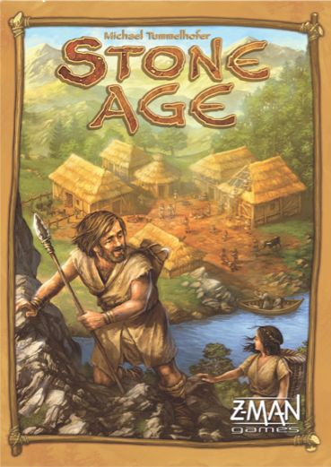
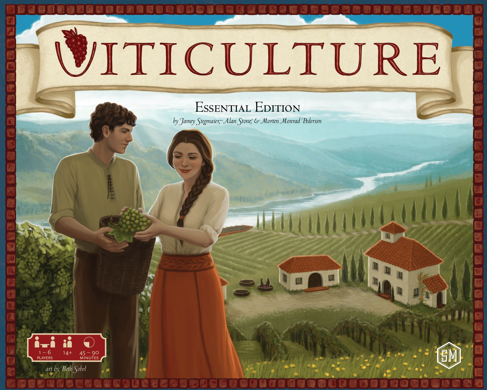

# Worker Placement: The Art of Getting in Everyone's Way

Few mechanisms in board gaming are as immediately legible as worker placement. You have a thing  -  a meeple, a pawn, a little wooden person  -  and you put it on a space. That space is now yours. Nobody else can have it. Simple. Devastating.

That's the hook. Worker placement is, at its core, a blocking game. Every action you take is simultaneously an action you deny to everyone else at the table. It creates a beautiful tension between doing what you need and ruining what your opponent needs, often at the same time, often by accident, and often followed by a quiet "oh no, were you going there?"

This article traces how worker placement grew from a single French castle into one of the hobby's defining mechanisms  -  and why, after two decades, designers keep finding new ways to make it sing.

## What Worker Placement Actually Is

A worker placement game typically has four interlocking elements:

- **Limited action spaces** that can only hold one worker (mutual exclusion)
- **A shared board** where everyone competes for the same spots
- **Turn order tension**, because going first means better picks but usually costs something
- **A finite pool of workers** that forces prioritization  -  you can't do everything

The genius is in that last point. You never have enough workers. Every round is a negotiation with yourself about what matters most *right now*. Take the wood? Grab the food? Block the building space your opponent has been eyeing for two rounds?

Some designs layer on additional pressure. Agricola famously makes you feed your workers every harvest, so growing your family gives you more actions but also more mouths. Others play with timing  -  wake-up tracks, seasonal phases, or variable turn order that turns "when do I act?" into its own strategic axis.

The result is a mechanism that scales beautifully from gateway games to heavy euros, from two players to five, and from 45 minutes to three hours. It's one of the few mechanisms where the core tension  -  I want that space but so do you  -  never stops being interesting.

## The Evolution: From a French Castle to Woodland Critters

### [Caylus](https://boardgamegeek.com/boardgame/18602/caylus) (2005)

This is where it starts. [Caylus](https://boardgamegeek.com/boardgame/18602/caylus) didn't technically invent worker placement  -  *Bus* (1999) and *Keydom* (1998) arguably got there earlier  -  but Caylus is the game that crystallized the mechanism into something the hobby recognized as a genre. Published in **2005**, it plays **2-5**, runs **60-150 minutes**, and carries a **3.79/5** weight on BGG. It's rated **7.70/10** and currently sits at **rank #137**.

The design is blunt and brilliant. You're building along a road to a castle, placing workers on buildings to activate them, and the provost mechanism means some of those buildings might not even fire. That's the knife twist. Not only can your opponent take the space you wanted  -  they can also manipulate the provost to shut down the spaces you *did* get. It's cutthroat in a way that later worker placement games deliberately softened.

Caylus established the grammar. Limited spaces. Mutual exclusion. Turn order as currency. Resource conversion chains. Everything that came after is, in some way, a conversation with this game.

### [Agricola](https://boardgamegeek.com/boardgame/31260/agricola) (2007)

If Caylus wrote the rules, [Agricola](https://boardgamegeek.com/boardgame/31260/agricola) wrote the emotional playbook. Uwe Rosenberg's farming epic arrived in **2007** for **1-5 players**, runs up to **150 minutes**, sits at a **3.64/5** weight, is rated **7.86/10**, and holds **BGG rank #64** with over 76,000 ratings.

Agricola's innovation was pressure. Specifically, the harvest. Every few rounds, you must feed your family, and if you can't, you take begging cards that are basically negative points branded with shame. This turns worker placement from a pure optimization puzzle into a survival game. You're not just building a farm  -  you're desperately trying not to starve while building a farm.

The other masterstroke is family growth. Adding a family member gives you an extra worker  -  more actions per round  -  but also another mouth to feed. It's the quintessential worker placement dilemma: more power comes with more responsibility, and the timing of when you grow your family is often the difference between a good game and a catastrophe.

Agricola also introduced occupation and minor improvement cards that make every game feel different. The card drafting variant alone could sustain its own article. This is the game that proved worker placement could be deeply personal, brutally tense, and endlessly replayable.

### [Stone Age](https://boardgamegeek.com/boardgame/34635/stone-age) (2008)

After Caylus's sharpness and Agricola's anxiety, [Stone Age](https://boardgamegeek.com/boardgame/34635/stone-age) arrived as a breath of fresh air. Published in **2008** for **2-4 players**, it plays in **60-90 minutes**, weighs just **2.46/5**, scores **7.51/10**, and sits at **BGG rank #187** with nearly 56,000 ratings.

Stone Age proved that worker placement could be a gateway mechanism. The rules are clean: place your people on resource spots, roll dice to see how much you gather, feed your tribe, buy cards and buildings. Dice. In a worker placement game. The eurogame purists winced. Everyone else had a great time.

What makes Stone Age more than just "baby's first worker placement" is the multi-worker commitment. You don't place one worker per space  -  you commit groups, and the number you send determines how many dice you roll. That creates a genuine allocation puzzle even at this weight level. Send three to the forest for reliable wood, or gamble two on the gold mine and hope the dice cooperate?

It's also the game that taught a generation of players what worker placement *feels* like before throwing them into heavier designs. That's a real contribution to the hobby, even if veteran players sometimes dismiss it.

### [Lords of Waterdeep](https://boardgamegeek.com/boardgame/110327/lords-of-waterdeep) (2012)

[Lords of Waterdeep](https://boardgamegeek.com/boardgame/110327/lords-of-waterdeep) did something worker placement games had largely avoided: it put a big recognizable theme on top and made no apologies about it. Released in **2012** for **2-5 players**, **60-120 minutes**, weight **2.45/5**, rated **7.73/10**, **BGG rank #106**.

Yes, the "theme" is technically Dungeons & Dragons. Yes, the adventurers are just colored cubes. The memes write themselves. But here's the thing  -  Lords of Waterdeep is an extremely well-tuned game that does something clever with its quest system. Your Lord card gives you secret scoring bonuses for completing certain quest types, so the worker placement layer feeds into hidden information and long-term planning.

The Scoundrels of Skullport expansion added corruption  -  a push-your-luck temptation track that gives powerful benefits now in exchange for potentially devastating penalties later. That expansion elevated the whole design.

Lords of Waterdeep also popularized building new action spaces as a strategy. When you construct a building, it becomes a new worker placement spot, and you get a bonus every time someone else uses it. That owner-benefit loop became a staple of later designs.

### [Viticulture Essential Edition](https://boardgamegeek.com/boardgame/183394/viticulture-essential-edition) (2015)

[Viticulture Essential Edition](https://boardgamegeek.com/boardgame/183394/viticulture-essential-edition) took the mechanism and added rhythm. Published in **2015** for **1-6 players**, **45-90 minutes**, weight **2.90/5**, rated **7.96/10**, and ranked **#44 on BGG**  -  making it the highest-rated pure worker placement game on this list.

The seasonal structure is the key innovation. Your year is split into summer and winter, and you assign workers to one season or the other at the start of each round. Summer is for planting and building. Winter is for harvesting and fulfilling wine orders. That split forces you to think about *when* your workers are available, not just *where* they go.

Then there's the wake-up track. You choose your turn order each round, and earlier positions come with weaker bonuses while later slots give you better compensation for going last. It's an elegant dial that makes turn order feel like a genuine strategic choice instead of random seating.

Viticulture is also one of the warmest worker placement games in the hobby. The winemaking theme actually works  -  you feel the arc of planting, harvesting, aging, and selling. When your cellar finally has a mature wine that perfectly fills a high-value order, there's a satisfaction that pure cube-pushing rarely delivers.

### [Everdell](https://boardgamegeek.com/boardgame/199792/everdell) (2018)

[Everdell](https://boardgamegeek.com/boardgame/199792/everdell) closes this arc by asking: what if worker placement wasn't the whole game, but half of a hybrid that also includes [tableau building](/posts/mechanic-deep-dive-tableau-building/)? Released in **2018** for **1-4 players**, **40-80 minutes**, weight **2.83/5**, rated **7.98/10**, **BGG rank #42**.

The worker placement spaces in Everdell are relatively limited  -  a handful of forest locations for resources, event spaces, and destination cards. What makes it click is that those workers feed into your tableau: a personal city of critters and constructions, capped at 15 cards, where paired cards unlock free deployments and cascading combos.

The seasonal pacing is the other smart move. Players don't move through seasons simultaneously. You advance to the next season whenever *you* run out of things to do, which means the table is constantly out of sync. One player might be in autumn while another is still in summer. That asynchronous tempo creates a rhythm unlike any other worker placement game.

Everdell showed that worker placement could be a *component* of a larger system rather than the whole identity. The mechanism provides the resource tension and blocking; the tableau provides the engine-building satisfaction. It's the best of both worlds  -  and it's no accident that Dune: Imperium (worker placement plus deckbuilding) followed a similar hybrid philosophy two years later.

## Why Worker Placement Endures

Twenty years after Caylus, designers are still iterating on this mechanism, and the reason is simple: mutual exclusion is inherently interesting. The moment two players want the same space, the game creates drama. No designer intervention needed. No combat system. No negotiation phase. Just one space, two desires, and a turn order.

That's an extraordinarily efficient source of tension. It works at every weight level  -  from Stone Age's breezy dice-rolling to Agricola's harvest anxiety. It pairs cleanly with other mechanisms  -  deckbuilding in Dune: Imperium, tableau building in Everdell, bag building in Orléans. And it scales well, because adding players doesn't add rules complexity, just competition for space.

The historical arc tells a clear story. Caylus established the grammar. Agricola added emotional stakes. Stone Age and Lords of Waterdeep proved the mechanism could welcome new players. Viticulture refined the tempo. Everdell showed it could share the spotlight with other systems.

Each step kept the core promise intact: your choices matter because they close doors for everyone else. That's worker placement. That's why it endures. And that's why, two decades in, designers keep finding new doors to close.
