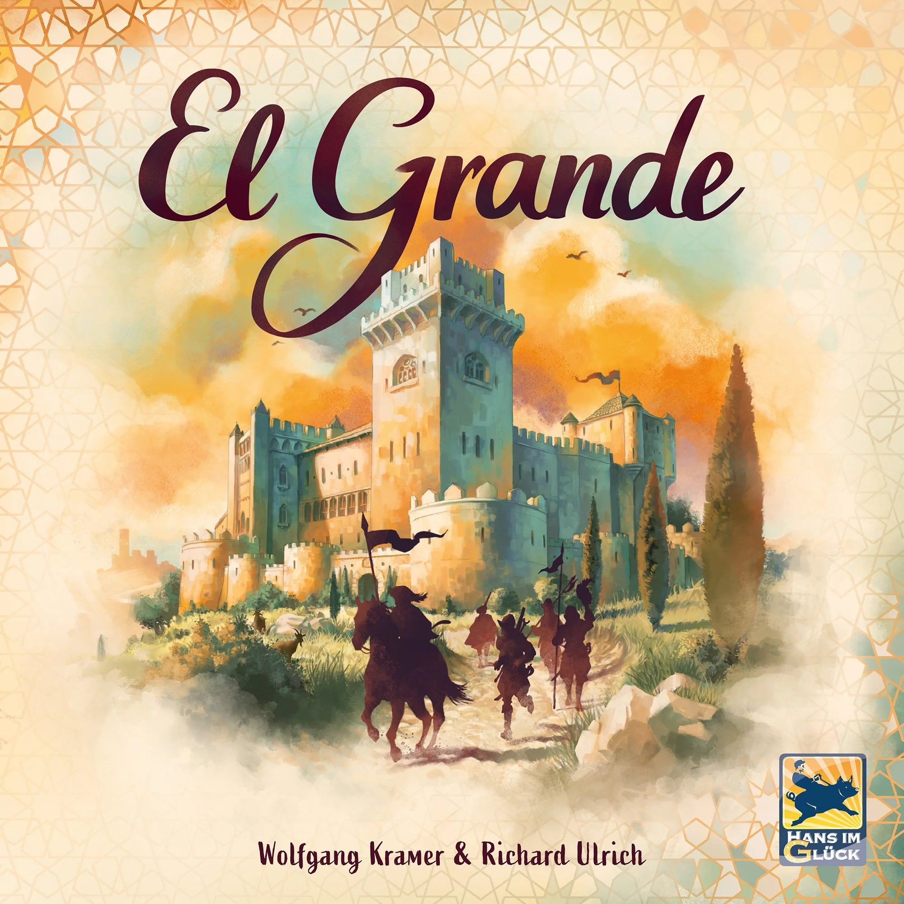

There's a moment in every game of [El Grande](https://boardgamegeek.com/boardgame/93) where someone dumps four caballeros out of the Castillo into a region you thought was locked down, flips the entire scoring round on its head, and grins at you like they've been planning it for three rounds.

They haven't. They just seized the opportunity. And that's the whole game.

Wolfgang Kramer and Richard Ulrich's 1995 masterpiece sits at a **7.77 rating** on BGG with nearly 33,000 ratings, ranked **#100 overall** and **#78 among strategy games**, carrying a weight of **2.93/5**. It plays **2–5 players** in **60–120 minutes**. It won the Spiel des Jahres in 1996. It was inducted into the BGG Hall of Fame in 2025. It invented area majority as a genre.

And after thirty-one years, nothing has topped it.

## The Setup: Medieval Spain, Maximum Spite

The premise is deceptively simple. You're a Grande — a powerful lord in medieval Spain — vying for influence across nine regions as the king's power wanes. You draft caballeros (knights) into your court and deploy them onto the board to claim majorities. After every third round, the board scores. Most points after nine rounds wins.

That's it. That's the game. You could teach it in ten minutes.

The depth that emerges from those ten minutes of rules is staggering.

## Power Cards: The Engine of Agony

Every player starts with thirteen power cards, numbered 1 through 13. You'll play exactly nine of them over the course of the game — one per round, never repeated. Here's the twist that makes El Grande sing: **high cards give you priority but fewer caballeros. Low cards flood your court with troops but leave you picking last.**

Play your 13 and you choose first from the action cards — but you recruit zero caballeros. Play your 1 and you'll get six fresh troops — but you're choosing from whatever scraps remain.

This creates an agonising push-pull that never gets old. Every single card play is a sacrifice. Do you burn the 13 now to grab that devastating action card, or save it for the final scoring round when positioning matters most? Do you go low to stockpile forces, gambling that no one takes the card you need?

Nine decisions. Thirteen cards. And every single one of them matters.

## Action Cards: Controlled Chaos

Each round, five action cards are revealed — one from each stack. The stacks are tiered: higher stacks let you place more caballeros but have weaker special abilities, while lower stacks offer brutal special powers with fewer placements.

The specials range from surgical to devastating. Move the king to a new region (fundamentally reshaping where anyone can deploy). Score all four-point regions early. Remove an opponent's caballeros from the board. Move your pieces across the map, ignoring adjacency rules.

One card is always available: the king's card, which lets you move the king and place five caballeros. It's the safety valve, the default choice — and sometimes the most powerful play on the board, because **nothing can ever change in the king's region**. No pieces in, no pieces out, no action card effects. The king is a shield, and moving him into your strongest region is one of the most satisfying defensive plays in all of board gaming.

## The Castillo: Where Plans Go to Die

And then there's the Castillo.

It's a cardboard tower sitting on the edge of the board. Whenever you place caballeros, you can drop them into the Castillo instead of any region. They disappear inside, hidden from view. No one knows exactly how many each player has stashed in there. You can try to count — and you should — but in the heat of a five-player game, the mental arithmetic gets fuzzy fast.

During each scoring round, the Castillo opens. First, it scores as its own region — most caballeros gets five points, second gets three. Then comes the real chaos: every player secretly selects a region on their dial, and their caballeros from the Castillo flood into that region *before* the rest of the board scores.

This is where El Grande transcends area control and becomes a psychological thriller. You've been quietly feeding the Castillo for three rounds. You've watched your opponent do the same. You both know Castilla La Vieja is the most contested region. Do you send your forces there and risk a collision? Or do you target that quiet little region in the corner where a surprise deployment would swing the scoring?

The Castillo turns deterministic area majority into a mind game. It's the single most elegant hidden information mechanism in board gaming history, and it's been copied a hundred times without anyone quite capturing the magic.

## Why It Still Works in 2026

Modern area control games have added layers upon layers — asymmetric powers, engine building, tech trees, variable setups. El Grande has none of that. It doesn't need it.

What it has is **purity**. Every mechanism serves one purpose: making your interactions with other players as meaningful as possible. There's no solitaire engine to hide behind. No combo to optimise in isolation. Every single thing you do on your turn directly affects everyone else at the table. Move caballeros into a region? You've just changed three people's scoring calculations. Move the king? You've reshaped deployment options for everyone. Take an action card? You've denied it to four other players.

This is a game where being in the lead is genuinely dangerous. The table will turn on you. Alliances form and dissolve between scoring rounds. Someone you helped two rounds ago will cheerfully evict your caballeros from Aragón because it serves them now. There's no hard feelings — it's just Spain.

The weight of **2.93** on BGG tells its own story. This is a game that plays at medium weight but thinks at heavy weight. The rules are simple enough for newcomers to grasp, but the strategic ceiling is high enough that veterans are still finding new angles after hundreds of plays.

## The Player Count Question

El Grande is **best at five players**. This isn't controversial — 555 out of 770 BGG poll respondents agree, making it one of the strongest "best at" consensuses on the site. At five, every region is contested, every action card matters, and the Castillo becomes a genuine pressure cooker.

At four, it's still excellent — 270 voted "Best," 389 voted "Recommended." You lose a little tension but gain slightly faster turns.

At three, it's playable but looser. Too many uncontested regions, too much room to avoid each other. The confrontation that makes El Grande special gets diluted.

At two, frankly, don't bother. There are better two-player area control games. El Grande needs the crowd.

## The 2024 Reprint

Hans im Glück's 2024 reprint deserves special mention. The original game's components were functional but plain — coloured cubes, a serviceable board, basic card design. The new edition replaces cubes with meeples, adds a striking new board with gold-finished edges, and packages everything in colour-coded tuck boxes that make setup a breeze.

The Castillo now has a portcullis mechanism — pull up the gate and the caballeros tumble out dramatically. It's a small touch, but it turns the scoring reveal into a genuine table moment.

Two mini-expansions are bundled in, adding variability without compromising the core game. Smart move for a design that could sustain a hundred plays on its own.

## The Verdict: Still the Gold Standard

El Grande didn't just launch area control as a genre — it perfected it on the first attempt. That's an extraordinary claim, and one that thirty-one years of subsequent designs have failed to disprove.

[Blood Rage](https://boardgamegeek.com/boardgame/170216) added drafting and monsters. [Inis](https://boardgamegeek.com/boardgame/155821) added card-driven elegance and Celtic mythology. [Cyclades](https://boardgamegeek.com/boardgame/54998) added auctions and mythological creatures. They're all excellent games. None of them are better at being an area control game than El Grande.

If you have four or five players and two hours, there is no finer way to spend them. El Grande is the king of area control, and the crown isn't going anywhere.

---

**El Grande** | Designed by Wolfgang Kramer & Richard Ulrich | Art by Doris Matthäus | Published by Hans im Glück | 2–5 Players | 60–120 Minutes | Weight: 2.93/5

*[Browse El Grande on BoardGameGeek →](https://boardgamegeek.com/boardgame/93)*
