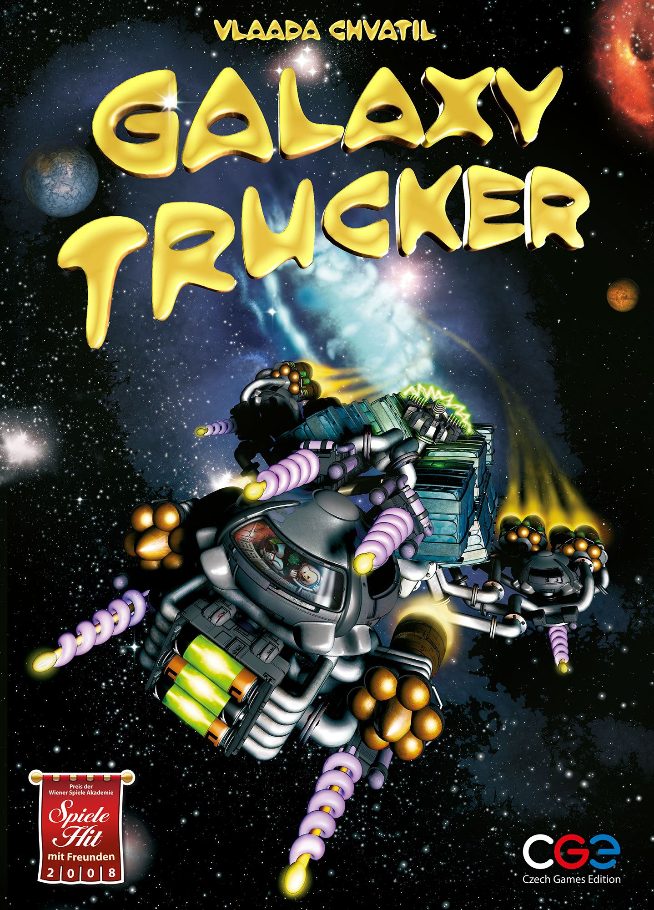
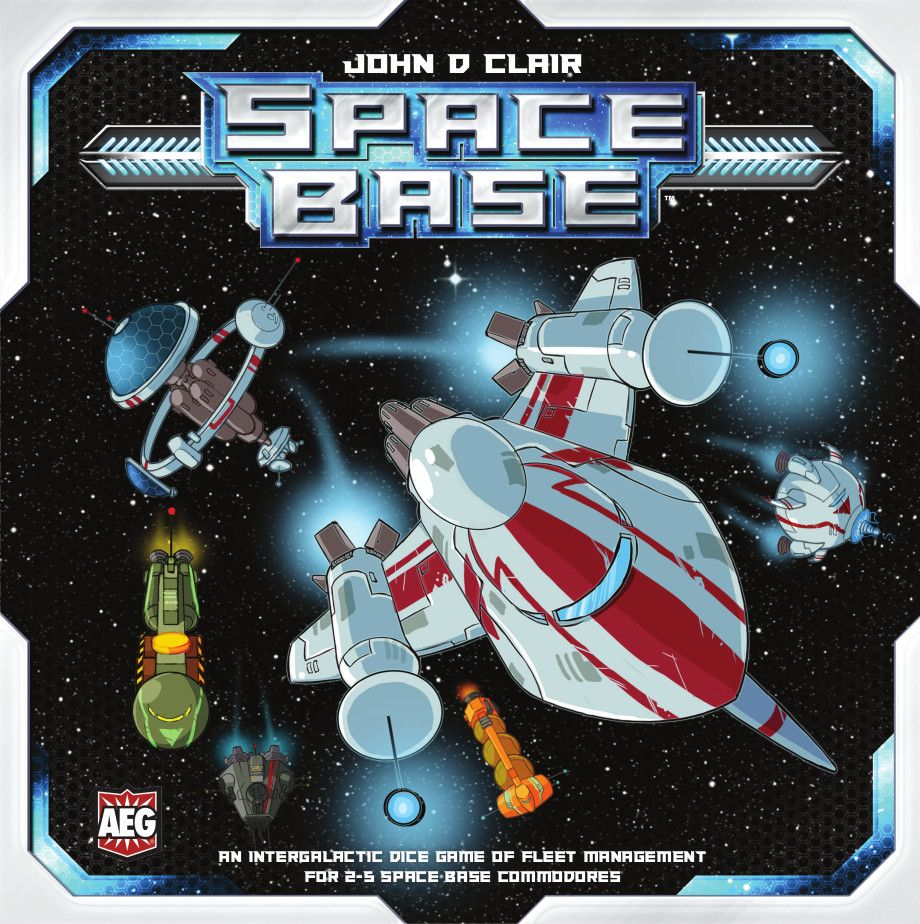
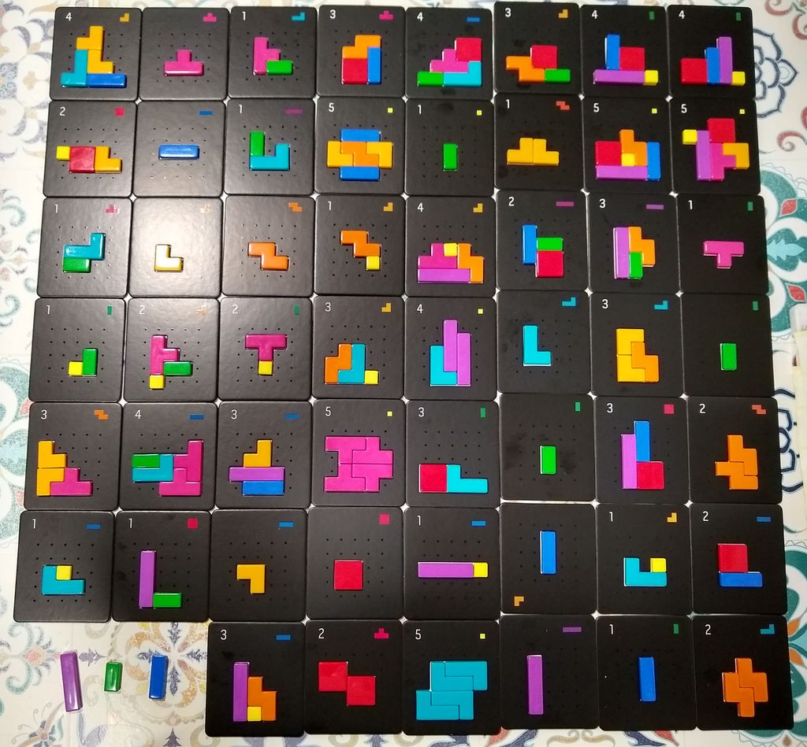

# [Galaxy Trucker](https://boardgamegeek.com/boardgame/31481) [Retro](/posts/retro-review-pandemic-2008/) Review: Building a Spaceship That Falls Apart. Still Funny?

## The Legend

In 2007, [Galaxy Trucker](https://boardgamegeek.com/boardgame/31481) landed like a small disaster. Which is fitting, because the whole game is about building a ship that absolutely should not be allowed in space, then watching the universe punish your optimism.

Designed by Vlaada Chvátil and published by Czech Games Edition, it arrived in a hobby that was far less comfortable with real-time play than it is now. Plenty of eurogames asked you to think carefully. [Galaxy Trucker](https://boardgamegeek.com/boardgame/31481) asked you to panic, slap tiles onto a board, realise you’ve attached a cannon to nothing, and then launch anyway because the sand timer does not care about your dreams.

That was the magic. The first half is frantic tile-grabbing chaos. The second half is the game calmly explaining, card by card, why your ship is rubbish.

This review looks at whether that formula still works today, what has aged well, what has not, and where modern games overlap with parts of its appeal. The short version is that [Galaxy Trucker](https://boardgamegeek.com/boardgame/31481) still feels unusual. The longer version is that its particular mix of panic, punishment, and comedy remains hard to imitate.

Its reputation has held up too. On BGG it sits at 7.32/10 from 35,697 ratings, with a weight of 2.33/5, ranked #314 overall. That feels right. This is not some dusty relic people politely respect. People still actually play it.

## Playing It Today

If the legend explains why the game mattered, the more useful question is how it actually feels to get it to the table now.

In 2026, the first surprise is how easy [Galaxy Trucker](https://boardgamegeek.com/boardgame/31481) is to get to the table. It plays 2 to 4, is listed at 60 minutes, and that remains broadly accurate unless you have one of those groups that treats every rules explanation like a hostage negotiation. At two and three players, which is where I live most of the time because organising four adults is apparently harder than orbital [mechanics](/posts/mechanic-deep-dive-tableau-building/), it still works very well.

The teach is not bad, either. Not by Vlaada standards. You explain connectors, batteries, crew, cannons, cargo holds, engines, and structural weak points. Then you tell everyone the real rule: your ship will break, and that is the joke.

That last part matters. If your group treats randomness as a personal insult, this can go wrong fast. [Galaxy Trucker](https://boardgamegeek.com/boardgame/31481) is not interested in fairness in the neat, modern, “everyone got to do their thing” sense. It wants stories. It wants one player to lose half a ship to a meteor because they got greedy with exposed sides. It wants someone else to realise, too late, that their fancy laser platform has no power. It wants laughter with a hint of despair.

And yes, it is still funny. Genuinely funny. Not “the flavour text is amusing” funny. Table funny. The kind where everyone leans in as cards flip and starts pointing at bits of cardboard that are about to become debris.

That present-day play experience also ties directly into why some parts of the design have aged so well, and why others still divide people.

The current recommended version is the 2021 edition, and that is the one to buy. It comes in a smaller box, has a lower MSRP of $29.95, improves accessibility for new players, shortens the structure, and gives the whole thing a visual overhaul from Tomáš Kučerovský that makes the silliness sing. Czech Games Edition did the smart thing here. They polished the game without sanding off its rough, idiotic charm.

## What Aged Well

### The core joke still works

This sounds obvious, but loads of “funny” games stop being funny once the novelty wears off. [Galaxy Trucker](https://boardgamegeek.com/boardgame/31481) avoids that because the humour comes from systems, not just writing. The game creates punchlines. You built the punchline yourself. Poorly.

That is why it still lands after nineteen years. Watching a ship fail is funny. Watching your ship fail because you made one stupid decision three minutes earlier is even better.

### The theme is brilliant

The low-budget sci-fi tone is perfect. This is not heroic space opera. It is duct tape, bad contracts, exposed wiring, and a crew who absolutely should have read the safety manual. The whole thing feels like Red Dwarf by way of a warehouse clearance sale. Sewer systems in space. Dodgy hauliers. Catastrophic planning. Lovely stuff.

Plenty of games paste a theme on top of mechanisms. [Galaxy Trucker](https://boardgamegeek.com/boardgame/31481) is one of those happy cases where the mechanisms are the theme. Of course your ship is lopsided. Of course your cargo hold gets blasted off. Of course the person who rushed the launch regrets everything.

### It still feels unlike most games

This is the big one. The hobby has changed massively since 2007. We have cleaner rules, smoother onboarding, more elegant balancing, and an entire generation of designs obsessed with reducing friction. Useful. Sensible. Sometimes a bit bloodless.

[Galaxy Trucker](https://boardgamegeek.com/boardgame/31481) is friction. Productive friction, hilarious friction, but friction all the same. It asks you to be fast, then punishes you for being sloppy. It creates stress and then turns that stress into a story. There still are not many games that do exactly that in quite this way.

## What Didn’t

The same qualities that make it memorable also explain where it shows its age.

### The randomness is not for everyone

Some old designs get accused of randomness because players have become more strategic over time. Not this one. [Galaxy Trucker](https://boardgamegeek.com/boardgame/31481) really is random. Deliberately, aggressively random.

You can build well and still get battered. You can build a shambles and somehow limp home with a profit. That swinginess is part of the fun, but it also means the game can feel cruel if your group wants agency above all else. If someone at the table starts sentences with “well, actually, statistically”, they may have a miserable evening.

### The second half is still more passive than the first

This was true in 2007 and it is true now. The build phase is electric. Everyone is grabbing tiles, muttering, rotating pieces in mid-air, and making terrible life choices. The flight phase is entertaining, but it is more reactive. You reveal cards, resolve problems, and watch consequences unfold.

That contrast is part of the design’s identity, yet modern players may feel the drop in intensity more sharply. We are used to games sustaining engagement more evenly. [Galaxy Trucker](https://boardgamegeek.com/boardgame/31481) is more theatrical than consistently interactive.

### The original edition is harder to recommend

The 2007 design still works, but the 2021 revision is simply friendlier. Better flow, better presentation, easier onboarding. Unless you are a collector or deeply attached to the original, the newer printing is the sensible choice. Current availability is good through Czech Games Edition, and the lower price helps. For a game with this much personality, around the thirty-dollar mark is a pretty easy sell.

## Modern Alternatives

That mix of strengths and weaknesses also explains why finding a true modern substitute is difficult. Most newer games smooth out one element or another, but they do not really recreate the full experience.

This section is tricky because there is no clean replacement for [Galaxy Trucker](https://boardgamegeek.com/boardgame/31481). A lot of modern games polish one part of its identity, but very few replicate the whole ridiculous package.

### [Space Base](https://boardgamegeek.com/boardgame/242302)

If what you like is cheerful space economics with plenty of momentum and less punishment, [Space Base](https://boardgamegeek.com/boardgame/242302) is a much smoother night. It gives you combos, progression, and that satisfying “my engine is doing something now” feeling. What it does not give you is the comic collapse. Nobody in [Space Base](https://boardgamegeek.com/boardgame/242302) proudly launches a vehicle that immediately sheds a toilet module into the void.

Choose [Space Base](https://boardgamegeek.com/boardgame/242302) if you want space-themed fun with cleaner design and less emotional violence. Choose [Galaxy Trucker](https://boardgamegeek.com/boardgame/31481) if you want stories you will still be talking about in the pub.

### [Project L](https://boardgamegeek.com/boardgame/260180)

This is not a thematic cousin, but it does speak to a modern preference for speed and clarity. [Project L](https://boardgamegeek.com/boardgame/260180) is quick, polished, and effortlessly teachable. It respects your evening. It also has almost none of the glorious stupidity that makes [Galaxy Trucker](https://boardgamegeek.com/boardgame/31481) memorable.

If your group wants a tidy puzzle, play [Project L](https://boardgamegeek.com/boardgame/260180). If they want to cackle while Dave’s starboard side evaporates, you already know the answer.

## Final Verdict

So, nineteen years on, does [Galaxy Trucker](https://boardgamegeek.com/boardgame/31481) still deserve shelf space?

Yes. With a small but important asterisk.

The verdict is **Worth revisiting**, and for the right group it edges very close to **Still essential**.

What this review keeps circling back to is simple: the game still works because its central joke, theme, and structure remain distinctive, even if the randomness and the more passive flight phase will still put some people off. It is easier to recommend in the 2021 edition, and it remains most appealing to groups that value stories and table energy over fairness and control.

If you love controlled strategy, low randomness, and elegant optimisation, the hobby has moved somewhere else. There are modern games that feel sharper, fairer, and more respectful of player planning. You will probably admire [Galaxy Trucker](https://boardgamegeek.com/boardgame/31481) more than love it.

But if you want a game night that feels alive, if you want a design with actual personality, if you enjoy laughing at disaster instead of sulking through it, this thing still absolutely works. More than works, really. It still stands out.

That is rare. Plenty of classics survive because we are sentimental. [Galaxy Trucker](https://boardgamegeek.com/boardgame/31481) survives because building a spaceship badly and watching it fall apart is, apparently, timeless.

Buy the 2021 edition. Play it with people who can handle chaos. Do not get attached to your left wing.

It is going to come off.