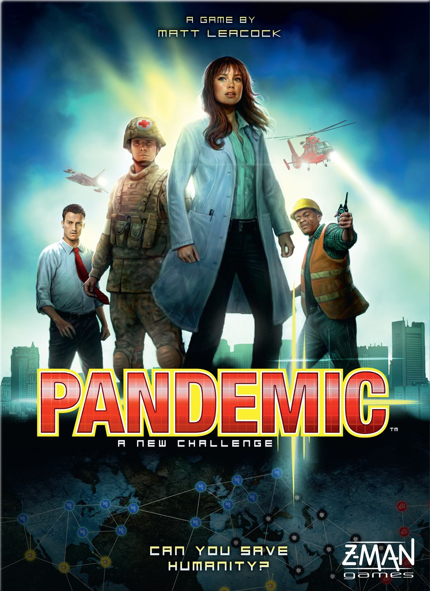
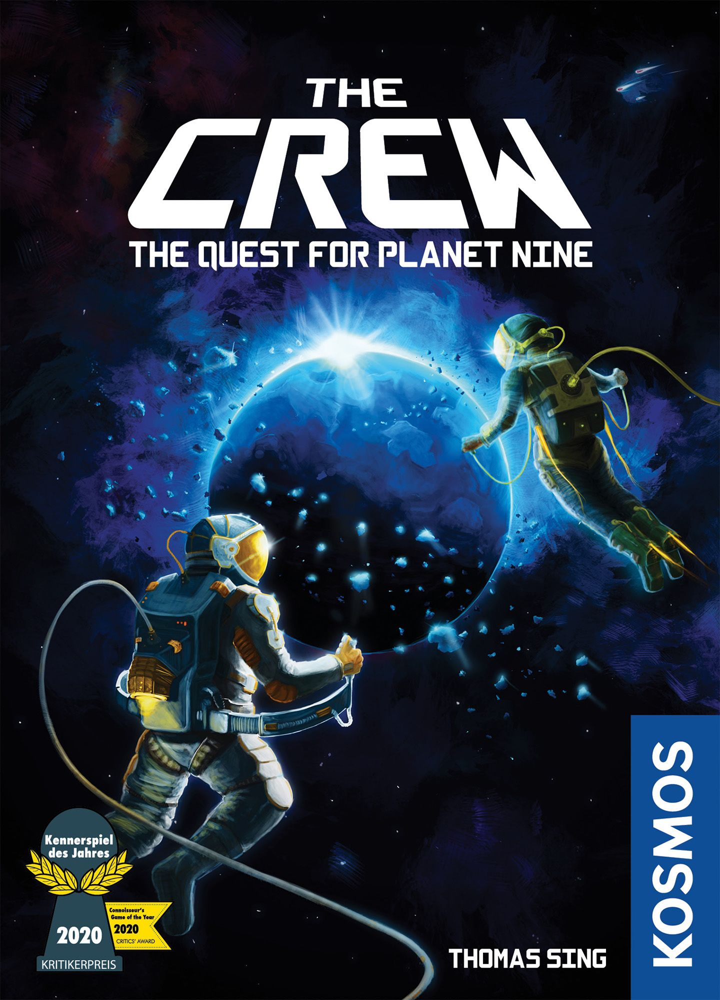
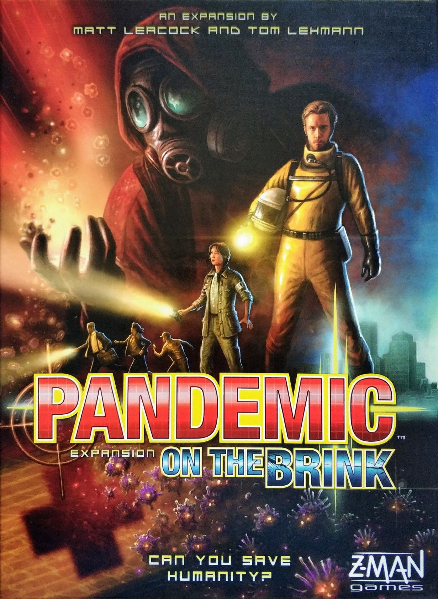

## The Legend

In 2008, [Pandemic](https://boardgamegeek.com/boardgame/30549) landed at exactly the right moment for the hobby. Not because the world was ready for disease cubes. Because the hobby was ready for a cooperative game that didn’t need a hidden traitor, a gimmick reveal, or a giant rules lecture to create tension.

Matt Leacock’s design changed the conversation. This was the game that showed a lot of players, including plenty of non-hobby folks, that “we all lose together” could be just as dramatic as direct conflict. Maybe more. You had a world map, a handful of specialist roles, four actions, a deck that kept getting nastier, and those awful little outbreaks that could turn a stable board into a full-blown disaster in one bad sequence. Clean design. Immediate stakes. Real panic.

That mattered. A lot.

It also helped establish Z-Man as a publisher people paid attention to. More than that, [Pandemic](https://boardgamegeek.com/boardgame/30549) became one of those gateway titles that escaped the usual hobby circles. Couples played it. Families played it. Friends who would never touch a beige euro played it. Reviewers at the time called it captivating, tense, and perfect for newcomers, and that wasn’t [hype](/posts/hype-vs-reality-march-2026-edition/). For years, groups played this thing relentlessly.

In 2026, its BGG page still tells the story. [Pandemic](https://boardgamegeek.com/boardgame/30549) sits at a 7.51/10 from 134,491 ratings, with a 2.39/5 weight, ranked #170 overall. That is serious staying power for a 45-minute co-op from 2008.

This review looks at why that staying power exists, what still works at the table, what has aged less gracefully, how it compares to newer co-ops, and whether it still makes sense to buy in 2026.

## Playing It Today

So, post-COVID, does sitting down with [Pandemic](https://boardgamegeek.com/boardgame/30549) feel weird?

Yes. Sometimes very weird.

But weird doesn’t mean bad. In fact, the game’s biggest surprise in 2026 is how little of it feels gimmicky or dated. The theme still clicks because the mechanisms still click. Drawing infection cards and watching hotspots flare up across the map remains one of the cleanest tension engines in board games. You don’t need paragraphs of flavor text. The cubes do the work. Seeing three blue cubes pile up in a city and knowing one more draw could trigger a chain reaction is enough to make the whole table lean in.

The actual play experience is still brisk and sharp. Four actions. Move, treat, share, build, discover. The rules are crystal-clear in a way modern hobby games too often forget to be. You can teach this to new players fast, and that matters more now than ever because the hobby has gotten bloated. Plenty of modern co-ops ask for two hours, asymmetrical player boards the size of placemats, and a teach that feels like filing taxes. [Pandemic](https://boardgamegeek.com/boardgame/30549) just gets on with it.

That accessibility is still its superpower.

At 2 to 4 players and around 45 minutes, it remains one of the easiest “actual game night” recommendations around. Not aspirational shelf candy. A game people will really play.

From there, the real question is what exactly has helped it hold up so well, and where the cracks show.

## What Aged Well

First, the core system still rules.

The player deck and infection deck create a rhythm that newer designs still borrow from. You spend the early game stabilizing, the midgame scrambling, and the endgame trying to thread a needle between efficient cure timing and total collapse. Epidemics don’t just make things harder. They make the board feel hostile. The infection discard pile getting shuffled back on top is still such a nasty, elegant bit of design. You know trouble is coming. You just don’t know if you can survive it.

Second, the role design still works. It’s simple by modern standards, sure, but that simplicity is part of the magic. The Medic feels useful immediately. The Dispatcher creates those big-brain team turns. The Scientist changes your cure math in a way even new players understand in seconds. There’s enough asymmetry to create identity without turning the game into a rules burden.

Third, the production still does the job. No, it’s not deluxe. No, it doesn’t need miniatures the size of soup cans. The cubes are iconic for a reason. People joke about hating them, and that’s because they’re effective. They are tiny plastic stress tokens. Mission accomplished.

And maybe most importantly, the game still has crossover power. This is where [Pandemic](https://boardgamegeek.com/boardgame/30549) remains dangerous. You pull it out for one “simple co-op,” and suddenly someone who never cared about board games is asking if you can run it back.

## What Didn’t

Of course, the same qualities that make [Pandemic](https://boardgamegeek.com/boardgame/30549) approachable also expose its limits.

The quarterbacking problem is real. Always was.

Every co-op discussion on BGG or Reddit eventually runs into this wall, and [Pandemic](https://boardgamegeek.com/boardgame/30549) is one of the textbook examples. Because information is mostly open and the action economy is easy to parse, one assertive player can absolutely start piloting the whole table. “You go here, treat that, I’ll fly there, then you pass me the card.” If you’ve played with That Guy, you know how fast the fun drains out of the room.

This isn’t a minor nitpick. It’s the game’s defining weakness.

Veteran groups also may find the base game a little solved after enough plays. Not fully solved, but familiar in a way that blunts the drama. You start recognizing the same patterns. Prioritize card efficiency. Manage outbreaks. Set up the Scientist. Don’t get cute. For casual tables, this stays fresh for a long time. For heavy players, the novelty fades.

The presentation has also aged in a very 2008 way. Functional, readable, a bit plain. The rulebook may be clear, but “flimsy” is a fair description. Modern editions are fine, widely available, and still a good value around the $35 mark, but nobody is mistaking this for a luxury production.

Then there’s the obvious question. Does the theme hit too close to home now?

For some players, yes. Full stop. Post-2020, [Pandemic](https://boardgamegeek.com/boardgame/30549) can feel less like exciting pulp tension and more like a reminder of a period many people would rather not revisit on game night. For others, weirdly, the opposite happened. The game feels even more relevant, more grounded, more eerily sharp. Your table’s mileage will vary, and that matters here more than with most retro reviews.

Those strengths and weaknesses also make it easier to place [Pandemic](https://boardgamegeek.com/boardgame/30549) against the co-ops that followed it.

## Modern Alternatives

If you want the clean co-op tension of [Pandemic](https://boardgamegeek.com/boardgame/30549) but with more resistance to alpha play, [Spirit Island](https://boardgamegeek.com/boardgame/162886) is the obvious modern heavyweight.

[Spirit Island](https://boardgamegeek.com/boardgame/162886) pushes asymmetry way harder. Each player has their own engine, their own priorities, and enough private tactical complexity that one person can’t easily run everyone else’s turn. The tradeoff is simple. It’s much harder to teach, much longer to play, and nowhere near as breezy. If [Pandemic](https://boardgamegeek.com/boardgame/30549) is the co-op you can get to the table with almost anyone, [Spirit Island](https://boardgamegeek.com/boardgame/162886) is the one for groups who already know they want to work for their dinner.

If you want a lighter modern co-op that keeps tension high without inviting one player to dominate every decision, [The Crew: The Quest for Planet Nine](https://boardgamegeek.com/boardgame/284083) is a great counterexample.

The restricted communication does a ton of work there. You can’t just script everybody’s turn because the game won’t let you. Different beast, obviously. Trick-taking mission structure instead of board-state crisis management. But if your issue with [Pandemic](https://boardgamegeek.com/boardgame/30549) is social rather than [mechanical](/posts/mechanic-deep-dive-hidden-roles/), that distinction matters.

And if what you really want is cinematic disaster with suspicion and chaos, [Nemesis](https://boardgamegeek.com/boardgame/167355) goes in the opposite direction entirely.

It adds betrayal, uncertainty, and a much louder table presence. Bigger swings, bigger stories, way more chrome. It’s also much less elegant. Sometimes you want that mess. Sometimes you absolutely do not.

For [Pandemic](https://boardgamegeek.com/boardgame/30549) itself, the smartest upgrade remains [Pandemic: On the Brink](https://boardgamegeek.com/boardgame/40849). More roles, more events, more ways to keep the base game from feeling too rehearsed. If you already know the system works for your group, that’s the add-on I’d point to first.

With those comparisons in mind, the buying question becomes a lot more practical.

## Should You Buy It in 2026? A Real Buyer’s Guide

A retro review is nice. A shelf decision is better. So let’s get practical.

The question with [Pandemic](https://boardgamegeek.com/boardgame/30549) in 2026 is not “Is this game historically important?” Of course it is. The real question is whether it solves a problem for your table right now. That answer changes a lot depending on who you play with, how often you play, and what kind of friction your group tolerates.

### Buy [Pandemic](https://boardgamegeek.com/boardgame/30549) if your group needs a reliable co-op starter

This is still where the game earns its keep.

If you have friends or family who are co-op curious but not ready for a 30-minute teach and a player board covered in keywords, [Pandemic](https://boardgamegeek.com/boardgame/30549) remains one of the safest recommendations in the hobby. The turn structure is easy to grasp. The goal is immediately understandable. Nobody asks, “Wait, what am I even trying to do here?” You are treating outbreaks, managing cards, and trying not to let the world catch fire.

That clarity matters more than hobby veterans sometimes admit. A lot of newer co-ops are better once everyone knows how to play. Fewer of them are better on minute ten of the teach.

It also works extremely well for couples. That was true in 2008 and it’s still true now. Two-player [Pandemic](https://boardgamegeek.com/boardgame/30549) is brisk, tense, and easy to get to the table on a random weeknight. Not every “classic” survives that test.

### Skip it if your group has a chronic alpha player problem

You know your table. Be honest.

If one person always takes over collaborative games, [Pandemic](https://boardgamegeek.com/boardgame/30549) is going to expose that immediately. This is not the game’s fault alone. It’s a social issue amplified by open information and relatively transparent optimization. But the result is the same. One player starts solving everyone else’s turn, and suddenly three people are just moving pawns where they’re told.

For those groups, [Spirit Island](https://boardgamegeek.com/boardgame/162886) is usually the better long-term buy because the asymmetry and complexity naturally create personal responsibility. [The Crew: The Quest for Planet Nine](https://boardgamegeek.com/boardgame/284083) also helps because limited communication shuts down the would-be table manager before they can start drawing flowcharts in the air.

If your group is good at collaborative discussion without one person becoming the regional director of fun, [Pandemic](https://boardgamegeek.com/boardgame/30549) still sings. If not, save yourself the argument.

### Buy it if you value elegant tension over spectacle

A lot of modern co-ops come with piles of content, giant scenario books, branching campaigns, miniatures, and enough plastic to survive a small flood. Cool. Some of those games are excellent.

But [Pandemic](https://boardgamegeek.com/boardgame/30549) does something many modern games do not. It gets to tension fast.

Within a few turns, the board state matters. Decisions matter. Card timing matters. You feel pressure without needing a giant narrative framework to manufacture urgency. That kind of elegance ages well because it doesn’t depend on novelty. The game is not trying to wow you with excess. It is trying to squeeze you with efficiency.

That’s why it still works.

### Skip it if you want your co-ops to keep surprising you for 30 plays

This is where the hobby has moved on.

You can absolutely get plenty of mileage out of [Pandemic](https://boardgamegeek.com/boardgame/30549), especially if you’re playing casually or introducing new people. But if your group is the sort that plays the same co-op twenty times in six months and starts dissecting opening lines on BGG, the base game will show its seams. The role powers are good, but not wildly transformative. The decision space is tense, but not endlessly weird. Eventually you start seeing the skeleton.

That doesn’t make it bad. It makes it finite.

If your shelf space is tight and you already own a heavier co-op you love, [Pandemic](https://boardgamegeek.com/boardgame/30549) may end up becoming “the one we respect” more than “the one we actually play.” There are worse fates, but shelf space is brutal. Every Kallax cube is a hostage negotiation.

### The best fit: families, mixed-experience groups, and lapsed hobbyists

This is the sweet spot.

For families with older kids, mixed groups with one or two gamers and a couple civilians, or former hobby players coming back after years away, [Pandemic](https://boardgamegeek.com/boardgame/30549) is still excellent. The 45-minute play time is a huge part of that. So is the 2.39/5 weight. People can hold the full game in their heads. They can learn by doing. They can lose, reset, and immediately want another shot.

That “let’s try again” energy is one of the game’s best traits. It creates stories without needing campaign scaffolding. You remember the turn where Atlanta got ignored for one round too many. You remember the miracle topdeck. You remember the outbreak chain that made the whole table groan like someone had unplugged life support.

Simple games can do that. The best simple games do it often.

### What version should you actually get?

Keep it easy. The current Z-Man base game is the right starting point.

No need to chase some mythical perfect printing. There isn’t one clear definitive edition that makes all others obsolete. The modern reprints are widely available, the quality is solid, and the price is still reasonable for how much table time you can get out of it.

If you already know your group likes it, then add [Pandemic: On the Brink](https://boardgamegeek.com/boardgame/40849). That expansion is the smart next step because it boosts longevity without burying the original design under too much extra machinery. More roles, more events, more wrinkles. Exactly what an aging classic needs.

### My short version

Buy [Pandemic](https://boardgamegeek.com/boardgame/30549) if you want a fast, clear, proven co-op for real people at real tables.

Skip it if your group demands high asymmetry, hates open-information collaboration, or burns through strategy games like a swarm of locusts through a wheat field.

For everyone else, this old box still has a job to do. And unlike a lot of classics people keep around out of guilt, this one will actually leave the shelf.

## Frequently Asked Questions About [Pandemic](https://boardgamegeek.com/boardgame/30549)

After the buyer’s guide, the remaining questions are the practical ones people ask before clicking buy, digging through the closet, or pitching the game to their group.

### Is [Pandemic](https://boardgamegeek.com/boardgame/30549) still good if you already know all the “best” strategies?

Mostly yes, but with a ceiling.

This is one of the big dividing lines in modern reactions to the game. If your group plays a title five times a year, [Pandemic](https://boardgamegeek.com/boardgame/30549) stays tense for a long time because the randomness of the infection deck and epidemic timing still creates drama. You can know the broad principles and still get wrecked by a bad sequence.

But if your group is the kind that starts discussing opening theory after game three, you’ll hit the edges faster. The strategic priorities become familiar. Cure efficiency matters. Trading cards efficiently matters. Letting one region simmer too long is usually a disaster. The game does not endlessly reinvent itself.

That’s where [Pandemic: On the Brink](https://boardgamegeek.com/boardgame/40849) earns its keep. It doesn’t transform the base game into some wildly different beast, but it adds enough roles, events, and wrinkles to stop the system from feeling too rehearsed. For a lot of groups, that expansion is the difference between “great classic” and “still actively in rotation.”

### Does the post-COVID theme make it harder to enjoy?

For some people, absolutely.

This isn’t one of those concerns you wave away with “it’s just a game.” The theme lands differently now. In 2008, [Pandemic](https://boardgamegeek.com/boardgame/30549) felt urgent in a cinematic way. In 2026, it can feel uncomfortably familiar. Some players will not want that on a relaxing game night, and that’s a perfectly reasonable reaction.

The interesting part is that other groups had the opposite response. The game feels sharper now. More grounded. The race to contain outbreaks, the pressure of limited resources, the sense that one bad turn can spiral into a global mess, all of that reads as more believable than it did before. Not necessarily more fun, but more potent.

So the answer is not universal. It depends on your table’s tolerance for real-world resonance. If you’re unsure, ask first. That tiny bit of social awareness saves a lot of awkwardness.

### Is [Pandemic](https://boardgamegeek.com/boardgame/30549) good at two players?

Yes. Very good, actually.

A lot of co-ops claim to work across player counts and then quietly fall apart when you drop below three. [Pandemic](https://boardgamegeek.com/boardgame/30549) avoids that better than most. At two, it becomes tighter, faster, and often a little more puzzle-like. You lose some of the table chatter and shared panic, but you gain focus. Turns move quickly. Coordination is easier. It makes a ton of sense why the game became such a common recommendation for couples.

The catch is that the quarterback problem can become even more obvious if one player is much more experienced. With only two people, there’s nowhere to hide. Either you’re collaborating, or one person is running the operation. If both players are engaged, two-player [Pandemic](https://boardgamegeek.com/boardgame/30549) is excellent. If one player is treating the other like an intern, it’s going to be miserable.

### Is it still a good gateway game in a hobby that now has a thousand gateway games?

Yes, and this is where the old design still embarrasses a lot of newer releases.

The hobby in 2026 has no shortage of beginner-friendly games. The problem is that many of them are beginner-friendly only if the players already understand hobby game conventions. [Pandemic](https://boardgamegeek.com/boardgame/30549) doesn’t ask for much of that. The board state is readable. The objective is obvious. The turn structure is simple enough that new players can start making meaningful choices almost immediately.

That matters. A lot.

If someone’s only experience with board games is roll-and-move stuff from a closet shelf, [Pandemic](https://boardgamegeek.com/boardgame/30549) still has a great chance of converting them because it feels dramatic without being opaque. You can lose and still feel like you understood why. That is one of the core reasons it became such a legend in the first place.

### Should you just skip it and buy [Spirit Island](https://boardgamegeek.com/boardgame/162886) instead?

Only if your group actually wants what [Spirit Island](https://boardgamegeek.com/boardgame/162886) is selling.

This comparison gets thrown around all the time, and I get why. [Spirit Island](https://boardgamegeek.com/boardgame/162886) is one of the great modern co-ops. It gives players much stronger identity, way deeper asymmetry, and far less room for one person to boss everyone around. On paper, that sounds like a straight upgrade.

At the table, it’s not that simple.

[Spirit Island](https://boardgamegeek.com/boardgame/162886) asks for more investment. More teaching, more rules absorption, more long-term commitment. It’s a game for groups who want to chew on systems. [Pandemic](https://boardgamegeek.com/boardgame/30549) is a game you can pitch after dinner and actually finish before people start checking the time. Those are different jobs.

So no, [Spirit Island](https://boardgamegeek.com/boardgame/162886) is not an automatic replacement. Sometimes you want a dense, demanding co-op masterpiece. Sometimes you want to save the world in 45 minutes with a group that includes one person who still calls every meeple “the little guy.”

### Is the base game enough, or do you need expansions right away?

The base game is enough. Start there.

One of the nicest things about [Pandemic](https://boardgamegeek.com/boardgame/30549) is that it still understands restraint. You do not need a stack of modules before the game becomes “complete.” The core box works. That’s part of why it spread so far and so fast in the first place.

If your group clicks with it, then [Pandemic: On the Brink](https://boardgamegeek.com/boardgame/40849) is the expansion to grab. Easy recommendation. It adds longevity without turning the game into a rules swamp. If your group doesn’t click with the base game, no expansion is going to fix the fundamental issue.

That’s the clean answer. Start simple. See if the outbreak machine still gets its hooks in you.

## Final Verdict

[Pandemic](https://boardgamegeek.com/boardgame/30549) is not just a historical artifact. It still plays.

That’s the key. Plenty of “important” games are only fun as museum pieces, interesting to discuss and less interesting to actually put on the table. [Pandemic](https://boardgamegeek.com/boardgame/30549) dodges that fate because the core design remains tight, tense, readable, and fast in a hobby that often confuses complication with depth.

But I’m not giving it a free nostalgia pass. The quarterbacking issue is baked in. Heavy groups may outgrow it. And for some players, the theme now carries baggage that no mechanical elegance can erase.

So where do I land?

**Worth revisiting.**

Not “still essential” for every shelf in 2026. The hobby has produced richer co-ops, stranger co-ops, and better protected co-ops since 2008. But [Pandemic](https://boardgamegeek.com/boardgame/30549) still deserves respect as more than the game that came first. It remains one of the cleanest introductions to cooperative board gaming ever made, and for plenty of groups, that’s not a consolation prize. That’s exactly what they need.

If you’ve never played it, the current Z-Man edition is still a smart buy. If you bounced off it years ago, try it again with the right group and maybe [Pandemic: On the Brink](https://boardgamegeek.com/boardgame/40849). If your table craves heavy asymmetry and zero quarterbacking tolerance, move on.

Eighteen years later, the old outbreak machine still has teeth.