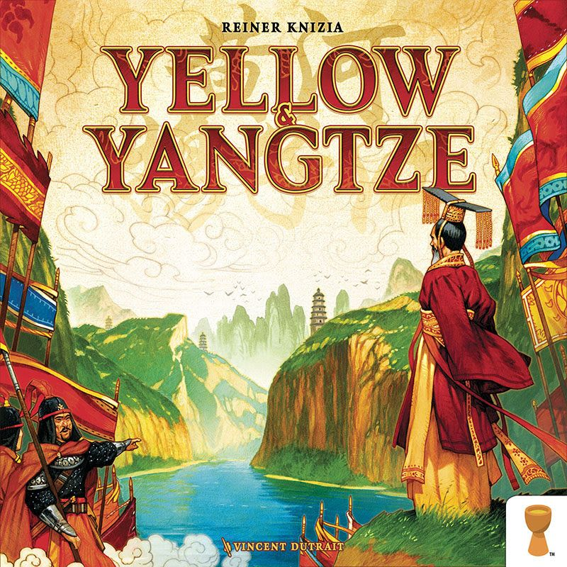

There's a moment in every game of [Tigris & Euphrates](https://boardgamegeek.com/boardgame/42) where someone connects two kingdoms, triggers a cascade of external conflicts, and the entire board state transforms so violently that everyone needs a moment of silence to process what just happened. Large swaths of tiles vanish. Leaders get expelled from civilisations they spent twenty minutes building. Someone who was cruising discovers their score is effectively two.

*Two.*

And it's magnificent.

Reiner Knizia's 1997 masterpiece sits at a **7.70 rating** on BGG from tens of thousands of ratings, ranked **#131 overall**, with a weight of **3.48/5**. It plays **2–4 players** in **60–120 minutes**. Those numbers tell you it's respected. They don't tell you it's one of the most elegant, brutal, and intellectually honest designs in the history of the hobby.

## The Premise

You're building civilisations in ancient Mesopotamia, the fertile crescent between the Tigris and Euphrates rivers. Four colours represent four pillars of society: religion (red), commerce (green), governance (black), and farming (blue). You place leaders onto the board, lay tiles to grow kingdoms, build monuments, and — inevitably — crash into other players' empires with consequences ranging from "mildly inconvenient" to "someone just dropped a nuke on ancient Mesopotamia."

Each turn you get two actions. Place a tile. Place a leader. Swap tiles from your hand. Drop a catastrophe token to permanently destroy a space. That's it. The rules fit on a couple of pages. The depth that emerges from those rules would take a lifetime to fully explore.

## The Scoring Trick That Changes Everything

Here's the foundational insight that makes Tigris & Euphrates *Tigris & Euphrates*: your final score is your **weakest colour**.

Got 20 black points but only 3 red? Your score is 3. Dominated commerce all game but neglected farming? Doesn't matter. The game demands balance, and it punishes specialisation with the cold indifference of a Mesopotamian flood.

This single rule reshapes every decision you make from turn one. It means a single blue cube can be more valuable to you than all the red cubes in the world — but handing that red to an opponent might be catastrophic for you, because it might fix *their* weakness. You're constantly doing mental arithmetic across four dimensions, weighing which colour you need against what your opponents are probably short on, against what the board state allows.

It's Knizia at his most devious. Simple to explain. Impossible to master.

## The Conflict System

Conflict in Tigris & Euphrates comes in two flavours, and both are brilliant.

**Internal conflicts** happen when two leaders of the same colour end up in the same kingdom. It's a power struggle, resolved by counting adjacent temples and playing red tiles from your hand. Quick, surgical, usually targeted. One leader stays, one gets kicked out.

**External conflicts** are the main event. When a tile placement connects two separate kingdoms, any shared leader colours trigger a showdown. Each player counts their followers — tiles of the matching colour in their kingdom — plus any they commit from their hand. The loser's leader is removed, and *all* their followers of that colour are swept off the board. The winner collects a victory point for every removed tile plus the ejected leader.

This is where the nuclear explosions happen. A well-timed external conflict can generate a massive swing of points in a single action, while simultaneously reshaping the map into something unrecognisable. The connecting player gets to choose which colour resolves first, which means you can tactically sequence conflicts to remove leaders before their fights even happen.

It's the board game equivalent of watching tectonic plates collide. And you did it by placing one tile.

## Monuments and Treasures

Two elements add further incentive to take risks. **Monuments** get built when four tiles of the same colour form a square — flip them over, place a bicoloured wooden structure, and from now on the matching leaders in that kingdom collect bonus victory points every single turn.

Monuments are magnets for violence. Build one, and suddenly everyone within tile-laying distance starts stockpiling tiles and eyeing your leaders like a cat watching a bird feeder.

**Treasures** start scattered across the board on temple tiles. They're wild victory points — assignable to any colour at game end. In a game where your weakest colour is everything, a wild point is gold dust. Only the green leader (merchant) can claim them, and only when two treasures exist in the same kingdom. The game ends when fewer than two treasures remain on the board, making them both prize and timer.

## Why It Still Works in 2026

Nearly thirty years on, Tigris & Euphrates does things that most modern designs still can't match:

**Emergent narrative without scripted story.** No flavour text, no event cards, no campaign book. The drama emerges purely from the system. Peaceful coexistence gives way to border tensions. Small kingdoms get swallowed by empires. Catastrophe tokens are Chekhov's gun — every player starts with two, and the only question is when and where they'll fire. The rise and fall of civilisations plays out on the table without a single narrative card in the box.

**Genuine uncertainty without randomness dominating.** Yes, you draw tiles from a bag, and sometimes your hand is terrible. But hand management is half the game. Discarding and redrawing is an action. Choosing when to commit tiles from your hand versus playing them on the board is a constant tension. The randomness creates variety without removing agency.

**Meaningful player interaction that isn't optional.** Modern Euros often let you play a two-hour optimisation puzzle where you occasionally glance at what others are doing. Tigris & Euphrates will not allow that. Kingdoms grow. They collide. You *will* fight, and the winner *will* benefit enormously. The question isn't whether to engage — it's when, where, and how to engineer the engagement in your favour.

**Elegant economy of design.** Two actions per turn. Four types of tiles. Four leaders. Catastrophe tokens. Monuments. Treasures. That's the entire game. No expansion-creep, no bolted-on subsystems, no "but also there's a tech tree and a market and a solo automa." Knizia gave the system exactly what it needed and nothing more. Modern games would probably need ten additional components and as many pages of rules to achieve the same complexity.

## The Rough Edges

Tigris & Euphrates is not a game that flatters you on first play. The conflict resolution — particularly external conflicts with multiple leaders involved — takes a couple of games to truly internalise. The first play is often confusing, the second frustrating, and only by the third does the system start revealing its depth.

The scoring system means you *can* get hammered early and spend the rest of the game struggling to recover. There are no catch-up mechanisms, no rubber-banding, no consolation prizes. This is a 1997 design and it plays like one — fair, but merciless.

At two players, it's functional but not ideal. The board feels spacious, conflicts feel less inevitable, and the psychological layer thins out. BGG's player poll reflects this: **3–4 players is the sweet spot**, with 4 being the most chaotic and rewarding configuration.

And yes, it's abstract. The Mesopotamian theme gives context and flavour, but you're ultimately placing coloured tiles on a grid. If you need miniatures and narrative arcs to stay engaged, this isn't your game. If you find beauty in systems, Tigris & Euphrates is the Louvre.

## The Successor: Yellow & Yangtze

*Yellow & Yangtze (2018) — Knizia's spiritual successor. Image via BoardGameGeek.*

Knizia revisited the formula in 2018 with [Yellow & Yangtze](https://boardgamegeek.com/boardgame/244114), which sits at a **7.79 rating** and **3.08 weight** on BGG. It moves to a hex grid, introduces pagodas instead of permanent monuments, and resolves external conflicts on a kingdom-wide rather than leader-by-leader basis.

Yellow & Yangtze is more forgiving, more tactical, and arguably more accessible. Monuments (pagodas) move as new ones are built, making the board more fluid. Conflicts are less devastating since the winner also loses tiles, discouraging pure aggression.

If Tigris & Euphrates is a razor, Yellow & Yangtze is a scalpel — still sharp, but less likely to cut the person wielding it. Both are excellent. Most Knizia devotees will tell you T&E remains the more elegant and consequential design, but Yellow & Yangtze is a perfectly valid modern entry point to the same design philosophy.

## The Verdict, Almost 30 Years Later

Tigris & Euphrates is one of those rare designs where every element serves the whole. The weakest-colour scoring creates agonising decisions. The conflict system creates dramatic, board-reshaping moments. The economy of actions creates tension. The tile draw creates variety. Nothing is wasted.

It won't click immediately. It demands repeat plays, rewards investment, and punishes carelessness. It's from an era when games weren't designed to make you feel clever — they were designed to *be* clever, and trusted that you'd rise to meet them.

If you've been in the hobby for years and somehow haven't played it, fix that. If you've bounced off it after one play, give it another two. If you've played it dozens of times and already know all this, I'm not telling you anything new — I'm just confirming what you already suspected.

Reiner Knizia's masterpiece. Twenty-nine years old. Still teaching modern design what depth looks like.

---

**Tigris & Euphrates** | [BGG Page](https://boardgamegeek.com/boardgame/42) | Designer: Reiner Knizia | 2–4 Players | 60–120 min | Weight: 3.48/5 | BGG Rating: 7.70
