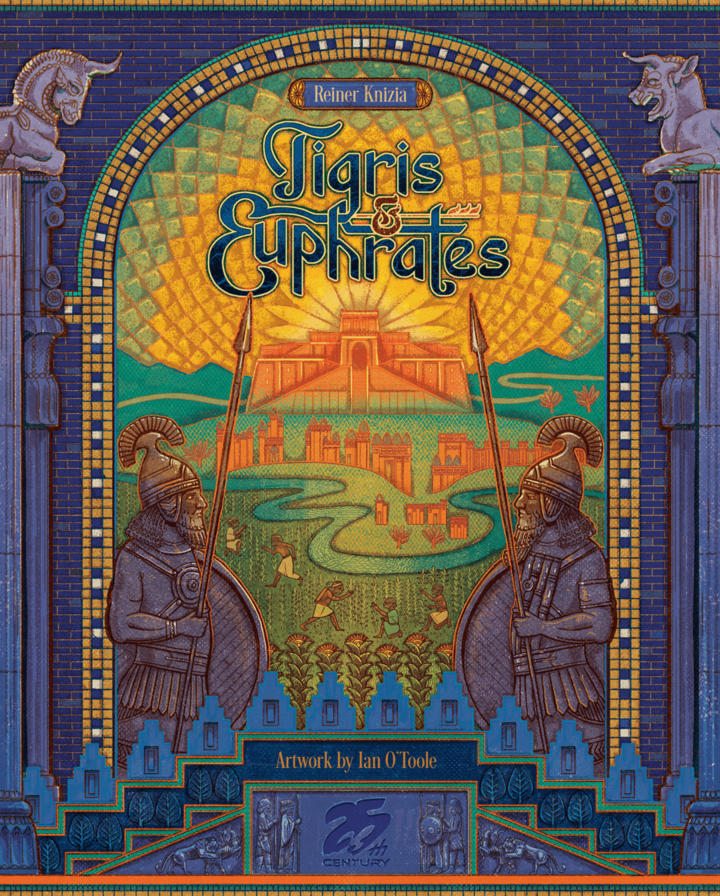

There's a moment in every game of [Tigris & Euphrates](https://boardgamegeek.com/boardgame/42/tigris-and-euphrates) where you realise the civilisation you spent six turns carefully building doesn't belong to you. It never did. Someone drops a red leader into your kingdom, triggers a revolt, and suddenly the temple network you'd been nursing is generating points for *them*. You sit there, tiles in hand, recalculating everything.

That feeling — the vertigo of sudden loss, the scramble to adapt — is why this game was inducted into the BoardGameGeek Hall of Fame in 2025. Twenty-nine years after its release, Reiner Knizia's masterpiece still does things no other game has managed to replicate.

## The Numbers

- **Designer:** Reiner Knizia
- **Year:** 1997
- **Players:** 2–4
- **Play time:** 60–120 minutes
- **BGG rating:** 7.70 (from nearly 30,000 ratings)
- **BGG rank:** #131 overall, #109 among strategy games
- **Weight:** 3.48/5
- **BGG Hall of Fame:** Class of 2025

## Two Actions. Infinite Consequences.

The rules of Tigris & Euphrates fit on a single sheet of paper. On your turn, you take two actions from a tiny menu: place a tile, place a leader, swap tiles from your hand, or play a catastrophe. That's it. Draw back up to six tiles. Next player.

From this absurdly simple framework, Knizia conjured a game of staggering depth. Kingdoms grow as tiles accumulate on the board. Leaders — one each in farming (blue), trading (green), religion (red), and government (black) — attach to kingdoms to score points. When two kingdoms collide, war erupts. When two leaders of the same colour share a kingdom, revolt breaks out.

Both conflict types are resolved by counting tiles and committing from your hand. The loser is expelled. Their tiles are removed. Points are scored by the victor. And the board state, which took rounds to build, is irrevocably changed in seconds.

## The Scoring That Changes Everything

Here's the twist that elevates Tigris & Euphrates from merely clever to genuinely profound: **your final score is your weakest colour.**

You score points in four suits — red, blue, green, and black — corresponding to the four types of civilisation tiles. At game end, you could have 15 red, 12 blue, 11 green, and 3 black. Your score? Three.

This single rule transforms the entire game. Suddenly you can't just dominate one area. That player hoarding green trading points? They're not winning — they're *losing*, because they've been neglecting everything else. The player who looks least impressive, quietly collecting a modest spread across all four colours, is probably the one you should fear.

It's scoring as philosophy. The game literally rewards balance over dominance, breadth over depth. Specialists get crushed. Generalists thrive. And you can never, ever tell who's winning by looking at the board.

## Conflict: Beautiful and Merciless

There are two kinds of conflict in Tigris & Euphrates, and understanding both is essential.

**Internal conflict (revolt)** happens when a leader is placed into a kingdom that already has a leader of the same colour. This is a battle of religion — only red temple tiles on the board and in your hand count. It's surgical, targeted, personal. You're marching into someone's civilisation and saying "that position is mine now."

**External conflict (war)** happens when two separate kingdoms merge through tile placement. This is the big one — the dramatic, board-reshaping moment that veterans live for. When kingdoms collide, *every* colour where both kingdoms have leaders triggers a separate war. The loser's leader is removed, and all their tiles of that colour in the contested kingdom are destroyed.

A well-timed external conflict can strip an opponent of a dozen points' worth of tiles in a single action. It can also backfire catastrophically. Committing tiles from your hand to win a war means fewer tiles for building later. Every conflict is a calculated gamble, and the information asymmetry — you can see the board, but not your opponent's hand — creates an atmosphere of perpetual tension.

As one BGG reviewer put it: *"There's always a way in which things come crashing down. The game builds itself with a degree of escalation, and yet destruction is always one tile placement away."*

## Monuments: The Temptation

When four tiles of the same colour form a square on the board, you can replace them with a monument — a permanent, two-colour point-generating structure. As long as your leader of either matching colour is in that kingdom, you earn a free point every turn.

Monuments are intoxicating. They're the closest thing the game has to an engine, and new players immediately start chasing them. But monuments are also *targets*. They announce to the table exactly where the value is, and experienced players will scheme to take control of monument kingdoms through revolt or war.

The tension between building monuments and defending them — between creating value and having it stolen — is one of the game's most elegant dynamics. It's a lesson in the danger of visible wealth.

## Why It Still Works in 2026

Modern board gaming has moved in a particular direction. Games are longer, more complex, more forgiving. Undo buttons and catch-up mechanisms proliferate. Player elimination is taboo. Mean games get lower ratings.

Tigris & Euphrates refuses all of this. It is uncompromisingly interactive. Your plans *will* be disrupted. Your kingdoms *will* be stolen. Your monuments *will* be coveted. And the game offers zero sympathy. There's no catch-up track, no consolation prize, no "at least you got some points." You lose a war, you lose your tiles. Full stop.

And yet it never feels *unfair*. Every loss is traceable to a decision — yours or your opponent's. You didn't defend that kingdom strongly enough. You committed too many tiles to a war you didn't need to fight. You neglected your weakest colour for one round too many. The game is harsh, but it's *honestly* harsh.

That combination — extreme consequence paired with complete transparency of rules — is vanishingly rare. It's why Tigris & Euphrates at a 3.48 weight feels heavier than games rated 4.0+. The cognitive load isn't in the rules; it's in the implications.

## The Knizia Paradox

Reiner Knizia has designed over 800 games. He's the most prolific game designer alive. And his best work was done in the 1990s — Tigris & Euphrates (1997), Ra (1999), Samurai (1998), Through the Desert (1998), Modern Art (1992). Every one of these is still played, still debated, still beloved.

What makes Knizia's designs endure is their mathematical elegance. He trained as a mathematician, and it shows — not in the sense that his games feel like equations, but in the sense that every element serves a purpose. There's no bloat in Tigris & Euphrates. No superfluous mechanism. No rule exists for flavour. Everything connects to everything else, and removing any single element would collapse the whole structure.

The Bitewing Games reviewer who ranked it their #1 game of all time captured it perfectly: *"What other game covers such a wide scope of theme and endless depth of strategy within such a simple ruleset? Civilisations rise, clash, and fall within the span of minutes while a deliciously satisfying feast of dramatic decisions is consumed in roughly an hour."*

## Yellow & Yangtze: The Gentler Sibling

In 2018, Knizia revisited the core design with [Yellow & Yangtze](https://boardgamegeek.com/boardgame/244228/yellow-yangtze) (now reprinted as Huang). It uses hexagonal tiles instead of squares, adds a wild colour for scoring, and introduces a few mechanisms that soften the harshest edges.

Yellow & Yangtze is an excellent game in its own right. Some players prefer it. But there's a purity to the original that the revision can't quite match. Tigris & Euphrates is the uncut version — rawer, meaner, more demanding. If Yellow & Yangtze is a well-aged whisky with a splash of water, Tigris & Euphrates is the cask-strength pour. It's not for everyone, but for those who want it, nothing else will do.

## Who This Game Is For

**You'll love it if:**
- You want a game where every single action matters
- You enjoy direct conflict that emerges naturally from the game state
- You appreciate elegant, minimalist design
- You want a 60–90 minute game that feels like an epic
- You think the best board games should make you *feel* something

**You might struggle if:**
- You dislike direct conflict and having your plans disrupted
- You prefer games where you can build an engine in peace
- You want clear indicators of who's winning at any point
- Abstract spatial reasoning isn't your strength
- You need your games to be "fair" in the catch-up-mechanism sense

## The Availability Problem

Here's the frustrating part: Tigris & Euphrates is, at the time of writing, somewhat difficult to find at retail. It's been through multiple publishers — Hans im Glück, Mayfair, Fantasy Flight — and availability varies by region. The Fantasy Flight edition is the most common on the secondhand market and plays beautifully.

If you can find a copy, buy it. If you can't, try it on Board Game Arena first — the digital implementation is excellent and captures the full experience. But do yourself a favour and play it physically at least once. The tactile experience of committing tiles to a conflict, watching the board reshape itself, and flipping your scoring tokens at the end is something a screen can't fully replicate.

## The Verdict

Nearly three decades later, Tigris & Euphrates remains one of the finest board games ever designed. It's a game about building civilisations that's really a game about reading people. It's a tile-laying game that's really a game about hand management. It's an area control game that's really a game about knowing when to walk away.

Reiner Knizia made something timeless in 1997. The BGG Hall of Fame simply made it official.

**Rating: 9/10** — A masterpiece of elegant brutality. The greatest tile-laying game ever made, and a strong contender for the greatest board game, full stop.

---

*Tigris & Euphrates was designed by Reiner Knizia, with art by Bascu, Christine Conrad, Doris Matthäus, Tom Thiel, Ricarda Thiel, and Stephen Graham Walsh. Originally published by Hans im Glück in 1997. Plays 2–4 in 60–120 minutes.*
