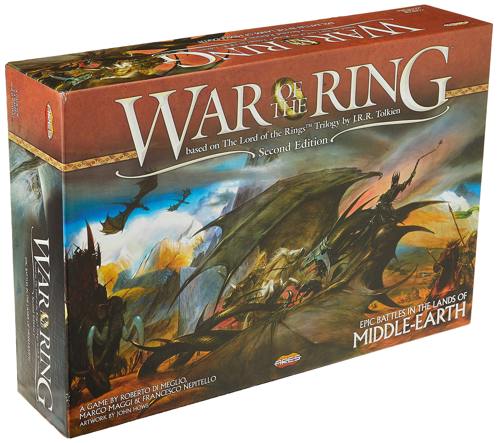
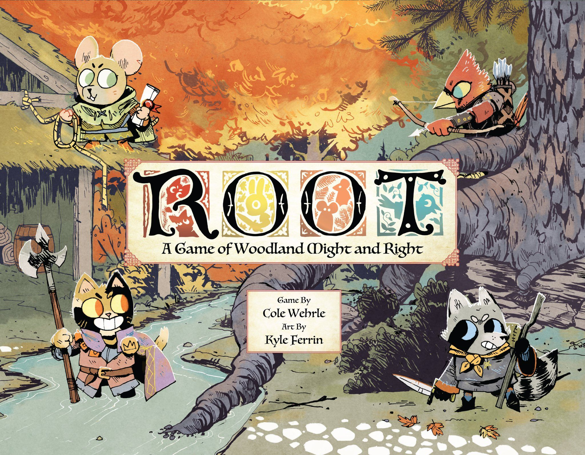
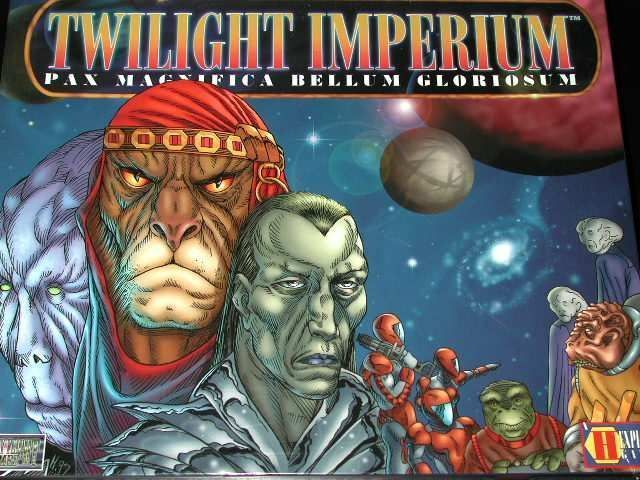

## The Legend

There are licensed games, and then there are games that make people shut up, lean over the board, and start speaking in full Tolkien narrator voice by hour two.

[War of the Ring](https://boardgamegeek.com/boardgame/115746/war-of-the-ring-second-edition) is one of the rare ones. The kind where a licensed property stopped being a ceiling and became a launchpad. When Nexus Editrice released the first edition in 2004, nobody expected it to become a stone-cold all-time classic. Most licensed games of that era were competent at best  -  pretty boxes, middling gameplay, shelf filler. This one was different.

Designed by Roberto Di Meglio, Marco Maggi, and Francesco Nepitello, [War of the Ring](https://boardgamegeek.com/boardgame/115746/war-of-the-ring-second-edition) proved a Lord of the Rings board game didn't have to be a plastic souvenir or a movie tie-in cash grab. It built a proper, ambitious asymmetric war game around Tolkien's world and got the structure right in ways that still hold up today.

The Second Edition arrived in 2011 through Ares Games  -  better production, cleaner rules, same essential design. That's the version most people mean when they talk about this game now, and it's the version that has earned a **#8 overall rank on BGG**, an **8.55/10** from over **24,000 ratings**, and a **4.22/5 complexity weight**. Not a cult obscurity. One of the best-reviewed board games ever made.

This article looks at why it worked, how it plays today, what has aged beautifully, what hasn't, and whether it still deserves space on the shelf in 2026.

## Why It Mattered

In 2004, the dominant template for licensed board games was either a) paste the IP onto a known mechanism (Monopoly, Risk, whatever) or b) create a niche hobby product that the hardcore would tolerate and everyone else would ignore. [War of the Ring](https://boardgamegeek.com/boardgame/115746/war-of-the-ring-second-edition) ignored both templates.

What Di Meglio, Maggi, and Nepitello understood  -  and what makes the game genuinely important  -  is that Tolkien's narrative has a *structural* asymmetry that a board game could express mechanically. The Shadow isn't trying to do the same thing as the Free Peoples. It's running a conquest engine, grinding forward across Middle-earth, applying pressure from every direction. The Free Peoples are trying to survive long enough for two hobbits to walk into a volcano.

That contrast isn't just cosmetic. The two sides have fundamentally different win conditions, different action economies, different decision textures. The Shadow accumulates and advances. The Free Peoples delay, sacrifice, and hope.

That asymmetry was bold in 2004. It influenced an enormous amount of design work that came after. Every modern game that does "sides that feel genuinely different rather than just unequal" owes something to what this game proved was possible at commercial scale.

It also helped push the hobby's expectations for licensed games permanently upward. After [War of the Ring](https://boardgamegeek.com/boardgame/115746/war-of-the-ring-second-edition), "good for a Tolkien game" became a slightly embarrassing compliment. The bar moved.

## The Stats

- **BGG Rank:** #8 overall
- **Rating:** 8.55/10 from 24,914 ratings
- **Weight:** 4.22/5
- **Players:** 2-4 (best at 2)
- **Playtime:** 150-180 minutes (experienced); 240-300+ minutes (with new players)
- **Designers:** Roberto Di Meglio, Marco Maggi, Francesco Nepitello
- **Art:** John Howe
- **Publisher:** Ares Games (Second Edition, 2011); originally Nexus Editrice (2004)

John Howe's art is worth mentioning specifically. He was one of the conceptual artists behind Peter Jackson's films, and his work on the game board and cards gives the whole experience a cinematic weight that no generic fantasy art could match. It's not just good art. It's *the right art*.

## Playing It Today

In 2026, [War of the Ring](https://boardgamegeek.com/boardgame/115746/war-of-the-ring-second-edition) still feels massive, dramatic, and gloriously overcommitted. You sit down, stare at Middle-earth sprawled across the table, and immediately understand this is not a casual Tuesday filler. This is a "clear the evening, order food, and accept that setup is part of the ritual" kind of game.

The action dice system remains the core of everything and it still holds up brilliantly. The Shadow player rolls a fistful of black dice and starts asking ugly questions across the whole map. The Free Peoples player is constantly triaging: do you defend Gondor, push the Fellowship, wake up the nations, play an event? You can never do all the things you want. You pick the least-bad option from a painful menu, and then watch the consequences unfold.

That's not swingy in the way that makes games feel arbitrary. It's urgent in a way that makes every round feel like genuine decision-making under pressure. You are not always choosing between good options and great options. You are often choosing between bad options and worse ones. That's where the tension lives.

More importantly, the game still *feels* like Tolkien. Not vaguely fantasy. Tolkien. The corruption track matters. The political awakening of the nations matters. Gandalf's timing matters. The military campaign is never just chrome sitting beside the Ring journey  -  they're tangled together in exactly the way they should be. Pushing the Fellowship forward without military cover is reckless. Ignoring the Fellowship while fighting the war is fatal. The two tracks constrain and inform each other constantly.

That said, the cost of its ambition is real. The rules overhead is substantial. A first teach can be genuinely rough. Setup and teardown take time. If your group hates checking iconography across multiple subsystems, this game will test patience. There's a reason people keep [Root](https://boardgamegeek.com/boardgame/237182/root) and [War of the Ring](https://boardgamegeek.com/boardgame/115746/war-of-the-ring-second-edition) in very different mental boxes even though both are famous for asymmetry. One is easier to get back to the table.

## What Aged Well

### The asymmetry is still exceptional

A lot of older "asymmetric" games are really just uneven starting positions with a few special powers bolted on. [War of the Ring](https://boardgamegeek.com/boardgame/115746/war-of-the-ring-second-edition) is the real thing. The Shadow and Free Peoples don't feel like they're playing mirror-image strategies from different angles. They feel like they're trapped in the same story from opposite ends.

The Shadow is expansion, pressure, inevitability. The Free Peoples are delay, survival, and hope deployed as a strategy. This creates a natural narrative arc without scripted scenarios or branching campaign text. The story emerges from the mechanics. That's hard to do, and harder to do at this scope.

### The action dice system still rules

This was a significant idea. Custom dice driving your available actions in a large-scale strategy game sounds swingy on paper. In practice it creates urgency. You're not choosing the best move from an open field. You're choosing the best move from a painful, imperfect menu.

The interesting thing about the dice isn't randomness  -  it's prioritization. What do you spend when you can't have everything? That question sits at the heart of every round, and it hasn't lost its bite.

Modern designs have cleaner systems. Fewer have this much tension packed into each turn.

### Theme integration is absurdly good

[War of the Ring](https://boardgamegeek.com/boardgame/115746/war-of-the-ring-second-edition) is still one of the most immersive adaptations ever made. It doesn't lean on movie stills or surface references. It understands the structure of Tolkien's world at a narrative level  -  that military threat is real but brute force alone cannot win, that the Ring quest is central but cannot happen in a vacuum, that the Free Peoples are always outmatched and must endure rather than overwhelm.

The game gets that balance right. A lot of Lord of the Rings games are fun. [War of the Ring](https://boardgamegeek.com/boardgame/115746/war-of-the-ring-second-edition) is the one that most often makes players say, "Yeah, that felt like the books." That's not a small achievement for a game built around moving plastic figures around a map.

### The event card system gives it depth and replayability

The event cards  -  split into Shadow and Free Peoples decks, further split into Character and Strategy cards  -  inject narrative texture and strategic variance that keep the game fresh across plays. You're not just maneuvering armies. You're managing a hand that can reinforce, surprise, and pivot. Cards referencing Saruman, the Nazgûl, the Ents, and a dozen other moving parts mean no two games follow the same arc.

This is still ahead of most wargame designs in terms of marrying narrative flavour with mechanical impact.

## What Didn't Age as Well

For all of that praise, some parts of the experience show their age more clearly.

### It's a beast to teach

There's a lot going on. Fellowship movement, hunts, politics, sieges, elite units, event cards, leadership, nation activation, combat resolution, strongholds, the Eye of Sauron. Veteran players internalize all of this and start seeing the flow. New players often spend their first game trying to understand what they're even allowed to care about.

The Second Edition improved the rulebook significantly. It's still demanding. BGG forums and Reddit threads have been saying versions of the same thing for twenty years: amazing game, homework required.

### It demands significant time and commitment

Three-plus hours is standard. More with newer players. That was easier to accept in an era when giant event games had less competition. In 2026, heavyweight players have options  -  good options, many of them easier to set up, easier to teach, and easier to finish before midnight.

Scheduling [War of the Ring](https://boardgamegeek.com/boardgame/115746/war-of-the-ring-second-edition) has always been a commitment. That barrier hasn't shrunk. If anything, it feels higher as gaming schedules get busier and alternatives multiply.

### First edition is strictly historical

The original 2004 Nexus Editrice edition has charm, but next to the Second Edition it's outclassed in almost every dimension. Better board, better art, better miniatures, better rules presentation. The gap is not subtle. If you're looking at picking this up or revisiting the design, the 2012 Ares Games Second Edition is the only sensible choice for actual play.

## Modern Alternatives

These comparisons keep coming up whenever people debate whether [War of the Ring](https://boardgamegeek.com/boardgame/115746/war-of-the-ring-second-edition) is still worth the effort.

If you want huge asymmetry and table presence without the weight, [Root](https://boardgamegeek.com/boardgame/237182/root) is tighter, faster, and far easier to schedule for multiple players. It delivers excellent asymmetry in under two hours. It doesn't deliver the same epic sweep, but it trims a lot of friction.

If you want sprawling conflict on an absurd scale, [Twilight Imperium](https://boardgamegeek.com/boardgame/233078/twilight-imperium-fourth-edition) covers similar emotional territory  -  that feeling of civilisations rising and colliding, of epic decisions made under time pressure  -  and it does it with an even bigger box, even more players, and even more commitment. Different animal, same category of lifestyle event.

None of these are actual replacements if what you want is Tolkien on the table. That's the key. [Root](https://boardgamegeek.com/boardgame/237182/root) is not Middle-earth. [Twilight Imperium](https://boardgamegeek.com/boardgame/233078/twilight-imperium-fourth-edition) is not the long defeat. Neither of them creates a desperate stand at Minas Tirith while two hobbits disappear into ash and nightmare.

That specific magic remains largely uncontested. No other game does it.

## Who Is This For?

The honest pitch:

**Play this if:** You love Tolkien at a level beyond casual appreciation. You want a two-player game with genuine strategic depth and asymmetry. You're willing to invest in learning it properly and scheduling dedicated sessions. You want a game that generates stories worth retelling.

**Skip this if:** You want something on the table in under an hour. You hate rules-dense systems. You don't have a reliable partner who can commit to the full experience. You need a game that's easy to teach to a rotating group.

The 4.22 weight rating is honest. This is a game for people who treat the table as the destination, not the shortcut.

## Final Verdict

**Still essential.**

Not because it's flawless. The teach is demanding. The setup is a nuisance. The session length is a scheduling obstacle. And if two-player war games with heavy rules overhead aren't your thing, no amount of Tolkien license will change that.

But if Tolkien means something to you, and if you want a game that does more than quote the setting, [War of the Ring](https://boardgamegeek.com/boardgame/115746/war-of-the-ring-second-edition) is still the definitive adaptation. Twenty-two years after the first edition, the hobby has absolutely evolved. Modern games are slicker, cleaner, more considerate of your calendar. Yet this one still creates stories that feel *earned*. Not pasted on. Earned.

The Shadow closes in. The West buckles. A desperate defence buys one more round. The corruption rises. The Fellowship stumbles forward anyway.

**#8 on BGG. 8.55 out of 10. 24,000 people who know exactly what they're talking about.**

That's not nostalgia. That's a verdict.

Play the Second Edition. Make sure the table is big enough.
