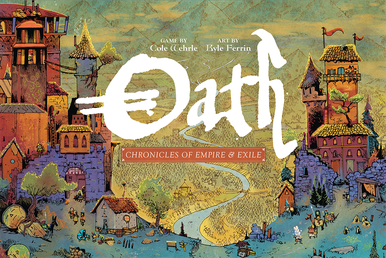

Cole Wehrle has a problem. He keeps making masterpieces and forcing us to choose between them.

[Root](https://boardgamegeek.com/boardgame/237182/root) and [Oath](https://boardgamegeek.com/boardgame/291572/oath-chronicles-empire-and-exile) are both Leder Games flagships, both designed by Wehrle, both gorgeous, both critically adored. The BGG forums have been arguing about this for years. So let's settle it.

| Category              | [Root](https://boardgamegeek.com/boardgame/237182/root) | [Oath](https://boardgamegeek.com/boardgame/291572/oath-chronicles-empire-and-exile) |
|-----------------------|----------------------------------------------------------|---------------------------------------------------------|
| Complexity            | 3.78/5                                                   | 4.22/5 🏆                                               |
| Theme & Immersion     | High (asymmetric factions, Kyle Ferrin art) 🏆           | High (legacy storytelling, evolving world)              |
| Replayability         | Massive (factions × expansions) 🏆                       | Moderate (needs campaign commitment)                     |
| Value for Money       | $45-55 🏆                                                | $50-60                                                  |
| Player Count Sweet Spot | 3-4 players 🏆                                           | 3 players                                               |
| Table Presence        | Stunning 🏆                                              | Impressive                                              |
| Learning Curve        | Steep                                                    | Steeper 🏆                                              |

### Complexity
**Winner: Oath 🏆**

[Oath](https://boardgamegeek.com/boardgame/291572/oath-chronicles-empire-and-exile) sits at 4.22 on BGG's weight scale, and that number undersells it. This is a game where the rules shift between sessions based on what happened last time. The world map changes. The victory conditions change. The deck changes. Your first game of Oath feels like reading a novel starting from chapter 7. You know *something* important is happening, you're just not sure what.

[Root](https://boardgamegeek.com/boardgame/237182/root) at 3.78 is no cakewalk either. Teaching four asymmetric factions is its own special kind of chaos. But here's the thing: once each player learns *their* faction, the game clicks. With Oath, the clicking takes entire campaigns.

### Theme & Immersion
**Winner: Root 🏆**

I know this is controversial. Oath literally builds an evolving narrative across sessions. Kingdoms rise and fall, citizens shift allegiances, the Chronicle deck tells the story of your world. On paper, that should win this category by a mile.

But Root's theme is *immediate*. You sit down, you see Kyle Ferrin's gorgeous woodland art, and you instantly get it: cute animals doing horrible things to each other. The Marquise is strip-mining the forest. The Eyrie are building a fascist bird empire. The Woodland Alliance are guerrilla insurgents. It's darkly funny and deeply thematic from minute one.

Oath needs 3-4 sessions before its narrative magic kicks in. Root hooks you before the first turn is over.

### Replayability
**Winner: Root 🏆**

This one isn't close. Root's base game has four factions that play completely differently. Add the Riverfolk and Underworld expansions and you've got nine factions, each demanding a totally different strategy. I've played Root 30+ times and I'm still discovering new faction matchups that change everything.

Oath's replayability is theoretically infinite, since each campaign reshapes the game. But here's the catch: you need the *same group* to come back. Every time. If Dave can't make it to session 4, your entire campaign stalls. Every Root owner has played it dozens of times. Ask Oath owners how many actually finished a full campaign. The Reddit threads are... revealing.

### Value for Money
**Winner: Root 🏆**

Root base box runs $45-55 and you genuinely don't need expansions. You'll get more plays out of it than games twice the price. When you eventually *do* grab an expansion, it feels like buying a whole new game.

Oath at $50-60 is a bigger ask because you're investing in a *commitment*, not just a game. If your group bails after three sessions (and statistically, some will) that's expensive shelf art. Beautiful shelf art, but still.

### Player Count Sweet Spot
**Winner: Root 🏆**

Root sings at 3-4 players. Four is the magic number where all the asymmetry clicks. Every faction has a natural rival, alliances form and break, and the table talk is electric. It works at 2 with a bot (the Clockwork expansions are excellent), and 5-6 is manageable with the right expansions.

Oath is laser-focused on 3 players. It *works* at other counts, but the political tension, which is the whole point, peaks at exactly three. That's a narrow sweet spot for game night logistics.

### Table Presence
**Winner: Root 🏆**

Put Root on the table and people who weren't even playing will wander over to look. The board is a vivid forest canopy. The meeples are adorable. The faction boards are colour-coded masterpieces. Everything is readable from across the table.

Oath is visually striking too. The world map evolving across sessions is genuinely cool. But Root's table presence is *consistent*. It looks incredible every single time you set it up. Oath's visual impact depends on where you are in the campaign.

### Learning Curve
**Winner: Oath 🏆**

Look, both of these games will make your brain hurt the first time. Every Root teach starts the same way: you explain the Marquise, everyone nods, then you explain the Eyrie decree and watch eyes glaze over. But by round 3, people get it.

Oath is different. Your first game is genuinely bewildering. The rules are simple enough, but understanding *why* you're doing things takes sessions. The legacy elements mean the game you're learning is literally a different game than the one you'll be playing in three weeks. Brilliant design, but the onboarding is brutal.

### Verdict

**Root wins 5 out of 7 categories. It's not close.**

Root is the better game for the vast majority of people. It's more replayable, more accessible, works with more player counts, looks better on the table, and hooks you faster. You can grab it off the shelf on a random Tuesday, teach it in 20 minutes per faction, and have one of the best game nights of your life. Try doing that with Oath.

**Buy [Root](https://boardgamegeek.com/boardgame/237182/root).** Cole Wehrle's masterpiece. Asymmetric woodland warfare with infinite legs and some of the most beautiful board game art ever committed to cardboard. If you only buy one Leder game, this is the one.

**Buy [Oath](https://boardgamegeek.com/boardgame/291572/oath-chronicles-empire-and-exile) only if** you have a locked-in group of 3 who will absolutely, no-excuses commit to a full legacy campaign. When it works, when the same players come back and the world evolves and the betrayals land, it's unlike anything else in board gaming. But "when it works" is doing a lot of heavy lifting in that sentence. Most groups won't get there. Root just asks you to show up and play.