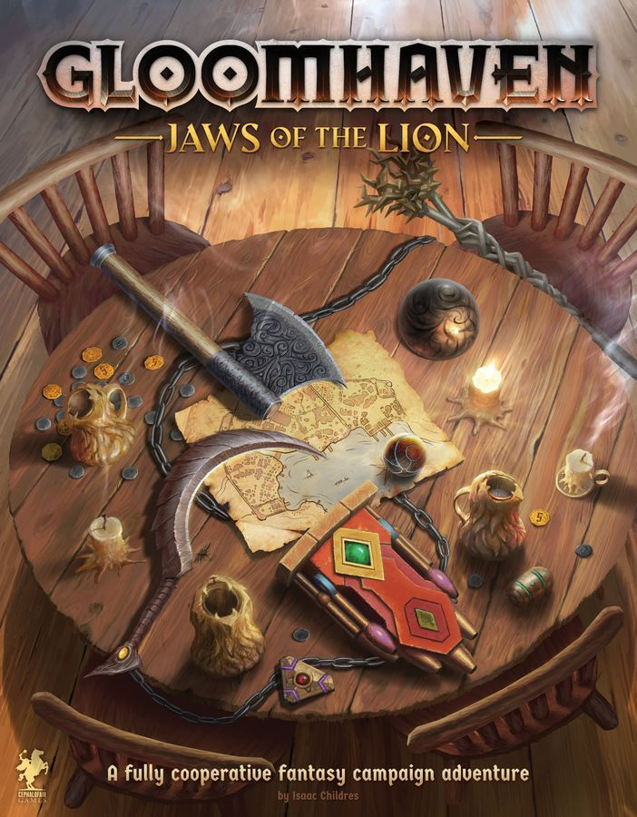

Let's address the enormous box in the room.

[Gloomhaven](https://boardgamegeek.com/boardgame/174430) is ranked **#4 on BGG** with an 8.54 average across nearly 67,000 ratings. It has a weight of **3.92**, plays 1-4 (best with 3), and runs 60-120 minutes per scenario. It was designed by Isaac Childres and published by Cephalofair Games in 2017. Over **104,000 people own it**.

It's also the single game I see mentioned most often in "what's on your shelf of shame?" threads. Not because it's bad  -  it wouldn't be #4 if it were  -  but because everything about it conspires to keep it in the box. The weight. The setup. The sheer *volume* of cardboard. The feeling that you need a dedicated gaming group, a permanent table, and a PhD in logistics to get started.

You bought it because the hype was inescapable. You haven't played it because opening the box feels like unpacking a filing cabinet. Let's fix that.

## The Real Barriers (Not What You Think)

### Barrier 1: The Box Is Terrifying

Gloomhaven weighs about 10 kilograms. When you open it, you're confronted with hundreds of cardboard tiles, nearly 1,500 cards, standees, tokens, overlay tiles, and a scenario book thicker than most novels. The natural reaction is to close the lid and play something else.

**The truth:** You don't need most of that stuff for your first game. Scenario 1 uses a handful of map tiles, two rooms' worth of monsters, and your starting characters. About 90% of what's in the box can stay in the box for weeks.

### Barrier 2: The Rulebook Is Dense

The learn-to-play guide is 52 pages. People read "52 pages" and their eyes glaze over. But here's what the BGG forums consistently point out: the actual *rules* of Gloomhaven are not that complicated. Each turn you play two cards, use the top of one and the bottom of the other. Move, attack, heal. That's the core loop.

The rulebook is long because it's a *reference manual* covering edge cases for a 95-scenario campaign. You don't need to memorise it. You need pages 1-15 and a willingness to look things up as they come.

### Barrier 3: "I Need a Committed Group"

This is the barrier that kills the most campaigns. People assume they need four players who can show up every fortnight for eighteen months. That's the dream, but it's not the requirement.

Gloomhaven works with any player count from 1 to 4, and the BGG poll backs this up: **Best with 3** (809 votes), but Recommended at every count from 1 to 4. The scenario difficulty scales automatically. You can play one session with two players and the next with four. Characters don't have to match between sessions.

And here's the thing the community figured out years ago: **Gloomhaven is secretly an excellent solo game.** Run two characters yourself. It eliminates scheduling entirely. The BGG poll shows 860 people voted it Recommended or Best at 1 player.

### Barrier 4: Setup and Teardown

This is the legitimate one. Setting up a Gloomhaven scenario from scratch  -  finding the right map tiles, sorting out the monster cards, placing overlay tokens  -  can take 30-45 minutes if you're disorganised. That's a real problem when your gaming window is two hours.

But this is a solved problem. More on that below.

## The Rescue Plan

### Step 1: Organise Before You Play (One Evening, No Gaming Required)

Don't try to learn the game and play it on the same night. Spend one evening  -  put on a podcast, pour a drink  -  and just **sort the box**. Here's the minimum viable organisation:

- **Bag the monster standees by type.** Small zip bags, one per monster. Label them with a marker or sticky note. This alone saves 15 minutes per setup.
- **Separate the map tiles.** They have letters. Keep them in alphabetical order. A rubber band around each stack of ~5 tiles is enough.
- **Put the character boxes in order.** You only need two to start. Pick any two from the six starting classes: Brute, Tinkerer, Spellweaver, Scoundrel, Mindthief, or Cragheart.
- **Ignore the sealed envelopes, the town records, and the party sheet for now.** That's campaign infrastructure. You'll need it eventually, but not today.

If you want to go further, a cheap tackle box from a hardware store works brilliantly. The Plano 3700 series is a community favourite. Total cost: about £8. But even zip bags are enough.

### Step 2: Watch One Video, Not Five

Don't fall into the "I need to watch every tutorial" trap. Watch **one**. The community consensus on BGG and r/boardgames consistently points to the same few: Gaming Rules' tutorial or JonGetsGames' playthrough. Pick one, watch it at 1.5x, and accept that you'll get some rules wrong on your first play.

That's fine. Everyone does. The first scenario is deliberately gentle  -  it's a straight-up dungeon brawl with low-complexity enemies. It exists to teach you the card system, not to challenge you.

### Step 3: Your First Scenario Is Tonight

Here's your setup checklist for Scenario 1 (Black Barrow):

1. **Map tiles:** Pull tiles G1b and I1b. Two tiles total. That's your entire dungeon.
2. **Monsters:** Living Bones and Bandit Guards. Two monster types. Grab their standees, stat sheets, and ability cards.
3. **Characters:** Pick two starting characters. Read their character sheets. Separate their ability cards  -  you'll use a subset of them (the ones without the X symbol work at level 1).
4. **Attack modifier decks:** Each player gets a base deck. They're pre-sorted in the box.
5. **Element board, round tracker, damage tokens.** Done.

That's it. Total setup time with even basic organisation: **15 minutes.** The first scenario plays in about 45-60 minutes with two characters. You can be done, packed up, and back on the sofa in under 90 minutes from opening the box.

### Step 4: Don't Start the Campaign. Play Scenario 1 Twice.

Counter-intuitive advice, but this is what the BGG community recommends more than anything else: play the first scenario twice before moving on. The first play, you're learning mechanics  -  when to short rest vs long rest, how the card loss system creates a timer, how initiative order works. The second play, you're actually *playing the game*. The difference is night and day.

After two plays of Scenario 1, the card system will click. You'll understand why losing a card permanently is such a big deal. You'll start seeing the puzzle: how do I get maximum value out of each card pair before I exhaust? That puzzle is the entire game, and it's why Gloomhaven is #4.

## The Nuclear Option: Jaws of the Lion

If all of the above still feels like too much, Cephalofair built the perfect on-ramp.

[Gloomhaven: Jaws of the Lion](https://boardgamegeek.com/boardgame/291457) is ranked **#12 on BGG** with an 8.36 average, a weight of **3.64**, and over 88,000 copies owned. It's a standalone game that uses the same core system but eliminates every friction point:

- **No map tiles.** You play directly on the scenario book. Open to the right page and you're set up.
- **Five tutorial scenarios** that teach you rules incrementally instead of dumping a 52-page rulebook on you.
- **Four characters** instead of six, all well-balanced for new players.
- **25 scenarios** instead of 95  -  a complete campaign that takes about 20 hours instead of 150.

Jaws of the Lion is **best with 2 players** (403 Best votes) and setup time is literally "open the book, grab your cards." If regular Gloomhaven feels like committing to a marathon, JotL is a half-marathon with better signposting.

And here's the kicker: the JotL characters are fully compatible with the original Gloomhaven. If JotL hooks you, you can port your characters straight into the bigger campaign.

## The Tonight Test

Can you realistically play Gloomhaven tonight?

**If your box is still shrink-wrapped:** No. Spend tonight sorting and organising. Play tomorrow.

**If your box is opened but unsorted:** Give yourself 45 minutes of sorting (just bag the monsters and find tiles G1b and I1b). Then yes  -  Scenario 1, two characters, solo or with one friend. You'll be playing within the hour.

**If you have Jaws of the Lion:** Absolutely yes. Open the book to Scenario 1. Grab two characters. You're playing in 10 minutes.

**If you already played once and bounced off:** Play Scenario 1 again with different characters. The Mindthief and Spellweaver combo is a community favourite for making the card system sing. Give it one more shot with those two.

## Why It's Worth the Effort

The people who push through the setup barrier and play 5-10 scenarios of Gloomhaven tend to become evangelists. There's a reason it sat at #1 on BGG for years and still holds #4 with nearly 67,000 ratings. The card-driven combat system  -  where every pair of cards is a genuine decision, where your hand slowly shrinks as a built-in timer, where you're simultaneously managing initiative, positioning, and resource depletion  -  is one of the best tactical puzzle systems ever designed for a board game.

You already own it. The hard part was the credit card. The easy part is putting standees in bags. Do that tonight, play tomorrow, and find out what 104,000 people bought and what the best of them already know: the game inside that terrifying box is worth every kilogram.

---

*Data sourced from [BoardGameGeek](https://boardgamegeek.com/boardgame/174430). Gloomhaven is designed by Isaac Childres and published by Cephalofair Games.*
