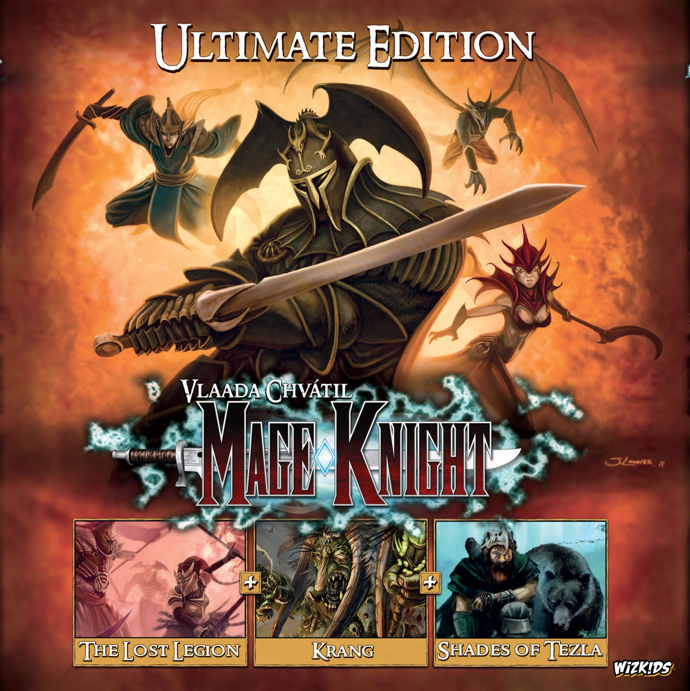
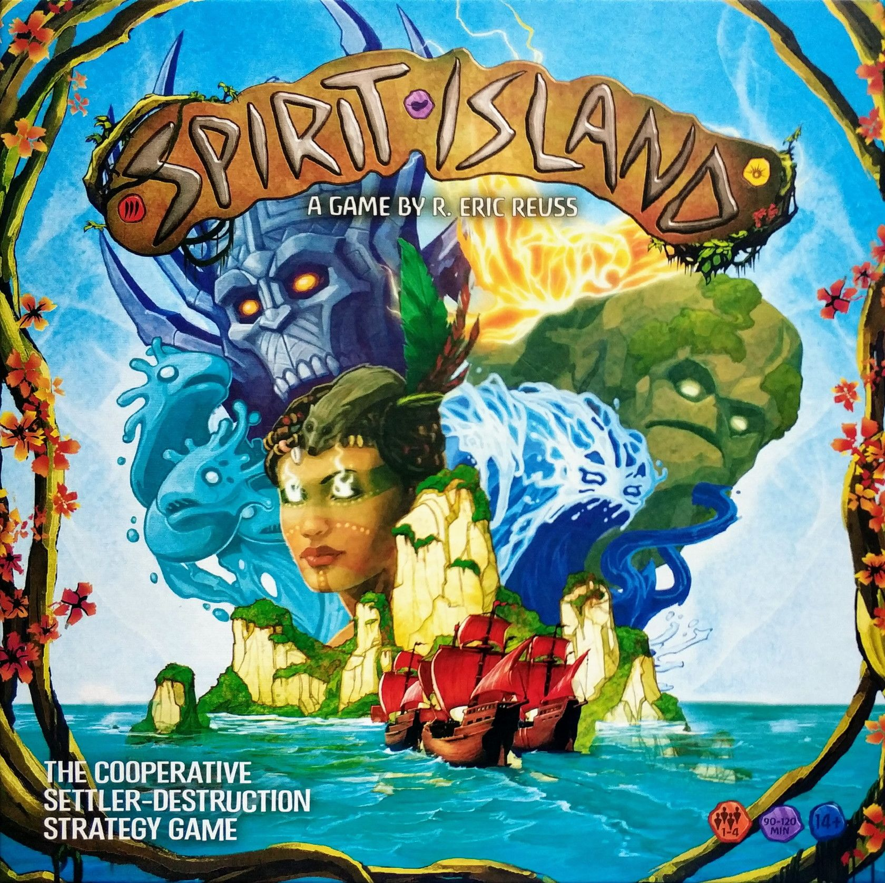

You own [Mage Knight](https://boardgamegeek.com/boardgame/96848). You bought it because someone on Reddit called it the greatest solo board game ever made. You opened the box once, stared at the rulebook, maybe punched the tokens, lined up the miniatures on your desk, felt very good about yourself, and then slid the lid back on. That was months ago. Maybe years. The box is still there, slightly too large for its shelf, radiating guilt every time you walk past it.

You are not alone. Mage Knight might be the most respected game in the hobby that consistently fails to reach the table. It sits at **rank #39 on BGG** with an average rating of **8.08** (the Ultimate Edition scores an absurd **8.84**), a weight of **4.38/5**, and the kind of reverent forum praise usually reserved for religious texts. And yet the most common sentence in its BGG comments section is some variation of "I really need to play this again."

This article is about diagnosing exactly why that keeps happening — and giving you a concrete plan to fix it tonight.

## The Symptoms

Let's be honest about the presenting problem. If you own Mage Knight and haven't played it in the last six months, you already know which of these applies to you:

**"The rulebook broke me."** The original rulebook is legendarily awful. Not because the rules are bad — they're actually elegant once internalised — but because the book buries simple concepts under walls of exceptions, edge cases, and cross-references. The walkthrough booklet helps, but it's a separate document you need to read *alongside* the rules. Two booklets. For one game. That's a setup tax before you've even opened a single card.

**"I don't have four hours."** The box says 60–240 minutes. In practice, your first solo game will be closer to three hours with rules lookups. A full conquest scenario with two players can eat an entire evening. That time commitment becomes a psychological barrier. You don't start the game because you're not sure you can finish it, and you can't finish it because you never start it.

**"I can't teach it."** Even if you've learned the game, teaching it is a different nightmare. Card play, mana, combat math, reputation, day/night cycle, unit recruitment — dumping all of that on a new player before Round 1 is a recipe for glazed eyes and a polite suggestion to play something else.

**"It takes up the whole table."** A mid-game Mage Knight board with expanded tiles, unit cards, deed decks, skill tokens, and dummy player spread covers a standard dining table. If you don't have a dedicated game space, even setup is an act of faith.

Any of those sound familiar? Good. Because the actual barrier is simpler than you think.

## The Real Barrier

It's not the complexity. It's the *activation energy*.

Compare Mage Knight with [Spirit Island](https://boardgamegeek.com/boardgame/162886), which sits at weight **4.08** — not dramatically lighter. Spirit Island is also crunchy, brain-burning, and solo-excellent. But it gets played constantly. Rank #11 on BGG. The difference isn't that Spirit Island is simpler. It's that Spirit Island has a lower *startup cost*. You can be playing your first turn within ten minutes, because the core loop — play cards, place power — is immediately grokkable even if the strategy takes weeks to develop.

Mage Knight's core loop is equally elegant: play cards from your hand, combine them with mana, move and fight. But the game doesn't *feel* elegant until you've cleared the rulebook hurdle, and the rulebook front-loads every edge case as if it's afraid you'll sue.

This is a **documentation problem disguised as a complexity problem**. The game itself flows beautifully. The card play is satisfying. The mana economy is clever. The map exploration creates genuine tension. But the on-ramp is so hostile that most people never reach the highway.

The good news: this is solvable. You don't need to be smarter or more patient. You need a better plan.

## The Rescue Plan

Here's how to get Mage Knight off the shelf and onto the table — permanently. This is not "just read the rulebook again." This is a specific, sequenced approach that works.

### Step 1: Forget the Rulebook

Seriously. Put both booklets back in the box. The single best learning resource for Mage Knight is the **Ricky Royal walkthrough series** on YouTube. It's a full solo conquest played at teaching pace, explaining every rule as it comes up in context. Watch the first two episodes. Don't take notes. Just let the structure seep in. This takes about 90 minutes total, and it replaces hours of rulebook wrestling.

If you prefer text, the fan-made quick-reference guides on BGG are vastly better than the official rules for actually playing. Search for "Mage Knight reference card" in the files section. Print one double-sided and keep it next to the board.

### Step 2: Play the First Reconnaissance

Don't start with a full conquest. The game includes a **First Reconnaissance** scenario that's specifically designed as a solo tutorial. One day, one night, three map tiles, no city assault. It takes about 60–90 minutes for a first play, which is a completely different proposition from the four-hour epic you were dreading.

This scenario teaches you the card system, basic combat, movement, mana crystals, and the day/night cycle. It deliberately leaves out the more advanced systems (city sieges, PvP, advanced unit abilities) so you can build confidence with the core before layering on complexity.

### Step 3: Keep the Table Set

This is the secret trick that converts occasional Mage Knight players into regular ones. If you have any way to leave the game set up between sessions — a spare table, a puzzle mat you can roll up, even a large baking sheet — do it. Mage Knight's setup time is 15–20 minutes from a cold start. That's not terrible, but it's enough friction to stop you on a weeknight. If the board is already there, the activation energy drops to almost nothing.

This is exactly what makes [Terraforming Mars](https://boardgamegeek.com/boardgame/167791) so successful at getting repeat plays despite its 120-minute runtime. It sets up fast, it has a clear stopping point, and it doesn't punish you for coming back to it. Mage Knight can work the same way if you eliminate the setup barrier.

### Step 4: Graduate to Solo Conquest

Once you've done the First Reconnaissance twice — it will take about 45 minutes the second time — run a full solo conquest. Three days and three nights. A full map. Cities to siege. Block out a Saturday afternoon (2.5–3 hours). The arc from struggling explorer to city-sacking force of nature is one of the best progressions in board gaming.

### Step 5: Introduce One Human

If you want to play with someone else, set up a cooperative First Reconnaissance and explain rules as they come up. "You can move, fight, or interact. Here's how movement works. We'll handle combat when we get there." The game supports this because turns are discrete and problems are concrete — you never explain an abstract rule; you explain it when the player is staring at the orc they need to kill.

## The Tonight Test

Here's what you can do *right now*, tonight, in under two hours:

1. **Open the box.** Sort the basic action cards into four hero decks (they're colour-coded). Set aside one hero's cards.
2. **Lay out three map tiles** face down, plus the starting tile.
3. **Skip the rulebook.** Pull up the Ricky Royal walkthrough (Episode 1) on your phone or laptop.
4. **Play the First Reconnaissance** alongside the video. Pause when you need to. Don't worry about getting rules wrong.
5. **When you finish**, leave the board set up if you possibly can.

That's it. You will make mistakes. You will forget mana die colours. You will resolve a combat wrong. None of that matters. By the end of that session, Mage Knight will have transformed from an intimidating box into a game you've actually played.

## Why It's Worth Rescuing

Mage Knight is one of the best games ever designed. Designer Vlaada Chvatil — who also made Galaxy Trucker, Codenames, and Through the Ages — built something with no real equivalent. Deck-building, exploration, puzzle-like combat, and RPG progression in a solo-focused package, still unique fifteen years later.

The BGG solo poll confirms it. On the Ultimate Edition: **327 votes for "Best at 1 player"** versus just 5 "Not Recommended." Out of 425 total votes, 77% say it's *best* solo. Not decent solo. Best. That's a staggering consensus for a game at weight 4.65.

Once you clear the learning hurdle, Mage Knight rewards you with:

- **Decision density** that holds up across dozens of plays. Every hand of cards is a new puzzle.
- **Genuine exploration** — the map is different every time, and tile reveals create real moments of excitement and dread.
- **A power curve** that makes you feel like you've earned every bit of progress. End-game Mage Knight, when you're combining advanced actions with powerful spells and units, is peak board gaming.
- **Scalable challenge.** The scenarios range from breezy tutorials to brutally difficult competitive conquests.

The [Ultimate Edition](https://boardgamegeek.com/boardgame/248562) bundles everything — base game, The Lost Legion, Shades of Tezla, Krang character expansion, plus integrated rules. If you're buying fresh, that's the one to get. If you own the base game, The Lost Legion alone transforms solo with a rival AI that hunts you across the map.

## Verdict

Mage Knight doesn't belong on your shelf of shame. It belongs on your table, with three map tiles laid out and a hero card in front of you, and the rest of the evening stretching ahead with nothing but satisfying problems to solve.

The barrier was never the game. It was the on-ramp. Follow the rescue plan, start small, and give yourself permission to get rules wrong. By your third play, you won't need reference sheets. By your fifth, you'll be planning city sieges in the shower.

Get it off the shelf. Tonight.