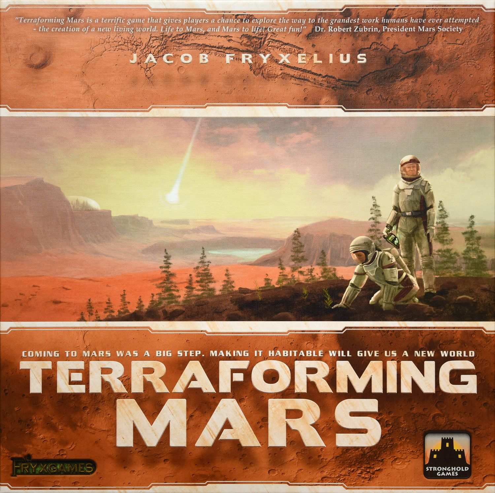

Most "solo-friendly" board games are really multiplayer games with a bot module bolted on. You can tell because the solo rules live at the back of the rulebook, the art always shows four smiling friends, and the BGG poll for "Best with 1 player" gets a sympathy vote from twelve people who bought the deluxe edition.

[Final Girl](https://boardgamegeek.com/boardgame/277659) is the opposite. It's a solo-only game. Not "plays well with one." Not "recommended for one." **Solo only.** The box says so. The rulebook says so. There is no multiplayer mode to retrofit and no AI opponent to simulate a friend. It is a horror movie in a box, designed from the ground up for exactly one person sitting at the table sweating.

It's also ranked **#96 overall on BGG** with an 8.23 average across 11,007 ratings — which is genuinely absurd for a game that refuses to entertain a second player. So: what is actually going on here, and is it worth the shelf space if you're a solo gamer looking for your next fix?

 — Van Ryder Games. BGG rank #96, 8.23 average rating.")

## What it actually is

Final Girl is a **solo-only horror game** by Evan Derrick and A. J. Porfirio, published by Van Ryder Games in 2021. You play the one character with a chance of surviving the night. The killer is the box.

Mechanically, each "Feature Film" combines two things:

- A **Killer** (Hans the Butcher, Jason-alike slashers, a demon, a cult leader, etc.)
- A **Location** (summer camp, haunted carnival, high school, suburban street)

You mix and match. Hans at the carnival plays nothing like Hans at the camp. Each location has its own board, its own civilians to rescue, its own terror events. Each killer has their own deck of movement, attack, and creepy-thing-you-didn't-expect cards. The box tells you exactly what the killer wants to do next — you just can't stop it cleanly.

A game takes **20 to 60 minutes** (BGG-listed playtime), and you spend roughly half of it rolling a fistful of dice, cursing, and trying to decide whether to hide, run, or actually pick up the axe and fight.

### The loop (what you actually do)

Each round has four beats you execute yourself, because there's no one to argue with:

1. **Plan.** Draw your action cards. Budget your time tokens. Decide whether tonight is a stealth run or a cardio run.
2. **Act.** Move, search, rescue, attack. Every action eats time; time feeds the killer.
3. **The Killer acts.** Flip the top of the killer's deck. Resolve the horrible thing. This is the part where you audibly say "oh no."
4. **Darkness grows.** The map gets worse. Lights go out. Doors lock. Civilians die if you didn't get to them.

There's no puzzle-solving in the Spirit Island sense. It's more like playing a survival-horror video game on hard mode with dice: you will get hit, you will lose resources, your job is to make the damage mean something.

## How the solo mode actually works (mechanically)

This is the bit that matters if you're coming from games like Spirit Island or Arkham Horror: The Card Game and wondering what "solo-only design" actually buys you.

**Everything is tuned for one brain.** No AI opponent means no bot flowchart. Instead, the killer is a **stacked deck with triggered abilities**. You don't run a simulation of an opponent — you turn over a card and the card does a thing. Fast, clean, no looking up multiple tables to decide who the bot targets.

**Every choice has consequences you don't share.** In a co-op with a faux-solo mode, you can usually "oops" a turn and the group compensates. Here, if you blow your action, the next three rounds get harder and there is nobody to bail you out. It makes the game punch well above its weight emotionally.

**Information is asymmetric — against you.** The killer has a hidden hand, a hidden motive, and a reveal mechanic. You're always acting on partial information, which is exactly what a horror movie feels like.

**Dice give the box a voice.** You're not rolling against a static target; you're rolling while the killer is watching. A good roll feels like a last-minute save. A bad one feels like the box earning its reputation.

The thing the design nails — and this is why it's top-100 and not just another app-driven solo oddity — is that **nothing about Final Girl feels like it's simulating a missing player**. There are no dummy hands, no phantom resource pools, no "pretend the other hero also moved." The game is the killer and the box is the GM.

## How it compares if you already own the big solo heavyweights

Three games show up in almost every "top solo games of all time" list. Here's how Final Girl stacks against them, with actual BGG numbers rather than vibes.

### vs [Spirit Island](https://boardgamegeek.com/boardgame/162886)

- **BGG rank:** #11 overall, rating 8.34
- **Weight:** 4.08 / 5
- **Play time:** 90–120 minutes
- **Players:** 1–4 (1 is Recommended, not Best)

Spirit Island is a **brain-burner puzzle** with a scripted opponent. Final Girl is a **tension simulator** with a deck that wants you dead. Spirit Island rewards optimisation; Final Girl rewards composure. If you finish a game of Spirit Island and feel like you *solved* it, you finish Final Girl and feel like you *survived* it.

Importantly, Spirit Island is a heavy puzzler (weight 4.08) and Final Girl is distinctly lighter (weight 2.75). These are not competing for the same slot on your table — they're competing for different moods. Rainy Sunday afternoon with a coffee → Spirit Island. Friday night, one candle, headphones on → Final Girl.

### vs [Arkham Horror: The Card Game](https://boardgamegeek.com/boardgame/205637)

- **BGG rank:** #32 overall, rating 8.12
- **Weight:** 3.57 / 5
- **Play time:** 60–120 minutes
- **Players:** 1–2 (deeply solo-supported)

Arkham LCG is the current king of **narrative solo campaigns**. Final Girl is a **standalone one-shot** every time you sit down. That's a real difference — Arkham asks you to invest in a 3–8 scenario arc; Final Girl gives you a complete horror film in 40 minutes. Better for the time-boxed evening, worse if what you want is season-long storytelling.

Both use a "box-runs-the-opponent" feel, but Arkham's chaos bag is probabilistic texture, while Final Girl's killer deck is a hostile character you'll come to recognise. Hans plays differently from the Poltergeist and you will, over time, develop a grudge against specific killers the way you develop a grudge against specific Arkham scenarios.

### vs [Terraforming Mars](https://boardgamegeek.com/boardgame/167791)

- **BGG rank:** #9 overall, rating 8.34
- **Weight:** 3.27 / 5
- **Play time:** 120 minutes
- **Players:** 1–5

Terraforming Mars is the classic "I'll just play against myself to beat a score" solo experience. It's optimisation against a clock. Final Girl has **no score, no clock-against-yourself, and no sense that you "beat the table"**. You either live or you don't. If TM is a spreadsheet solo game, Final Girl is a diary solo game — you'll remember the games you lost more than the ones you won.

## What the solo community actually says

Dropping into BGG and the r/soloboardgaming threads on Final Girl, the same themes come up over and over:

- **"It captures the feeling of a horror movie better than anything else I own."** This is the most common sentiment, and it's the hook. People who like the *genre* of slasher films come away happy even when they lose (which is often).
- **"I was sceptical of the dice until I realised the dice ARE the tension."** Grognards who bounced off initially because it looked random tend to come back once they understand that the dice aren't the decision engine — they're the sweat. The decisions are in when to spend time, when to hide, when to run.
- **"Teaches in fifteen minutes, then owns you for forty."** Compared to setup-heavy solo monsters like Mage Knight, Nemesis, or Gloomhaven, Final Girl has a refreshingly low barrier to table.
- **"Box-on-table footprint is smaller than it looks."** You need the location map, the killer's area, your character sheet, and a small pool of dice. It fits on a dinner-for-one sized table. Meaningful when you play at a cramped kitchen table after bedtime.
- **"I wish it weren't so expansion-hungry."** This one comes up a lot. The core box is a complete experience, but the Feature Films are sold as separate killer + location combos, and collectors end up dropping real money chasing the cinematic universe Van Ryder built.

If you want to sanity-check this yourself, the BGG forums for [Final Girl](https://boardgamegeek.com/boardgame/277659/final-girl) and the "Solo Play" guild threads have thousands of first-play write-ups that sound like film reviews. That's a sign the theme is landing.

## Practical stuff (the unglamorous bits)

Let's talk about the things nobody mentions in reviews but absolutely decide whether a solo game gets played or shelved.

**Setup and teardown.** Maybe 5–7 minutes if you know the killer/location combo. Closer to 10 the first few times you play an unfamiliar combo. This is *substantially* better than Spirit Island's 10–15, Arkham LCG's 10–20 (plus deckbuilding), or any legacy-style solo campaign.

**Table footprint.** Small. You can play Final Girl on a single dinner place-mat if you're careful. Compare that to Spirit Island's sprawling island or Nemesis's entire kitchen table. This matters if your "solo gaming table" is your kitchen table and the baby monitor is on it.

**Decision density.** Medium-high. Every round you're making 3–5 meaningful choices with visible consequences. That's a higher ratio than TM solo, lower than Spirit Island. It's the sweet spot for a midweek evening brain.

**Replayability.** Extremely high for a reason you might not expect — because each killer has a bespoke deck and each location has a bespoke board, the **combinations** multiply. The base game alone gives you multiple playable killer/location matchups, and each Feature Film expansion adds new combinations. If you like the design, you'll never run out of table time for this game.

**Shelf guilt risk.** Low. Final Girl's biggest strength is that you can **decide to play and be playing in under ten minutes**. Compared to the games that live in solo-gamer shame cupboards because "I need to re-read the rules," Final Girl does not punish you for taking a month off.

## BGG solo poll data

For a "solo-only" game, the player count poll is almost a formality — but it's still worth pulling. On BGG, the "User Suggested Number of Players" poll for Final Girl shows **"Best with 1 player"** as the only recommended count. 144 of 151 voters marked 1-player as "Best," and the game has no legal multiplayer configuration to vote for. This is the rare case where the poll exists only to confirm what the box already told you.

## Who this game still isn't for

No article has any business pretending a game is universally great, so here's the honest list of who should *not* buy Final Girl even though it's top-100:

- **You dislike horror.** No amount of "but the mechanics are clever" will save you from a game whose core loop is "watch innocent people die in stylised ways." The theme is baked in. If a slasher film would ruin your evening, so will this game.
- **You want a multiplayer option on the shelf.** You will never, ever play Final Girl with another human at the table. There is no mode. If your spouse looks at the shelf and says "let's try that one tonight," the answer is "you can't, but you can watch." That's a worse vibe than it sounds.
- **You hate dice-driven tension.** Spirit Island players sometimes bounce because Final Girl's big moments are decided by dice. If "I made the right call but the dice killed me" is a deal-breaker, this is a bad fit.
- **You already own too many solo games.** Real talk — the overlap between Final Girl and [Nemesis](https://boardgamegeek.com/boardgame/167355) or the horror end of Arkham LCG is meaningful. If your solo shelf is already five horror games deep, you might not need another.
- **You hate expansion creep.** The core box is complete, but the Feature Film model means you'll be tempted. A lot. The game's design philosophy is "each killer is a movie" — which is the best and worst thing about it.

## Verdict

If you're a solo gamer who wants a game that was **built** for solo from the first playtest, rather than scaled down from a multiplayer original, Final Girl is one of the only games on the market that qualifies. It's lighter than Spirit Island (weight **2.75** vs Spirit Island's **4.08**), shorter to set up than Arkham LCG, and does something emotionally that none of the other top-100 solo games really try to do: it makes you scared of the box.

It's also very clearly **not** a "one solo game to replace them all" choice — if you want optimisation, get Terraforming Mars; if you want narrative arcs, get Arkham LCG; if you want a puzzle, get Spirit Island. Final Girl is the horror slot on your solo shelf, and it's the best horror slot available.

For a solo-designated evening, one candle, a bowl of popcorn, and a box that wants you dead? Worth it. Tonight, even.

---

**At a glance**

| | BGG rank | Rating | Weight | Players | Playtime |
|---|---|---|---|---|---|
| [Final Girl](https://boardgamegeek.com/boardgame/277659) | **#96** | 8.23 | 2.75 | 1 | 20–60 min |
| [Spirit Island](https://boardgamegeek.com/boardgame/162886) | #11 | 8.34 | 4.08 | 1–4 | 90–120 min |
| [Arkham Horror LCG](https://boardgamegeek.com/boardgame/205637) | #32 | 8.12 | 3.57 | 1–2 | 60–120 min |
| [Terraforming Mars](https://boardgamegeek.com/boardgame/167791) | #9 | 8.34 | 3.27 | 1–5 | 120 min |

*All stats from the BoardGameGeek XML API, verified at time of writing. Cover art via BGG; publisher credits: Van Ryder Games (Final Girl), Greater Than Games (Spirit Island), Fantasy Flight Games (Arkham Horror: The Card Game), Stronghold Games / FryxGames (Terraforming Mars).*
