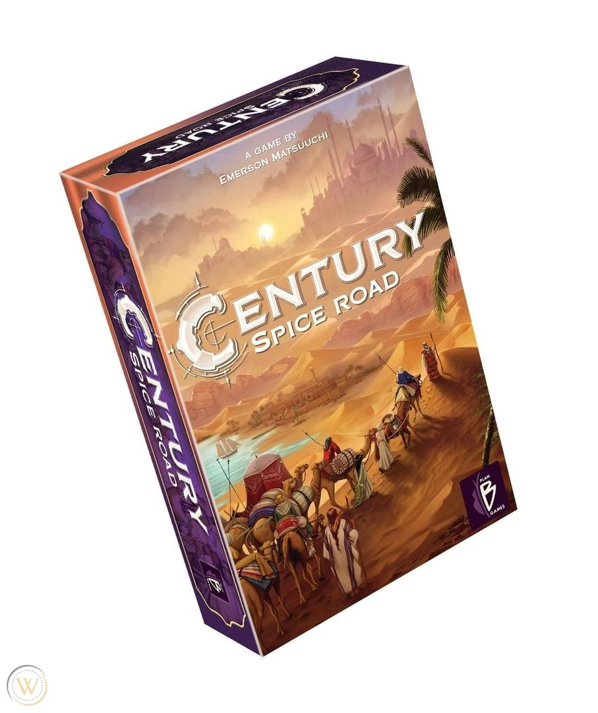

Ah, the eternal battle of gateway engine-builders: [Splendor](https://boardgamegeek.com/boardgame/148228/splendor) vs [Century: Spice Road](https://boardgamegeek.com/boardgame/209685/century-spice-road). If you've spent any time lurking on BGG forums, you've seen the skirmishes. Two beloved games, both claiming the title of the ultimate go-to game for new folks and seasoned veterans alike. But which should you drop your hard-earned cash on? Let's break it down.

### Quick Reference Comparison

| Aspect                  | Splendor 🏆                                  | Century: Spice Road                           |
|-------------------------|-----------------------------------------------|-----------------------------------------------|
| **Core Focus**          | Economic efficiency, permanent discounts    | Deckbuilding synergies, spice cube combos    |
| **Interaction**         | Minimal (reservation only)                   | Higher (blocking, faster opponent denial)    |
| **Components**          | Tactile poker chips 🏆                        | Spice cubes, metal coins, plastic bowls      |
| **Endgame Feel**        | Rapid acceleration to 15 points              | Steady trading to point cards, less sudden   |
| **Replayability**       | High for quick plays                         | Higher depth via card combos 🏆               |

### Complexity

Here's the thing: [Splendor](https://boardgamegeek.com/boardgame/148228/splendor) is the quintessential easy-to-teach game. With a weight of 1.96, it’s the kind of game you can get rolling in five minutes flat. [Century: Spice Road](https://boardgamegeek.com/boardgame/209685/century-spice-road), rated at 2.16, offers a touch more depth with its card synergies and combos. But does that actually matter at game night? For a group eager to delve into strategy without a steep learning curve, Splendor has the edge. 🏆

### Theme & Immersion

Neither game is going to transport you into a deep narrative universe. Splendor's theme - a Renaissance jeweler acquiring gems - is as thin as a single-ply tissue. Century, with its spice trading across the Silk Road, tries a bit harder. The tactile pleasure of handling those spice cubes and metal coins adds a layer of immersion that Splendor’s poker chips just don’t touch. Century wins on atmosphere.

### Replayability

Splendor has some serious staying power, especially for quick plays. You can knock out game after game without fatigue setting in. But Century, with its myriad card combos, offers layers to peel back over repeated sessions. Each play feels like a new puzzle to solve, especially as you get better at spotting those synergies. It may start slow, but it grows with you. Replayability? Century: Spice Road takes this one. 🏆

### Value for Money

Let's be real: both of these games are wallet-friendly, typically landing in the $25-$35 range. Given their popularity and the components involved, they’re both solid buys. But considering Splendor came out in 2014 and still reigns as a top entry, it’s a proven investment. The ongoing digital support and expansions (hello, Cities of Splendor) sweeten the deal. Splendor edges out here with its established longevity and ongoing support. 🏆

### Player Count Sweet Spot

Splendor shines at 3-4 players, keeping the pace snappy while maintaining strategic tension. Century also does well in this range but can extend up to 5 players, which is great for larger gatherings. However, with each added player, the game can slow down and lose some of its charm. For tight, consistent gameplay, Splendor holds its ground better. 🏆

### Table Presence

Splendor’s poker chips are iconic. They're chunky, satisfying, and let’s face it, they're the game’s unofficial mascot. Meanwhile, Century's array of colorful spice cubes in quaint bowls is eye-catching, but it doesn’t quite capture the tactile joy of those chips. Splendor’s table presence is a class of its own. 🏆

### Learning Curve

For a gateway game, ease of teaching is crucial. Splendor’s straightforward rules make it a breeze to teach. You grab chips, buy cards, and race to 15 points. Century requires a bit more patience to grasp the card synergy and trading mechanics. While it's not brain surgery, it demands more mental gymnastics than Splendor for a new player. Splendor is the clear choice for the game's target audience. 🏆

### Verdict

Here's where the rubber meets the road. Splendor wins 5 out of 7 categories. It's not close. For most people, it’s the better game, period. It’s the king of gateway games for a reason: easy to teach, quick to play, and incredibly satisfying.

Buy [Century: Spice Road](https://boardgamegeek.com/boardgame/209685/century-spice-road) only if you’re looking for a bit more depth and interaction, especially if you’ve got a group ready to explore those layered strategies. It’s the niche pick for those who find Splendor a bit too straightforward.

But if you just want a great time around the table that’s easy to pick up and hard to put down, Splendor’s your game.