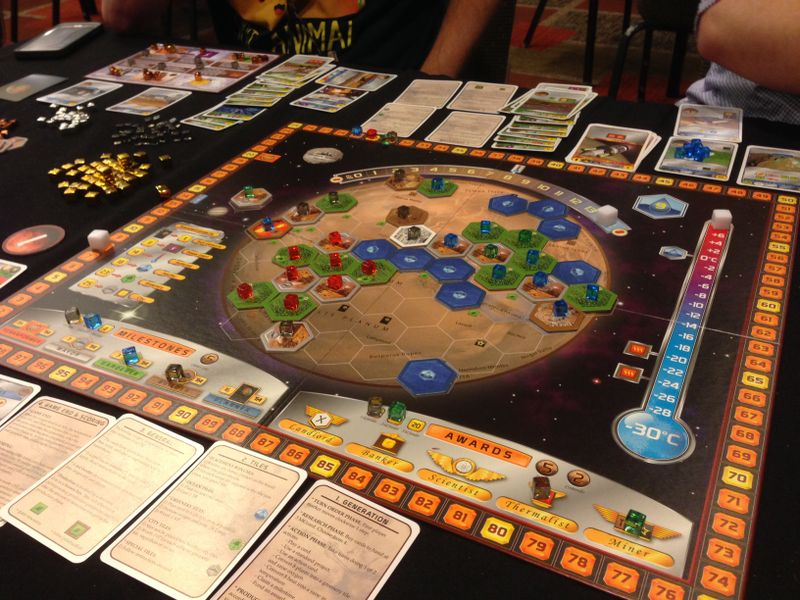
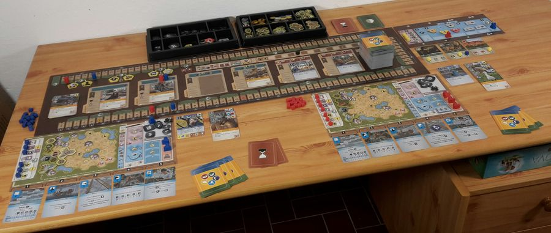
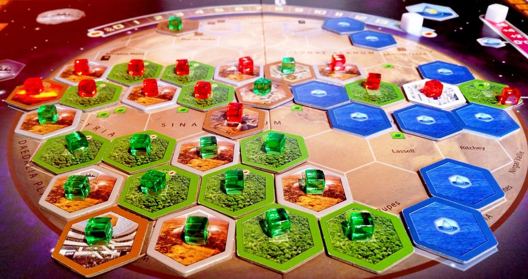
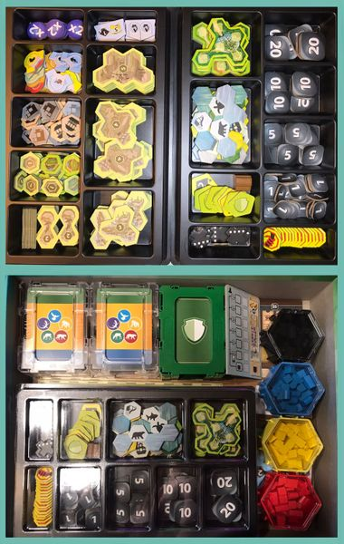

Two of the ten highest-rated board games ever made. Both card-driven tableau builders. Both games where you draft from a huge deck, build an engine over two hours, and feel genuinely clever by the end. And both sitting in nearly every serious collection already.

So why compare them? Because if you only have room (or budget) for one, the choice is less obvious than it looks. [Terraforming Mars](https://boardgamegeek.com/boardgame/167791/terraforming-mars) and [Ark Nova](https://boardgamegeek.com/boardgame/342942/ark-nova) share a skeleton — play cards, build combos, race toward a finish condition — but the experience at the table is surprisingly different.

This comparison breaks down exactly where they diverge, who each game is really for, and which one earns that coveted permanent shelf spot.

## At a glance

| Category | Terraforming Mars | Ark Nova | Edge |
|---|---|---|---|
| BGG Rating | 8.34 (#9 overall) | 8.54 (#2 overall) | 🏆 Ark Nova |
| Weight | 3.27 / 5 | 3.80 / 5 | Depends on taste |
| Players | 1–5 (best at 3) | 1–4 (best at 2) | Draw |
| Play Time | ~120 min | 90–150 min | Draw |
| Designer | Jacob Fryxelius | Mathias Wigge | — |
| Year | 2016 | 2021 | — |
| Owned (BGG) | 158,742 | 87,888 | — |

Both are in BGG's top 10. That's rarefied air. But the five-year gap between them matters more than you'd think.

## The core difference: shared board vs private zoo

This is where the decision really starts.

*Image credit: Feuerland Spiele / BoardGameGeek*

In **Terraforming Mars**, you're collectively turning a dead planet green. There's a shared board — Mars itself — where you place ocean tiles, greenery, and cities. The map creates genuine spatial tension. Placing a city next to someone else's greenery matters. Claiming a Milestone before your opponent can is a race. The global parameters (temperature, oxygen, oceans) tick upward from everyone's efforts, but you're jockeying for credit.

*A Terraforming Mars game nearing completion — oceans placed, greenery spreading, cities contested. Image credit: BoardGameGeek user*

In **Ark Nova**, there is no shared map in the same way. You're building your own zoo on your own board. You place enclosures, kiosks, and pavilions in a spatial puzzle that's entirely yours. The interaction comes from the card display (sniping animals your opponent needs), the association board (grabbing conservation projects first), and the break trigger (ending the game before others are ready).

*An Ark Nova game in progress — enclosures placed, action cards sliding along the track. Image credit: BoardGameGeek user*

The result: Terraforming Mars feels more *competitive*, with direct board presence and take-that cards. Ark Nova feels more like a *competitive solitaire* — your zoo is yours, but the race is real.

## Card play: 200+ vs 255

Both games live and die by their card decks. But they handle them differently.

**Terraforming Mars** uses a draft-and-buy system. Each generation, you draw four cards and decide which to purchase at 3 MegaCredits each. Cards you don't buy are gone. The economy of buying versus playing is the game's central tension — every card bought is money not spent elsewhere. Many cards have requirements (minimum temperature, ocean count, etc.), which means you're planning generations ahead.

**Ark Nova** uses a different approach entirely: five action cards that slide along a track. The power of each action depends on its position — the further right, the stronger. After you use a card, it resets to position 1. This creates a gorgeous puzzle within the puzzle. Do you take a weak Animals action now, or wait a turn so it powers up? Do you burn your strong Build to grab that perfect enclosure spot?

The action card mechanism is Ark Nova's signature innovation, and it's what makes the game feel distinct from every other tableau builder. Terraforming Mars has nothing like it — your turns are simply "do 1-2 actions from a list." The flexibility is greater, but the mechanical cleverness is lower.

*The full Terraforming Mars table spread — cards, cubes, and a planet slowly coming to life. Image credit: BoardGameGeek user*

## Complexity and learning curve

BGG weight tells part of the story: Terraforming Mars sits at **3.27/5**, Ark Nova at **3.80/5**. That half-point gap is real.

Terraforming Mars is easier to *start*. The basic loop — buy cards, play cards, produce resources, repeat — clicks within a generation or two. The complexity comes from the card interactions and long-term engine planning, but the turn structure is clean.

Ark Nova front-loads more rules. The action card mechanism, the association board, the conservation vs appeal tracks, sponsor cards, partner zoos, university bonuses — there's a lot to process before your first turn makes sense. Most new players report their first game feeling overwhelming, then the second game clicking hard.

**If you're teaching non-gamers:** Terraforming Mars. Not because it's simple, but because the turn structure is more intuitive.

**If your group already plays heavy games:** Ark Nova's additional complexity translates into more meaningful decisions per turn.

## Theme: does it matter?

More than you'd expect.

Terraforming Mars has one of the best themes in modern board gaming — but you barely notice it during play. The cards have flavour text and real science concepts (asteroid mining, nitrogen-fixing bacteria, nuclear plants), and the Mars board gradually transforming from brown to blue-green is genuinely satisfying. But mechanically, you're mostly just checking requirements and adding production cubes.

Ark Nova's theme is more *felt*. You're placing specific animals — African elephants, komodo dragons, koalas — into enclosures you built. The animals have geographic requirements, size needs, and tag synergies that map logically onto real zoology. When you play a petting zoo sponsor next to your reptile house, it makes thematic sense. The conservation vs commercial appeal tension is baked into the scoring, not just the flavour text.

**Winner:** Ark Nova. The theme and mechanics are more tightly interwoven.

## Solo play

Both games have official solo modes, and both are genuinely good.

**Terraforming Mars solo** gives you a fixed number of generations (14, or 12 with Prelude) to complete all three global parameters. It's a pure optimisation puzzle — can you build an engine fast enough? The solo community is enormous, with hundreds of corporation/map combinations keeping it fresh.

**Ark Nova solo** uses a clever card-driven AI opponent (the "Conservation" opponent) that competes for display cards and association actions. It's tighter and more interactive than TM's solo, but also more fiddly to manage.

BGG player count polls tell the story:

- **Terraforming Mars:** Best with 3 (1,712 votes), Recommended solo (1,239 vs 555 Not Rec)
- **Ark Nova:** Best with 2 (1,493 votes), Recommended solo (964 vs 296 Not Rec)

Both are solid solo. TM solo is simpler to run; Ark Nova solo is a more engaging opponent.

## Player interaction

This is where they diverge sharply.

**Terraforming Mars** has genuine take-that. Cards like asteroid impacts can destroy your opponent's plants. Stealing tiles on the Mars board has real consequences. Milestones and Awards create zero-sum races. Some groups love this; some house-rule the aggressive cards out.

**Ark Nova** is almost entirely indirect. You're competing for cards in the display, for spots on the association board, and for the break timing. Nobody can destroy your zoo or steal your animals. The tension is real but gentler.

**Prefer direct conflict?** Terraforming Mars.
**Prefer "race you to the finish" tension?** Ark Nova.

## Expansion ecosystem

Terraforming Mars wins this category by sheer volume. After nearly a decade, it has:
- **Prelude** (essential, speeds up early game)
- **Colonies** (adds trade routes)
- **Venus Next** (new parameter track)
- **Turmoil** (political layer, divisive)
- **Hellas & Elysium** (alternate maps)
- **Prelude 2** (more prelude cards)

Ark Nova has:
- **Marine Worlds** (adds aquariums, new animal types)
- **Zoo Map Packs 1 & 2** (alternate zoo layouts)

Terraforming Mars with Prelude is widely considered the definitive version. Without it, the early game drags. Ark Nova's base game stands alone better — Marine Worlds is excellent but not essential.

*Ark Nova's components laid out — clean iconography and a well-organised player area. Image credit: BoardGameGeek user*

## Production quality

Let's be honest: Terraforming Mars's components are famously mediocre. The player boards are thin cardboard that bumps send cubes flying. The card art ranges from good to clip-art-adjacent. The 3D-printed tiles and dual-layer player board upgrades exist because the base game needed them.

Ark Nova ships with a better box from day one. Thicker boards, clearer iconography, and card art that's consistently attractive. It's not a deluxe production, but it doesn't need aftermarket fixes to be playable.

**Winner:** Ark Nova, clearly.

## Which should you buy?

**Buy Terraforming Mars if:**
- You want a game with a massive expansion ecosystem to grow into
- You enjoy direct player interaction and take-that moments
- You play regularly at 3–4 players
- You want the easier teach for mixed-experience groups
- You love the sci-fi theme and don't mind modest components
- Budget matters — the base game is often under £30

**Buy Ark Nova if:**
- You want the tighter, more modern design
- You primarily play at 2 players
- You prefer indirect competition over direct conflict
- You want better production quality out of the box
- You enjoy a theme that's woven into the mechanics, not just the flavour
- You're comfortable with a steeper initial learning curve

**Buy both if:**
- They scratch different enough itches to justify both. And honestly? They do. Terraforming Mars is the sprawling sandbox. Ark Nova is the precision puzzle. Most serious collections have room for both.

## The verdict

If forced to pick one? **Ark Nova**. It's the more refined design, the tighter experience, and the game that rewards repeated play more consistently. The action card mechanism alone elevates it above "just another tableau builder." There's a reason it's #2 on BGG.

But Terraforming Mars isn't just a lesser version of the same thing. It's a different beast — looser, more chaotic, more social, and with a decade of content to explore. Its community is one of the largest in the hobby. Dismissing it because a newer game rates 0.2 points higher would be missing the point entirely.

Two titans. Different strengths. Your call.
