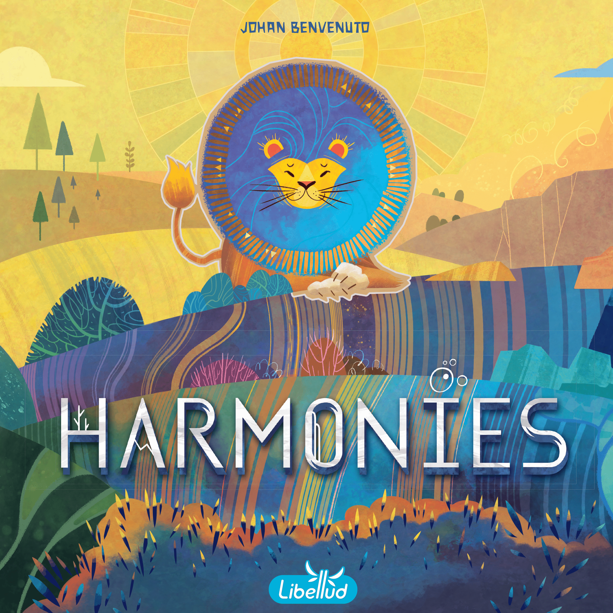
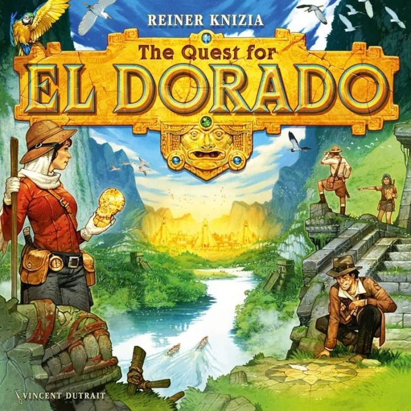
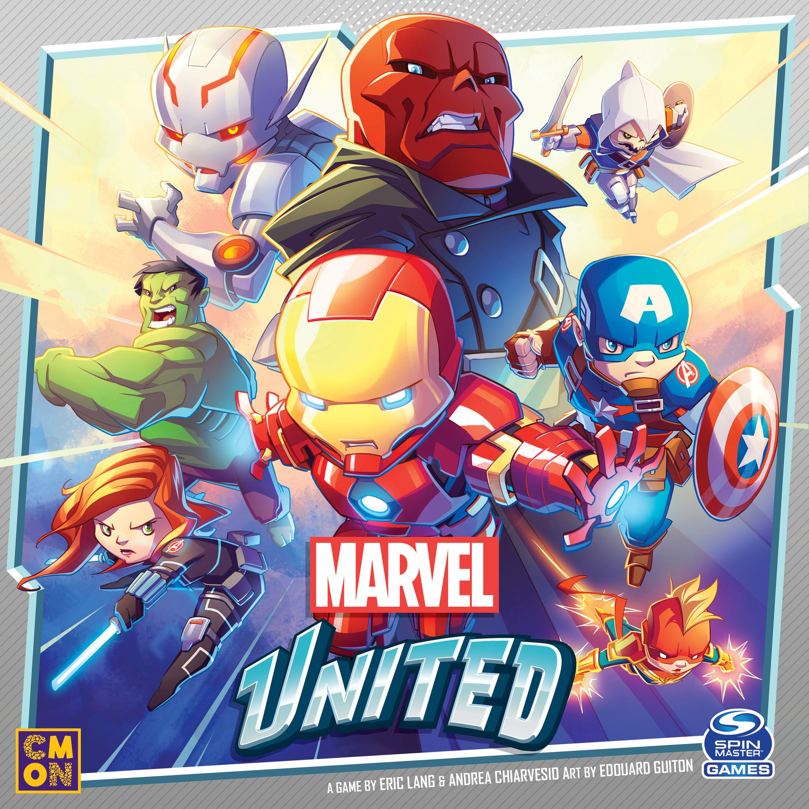
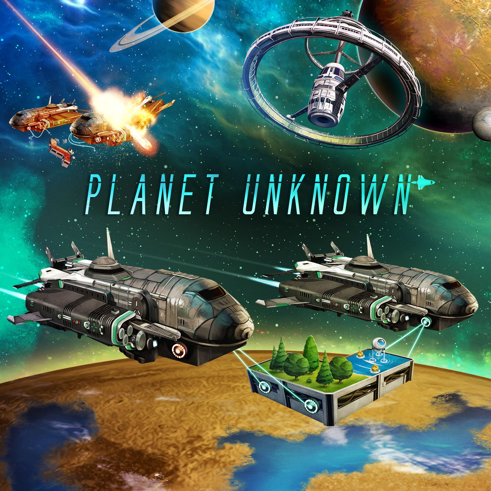
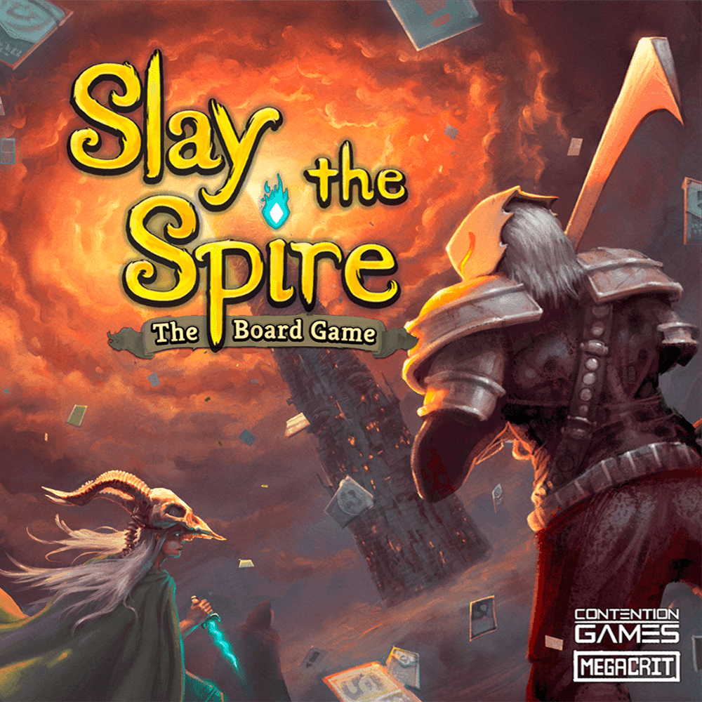

If you want the short answer to **“what are the best board game gifts in 2026?”**, start with **[Harmonies](https://boardgamegeek.com/boardgame/414317)** for calm, beautiful puzzle play, **[Quest for El Dorado](https://boardgamegeek.com/boardgame/217372)** for families, **[Planet Unknown](https://boardgamegeek.com/boardgame/258779)** for strategy-minded groups, **[Marvel United](https://boardgamegeek.com/boardgame/298047)** for kids and superhero fans, and **[Slay the Spire: The Board Game](https://boardgamegeek.com/boardgame/338960)** for gamers who want a bigger, more involved gift.

Board game gifting is tricky because the “best” game is not always the highest-rated game. It’s the one that fits the recipient’s table, attention span, taste, and the people they actually play with. A brilliant heavy strategy game can be a terrible present for a family that wants a 40-minute after-dinner game. A lightweight party title can flop for someone who lives for crunchy decisions.

So this guide is built around **recipient type and budget**, with specific recommendations that are gift-worthy because they combine accessibility, replayability, table presence, and that all-important “let’s play again” factor. First, I’ll run through the best quick picks, then break the recommendations down by price and audience, and finally close with practical advice on how to choose the right game for the person you’re buying for.

## Quick Picks: The Best Board Game Gifts at a Glance

### Best overall board game gift
- **[Harmonies](https://boardgamegeek.com/boardgame/414317)**  
  BGG rating: ~7.9 | 1-4 players | 30-45 minutes  
  Beautiful, calming, smart, and easy to teach.

### Best gift for families
- **[Quest for El Dorado](https://boardgamegeek.com/boardgame/217372)**  
  BGG rating: ~7.5 | 2-4 players | 30-60 minutes  
  Racing plus deck-building is an amazing combo.

### Best gift for strategy lovers
- **[Planet Unknown](https://boardgamegeek.com/boardgame/258779)**  
  BGG rating: ~7.9 | 1-6 players | 60-80 minutes  
  Clever, tactile, and unusually welcoming for a thinky game.

### Best gift for superhero fans and kids
- **[Marvel United](https://boardgamegeek.com/boardgame/298047)**  
  BGG rating: ~7.3 | 1-4 players | 40 minutes  
  Fast co-op fun with loads of personality.

### Best premium gift for serious gamers
- **[Slay the Spire: The Board Game](https://boardgamegeek.com/boardgame/338960)**  
  BGG rating: ~8.8 | 1-4 players | 90-150 minutes  
  One of the best video-game-to-board-game adaptations around.

### Best gift under $35
- **[Azul](https://boardgamegeek.com/boardgame/230802)**  
  BGG rating: ~7.7 | 2-4 players | 30-45 minutes  
  Gorgeous, tactile, and nearly impossible to dislike.

### Best gift for non-gamers
- **[Ticket to Ride](https://boardgamegeek.com/boardgame/9209)**  
  BGG rating: ~7.4 | 2-5 players | 30-60 minutes  
  Still one of the safest and smartest gifts in the hobby.

### Best relaxing gift
- **[Cascadia](https://boardgamegeek.com/boardgame/295947)**  
  BGG rating: ~7.9 | 1-4 players | 30-45 minutes  
  Peaceful, puzzly, and consistently adored.

## Best Board Game Gifts Under $30

Not every great gift needs to be a giant box. In fact, some of the best board game presents are the ones that come out often because they’re easy to learn, quick to set up, and don’t ask for a whole evening.

## [Canvas Critters](https://boardgamegeek.com/boardgame/414603)

If you’re shopping for an artistic family, a couple that likes lighter games, or someone who lights up at anything cute and whimsical, **Canvas Critters** is a very easy gift recommendation. It has the kind of presentation that works before you even explain the rules. People see the critter art, the playful creative angle, and they immediately want to touch the components.

### Why it makes a great gift
This is the sort of game that feels welcoming on sight. That matters. A lot. Especially if your recipient isn’t already deep in hobby games. The appeal here is not intimidating strategy. It’s creativity, speed, and charm. Based on early enthusiasm around 2026 first plays, people are responding to its family-friendly energy and quick pacing.

### Who it’s for
- Artistic households
- Families with kids
- Casual gamers who want something light and expressive

### The moment that sells it
The best moment in games like this is when everyone reveals their little creation and the table immediately turns into a mix of admiration, laughter, and mild scoring debate. That tiny burst of “wait, yours is adorable” is exactly why this works as a present.

### Caveat
Scoring subjectivity can bother more competitive players. If your recipient wants razor-sharp balance, pick something else.

## [Azul](https://boardgamegeek.com/boardgame/230802)

**Azul** remains one of the safest board game gifts on the market because it does two things at once: it looks classy on a shelf, and it plays brilliantly with almost anyone. BGG rating sits around **7.7**, it supports **2-4 players**, and plays in about **30-45 minutes**.

### Why it makes a great gift
The tactile tiles are the hook, but the draft is what keeps people coming back. New players enjoy collecting pretty pieces and building patterns. Experienced players quickly realize just how mean and clever the game can get. That gap between “easy to learn” and “surprisingly competitive” is exactly what you want in a gift.

### Who it’s for
- Non-gamers
- Couples
- Families with teens and adults
- Anyone who appreciates elegant design

### The moment that sells it
It’s when someone greedily grabs a pile of blue tiles, only to realize they’ve just taken far too many and dumped a heap of negative points onto their own board. Everyone sees it happen. Everyone smiles. Azul creates that kind of clean, satisfying tension constantly.

### Caveat
If your recipient hates indirect conflict, Azul can feel sharper than it first appears.

## Best Board Game Gifts Under $50

If you can spend a little more, this is the sweet spot for board game gifting. You can get something substantial, replayable, and polished without moving into “I hope they really like this” premium territory.

## [Harmonies](https://boardgamegeek.com/boardgame/414317)

**Harmonies** is one of my favorite gift recommendations right now because it feels special from the first minute. Its BGG rating is about **7.9**, it plays **1-4 players**, and usually wraps up in **30-45 minutes**. The pitch is simple: build landscapes, place mountains, forests, rivers, and habitats, and attract animals by creating the patterns they need. In play, it becomes this deeply satisfying spatial puzzle that looks gorgeous on the table.

### Why it makes it special
A lot of “beautiful” games turn out to be all packaging and no staying power. Harmonies is not that. The puzzle has teeth. You’re balancing terrain efficiency, animal goals, and timing in a way that feels thoughtful without becoming exhausting. It’s peaceful, but not passive.

### Who it’s for
- Puzzle lovers
- Nature fans
- Couples
- People who want a relaxing game with real decisions

### The moment that sells it
Halfway through a game, the table starts to look like a tiny shared world. One player has built a snaking river system, another has stacked mountains for a high-scoring habitat, and someone suddenly realizes that the one token they took two turns ago completed a perfect animal pattern. That click of long-term planning paying off is wonderful.

### Caveat
If your recipient prefers direct interaction or big dramatic swings, Harmonies may feel too serene.

## [Quest for El Dorado](https://boardgamegeek.com/boardgame/217372)

**Quest for El Dorado** is one of the best family gifts in board gaming, full stop. It carries a BGG rating around **7.5**, supports **2-4 players**, and runs **30-60 minutes**. The genius is in the mash-up: deck-building plus racing. You’re buying better cards to move through jungle, water, villages, and choke points, but every card you buy is time you didn’t spend moving forward.

### Why it makes it special
This game creates tension naturally. Do you build a stronger deck for later, or sprint now before the route gets clogged? It’s easy to teach because the core action is obvious, but it has enough strategic bite that adults stay fully engaged. That’s rare.

### Who it’s for
- Families
- Kids around 10+
- Gateway gamers
- People who like competition but not rules overload

### The moment that sells it
Someone spends two turns carefully improving their deck, ready for a huge late push, and then another player slips through a narrow route first and turns the whole race into a panic. El Dorado is full of those “oh no, I waited too long” moments in the best possible way.

### Caveat
A stalled hand can occasionally feel frustrating, though that tension is also part of the game’s charm.

## [Ticket to Ride](https://boardgamegeek.com/boardgame/9209)

I know some hobby veterans roll their eyes at recommending **[Ticket to Ride](/posts/games-like-ticket-to-ride/)** in 2026. I think that’s a mistake. It still has a BGG rating around **7.4**, supports **2-5 players**, and plays in **30-60 minutes**. More importantly, it still works. If you need a gift for non-gamers, relatives, coworkers, or a household that wants a true evergreen, this is still one of the best answers.

### Why it makes it special
The rules are almost frictionless. Collect colored cards, claim routes, complete tickets. That’s enough for first-time players to get going immediately, but there’s real tension in route blocking and ticket risk. It earns its longevity.

### Who it’s for
- Absolute beginners
- Families
- Mixed-age groups
- People who want a reliable classic

### The moment that sells it
A player has been quietly collecting orange cards for half the game, then drops a long route that connects half their network and everyone at the table suddenly understands what they were planning. Ticket to Ride is great at making people feel clever without making them study a rulebook.

### Caveat
If your recipient already owns several gateway games, this may be too familiar unless you buy a map variant.

## [Cascadia](https://boardgamegeek.com/boardgame/295947)

**Cascadia** has become one of the most consistently recommended gifts for good reason. It sits around a **7.9** BGG rating, plays **1-4 players**, and takes **30-45 minutes**. You draft habitat tiles and wildlife tokens to build a Pacific Northwest ecosystem, trying to satisfy both terrain and animal scoring patterns.

### Why it makes it special
Cascadia feels calm without being flat. There’s enough puzzle here to satisfy experienced players, but the game never becomes stressful or fiddly. It also has a great solo mode, which makes it a better gift than many family-weight games if the recipient sometimes plays alone.

### Who it’s for
- Introverts
- Nature lovers
- Solo players
- Anyone who likes puzzle-forward games

### The moment that sells it
Late in the game, you rotate a single tile and realize it connects a huge forest, improves your salmon line, and gives your hawk a perfect sightline. It’s one of those tiny masterpiece turns that makes you stare at the board for a second with genuine satisfaction.

### Caveat
People who want strong player interaction may find it too multiplayer-solitaire.

## Best Board Game Gifts for Families and Mixed Groups

Budget is only one way to shop, though. If you’re buying for a household or a holiday table, the better question is often who needs to enjoy the game together. These are the games I’d bring to a gathering where not everyone identifies as a “board gamer,” but everyone is open to having a good time.

## [Marvel United](https://boardgamegeek.com/boardgame/298047)

**Marvel United** has a BGG rating around **7.3**, plays **1-4 players**, and usually f[inishes](/posts/games-like-inis/) in about **40 minutes**. It’s a co-op superhero game with chunky chibi minis, simple card play, and lots of accessible drama. It’s also one of the better gift options for kids, parents, and comic fans who want to jump in fast.

### Why it makes it special
The system is friendly. On your turn, you play one card, use its symbols, and benefit from the previous card in the shared action timeline. That structure is simple enough for younger players, but it still creates teamwork and fun combo planning. It also has serious shelf-life thanks to the mountain of available heroes and villains.

### Who it’s for
- Marvel fans
- Families with kids
- New co-op players
- People interested in painting beginner-friendly minis

### The moment that sells it
A child playing Spider-Man sets up a move that lets another player swoop in as Captain Marvel to clear civilians and punch the villain in the same chain. The table erupts because everyone contributed. That shared heroic feeling is exactly why this game lands so well as a gift.

### Caveat
For experienced strategy gamers, the base game can feel light unless they’re invested in the theme.

## [Aquaria](https://boardgamegeek.com/boardgame/443932)

**Aquaria** has emerged as a strong family recommendation from 2026 play groups, especially for mixed ages. It plays lighter than the bigger strategy titles on this list and leans into accessible thematic fun. Public consensus is still developing, but early reception is warm, especially from groups who want something welcoming and easy to bring back to the table.

### Why it makes it special
This is the kind of game you gift when you want a family to actually play the thing, not admire it and shelve it. The rules load is manageable, the theme is inviting, and it seems to hit that sweet spot between “starter game” and “too flimsy to matter.”

### Who it’s for
- Families with mixed ages
- Newer gamers
- People who want a lighter thematic experience

### The moment that sells it
The best family games have a point where everyone understands the rhythm together. Aquaria seems built for that exact moment, where a younger player suddenly gets the system, makes a solid move, and the whole table is in it together instead of one person carrying the rules.

### Caveat
If your recipient wants deep strategic planning, there are stronger heavy options below.

## [Wingspan](https://boardgamegeek.com/boardgame/266192)

**Wingspan** remains one of the best board game gifts for people who might not think they want a board game. Its BGG rating is around **8.1**, it supports **1-5 players**, and typically runs **40-70 minutes**. Yes, it’s famous. Yes, that’s partly because it’s very good. The bird art, eggs, dice tower, and card variety make it feel like a complete premium package.

### Why it makes it special
Wingspan is excellent at making players feel smart while surrounding them with lovely components. You build an engine of bird powers across habitats, and every little combo feels rewarding. It also has broad crossover appeal. Birders like it. Families like it. Eurogamers like it.

### Who it’s for
- Nature lovers
- People ready for their first modern strategy game
- Couples and families
- Collectors who care about production value

### The moment that sells it
You activate a row and suddenly one bird gives food, another lays eggs, another tucks cards for points, and your little engine hums along exactly as planned. That “look what I built” feeling is immensely satisfying.

### Caveat
Some players bounce off the low-interaction style, and the theme will matter more to some recipients than others.

## Best Board Game Gifts for Strategy Lovers

If the recipient is already comfortable with modern games, the next filter is complexity. These are for the people who want decisions that matter. If your recipient likes thinking several turns ahead, optimizing systems, or replaying games to improve, this is your section.

## [Planet Unknown](https://boardgamegeek.com/boardgame/258779)

**Planet Unknown** is one of the smartest gifts you can buy for a strategy fan who still wants something smooth and modern. It has a BGG rating around **7.9**, supports **1-6 players**, and plays in **60-80 minutes**. Players draft polyomino tiles from a rotating Lazy Susan and place them on their personal planet boards, building terrain while advancing tracks and exploiting asymmetric powers.

### Why it makes it special
The Lazy Susan is not a gimmick. It makes drafting fast, tactile, and fun. The simultaneous turns keep downtime low, which is a huge deal in a strategy game at higher player counts. On top of that, the asymmetry gives the game legs. Different corporations and planets genuinely shift how you approach the puzzle.

### Who it’s for
- Strategy gamers
- Families who want a step up in complexity
- Polyomino fans
- Groups of 4-6 who hate waiting around

### The moment that sells it
You rotate the station, spot the exact tile that fills an awkward crater, completes a row, advances two tracks, and unlocks a bonus action. It’s the kind of turn that feels absurdly efficient and makes you want to immediately play again with a different board.

### Caveat
The box is big, and the table footprint is not small.

## [It’s a Wonderful World](https://boardgamegeek.com/boardgame/271324)

**It’s a Wonderful World** sits around **7.7** on BGG, plays **1-5 players**, and usually takes **45 minutes**. It’s a card-drafting engine-builder where you decide whether to construct cards for their effects and points or recycle them immediately for resources. That tension is the game.

### Why it makes it special
This is one of the most satisfying resource cascade games in its weight class. The production phase is a little thrill machine. You’ve spent the round making painful drafting decisions, then the engine fires and suddenly steel becomes a card, which becomes a production boost, which becomes a scoring plan. It’s compact, fast, and very replayable.

### Who it’s for
- Engine-building fans
- Solo players
- Drafting fans
- Gamers who like efficient systems

### The moment that sells it
Near the end of the game, you finish a card just in time for it to produce the exact resource needed to complete another card in the same round. That chain reaction feels fantastic every single time.

### Caveat
The iconography takes a game to settle into for some players.

## [The Castles of Burgundy](https://boardgamegeek.com/boardgame/84876)

**The Castles of Burgundy** is one of those classic strategy gifts that keeps proving why it has such a loyal following. Its BGG rating is around **8.1**, it plays **2-4 players**, and generally takes **70-120 minutes**. You roll dice, draft hex tiles, and build an estate full of buildings, ships, animals, and knowledge tiles, all trying to squeeze maximum value from every action.

### Why it makes it special
This is not a flashy game. It’s a brilliant one. Almost every turn matters, and almost every tile feels like it could become part of a larger plan. For people who love optimization, flexibility, and tactical adaptation, Burgundy is catnip.

### Who it’s for
- Eurogame fans
- Planners
- Experienced gamers
- People who like replayable strategic puzzles

### The moment that sells it
You use a knowledge tile to tweak a die result, grab the perfect building, place it into a region you’ve nearly completed, trigger a bonus action, and suddenly a turn that looked average becomes a mini-masterclass in efficiency. That’s Castles of Burgundy in a nutshell.

### Caveat
Theme is thin, and the presentation has never been the main attraction.

## [Brass: Birmingham](https://boardgamegeek.com/boardgame/224517)

For the recipient who wants something meatier and doesn’t scare easily, **Brass: Birmingham** is an incredible gift. Its BGG rating is around **8.6**, it supports **2-4 players**, and plays in **60-120 minutes**. It’s a tight economic strategy game about building industries, managing networks, and timing the market better than everyone else.

### Why it makes it special
Brass is admired for a reason. The economy is interactive, opportunities are contested, and every action feels expensive in the good way. It’s the kind of game that asks you to think carefully, then rewards you for understanding its rhythms more deeply each play.

### Who it’s for
- Serious strategy gamers
- Players who love economic tension
- Groups that meet regularly
- People who want a benchmark “big” euro

### The moment that sells it
You spend several turns setting up a network, then flip a key industry at just the right moment and watch your income spike while the table collectively realizes what you were building toward. Brass can make long-term planning feel dramatic.

### Caveat
This is not a casual gift. If the recipient is new to modern games, it may sit unopened.

## Best Premium Board Game Gifts for Gamers

From there, the final category is the big swing: larger, pricier gifts for people who are already in the hobby or clearly ready for a deeper experience. These are bigger presents, more expensive, more involved, and best for people who are already in the hobby or clearly ready for a deeper experience.

## [Slay the Spire: The Board Game](https://boardgamegeek.com/boardgame/338960)

**Slay the Spire: The Board Game** has a BGG rating around **8.8**, supports **1-4 players**, and usually runs **90-150 minutes**. It takes the beloved roguelike deck-builder video game and turns it into a co-operative tabletop campaign of card play, relic combos, escalating enemies, and run-based storytelling. This could have been a clumsy adaptation. Instead, it’s one of the best.

### Why it makes it special
It captures the feel of the video game without feeling trapped by it. You still get that delicious progression of a weak starting deck becoming a ridiculous machine full of synergies and weird relic interactions. But now you’re sharing the highs and disasters with other players, which changes the emotional texture in a very fun way.

### Who it’s for
- Fans of the video game
- Co-op groups
- Solo gamers
- People who love deck-building and character progression

### The moment that sells it
A run looks doomed. Your team is low on health, the next elite fight feels impossible, and then one player assembles a combo that suddenly lets the whole group stabilize and explode into action. Slay the Spire creates comeback stories constantly, and they’re incredibly memorable.

### Caveat
Setup is a bit of a chore, and this is not a “play five minutes after opening” kind of gift.

## [Everdell](https://boardgamegeek.com/boardgame/199792)

**Everdell** is sitting around **8.0** on BGG, supports **1-4 players**, and usually plays in **40-80 minutes**. It’s a worker placement and tableau-building game set in a gorgeous woodland world of critters and constructions. If you want a gift with shelf appeal, this is near the top of the list.

### Why it makes it special
Everdell has that rare “wow” factor without being shallow. The giant tree and charming art draw people in, but the card combos and seasonal pacing give the game real substance. It’s also the kind of gift that feels generous. The box looks and feels like an event.

### Who it’s for
- People who love whimsical themes
- Couples
- Families with older kids
- Gamers who enjoy tableau building

### The moment that sells it
You finally pair a construction with the critter that gets built for free into it, extend your city, and turn a quiet board into a bustling little engine. Everdell is full of those satisfying thematic-[mechanical](/posts/mechanic-deep-dive-tableau-building/) overlaps.

### Caveat
Card availability can sometimes feel swingy if someone misses the pieces they wanted.

## [Root](https://boardgamegeek.com/boardgame/237182)

**Root** has a BGG rating around **8.0**, plays **2-4 players** in the base game, and runs about **60-90 minutes**. It’s an asymmetric woodland war game where each faction plays by different rules. The Marquise builds industry, the Eyrie follows programmed decrees, the Woodland Alliance sparks rebellion, and the Vagabond wanders opportunistically through the conflict.

### Why it makes it special
Very few games create stories like Root. It’s tense, political, funny, and occasionally vicious. For the right group, it becomes a lifestyle game. People choose factions they identify with, learn matchups, and start talking about individual sessions for weeks afterward.

### Who it’s for
- Experienced gamers
- Groups that meet regularly
- Players who enjoy conflict and negotiation
- Fans of asymmetry

### The moment that sells it
Someone at the table looks harmless for half the game, then a faction-specific scoring burst launches them into contention and everyone suddenly scrambles to respond. Root thrives on that table-wide realization that the balance of power just shifted.

### Caveat
Not for casual groups. Teaching Root well takes effort, and the wrong group will bounce off hard.

## Best Board Game Gifts by Recipient Type

If you don’t want to think in terms of mechanics, here’s the practical shopping version. This section pulls together the recommendations above by the kinds of people you’re actually buying for.

### For non-gamers
- **[Ticket to Ride](https://boardgamegeek.com/boardgame/9209)**
- **[Azul](https://boardgamegeek.com/boardgame/230802)**
- **[Harmonies](https://boardgamegeek.com/boardgame/414317)**

These are easy to teach, visually appealing, and not overloaded with jargon or edge cases.

### For families with kids
- **[Marvel United](https://boardgamegeek.com/boardgame/298047)**
- **[Quest for El Dorado](https://boardgamegeek.com/boardgame/217372)**
- **Aquaria**

These create immediate engagement and give younger players something fun to latch onto.

### For solo players
- **[Slay the Spire: The Board Game](https://boardgamegeek.com/boardgame/338960)**
- **[Cascadia](https://boardgamegeek.com/boardgame/295947)**
- **[It’s a Wonderful World](https://boardgamegeek.com/boardgame/271324)**

A solo mode is a huge value-add in a gift because it means the game can hit the table even when the group can’t.

### For strategy fans
- **[Planet Unknown](https://boardgamegeek.com/boardgame/258779)**
- **[The Castles of Burgundy](https://boardgamegeek.com/boardgame/84876)**
- **[Brass: Birmingham](https://boardgamegeek.com/boardgame/224517)**

These have real staying power and reward repeated play.

### For theme lovers
- **[Wingspan](https://boardgamegeek.com/boardgame/266192)**
- **[Everdell](https://boardgamegeek.com/boardgame/199792)**
- **[Marvel United](https://boardgamegeek.com/boardgame/298047)**

These are the games people want to leave on the table a little longer because they enjoy looking at them.

## How to Choose the Best Board Game Gift

After all those recommendations, the actual buying decision still comes down to fit. Buying the right board game gift is less about finding the “best game ever” and more about matching the present to the person.

### 1. Start with who they play with
This matters more than almost anything else.

If they mostly play with:
- **family and non-gamers**: go with **Ticket to Ride**, **Azul**, **Harmonies**
- **kids**: go with **Marvel United** or **Quest for El Dorado**
- **a regular hobby group**: go with **Planet Unknown**, **Castles of Burgundy**, or **Root**
- **solo**: go with **Slay the Spire**, **Cascadia**, or **It’s a Wonderful World**

A 10/10 game for the wrong group is still a bad gift.

### 2. Think about teach time, not just play time
A lot of people look at the box and see “45 minutes” and assume that means easy. Not always. **Azul** and **Ticket to Ride** are truly quick to teach. **The Castles of Burgundy** and **Brass: Birmingham** are not. If this gift is likely to be opened and played on the same day, favor lower teach friction.

### 3. Use theme as your shortcut
Not everyone knows whether they like deck-building or tableau engines. Most people do know whether they like:
- birds
- superheroes
- maps and trains
- fantasy combat
- peaceful nature puzzles

That’s why **Wingspan**, **Marvel United**, and **Harmonies** are such reliable gifts. Theme gets the box opened.

### 4. Don’t overgift complexity
This is the biggest mistake enthusiasts make. They buy the game they wish someone would buy them. If your cousin has only played party games, giving them **Brass: Birmingham** is not generous. It’s homework. A great gift meets the person where they are and maybe nudges them one step further.

### 5. If in doubt, choose replayability over novelty
Evergreen games beat [hype](/posts/hype-vs-reality-march-2026-edition-2026-03-29/) purchases as gifts. A game like **Cascadia**, **Azul**, or **Quest for El Dorado** is far more likely to become a regular favorite than some flashy overproduced release with a rough rulebook.

## FAQ: Best Board Game Gifts

### What is the best board game gift overall in 2026?
For most people, **[Harmonies](https://boardgamegeek.com/boardgame/414317)** is the best all-around board game gift in 2026 because it’s accessible, beautiful, replayable, and satisfying for both newer and experienced players.

### What’s the best board game gift for someone new to modern board games?
**[Ticket to Ride](https://boardgamegeek.com/boardgame/9209)**, **[Azul](https://boardgamegeek.com/boardgame/230802)**, and **[Harmonies](https://boardgamegeek.com/boardgame/414317)** are the safest bets.

### What’s the best board game gift for a family?
**[Quest for El Dorado](https://boardgamegeek.com/boardgame/217372)** is my top pick for families because it’s exciting, easy to understand, and genuinely fun for adults too.

### What’s the best premium board game gift?
**[Slay the Spire: The Board Game](https://boardgamegeek.com/boardgame/338960)** if they like co-op or deck-building. **[Brass: Birmingham](https://boardgamegeek.com/boardgame/224517)** if they want deep strategy.

### What board game gift works for both gamers and non-gamers?
**[Cascadia](https://boardgamegeek.com/boardgame/295947)** and **[Harmonies](https://boardgamegeek.com/boardgame/414317)** are especially strong in that middle ground. They’re welcoming but not shallow.

### Are expansions a good board game gift?
Usually only if you know they already own and love the base game. As a default present, a complete standalone game is safer.

If you want the simplest buying advice possible, here it is:  
- Buy **[Harmonies](https://boardgamegeek.com/boardgame/414317)** for almost anyone  
- Buy **[Quest for El Dorado](https://boardgamegeek.com/boardgame/217372)** for families  
- Buy **[Planet Unknown](https://boardgamegeek.com/boardgame/258779)** for strategy fans  
- Buy **[Marvel United](https://boardgamegeek.com/boardgame/298047)** for kids and superhero households  
- Buy **[Slay the Spire: The Board Game](https://boardgamegeek.com/boardgame/338960)** if you want to give one of the best big gamer gifts of the year

That mix covers most gift situations. More importantly, it reflects exactly what this guide has focused on: matching the game to the recipient, whether you’re shopping by budget, by group type, or by experience level. The best board game gift in 2026 is the one they’ll actually want to open, learn, and play instead of politely thanking you and putting the box on a shelf.