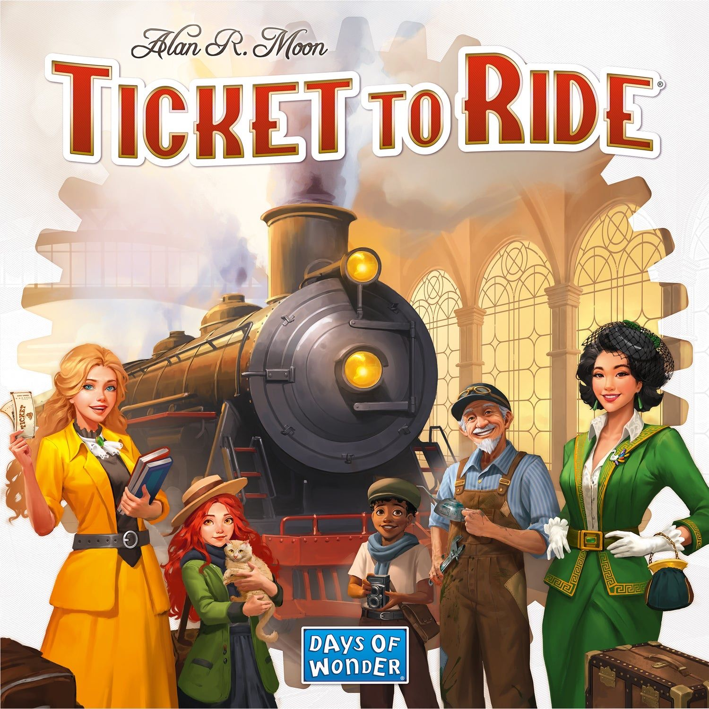

If you want the **best board games for families** in 2026, this guide focuses on the games that actually work for real family nights: titles with easy rules, broad age appeal, manageable playtimes, and enough depth that adults enjoy playing too. Start with **[Ticket to Ride](https://boardgamegeek.com/boardgame/9209)**, **[Ghost Fightin’ Treasure Hunters](https://boardgamegeek.com/boardgame/146312)**, **[Azul](https://boardgamegeek.com/boardgame/230802)**, **[Forbidden Island](https://boardgamegeek.com/boardgame/65244)**, and **[Zombie Kidz Evolution](https://boardgamegeek.com/boardgame/256952)**. Those five cover the sweet spot most families actually need. If your family likes laughing chaos, go lighter with [Pikit](https://boardgamegeek.com/boardgame/403258) or [Coconuts](https://boardgamegeek.com/boardgame/98386). If you want story and adventure, [Stuffed Fables](https://boardgamegeek.com/boardgame/233312) and [The Adventures of Robin Hood](https://boardgamegeek.com/boardgame/326494) are excellent. If you want strategy that still feels welcoming, [Tower Up](https://boardgamegeek.com/boardgame/393307), **Carcassonne**, and **Wingspan** are terrific next-step picks.

## Quick Picks

Here’s the short version for busy parents, gift buyers, and anyone trying to pick one box that will actually get played:

- **Best overall family board game:** [Ticket to Ride](https://boardgamegeek.com/boardgame/9209)  
  Easy to teach, satisfying to play, still great after dozens of sessions.

- **Best cooperative family game:** [Ghost Fightin’ Treasure Hunters](https://boardgamegeek.com/boardgame/146312)  
  One of the most reliably fun co-ops for mixed ages.

- **Best for younger kids (ages 5-7):** [Forbidden Island](https://boardgamegeek.com/boardgame/65244)  
  Simple teamwork, clear goals, and a real sense of adventure.

- **Best for families who want something modern:** Tower Up  
  A newer family favorite with snappy turns and strong replay value.

- **Best quick game after dinner:** Pikit  
  Fast, funny, colorful chaos in a small package.

- **Best legacy-style family game:** [Zombie Kidz Evolution](https://boardgamegeek.com/boardgame/256952)  
  Brilliant if your kids love unlocking new stuff over time.

- **Best strategy game for families:** [Azul](https://boardgamegeek.com/boardgame/230802)  
  Beautiful, tactile, and much deeper than it first appears.

  One of the rare math games that is actually fun.

- **Best story-driven game:** Stuffed Fables  
  Bedtime-story energy, but with real stakes and great table presence.

  Silly monkey catapults. Instant crowd-pleaser.

## What Makes a Great Family Board Game?

Before getting into the individual recommendations, it helps to define what this list is actually prioritizing.

The best family games are not just “easy.” Plenty of easy games are dull after two plays. The games that last are the ones that hit a few key things at once:

- **Simple rules**
- **Fast turns**
- **No early elimination**
- **Enough depth for adults**
- **A theme kids can latch onto**
- **A playtime that fits real life**, usually 15 to 60 minutes

That last point matters more than people admit. A family game can be brilliant, but if it takes 40 minutes to explain and two hours to finish, it is going to lose to pizza, TV, or bedtime. The games below are the ones I’d actually pull off the shelf for a real family night.

## [Ticket to Ride](https://boardgamegeek.com/boardgame/9209)

### Why it still deserves its crown

- **BGG rating:** 7.4  
- **Players:** 2-5  
- **Play time:** 30-60 minutes  
- **Typical price:** $35-$55

There is a reason **Ticket to Ride** keeps showing up whenever people ask for the best board games for families. It is the rare modern classic that works for almost everyone. On your turn, you draw cards, claim train routes, and try to connect cities on the map. That is basically the whole teach. Five minutes in, everyone gets it.

What makes it special is how cleanly it scales. Kids can focus on “I want to connect Chicago to New Orleans,” while adults start reading the board, blocking routes, and timing big turns. It never feels mean in the ugly way some family games do, but it has just enough tension to matter. That balance is hard to nail, and Ticket to Ride absolutely nails it.

## [Ghost Fightin’ Treasure Hunters](https://boardgamegeek.com/boardgame/146312)

### The co-op I recommend most to mixed-age families

- **BGG rating:** 7.2  
- **Players:** 2-4  
- **Play time:** 30 minutes  
- **Typical price:** $25-$35

If you told me I could only keep one cooperative kids-and-adults game, **Ghost Fightin’ Treasure Hunters** would be very high on the list. It is energetic, funny, and surprisingly tense. The setup is pure kid bait: you are racing through a haunted house, collecting treasures, while ghosts keep popping up and making everything worse.

The genius here is the pacing. Bad stuff happens fast enough that everyone stays engaged, but not so fast that the game feels cruel. Kids can contribute meaningful choices, adults stay invested, and the whole thing builds toward a genuinely exciting finish. A lot of family co-ops are “good for kids.” This one is just flat-out fun.

The moment that sells it is when a hallway starts filling with ghosts, everyone scrambles to coordinate, and one player barely clears a room before it becomes a disaster zone. You get that delicious cooperative panic without the misery of a punishing strategy game.

## [Forbidden Island](https://boardgamegeek.com/boardgame/65244)

### The best gentle introduction to cooperative gaming

- **BGG rating:** 6.8  
- **Players:** 2-4  
- **Play time:** 30 minutes  
- **Typical price:** $20-$25

Staying with cooperative games for a moment, **Forbidden Island** has been a gateway family co-op for years, and it still earns that spot. You work together to collect treasures and escape an island that is literally sinking beneath your feet. That theme lands immediately with kids. Flooding tiles, racing to save key locations, and pulling off a dramatic helicopter escape gives the game a real sense of adventure.

One of my favorite things about Forbidden Island is how readable it is. Younger players can look at the board and understand the danger. This tile is sinking. That treasure is at risk. We need to get over there. That clarity makes cooperative discussion much smoother than in games where the threat is abstract.

It also has a nice side benefit for early readers. Research around family use has pointed out that kids engage with tile names and card text in a natural way, which is exactly the sort of stealth learning I like in family games.

## [Zombie Kidz Evolution](https://boardgamegeek.com/boardgame/256952)

### The game that gets kids asking for “one more round”

- **BGG rating:** 7.0  
- **Players:** 2-4  
- **Play time:** 5-15 minutes  
- **Typical price:** $20-$30

If your family likes the feeling of progress, **Zombie Kidz Evolution** is a slam dunk. On paper, it is a simple co-op about defending a school from zombies and locking the gates before things get out of control. In practice, it is one of the smartest family designs of the last several years because it evolves as you play.

You start with very basic rules. Then you unlock envelopes, stickers, and new twists over multiple sessions. That “what do we get next?” energy is powerful, especially with kids. It turns a small cooperative game into an ongoing event.

The thing I love most here is how efficiently it creates excitement. A full game can be over in 10 minutes. Lose? Reset and try again. Win? Great, maybe you unlock something. It fits real family life better than sprawling campaign games that demand a whole evening.

## [Azul](https://boardgamegeek.com/boardgame/230802)

### Beautiful, tactile, and sneakily sharp

- **BGG rating:** 7.7  
- **Players:** 2-4  
- **Play time:** 30-45 minutes  
- **Typical price:** $30-$40

If your family prefers competition to cooperation, **Azul** is one of the best next stops. It is one of those games that wins people over before the rules even start. The chunky tiles look great, feel great, and make the game instantly inviting. That matters for family gaming. Table presence is not superficial when you are trying to get kids, grandparents, and skeptical spouses to sit down together.

The rules are approachable: draft colored tiles, complete rows, and build your mosaic for points. But the game has bite. Every pick changes what is available for everyone else, and the penalties for taking too much can sting. That makes Azul a terrific fit for families with older kids who are ready for a little more decision-making.

What makes it special is the mix of calm and tension. It looks serene. It is not always serene. The table can get very quiet as somebody realizes the exact tile they need is about to vanish. Then comes the dramatic sigh when they are forced to take a pile they cannot fully use.

## [Stuffed Fables](https://boardgamegeek.com/boardgame/233312)

### A storybook adventure that actually feels warm and memorable

- **BGG rating:** 7.6  
- **Players:** 2-4  
- **Play time:** 60-90 minutes  
- **Typical price:** $45-$70

Not every family favorite needs to be short and abstract, though. **Stuffed Fables** is the family story game I most often recommend when people want something richer than a standard co-op. You play as stuffed animals protecting a child from nightmares and creeping dangers, and the game leans hard into that bedtime-story mood. It is sweet, a little spooky, and surprisingly heartfelt.

[Mechanically](/posts/mechanic-deep-dive-hidden-roles/), it uses dice-driven action and scenario-based adventures in a storybook format. That means it is less elegant than Ticket to Ride and definitely more fiddly to set up. But if your family wants narrative and character, Stuffed Fables gives you something most family games cannot: emotional texture.

There is a reason many families prefer it to **Mice & Mystics**. It is easier to connect with immediately. The theme is intimate. Everyone understands the fantasy of brave plush guardians heading into danger for a sleeping child.

## [The Adventures of Robin Hood](https://boardgamegeek.com/boardgame/326494)

### For families ready for a bigger, richer shared adventure

- **BGG rating:** 7.5  
- **Players:** 2-4  
- **Play time:** 60 minutes  
- **Typical price:** $40-$55

If your family likes that sense of unfolding story but wants something aimed a bit older, **The Adventures of Robin Hood** is one of the most inventive family co-ops in this space. Instead of giving you a static board and a pile of standard missions, it lets the board itself evolve. New elements appear, stories unfold through a book, and your choices shape how the campaign feels.

For families with older kids, this is the kind of game that can create real memory-making sessions. You are not just “trying to win.” You are sneaking through Sherwood, helping villagers, dodging guards, and building a shared tale. It has that lovely storybook quality where each session feels like another chapter.

What I appreciate is that it avoids becoming rules soup. There is enough novelty to keep you curious, but it stays approachable compared to many campaign games aimed at hobbyists. That matters for a family recommendation.

## [Pikit](https://boardgamegeek.com/boardgame/403258)

### Fast, funny Kaiju chaos for all ages

- **BGG rating:** not established in the research data  
- **Players:** family-friendly, easy for mixed ages  
- **Play time:** quick sessions  
- **Typical price:** varies by retailer

For families who want something much lighter, **Pikit** is one of those newer family games that immediately makes sense once you see it on the table. Giant-monster energy, dice battles, bright art, quick turns. It is built for laughter first, and that is a compliment. A lot of family game lists lean so hard into “accessible” that they forget fun should be loud sometimes.

It is easy enough for younger players to grasp, but it still creates those little eruptions of excitement that make people ask for a rematch. That matters more than abstract design elegance when the goal is to entertain a wide age range after dinner.

The best Pikit moments are the swingy ones: a surprising roll, a ridiculous comeback, everyone reacting to some tiny monster disaster like it is the championship final. It has that party-game quality where the table energy becomes part of the game.

## [Garden Heist](https://boardgamegeek.com/boardgame/413416)

### Tactile, playful, and designed for repeat plays

- **BGG rating:** not established in the research data  
- **Players:** family-friendly  
- **Play time:** quick  
- **Typical price:** varies

Along similar lines, [Garden Heist](https://boardgamegeek.com/boardgame/413416) is a great example of a family game understanding its audience. The chunky pieces matter. The box-as-house gimmick matters. The tactile hide-and-seek feel matters. Adults sometimes dismiss these things as presentation, but for kids, presentation is often the bridge to repeated play.

This game has been praised for exactly that reason: families replay it because the physical toy factor is strong and the core activity is funny. That is not trivial. There are many games with better systems that get played less often because they never create that instant “again!” reaction.

The moment that captures Garden Heist is a child physically leaning across the table, delighted by the pieces, while the whole family gets pulled into the silly tension of where things are hidden and how the plan might go wrong. It sounds simple because it is simple. That is the point.

## [Tower Up](https://boardgamegeek.com/boardgame/393307)

### A fresh family strategy game with broad appeal

- **BGG rating:** not established in the research data  
- **Players:** scalable across player counts  
- **Play time:** snappy family length  
- **Typical price:** varies

If you want to move back toward strategy, **Tower Up** has been getting a lot of love as a family game of the year type pick, and the appeal is easy to understand. It has some of that **Ticket to Ride** magic: approachable turns, satisfying spatial decisions, and enough tactical play that adults stay fully engaged.

That “works at every player count” point is a big deal. Many family games are really good at three and awkward at five, or fine with kids but flat with adults. Tower Up’s reputation so far suggests a smoother all-around package, which is exactly what most families need.

What makes it stand out is that it seems to hit the sweet spot between gateway and gamer. New players can enjoy building and claiming space. More experienced players can think a few turns ahead and find clever opportunities. That is the zone where family games become long-term shelf staples.

## [Carcassonne](https://boardgamegeek.com/boardgame/822)

### The tile-laying classic that grows with your family

- **BGG rating:** 7.4  
- **Players:** 2-5  
- **Play time:** 30-45 minutes  
- **Typical price:** $30-$40

Another excellent strategy step-up is **Carcassonne**. It remains one of the best family board games because it does something magical: it looks simple, teaches quickly, and keeps revealing more depth as players improve. On your turn, place a tile, maybe place a meeple, and slowly build a shared landscape of cities, roads, monasteries, and farms.

The shared board is the hook. Kids love watching the map grow. Adults enjoy the tactical decisions around where to commit meeples and when to steal or share points. It creates little stories naturally. This city got absurdly huge. That road went nowhere. Somebody turned a peaceful field into a major scoring battle.

That emergent storytelling is why Carcassonne has remained such a staple in community recommendations. It feels alive in a way many point-salad family games do not.

## [Wingspan](https://boardgamegeek.com/boardgame/266192)

### A gorgeous next-step family game for older kids and adults

- **BGG rating:** 8.1  
- **Players:** 1-5  
- **Play time:** 40-70 minutes  
- **Typical price:** $45-$65

For families ready for something richer, **Wingspan** is a strong next-step option. I would not call **Wingspan** a universal family game in the same way Ticket to Ride is. I would call it one of the best family games for households with older kids, teens, and adults who want something a little richer. You are building habitats, playing birds, and creating an engine that gets stronger over the course of the game.

The reason it works so well for many families is that the turns are intuitive once you start. Play a bird, gain food, lay eggs, draw cards. The bird theme does a lot of lifting here too. It is educational in the best possible way: not forced, just naturally interesting. Kids start reading bird powers. Adults start admiring the art. Everybody likes the egg components.

## [Sushi Go Party!](https://boardgamegeek.com/boardgame/192291)

### The easiest recommendation for big family tables

- **BGG rating:** 7.4  
- **Players:** 2-8  
- **Play time:** 20 minutes  
- **Typical price:** $20-$30

If your family gatherings are bigger, louder, and more chaotic, **Sushi Go Party!** is a fantastic choice. It is a drafting game, which sounds more intimidating than it is. Everyone picks one card from their hand, reveals, then passes the rest. Build sets, score points, and laugh when your perfect plan gets disrupted.

This game shines because turns are simultaneous. That means almost no downtime, which is gold for family gaming. The cute art helps, but the real strength is pace. It keeps everyone involved and rarely overstays its welcome.

The “Party!” version is especially good because it lets you mix and match menus, which boosts replay value and lets you tailor complexity. That flexibility is exactly what family shelves need.

The classic Sushi Go moment is watching someone gleefully collect a scoring combo while another player realizes the card they needed just got passed away. It is quick, light tension done right.

## How to Choose

**If you have younger kids:** Start with [Zombie Kidz Evolution](https://boardgamegeek.com/boardgame/256952) or [Ghost Fightin' Treasure Hunters](https://boardgamegeek.com/boardgame/146312). Both are cooperative, so nobody loses, and the rules click fast.

**If you want fewer arguments:** Choose co-ops like [Forbidden Island](https://boardgamegeek.com/boardgame/65244) or [Stuffed Fables](https://boardgamegeek.com/boardgame/233312). Playing together instead of against each other changes the mood completely.

**If you want strategy without overwhelming anyone:** Pick [Azul](https://boardgamegeek.com/boardgame/230802), [Carcassonne](https://boardgamegeek.com/boardgame/822), or [Ticket to Ride](https://boardgamegeek.com/boardgame/9209). Simple rules, real decisions.

**If your family likes stories and imagination:** Go with [The Adventures of Robin Hood](https://boardgamegeek.com/boardgame/326494) or [Stuffed Fables](https://boardgamegeek.com/boardgame/233312). Both deliver genuine narrative moments.

**If you need a game that works with grandparents too:** Best bets are [Sushi Go Party!](https://boardgamegeek.com/boardgame/192291) and [Ticket to Ride](https://boardgamegeek.com/boardgame/9209). Intuitive, quick to teach, and nobody feels left behind.

