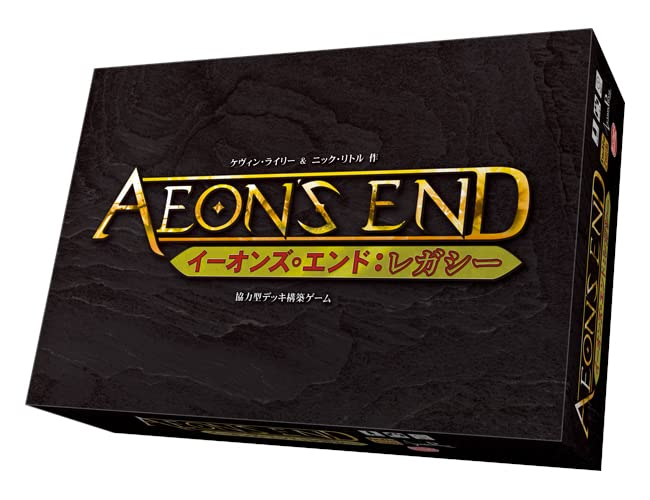
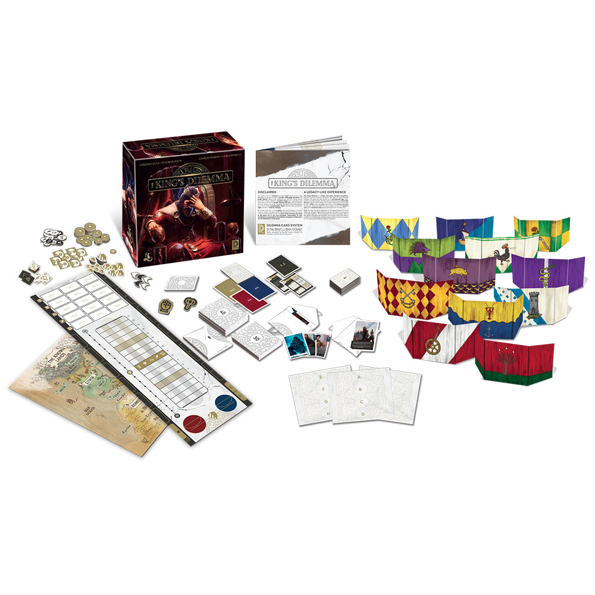

If you’re searching for the **best legacy board games**, the short answer is this: **[Pandemic Legacy: Season 1](https://boardgamegeek.com/boardgame/161936)** is still the benchmark, but it’s far from the only great choice in 2026. The best legacy and campaign board games are the ones that make your group care about what happens next, whether that means tearing up cards in panic, naming a favorite character, or staring at the board after a session because the world now looks permanently different.

This guide ranks the strongest legacy and legacy-adjacent campaign games to play in 2026, then helps you figure out which one actually fits your group. If you want the cream of the crop, start with Pandemic Legacy: Season 1, Betrayal Legacy, Aeon’s End: Legacy, Frosthaven, and Clank! Legacy. If you want the full ranked guide, with who each game is actually for and which ones justify the commitment, you’re in the right place.

## Quick Picks

If you don’t want to read 4,000 words before choosing a box, here are my fast recommendations.

- **Best overall legacy game:** [Pandemic Legacy: Season 1](https://boardgamegeek.com/boardgame/161936)
- **Best for spooky story lovers:** [Betrayal Legacy](https://boardgamegeek.com/boardgame/240196)
- **Best deckbuilding legacy game:** [Aeon's End: Legacy](https://boardgamegeek.com/boardgame/241451)
- **Best fantasy campaign epic:** [Frosthaven](https://boardgamegeek.com/boardgame/295770)
- **Best for families and mixed-skill groups:** [Clank! Legacy: Acquisitions Incorporated](https://boardgamegeek.com/boardgame/266507)
- **Best if you want narrative over systems:** [The King's Dilemma](https://boardgamegeek.com/boardgame/245655)
- **Best dungeon crawler legacy:** [Gloomhaven: Jaws of the Lion](https://boardgamegeek.com/boardgame/291457) if you want campaign feel with less commitment, [Gloomhaven](https://boardgamegeek.com/boardgame/174430) if you want the full mountain
- **Best one-vs-many legacy game:** [Risk Legacy](https://boardgamegeek.com/boardgame/105134)
- **Best for groups who love app integration and puzzles:** [My City](https://boardgamegeek.com/boardgame/295486) for lighter play, [Charterstone](https://boardgamegeek.com/boardgame/197376) for engine-building permanence
- **Best for people who think they don’t like legacy games:** [My City](https://boardgamegeek.com/boardgame/295486)

Before the ranking, one quick note: “legacy” and “campaign” get mixed together all the time. I’m including both here, because people searching for the best legacy board games usually want the same thing: **a game that evolves over multiple sessions and gives your group a real sense of progression**. Some of these involve stickers, destroyed cards, and permanent changes. Others are campaign games with less literal permanence but the same emotional payoff.

## What Makes a Great Legacy Board Game?

A great legacy game does three things.

### It makes your choices feel permanent

The best legacy designs create tension because every decision matters. Which city do you protect? Which character gets upgraded? Which faction do you trust? Permanent consequences create stories your group will remember years later.

### It gives your group something to anticipate

The envelope on the table matters. The secret compartment matters. The next chapter matters. Great legacy games turn “Want to play a board game?” into “Can we please do one more session?”

### It evolves without collapsing under its own gimmick

This is where some legacy games fall short. A sticker on a board is not enough. The system has to stay fun after the novelty wears off. The best ones reveal new mechanisms, deepen strategy, and make earlier decisions echo later in the campaign.

With that in mind, here are the legacy and campaign board games I’d actually recommend in 2026.

## 1. [Pandemic Legacy: Season 1](https://boardgamegeek.com/boardgame/161936)

**BGG rating:** 8.5  
**Players:** 2-4  
**Play time:** 60 minutes  
**Typical price:** around $70-$90

This is still the king. Not because it was first, and not because people are nostalgic about it, but because it remains one of the cleanest examples of what legacy gaming can do. Pandemic Legacy: Season 1 takes the familiar co-op structure of Pandemic and turns every month of the campaign into a rising spiral of dread, adaptation, and group ownership. It is brilliantly paced. New systems appear exactly when they should. The pressure escalates in a way that feels earned. By the back half of the campaign, your board tells a story only your group could have created.

What makes it special is how efficiently it transforms a very accessible co-op into something deeply personal. You’re not just curing diseases anymore. You’re protecting cities you’ve invested in, relying on characters you’ve upgraded, and trying to recover from mistakes that now live on the map forever.

It’s for almost anyone who has a regular group of two to four players and wants a true legacy experience. You don’t need to be a hobby veteran. In fact, this is one of the easiest legacy games to recommend to newer players because the core rules are so approachable.

The moment that captures why it’s great is the first time your table opens a box after a crushing loss and realizes the game is not just reacting to your performance, it’s reshaping the whole campaign around it. That feeling is electric.

## 2. [Clank! Legacy: Acquisitions Incorporated](https://boardgamegeek.com/boardgame/266507)

**BGG rating:** 8.6  
**Players:** 2-4  
**Play time:** 90-120 minutes  
**Typical price:** around $90-$120

Clank! Legacy is one of my favorite answers for groups who want a legacy game that stays playful. Where Pandemic Legacy builds tension through crisis, Clank! Legacy builds momentum through discovery, jokes, map changes, deck upgrades, and the constant temptation to push your luck one room too far.

At its core, it’s still Clank. You’re building a deck, sneaking into danger, grabbing loot, and trying not to get roasted on the way out. The legacy campaign layers in branching story beats, permanent upgrades, custom cards, and evolving locations in a way that feels generous instead of fiddly. It keeps giving your group new toys.

What makes it special is the tone. A lot of campaign games lean grim, apocalyptic, or ultra-serious. Clank! Legacy remembers that a campaign can be funny, breezy, and still [mechanic](/posts/mechanic-deep-dive-hidden-roles/)ally satisfying. It also leaves you with a playable copy at the end, which matters more than people admit when you’re spending this much on a game.

This is for groups who like medium-weight strategy, table banter, and a campaign that doesn’t feel emotionally exhausting. It’s especially good for mixed groups where some players want meaningful progression and others mostly want to laugh and pull off ridiculous turns.

My favorite Clank! Legacy moment is when a seemingly throwaway story choice suddenly changes a future setup and everyone at the table realizes, “Wait, we did this.” That sense of shared authorship is the whole appeal of legacy gaming.

## 3. [Betrayal Legacy](https://boardgamegeek.com/boardgame/240196)

**BGG rating:** 8.0  
**Players:** 3-5  
**Play time:** 45-90 minutes  
**Typical price:** around $70-$100

Betrayal Legacy takes the pulpy haunted-house chaos of Betrayal at House on the Hill and does the smartest possible thing with it: it turns your sessions into a family saga. Characters live, die, inherit, and haunt the story across generations. The result is messy in the best way. This is not a precision Euro. It’s a horror serial where the house remembers everything.

What makes it special is narrative continuity. Standard Betrayal already excels at creating stories people retell later, but Betrayal Legacy gives those stories consequences. A room isn’t just a room anymore. An event isn’t just a weird surprise. It becomes part of your group’s version of the house.

It’s for players who value theme, drama, and table talk over perfect balance. If your group enjoys emergent storytelling and doesn’t mind some swingy outcomes, this can be an absolute event game. If your group hates randomness, this will be a rough fit.

The moment that sells Betrayal Legacy is when someone draws a card or enters a room and the whole table reacts not because of the immediate effect, but because of what that element meant three sessions ago. That callback magic is something only a good legacy game can really deliver.

## 4. [Aeon's End: Legacy](https://boardgamegeek.com/boardgame/241451)

**BGG rating:** 8.4  
**Players:** 1-4  
**Play time:** 60 minutes  
**Typical price:** around $65-$85

Aeon’s End was already one of the best co-op deckbuilders around, and the legacy version turns it into a wonderfully structured progression game. You build your own breach mage over the course of the campaign, unlocking new tools, upgrading abilities, and facing increasingly nasty threats. It’s one of the most satisfying “watch your character grow” arcs in the genre.

What makes it special is how naturally the legacy format fits the system. Aeon’s End already has a strong sense of escalation through market choices, spell combos, and boss-specific problem solving. Legacy gives those decisions continuity. You’re not just tuning a deck for one fight. You’re shaping a mage over time.

This is for players who like cooperative strategy, card play, and meaningful customization. It’s especially good if your group wants a campaign game without the sprawling setup and teardown of a giant dungeon crawler. Solo players also get a lot from it.

A perfect Aeon’s End: Legacy moment is when a mage build that seemed awkward two sessions earlier suddenly clicks because of a new upgrade, and your table goes from barely surviving to chaining together a brilliant sequence of turns. It feels earned, not scripted.

## 5. [Frosthaven](https://boardgamegeek.com/boardgame/295770)

**BGG rating:** 8.8  
**Players:** 1-4  
**Play time:** 30-120 minutes  
**Typical price:** around $180-$250

Frosthaven is not a casual recommendation. It is enormous, demanding, expensive, and absolutely worth considering if your group wants the biggest campaign commitment in modern board gaming. This is the sequel to [Gloomhaven](/posts/gloomhaven-a-deep-dive-review/), and while it’s technically more campaign than pure legacy, it absolutely belongs in this conversation because of its persistent world changes, character progression, unlocks, and long-form sense of place.

What makes it special is depth. Tactical combat is excellent, but Frosthaven also expands the settlement layer, scenario variety, and broader campaign structure. It feels like living in a harsh frontier where every success strengthens your options and every setback costs you.

This is for dedicated groups who want a hobby inside the hobby. If your crew meets regularly, enjoys crunchy tactical play, and likes optimizing characters between sessions, Frosthaven can become the center of your game nights for months. If your group struggles to finish even short campaigns, do not start here.

The Frosthaven moment I keep coming back to is the first time your group returns from a brutal scenario, manages the outpost phase, unlocks something surprising, and realizes the game is not just a chain of fights. It’s a world with rhythm, memory, and consequences.

## 6. [The King's Dilemma](https://boardgamegeek.com/boardgame/245655)

**BGG rating:** 7.9  
**Players:** 3-5  
**Play time:** 45-60 minutes  
**Typical price:** around $70-$90

The King’s Dilemma is one of the most fascinating legacy-adjacent designs ever published because the real game is not resource management or combat. It’s negotiation, hypocrisy, and long-term political theater. Each player represents a noble house trying to steer the kingdom while also quietly serving private ambitions. Every session asks you to vote on problems, fund outcomes, and deal with the fallout.

What makes it special is social tension. This game creates the kind of table talk people hope for when they buy heavily narrative games. Alliances form, promises get broken, and noble speeches are followed by deeply selfish decisions. It can feel like a fantasy council drama where everyone is smiling while setting traps.

It’s for groups who love roleplay, debate, and meta-strategy. It is not for players who want tactical board presence or constant mechanical novelty. The box is mostly cards and consequences.

The specific moment that defines The King’s Dilemma is when a player gives an impassioned speech about protecting the realm, convinces the table to support a policy, then quietly scores points because the “good” outcome happened to align perfectly with their house agenda. Everyone laughs, groans, and starts taking notes. That’s the game.

## 7. [Gloomhaven](https://boardgamegeek.com/boardgame/174430)

**BGG rating:** 8.6  
**Players:** 1-4  
**Play time:** 60-120 minutes  
**Typical price:** around $120-$180

Gloomhaven changed the campaign board game landscape. Its card-driven combat remains one of the best tactical systems in the genre, and the campaign structure, retirement system, sealed content, and evolving world create a persistent sense of discovery that still feels impressive years later.

What makes it special is how much game there is here without relying on dice-chucking chaos. Every turn is a puzzle. Every card played has timing implications. Character classes feel distinct, and unlocking a new one still ranks among the most exciting moments in modern hobby gaming.

This is for players who want a serious campaign and don’t mind admin, setup, and rules overhead. It rewards commitment. It also asks for it constantly.

The moment that captures Gloomhaven is retiring a beloved character. You’ve learned their rhythm, upgraded their deck, built strategies around them, and now the campaign tells you it’s time to let them go and open something new. That mix of loss and excitement is pure campaign magic.

## 8. [Gloomhaven: Jaws of the Lion](https://boardgamegeek.com/boardgame/291457)

**BGG rating:** 8.5  
**Players:** 1-4  
**Play time:** 30-120 minutes  
**Typical price:** around $35-$50

If Gloomhaven is the intimidating epic, Jaws of the Lion is the smart recommendation for most people. It takes the same core combat DNA and packages it in a more approachable campaign with an excellent tutorial, lower cost, and far less setup pain. For many groups, this is the better purchase.

What makes it special is accessibility without dumbing things down. The early scenarios teach the game in stages, and by the time you’re making tough card decisions and coordinating with teammates, it feels like you’ve climbed into a genuinely rich system rather than a beginner box.

It’s for players who are curious about campaign dungeon crawlers but don’t want to commit to a hundred-scenario behemoth on day one. It’s also great for couples and smaller groups.

The Jaws of the Lion moment I love is that point around scenario three or four where everyone at the table suddenly “gets” the hand management puzzle. Turns become cleaner, combos become intentional, and what first looked like a complicated dungeon crawler reveals itself as a beautifully tense efficiency game.

## 9. [Charterstone](https://boardgamegeek.com/boardgame/197376)

**BGG rating:** 7.2  
**Players:** 1-6  
**Play time:** 45-75 minutes  
**Typical price:** around $60-$80

Charterstone is a more divisive pick than the games above, but it deserves a spot in a definitive guide because when it works for a group, it really works. This is a worker-placement legacy game where players build up a shared village over a campaign, unlocking spaces, adding rules, and gradually turning a sparse board into a bustling engine-building puzzle.

What makes it special is the physical growth of the board. Few legacy games communicate progression as clearly. Your village becomes a visual record of your campaign, and that tactile sense of building something together is deeply appealing.

It’s for groups who prefer lower-conflict Euro-style play and want a lighter legacy experience than the usual apocalypse, dungeon crawl, or horror story. It’s especially good for players who like watching systems layer in gradually.

The caveat is that Charterstone can feel a bit too gentle, and some groups find the campaign arc less dramatic than the genre’s best. Still, the moment where a newly unlocked building suddenly changes everyone’s priorities and makes the village feel alive is very satisfying.

## 10. [Risk Legacy](https://boardgamegeek.com/boardgame/105134)

**BGG rating:** 7.4  
**Players:** 3-5  
**Play time:** 30-90 minutes  
**Typical price:** around $50-$70

Risk Legacy matters. Even now, after years of more elaborate campaign games, it remains one of the boldest and most elegant demonstrations of what permanence can do to a familiar design. This is still Risk at heart: area control, attacks, alliances, grudges. But legacy modifications transform it into something far more personal and far more memorable.

What makes it special is how directly it weaponizes table history. Territories gain names. Factions evolve. Rules shift. Scars stay on the map. The game thrives on rivalry in a way cooperative legacy games simply can’t replicate.

It’s for competitive groups who enjoy diplomacy, trash talk, and the idea that one session’s betrayal might shape the next five. It is not for players who already dislike Risk’s conflict and swinginess, because the legacy additions don’t erase that DNA.

The signature Risk Legacy moment is writing on the board for the first time. It feels absurdly transgressive. Then, a few sessions later, that named continent or scarred city becomes central to an argument, a revenge play, or a desperate final stand. Suddenly the gimmick becomes memory.

## 11. [My City](https://boardgamegeek.com/boardgame/295486)

**BGG rating:** 7.8  
**Players:** 2-4  
**Play time:** 30 minutes  
**Typical price:** around $30-$40

My City is proof that a legacy game does not need to be huge, expensive, or rules-heavy to be excellent. This is a polyomino tile-laying game from Reiner Knizia, and it delivers one of the most approachable campaign experiences in the hobby. Sessions are short, rules are simple, and the campaign introduces twists at a pace that keeps the game fresh without overwhelming anyone.

What makes it special is elegance. Every chapter changes the puzzle just enough. You feel the board tightening, your habits adjusting, your planning improving. It’s legacy design at its most efficient.

This is the best recommendation for families, couples, newer hobby gamers, or anyone skeptical of the whole idea of “buy a game you can alter permanently.” It’s also a fantastic palate cleanser if your group usually plays heavier fare and wants something lighter between larger campaigns.

The moment that sells My City is when a tiny rules addition completely changes how you value space on your board. Suddenly a comfortable pattern no longer works, and everyone starts muttering over their tiles like the game just got twice as deep. For such a small box, it creates a lot of delight.

## 12. [SeaFall](https://boardgamegeek.com/boardgame/148261)

**BGG rating:** 6.9  
**Players:** 3-5  
**Play time:** 120 minutes  
**Typical price:** around $40-$70

SeaFall is the most controversial recommendation on this list, and I’m including it because a definitive guide should talk about the famous swings, not pretend they don’t exist. Designed by Rob Daviau after Pandemic Legacy, SeaFall aimed for a grand competitive campaign of exploration, trade, combat, and discovery on an evolving map. Its ambition is undeniable.

What makes it special, at least at its best, is the sense of mystery. Few games have opened with this much promise. Setting sail into unknown waters, naming islands, uncovering secrets, and gradually changing the world can be thrilling.

But this is also where the criticism matters. SeaFall can feel uneven, with pacing issues and systems that don’t always support the wonder it’s chasing. Some groups bounce off hard. Others find a fascinating, flawed epic that still creates unforgettable stories.

It’s for adventurous groups who enjoy discovering odd, ambitious designs and don’t mind rough edges. I would not recommend it as your first legacy game.

The SeaFall moment people remember fondly is often an early reveal that makes the map suddenly feel larger and stranger than expected. The problem is keeping that feeling alive. When it works, it’s exciting. When it doesn’t, you’ll feel the drag.

## 13. [Jurassic World: The Legacy of Isla Nublar](https://boardgamegeek.com/boardgame/352697)

**BGG rating:** 7.8  
**Players:** 2-4  
**Play time:** 90-150 minutes  
**Typical price:** around $90-$120

For groups who want spectacle, dinosaurs, and a campaign that leans hard into theme, Jurassic World: The Legacy of Isla Nublar is an easy game to notice and a surprisingly solid one to keep on your shortlist. It spans multiple eras of the franchise and asks players to build, protect, and survive on an island that you already know is not exactly a stable workplace.

What makes it special is presentation and theme integration. This is one of those campaign games where the setting does a lot of emotional heavy lifting. If your group likes Jurassic Park and Jurassic World, the campaign gets free momentum from that built-in affection.

It’s for fans of cinematic adventure who want something more approachable than a massive dungeon crawler. The systems are not as razor-sharp as the very best legacy titles, but the package is strong and the story beats land if the theme grabs you.

The standout moment is any session where your careful planning collapses because a dinosaur situation suddenly escalates across the island. Legacy games are great at making your previous decisions matter. Dinosaurs are great at reminding you that control is temporary.

## 14. [Ultimate Werewolf Legacy](https://boardgamegeek.com/boardgame/239188)

**BGG rating:** 7.3  
**Players:** 8-16  
**Play time:** 60 minutes  
**Typical price:** around $25-$35

Most legacy recommendations focus on campaign co-ops and medium-heavy hobby games, so it’s worth making room for something different. Ultimate Werewolf Legacy takes social deduction and gives it continuity, roles that evolve, and a town history that changes over time. That’s a very unusual pitch, and for the right group, it’s a blast.

What makes it special is how it turns a party-style deduction game into a recurring drama. Instead of each session being disposable, players become invested in the town, in recurring role interactions, and in the bizarre stories that emerge when suspicion and memory stack up.

This is for larger groups who already enjoy Werewolf-style games and have a moderator or at least a group willing to embrace the format. It’s obviously less universal than Pandemic or Clank, but it fills a niche no other major legacy game really covers.

The defining moment is when a player’s reputation from previous sessions affects a current vote even before any evidence appears. In a normal social deduction game, that would just be table meta. In Ultimate Werewolf Legacy, it becomes part of the campaign’s actual identity.

## 15. [Vampire: The Masquerade - Heritage](https://boardgamegeek.com/boardgame/300072)

**BGG rating:** 7.7  
**Players:** 2-4  
**Play time:** 30-120 minutes  
**Typical price:** around $60-$90

Vampire: The Masquerade - Heritage is one of the more intriguing narrative card-driven legacy games of the last few years. It blends hand management, tableau-style development, and branching narrative in a centuries-spanning story of vampire lineage, politics, and identity. It is moodier and more intimate than many campaign games, which helps it stand out.

What makes it special is atmosphere. A lot of legacy games are about systems first and story second. Heritage puts lineage and narrative framing front and center, and that gives the campaign a very different emotional texture.

It’s for players who enjoy narrative card games, gothic themes, and campaign choices that feel more personal than tactical. If your group wants crunchy combat, look elsewhere. If you want intrigue and story progression, this is a compelling option.

The moment that captures its appeal is when a seemingly minor narrative decision echoes generations later in your tableau and available options. That long shadow of consequence is exactly what legacy gaming should do well.

## The Best Legacy Board Games Ranked

If you want the ranking in a clean list, here’s where I land in 2026:

1. [Pandemic Legacy: Season 1](https://boardgamegeek.com/boardgame/161936)  
2. [Clank! Legacy: Acquisitions Incorporated](https://boardgamegeek.com/boardgame/266507)  
3. [Betrayal Legacy](https://boardgamegeek.com/boardgame/240196)  
4. [Aeon's End: Legacy](https://boardgamegeek.com/boardgame/241451)  
5. [Frosthaven](https://boardgamegeek.com/boardgame/295770)  
6. [The King's Dilemma](https://boardgamegeek.com/boardgame/245655)  
7. [Gloomhaven](https://boardgamegeek.com/boardgame/174430)  
8. [Gloomhaven: Jaws of the Lion](https://boardgamegeek.com/boardgame/291457)  
9. [Charterstone](https://boardgamegeek.com/boardgame/197376)  
10. [Risk Legacy](https://boardgamegeek.com/boardgame/105134)  
11. [My City](https://boardgamegeek.com/boardgame/295486)  
12. [Jurassic World: The Legacy of Isla Nublar](https://boardgamegeek.com/boardgame/352697)  
13. [Vampire: The Masquerade - Heritage](https://boardgamegeek.com/boardgame/300072)  
14. [Ultimate Werewolf Legacy](https://boardgamegeek.com/boardgame/239188)  
15. [SeaFall](https://boardgamegeek.com/boardgame/148261)  

That ranking mixes pure quality with recommendation confidence. SeaFall is not “better” than several games below it in raw ambition, but it is much harder to recommend. My City is lower only because it’s lighter, not because it’s less skillful at what it does.

Now that the ranking is clear, the more practical question is how to choose among them.

## How to Choose the Right Legacy Board Game

This is where most “best legacy board games” lists stop too early. The best legacy game is not just the one with the highest rating. It’s the one your group will actually finish.

### Choose by group reliability

If your group struggles to meet consistently, do not buy Frosthaven first. Pick My City, Jaws of the Lion, or Pandemic Legacy: Season 1. A shorter campaign finished is better than a giant campaign abandoned after four sessions.

### Choose by tolerance for rules overhead

- **Low overhead:** My City, Pandemic Legacy: Season 1
- **Medium overhead:** Clank! Legacy, Betrayal Legacy, Charterstone
- **High overhead:** Gloomhaven, Frosthaven

A great legacy campaign can still die if setup feels like homework.

### Choose by tone

- **Tense co-op:** Pandemic Legacy: Season 1, Aeon’s End: Legacy
- **Funny adventure:** Clank! Legacy
- **Spooky drama:** Betrayal Legacy
- **Political narrative:** The King’s Dilemma
- **Epic fantasy:** Frosthaven, Gloomhaven
- **Family-friendly puzzle:** My City
- **Competitive conflict:** Risk Legacy

Tone matters more than people think. The best mechanics in the world won’t save a campaign if your group doesn’t enjoy the vibe.

### Choose by player count

Some games are much more flexible than others.

- **Best at 2 players:** Pandemic Legacy: Season 1, Aeon’s End: Legacy, Jaws of the Lion, My City
- **Best at 3-4 players:** Clank! Legacy, Frosthaven, Gloomhaven
- **Best at 5 players:** The King’s Dilemma, Betrayal Legacy
- **Best for large groups:** Ultimate Werewolf Legacy

Always buy for the count you actually play, not the count you imagine you’ll gather someday.

### Choose by budget

Legacy games can get expensive fast.

- **Budget-friendly:** My City ($30-$40), Jaws of the Lion ($35-$50), Ultimate Werewolf Legacy ($25-$35)
- **Mid-range:** Pandemic Legacy, Aeon’s End: Legacy, Charterstone, Risk Legacy
- **Premium:** Clank! Legacy, Frosthaven, Gloomhaven, Jurassic World

If you divide the cost by number of sessions, many campaign games are great value. But the upfront price still matters.

### Choose by how much permanence you want

Some players love tearing cards and writing on boards. Others hate it.

- **High permanence:** Pandemic Legacy, Risk Legacy, Charterstone
- **Moderate permanence:** Betrayal Legacy, Clank! Legacy
- **Lower physical permanence, still campaign-heavy:** Gloomhaven, Frosthaven, Jaws of the Lion

If the idea of “ruining” components bothers someone in your group, that should be a real part of the decision.

## Legacy vs Campaign Games: What’s the Difference?

This matters if you’re shopping carefully.

### Legacy games

Legacy games usually include **permanent changes**. You’ll place stickers, mark components, destroy cards, unlock sealed content, and alter future sessions in irreversible ways.

Examples here: Pandemic Legacy, Risk Legacy, Betrayal Legacy, Charterstone, My City.

### Campaign games

Campaign games usually focus on **persistent progression across sessions**, but not always through permanent physical modification. Characters level up, story branches, new scenarios unlock, and the world changes, even if the box remains more reusable.

Examples here: Frosthaven, Gloomhaven, Jaws of the Lion.

For most players, the distinction matters less than the result. You want a game that creates continuity and memorable consequences.

## FAQ: Best Legacy Board Games

### What is the best legacy board game in 2026?

For most groups, **[Pandemic Legacy: Season 1](https://boardgamegeek.com/boardgame/161936)** is still the best legacy board game overall. It’s accessible, brilliantly paced, and consistently memorable.

### What is the best legacy game for beginners?

**[My City](https://boardgamegeek.com/boardgame/295486)** if you want something light and easy to teach.  
**[Pandemic Legacy: Season 1](https://boardgamegeek.com/boardgame/161936)** if you want the full classic legacy experience.  
**[Gloomhaven: Jaws of the Lion](https://boardgamegeek.com/boardgame/291457)** if you want a campaign dungeon crawler that won’t crush you with complexity on session one.

### What is the best two-player legacy board game?

**Aeon’s End: Legacy**, **Pandemic Legacy: Season 1**, and **My City** are my top picks at two. Jaws of the Lion is also excellent.

### Are legacy board games replayable?

Usually not in the traditional sense. Many legacy games are designed for a single main campaign. Some leave behind a playable version after completion, especially **Clank! Legacy** and **Charterstone**. Campaign games like **Gloomhaven** and **Frosthaven** offer more replay flexibility through branching and class variety.

### Are legacy board games worth it?

Yes, if your group actually finishes them. A great legacy campaign can deliver some of the most memorable experiences in tabletop gaming. But if your group rarely reconvenes, a shorter or more modular campaign game is the smarter buy.

### What if my group hates permanent destruction?

Pick a campaign-heavy game with less irreversible component alteration, like **Jaws of the Lion**, **Gloomhaven**, or **Frosthaven**. You’ll still get progression and continuity without as much “rip this card in half” anxiety.

## Final Buying Advice

If you want the safest recommendation, buy **[Pandemic Legacy: Season 1](https://boardgamegeek.com/boardgame/161936)**.

If you want the most fun per session with a lighter tone, buy **[Clank! Legacy: Acquisitions Incorporated](https://boardgamegeek.com/boardgame/266507)**.

If your group wants a giant fantasy campaign to live in, buy **[Frosthaven](https://boardgamegeek.com/boardgame/295770)** or start smaller with **[Gloomhaven: Jaws of the Lion](https://boardgamegeek.com/boardgame/291457)**.

If you want something accessible, affordable, and surprisingly brilliant, buy **[My City](https://boardgamegeek.com/boardgame/295486)**.

Across this guide, the standouts were the games that combine strong systems with real continuity: Pandemic Legacy for overall excellence, Clank! Legacy for a lighter and funnier campaign, Frosthaven and the Gloomhaven line for long-form fantasy commitment, The King’s Dilemma for social narrative, and My City for accessibility. And if what you really want is a legacy game that proves why this format became such a big deal in the first place, it’s still Pandemic Legacy. Few games make a table feel so invested, so quickly, with so little wasted motion. Years later, I can still remember specific cities, specific characters, and specific disasters from campaigns I played. That’s the standard. That’s why people keep searching for the best legacy board games. They’re looking for a box that turns game night into a shared history. The games above are the ones most likely to do it.