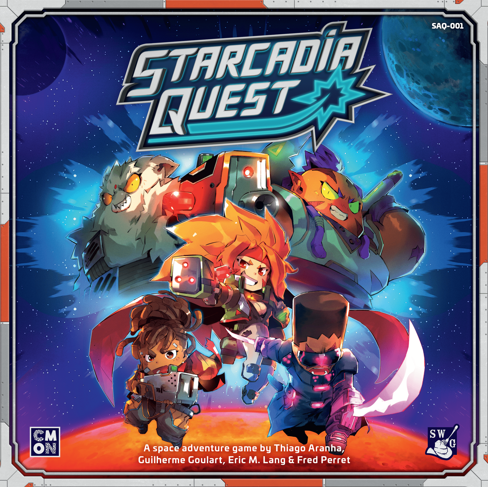
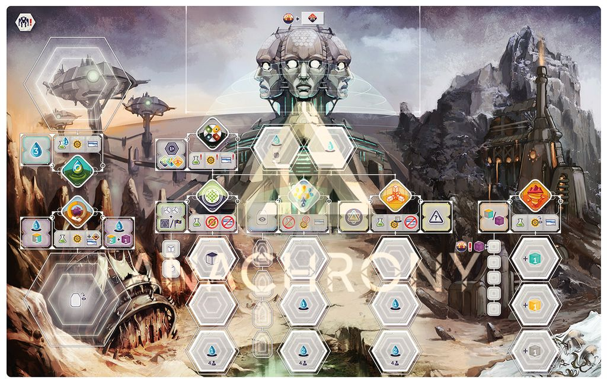
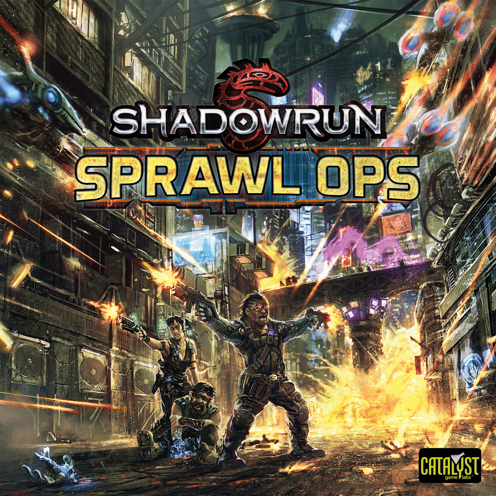

# Theme Park: Cyberpunk & Sci-Fi Board Games
*Neon-lit futures and dystopian tech*

Cyberpunk and sci-fi are catnip for board games because the genre does two things absurdly well. First, it gives [designers](/posts/designer-spotlight-vlaada-chvatil/) permission to go big. Megacorps. time travel. exosuits. galaxy-spanning factions. Second, it makes mechanisms feel like more than mechanisms. Deckbuilding becomes a desperate loot run through a hostile ship. Worker placement becomes sending people into powered suits because the world outside is trying to kill them. Hand management becomes a hacking duel where one side is bluffing ICE and the other is praying the run isn’t a trap.

That range is exactly what this article is about. The picks below move from an easy-entry sci-fi gateway game to mid-weight and heavyweight standouts, then close with a hidden gem, a sample game-night lineup, and the one title that best captures the cyberpunk ideal.

That’s why this theme works so well at every weight. You can teach it in ten minutes. You can also spend three hours staring at a tech tree and loving every second.

So if you want a tour from easy-entry space chaos to brain-melting future misery, this is the lineup.

## Gateway pick: accessible sci-fi that still feels like a story

The best gateway sci-fi game is [Clank! In! Space!](https://boardgamegeek.com/boardgame/333536).

Yes, I’m planting a flag here, even with the weirdness in the verified BGG data pointing to an expansion entry. The numbers we have are exact, so here they are exactly: BGG rating **8.01/10 (300 ratings)**, weight **2.50/5**, **2-4 players**, **60 min**, published **2021**.

What matters at the table is simple. This game gets people into sci-fi mode immediately. You’re sneaking through a spaceship, grabbing loot, making too much noise, and trying not to get mulched by the system before you escape. That “clank” mechanism is still terrific because it turns your own deck into a liability. Every greedy move feels funny right up until it absolutely isn’t.

This is why it beats [Starcadia Quest](https://boardgamegeek.com/boardgame/257193) as a first stop. [Starcadia Quest](https://boardgamegeek.com/boardgame/257193) is charming, but minis skirmish rules and scenario friction ask a little more from new players. [Clank! In! Space!](https://boardgamegeek.com/boardgame/333536) gets to the good stuff faster. Draw cards. move. buy nonsense. panic.

BGG forum regulars love arguing about whether Clank games are too swingy. Sure. They are. That’s part of the point. This isn’t a sterile efficiency contest. It’s a sci-fi heist where somebody always gets too cute and leaves one turn too late.

If you want a gateway alternative with more [retro](/posts/retro-review-pandemic-2008/) hacker grime, [Edge City](https://boardgamegeek.com/boardgame/5347) deserves a nod. It’s old, mean, and hard to find, but there’s a certain delight in that early-’90s cyberpunk aggression.

## Mid-weight picks: where the theme gets teeth

Once the gateway end of the spectrum is covered, the next question is which games make the setting feel sharper and more consequential. This is where the theme stops being just fun dressing and starts driving the tension.

The definitive cyberpunk game, full stop, is [Android: Netrunner](https://boardgamegeek.com/boardgame/124742).

Published in **2012**, it sits at **7.89/10 from 31,250 ratings**, weight **3.42/5**, overall rank **#82**, for **2 players**, in about **45 min**. Those numbers tell one story. The actual table experience tells the louder one. This game absolutely nails the fantasy of corp versus runner. One side is building remote servers, setting traps, advancing agendas, and projecting confidence. The other is probing, bluff-calling, face-checking ICE, and trying not to get their brain liquefied.

This is not generic “cyber” wallpaper pasted onto a card game. Every action feels like part of the fiction. That’s why [Android: Netrunner](https://boardgamegeek.com/boardgame/124742) still has people posting wistful Reddit comments years after it went out of print. The asymmetry is brilliant. The tension is brutal. Few games make hidden information feel this personal.

It also beats lighter cyberpunk options because it has actual bite. [Shadowrun: Sprawl Ops](https://boardgamegeek.com/boardgame/253087) has style and a fun cyberpunk-fantasy mashup, but [Android: Netrunner](https://boardgamegeek.com/boardgame/124742) is the one that turns every credit and every click into a tiny psychological war. The downside is obvious. The learning curve is real. A first teach can feel like being handed a datajack and a migraine at the same time. Worth it.

If you want a more colorful, more chaotic mid-weight sci-fi pick, [Starcadia Quest](https://boardgamegeek.com/boardgame/257193) is a blast. It was published in **2020**, has a **7.33/10** rating from **1,041 ratings**, weight **2.67/5**, overall rank **#3008**, for **2-4 players**, in **60 min**. This game is what happens when a Saturday morning cartoon gets armed to the teeth. Crew upgrades are addictive, the campaign arc is breezy, and the whole thing has that CMON toybox appeal people either adore or roll their eyes at. I adore it more than I roll my eyes.

Still, if the question is “best at this weight for cyberpunk and sci-fi,” [Android: Netrunner](https://boardgamegeek.com/boardgame/124742) wins without much drama.

## Heavyweight picks: the future gets cruel

If the mid-weight games give the theme teeth, the heavyweights give it consequences. Here the systems get denser, the planning gets harsher, and the setting has more room to press on every decision.

For heavy sci-fi, the crown goes to [Anachrony](https://boardgamegeek.com/boardgame/185343).

Published in **2017**, it holds **8.04/10 from 21,365 ratings**, weight **4.00/5**, overall rank **#61**, for **1-4 players**, with a play time of **30-120 min**. This is the game I’d hand to someone who says, “I want a big sci-fi euro, but I also want the theme to matter.” Because in [Anachrony](https://boardgamegeek.com/boardgame/185343), it does.

The exosuits are not just table candy. They sell the whole premise. You are sending workers into a poisoned world, borrowing resources from the future, and trying to survive a catastrophe you already know is coming. That time-bending debt system is one of those mechanisms that makes hobby people light up mid-explanation. “Wait. I can take resources from my future self?” Yes. You can. Deal with the consequences later. Very on-brand for humanity.

This is where [Anachrony](https://boardgamegeek.com/boardgame/185343) edges past [Gaia Project](https://boardgamegeek.com/boardgame/220308) for me. [Gaia Project](https://boardgamegeek.com/boardgame/220308) is cleaner, more abstractly brilliant, and probably the stronger pure euro in a vacuum. But [Anachrony](https://boardgamegeek.com/boardgame/185343) feels like sci-fi in your bones. The faction agendas, the evacuation pressure, the shady ethics of cloning and survival. It has dramatic weight, not just [mechanical](/posts/mechanic-deep-dive-drafting/) weight.

That said, [Gaia Project](https://boardgamegeek.com/boardgame/220308) is still a monster. Also from **2017**, it carries an **8.35/10 from 31,041 ratings**, a fearsome **4.40/5** weight, overall rank **#13**, for **1-4 players**, in **60-150 min**. If your ideal sci-fi game is less “neon dystopia” and more “spreadsheet in space, but make it transcendent,” this is your drug. The faction asymmetry is wild, the tech tracks are delicious, and the puzzle is so tight it can feel almost solitary even with other people at the table. Some players love that. Some bounce off the icon soup and emotional temperature. Fair enough.

But if I’m picking one heavyweight for this theme, [Anachrony](https://boardgamegeek.com/boardgame/185343) gets the nod.

## Hidden gem: cyberpunk with rough edges and real personality

After the obvious headliners, there are still a couple of games worth mentioning because they do something messier and more specific with the theme.

The hidden gem pick is [Shadowrun: Sprawl Ops](https://boardgamegeek.com/boardgame/253087).

It’s not as elegant as the top-tier choices, and player elimination will irritate some groups immediately. Good. A cyberpunk game should have a little grime under its fingernails. What [Shadowrun: Sprawl Ops](https://boardgamegeek.com/boardgame/253087) does well is create emergent stories from team-building, mission timing, and that Shadowrun blend of chrome and magic. If your group already loves the setting, this lands harder than its reputation suggests.

There’s also [Human Interface](https://boardgamegeek.com/boardgame/229319), which gets talked about far less than the big names. It leans into co-op detective noir in a way that feels refreshingly different from the usual “shoot aliens, optimize engine, conquer planet” loop.

## The ultimate cyberpunk & sci-fi game night lineup

With the main picks in place, the easiest way to see how broad this theme can be is to imagine a full evening built around it.

If you want one evening that escalates beautifully, this is the playlist:

1. [Clank! In! Space!](https://boardgamegeek.com/boardgame/333536)  
   Start loose. Get people laughing. Let somebody make one spectacularly bad greedy decision.

2. [Android: Netrunner](https://boardgamegeek.com/boardgame/124742)  
   Then narrow the focus. Two players dive into the purest cyberpunk duel in the hobby while everyone else watches, comments, and starts backseat hacking.

3. [Starcadia Quest](https://boardgamegeek.com/boardgame/257193)  
   End with colorful mayhem. It’s energetic, fast enough, and doesn’t ask the table to finish the night by reading thirty icons on a tech board.

If your group is heavier and meaner, swap [Starcadia Quest](https://boardgamegeek.com/boardgame/257193) for [Anachrony](https://boardgamegeek.com/boardgame/185343), but that becomes less “theme night” and more “we live here now.”

## So what’s the ultimate cyberpunk & sci-fi board game?

Taken together, these picks cover a lot of ground: gateway chaos, mid-weight tension, heavyweight systems, and a few rougher-edged alternatives. But the article has been circling one answer the whole time.

It’s [Android: Netrunner](https://boardgamegeek.com/boardgame/124742).

Not the highest ranked. Not the heaviest. Not the easiest to find. Still the one.

Because cyberpunk is not just chrome art and hacking words in flavor text. It’s asymmetry, paranoia, systems of control, desperate runs, and the constant feeling that somebody richer than you has already built the trap. [Android: Netrunner](https://boardgamegeek.com/boardgame/124742) captures all of that in actual play, not just in lore blurbs and card names.

That’s the difference. A lot of sci-fi games are great games wearing a space helmet. [Android: Netrunner](https://boardgamegeek.com/boardgame/124742) is cyberpunk all the way down.