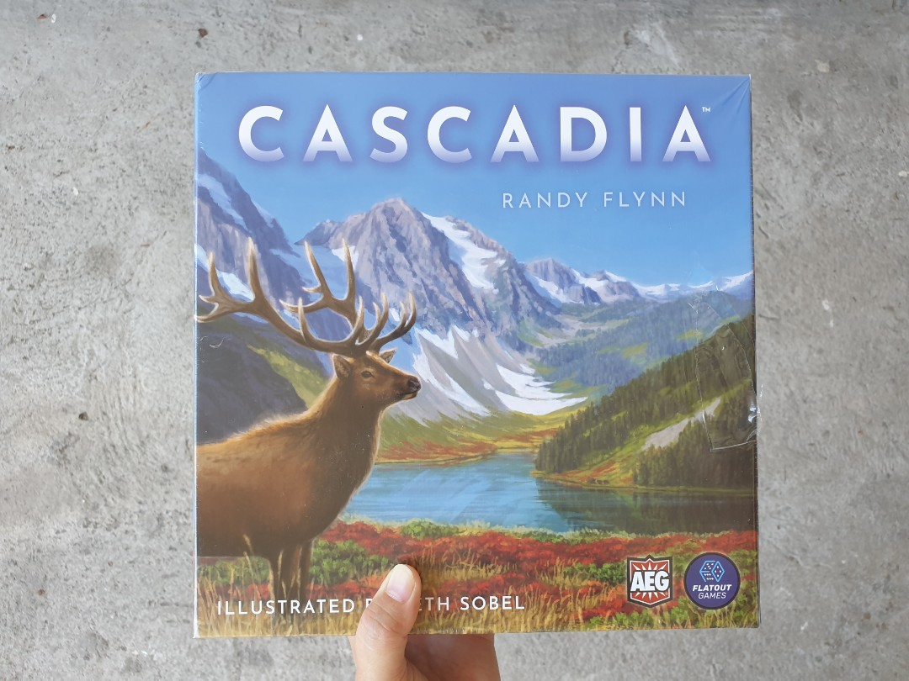
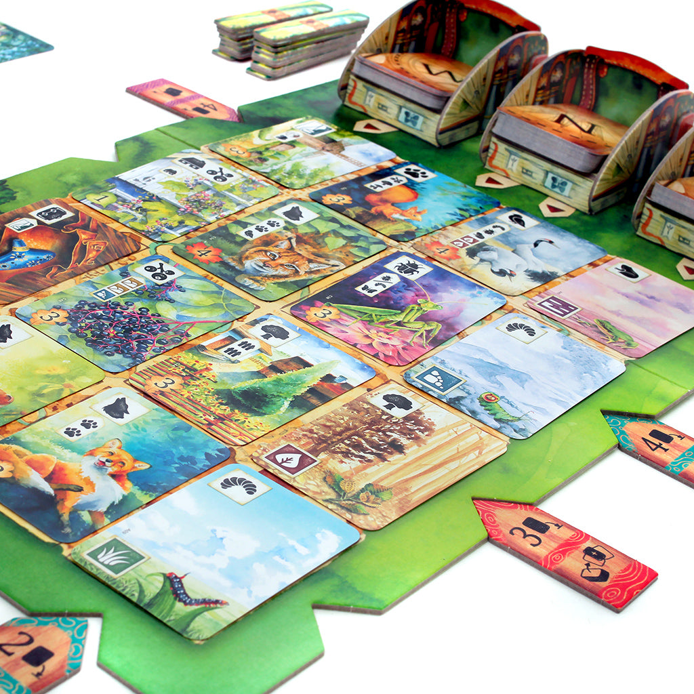
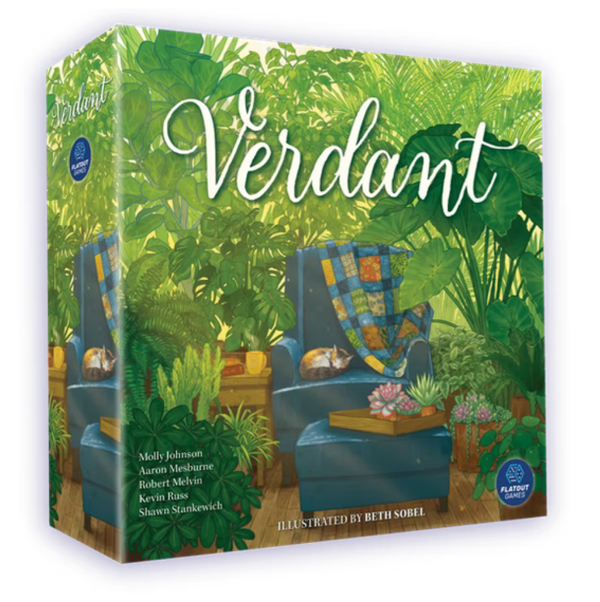

# Theme Park: Nature & Wildlife Board Games  
*The cozy end of board gaming*

There’s a reason nature games keep blowing up. They look inviting on a shelf, they’re easier to pitch to non-gamers than “industrial-era canal economics,” and the theme actually does work at the table. Animals, plants, habitats, migration, sunlight, ecosystems. These aren’t pasted-on ideas. They naturally become mechanisms.

Look, when a game asks you to build a forest, attract birds, or balance a habitat, your brain gets it immediately. You don’t need a 15-minute lore dump. You just start playing. And that matters.

Nature games also occupy a really nice corner of the hobby. They’re often beautiful without being precious, strategic without needing a spreadsheet, and competitive without feeling mean. Usually. Then [Photosynthesis](https://boardgamegeek.com/boardgame/218603/photosynthesis) shows up and reminds everyone that trees can be absolutely vicious.

This article looks at why the theme works so well, then moves from lighter gateway games into stronger mid-weight options, the heaviest thinker in the bunch, a hidden gem, and finally the question that hangs over all of them: which one is the ultimate nature and wildlife board game?

## Why this theme works so well in board games

Nature gives designers structure for free. Habitats want adjacency. Animals want conditions. Plants want growth cycles. Ecosystems want balance. That translates cleanly into tile-laying, tableau building, engine building, and spatial competition.

It also helps that nature themes soften the edges of game night. People who would never sit down for a war game will absolutely say yes to birds, parks, cats, or houseplants. I’ve seen this happen over and over. Put [Cascadia](https://boardgamegeek.com/boardgame/295947/cascadia) on the table and people lean in. Put a drab cube-pusher there instead and suddenly everyone needs a snack first.

But does that actually matter once the game starts? Yes. Because good nature games don’t just look nice. They create decisions that feel tied to the subject. Shade matters in [Photosynthesis](https://boardgamegeek.com/boardgame/218603/photosynthesis). Habitat matching matters in [Cascadia](https://boardgamegeek.com/boardgame/295947/cascadia). Bird powers in [Wingspan](https://boardgamegeek.com/boardgame/266192/wingspan) often echo real behaviors. That connection is why this theme has lasted instead of fading as a trend.

There’s also a practical design reason this theme keeps succeeding. Nature gives players visible goals without requiring them to memorize a setting bible. In [Cascadia](https://boardgamegeek.com/boardgame/295947/cascadia), if I tell a new player that salmon like to school and hawks prefer separation, they immediately understand the scoring tension. In [Wingspan](https://boardgamegeek.com/boardgame/266192/wingspan), putting a predator bird into your tableau and triggering a hunting power just feels right. That intuitive link between action and theme lowers the friction of learning, which is a huge deal if you actually host game nights instead of just ranking box covers on Reddit.

Nature themes also make passive information feel exciting. Bird facts in [Wingspan](https://boardgamegeek.com/boardgame/266192/wingspan) are not mechanically necessary, but they deepen the experience because the cards stop feeling like generic efficiency widgets. Same with the park art and location names in [Parks](https://boardgamegeek.com/boardgame/266524/parks). Same with the species and observation-book framing in [Meadow](https://boardgamegeek.com/boardgame/314491/meadow). You’re learning incidentally, and that gives the table something to talk about besides pure optimization. That matters more than hobby purists like to admit. Some groups want to compare scores. Other groups want to say, “Wait, that bird really does that?” and then pass the card around.

I also think this theme creates a rare kind of tension. It’s competitive, but it doesn’t always feel personal. In [Photosynthesis](https://boardgamegeek.com/boardgame/218603/photosynthesis), I can absolutely ruin your sunlight income by planting in the right lane, but it feels like ecological pressure, not direct aggression. That’s a big difference. It’s one reason these games work so well with mixed groups. People tolerate conflict better when it emerges from the system instead of from “I attack you because you’re winning.”

And here’s a tactical throughline across the whole genre. Nature games reward balance early and specialization late. In [Cascadia](https://boardgamegeek.com/boardgame/295947/cascadia), spreading yourself too thin across all five animals can leave you with a pretty map and a mediocre score, but hard-committing too early can trap you when the market dries up. In [Wingspan](https://boardgamegeek.com/boardgame/266192/wingspan), players who chase flashy bird powers without building a stable food or card economy usually stall out in round three. In [Verdant](https://boardgamegeek.com/boardgame/334065/verdant), if you collect rooms without thinking about light icons, your houseplants become decorative liabilities. The best nature games understand that ecosystems are interconnected, and they make you feel that at the decision level.

With that foundation in place, the games themselves sort naturally by weight.

## Gateway picks

If you want the cozy end of board gaming, this is where the magic starts.

### [Cascadia](https://boardgamegeek.com/boardgame/295947/cascadia)

This is the gateway winner. Full stop.

[Cascadia](https://boardgamegeek.com/boardgame/295947/cascadia) is a 1 to 4 player tile-laying ecosystem builder from 2021 that plays in 30 to 45 minutes. It’s sitting at an 8.2 BGG rating and rank #29 overall, which is wild for a game this approachable but also completely deserved.

Here’s the thing: [Cascadia](https://boardgamegeek.com/boardgame/295947/cascadia) does the hardest thing in game design. It makes simple turns feel meaningful. On your turn, you draft a habitat tile and an animal token, trying to create satisfying land clusters while also meeting changing wildlife scoring goals. That’s it. The teach is tiny. The decisions are not.

It beats [Azul](https://boardgamegeek.com/boardgame/230802/azul) for this theme because it gives pattern-building a real ecological identity instead of clean abstraction. It beats [Takenoko](https://boardgamegeek.com/boardgame/70919/takenoko) because the puzzle has more staying power, thanks to the variable wildlife scoring cards. Every game asks for slightly different priorities.

This is the game I’d hand to families, new gamers, and mixed groups without hesitation. It’s calm, clever, and prettier than it has any right to be. More importantly, it never talks down to the table.

### [Parks](https://boardgamegeek.com/boardgame/266524/parks)

[Parks](https://boardgamegeek.com/boardgame/266524/parks) is the breezier option. It plays 1 to 5 in 20 to 60 minutes, published in 2019, with a 7.7 BGG rating and rank #303 overall.

This one wins people over on presentation first, then keeps them with clean design. You move hikers down a trail, gather resources, take photos, and visit U.S. national parks. It has that outdoorsy road-trip energy that makes you want to pack a backpack immediately after the game.

Compared with [Qwirkle](https://boardgamegeek.com/boardgame/25669/qwirkle), [Parks](https://boardgamegeek.com/boardgame/266524/parks) actually gives those light decisions emotional texture. Compared with [Sushi Go!](https://boardgamegeek.com/boardgame/133473/sushi-go), it feels like a journey instead of a quick math exercise in cute packaging.

I don’t think it’s the strongest pure design in this whole category. I do think it’s one of the easiest nature games to love.

### [Meadow](https://boardgamegeek.com/boardgame/314491/meadow)

[Meadow](https://boardgamegeek.com/boardgame/314491/meadow) is for the people who want nature as observation rather than puzzle. It plays 1 to 4 in 60 to 90 minutes, from 2021, with a 7.9 rating and rank #169.

This game feels like paging through a field journal. You collect flowers, insects, birds, and other discoveries into a tableau, and the whole production leans hard into that art-book presentation. I love that about it. It understands that half the appeal of nature games is simply enjoying the subject.

It outdoes [Wingspan Asia](https://boardgamegeek.com/boardgame/366161/wingspan-asia) in accessibility and leaves [Res Arcana](https://boardgamegeek.com/boardgame/262712/res-arcana) behind on immersion. If your group likes relaxed tableau building and doesn’t need aggressive interaction, [Meadow](https://boardgamegeek.com/boardgame/314491/meadow) is a lovely pick.

### [Calico](https://boardgamegeek.com/boardgame/283155/calico)

[Calico](https://boardgamegeek.com/boardgame/283155/calico) is the cute one that quietly wrecks people.

It plays 1 to 4 in 30 to 45 minutes, published in 2020, rated 7.7 on BGG and ranked #245. You’re placing patch tiles on a quilt, trying to satisfy color and pattern goals while attracting cats and collecting buttons. Cozy? Yes. Forgiving? Absolutely not.

It beats [Patchwork](https://boardgamegeek.com/boardgame/163412/patchwork) for groups because it scales beyond two and gives the puzzle more personality. It also has more tension than a lot of buyers expect. Every tile feels loaded. Every “nice relaxing cat game” eventually turns into someone staring at the board like it insulted their family.

I say that with affection.

Once you move past gateway territory, the category gets even more interesting.

## Mid-weight picks

This is where nature games really start to sing. Enough mechanical depth to stay interesting. Still easy to get to the table.

### [Wingspan](https://boardgamegeek.com/boardgame/266192/wingspan)

This is the definitive middleweight nature game. The benchmark. The one everyone argues about because it got too popular, which is always the hobby’s funniest bad take.

[Wingspan](https://boardgamegeek.com/boardgame/266192/wingspan) is a 1 to 5 player engine-builder from 2019 that runs 40 to 70 minutes. It holds an 8.1 BGG rating and sits at #52 overall. More importantly, it earns that status at the table.

You’re attracting birds to forest, grassland, and wetland habitats, building an engine that improves food generation, egg laying, and card draw. Bird powers chain together. Habitat rows get stronger. End-of-round goals pull your attention in uncomfortable directions. It’s a smooth, satisfying machine.

And yes, it beats [Everdell](https://boardgamegeek.com/boardgame/199792/everdell) as a nature-themed medium-weight game. I know that debate. The BGG threads have done this to death. [Everdell](https://boardgamegeek.com/boardgame/199792/everdell) has gorgeous table presence and woodland charm, but it’s fantasy critters in a worker placement city. [Wingspan](https://boardgamegeek.com/boardgame/266192/wingspan) feels more rooted in actual wildlife, and its Automa solo mode is smoother too. It also edges [Terraforming Mars](https://boardgamegeek.com/boardgame/167791/terraforming-mars) if what you want is thematic purity without a sprawling sci-fi runtime.

I love this game because it meets people where they are. Bird nerds adore it. Engine-building fans find plenty to chew on. Solo players get a strong system. Newer hobbyists can grow into it. That range is rare.

Is it the most interactive game ever made? No. If your group needs constant table drama, look elsewhere. But for accessible strategy wrapped in real ornithology, [Wingspan](https://boardgamegeek.com/boardgame/266192/wingspan) is still the standard.

### [Verdant](https://boardgamegeek.com/boardgame/334065/verdant)

[Verdant](https://boardgamegeek.com/boardgame/334065/verdant) is a smart little bridge game. It plays 1 to 5 in 30 to 60 minutes, from 2021, with a 7.9 rating and rank #212.

Instead of wild habitats, it goes domestic. Houseplants, rooms, light requirements, and a tableau that gradually turns into a living indoor space. That sounds softer than [Wingspan](https://boardgamegeek.com/boardgame/266192/wingspan), but the puzzle is tighter than people expect.

It beats [Next Station: London](https://boardgamegeek.com/boardgame/352223/next-station-london) on thematic integration and has far more personality than [Santorini](https://boardgamegeek.com/boardgame/194655/santorini) if you’re specifically chasing nature-adjacent play. Best for plant collectors, solo challenge fans, and people who like their games tidy but not shallow.

If you want the sharper, more punishing side of the theme, that leads naturally to the heaviest game in this lineup.

## Heavyweight pick

### [Photosynthesis](https://boardgamegeek.com/boardgame/218603/photosynthesis)

I know, I know. Calling [Photosynthesis](https://boardgamegeek.com/boardgame/218603/photosynthesis) the heavyweight here will make some heavy-euro diehards roll their eyes. But within this lineup, this is the thinkiest, meanest, most spatially demanding game on the list.

It plays 2 to 4 in 30 to 60 minutes, came out in 2017, and holds a 7.7 rating with a #257 overall rank. You plant trees, grow them through stages, collect light points as the sun rotates around the board, and try not to get completely shaded out by your so-called friends.

This mechanism is brilliant. The rotating sun means the value of every position changes over time. A tree that helps you this round may hurt you next round. Plant too aggressively and you choke your own future. Play too passively and someone else takes the canopy. It feels botanical in a way most “nature” games only gesture at.

It surpasses Treehouse and even makes [Viticulture](https://boardgamegeek.com/boardgame/128621/viticulture) feel generic by comparison, because the central system actually *is* the theme. Not vibes. Not artwork. Rules.

The downside? This game can be quietly brutal, and families who expected a peaceful tree-growing activity sometimes discover they’ve brought home a sunlight-denial simulator. I love that. Some people do not.

Not every worthwhile pick in this space is a headliner, though.

## Hidden gem

My pick here is [Ecologies](https://boardgamegeek.com/boardgame/307110/ecologies).

It’s a 2020 gateway card game with 108 cards, supports up to 6 players, plays in about 30 minutes, and has a 7.5 BGG rating. You build trophic pyramids across 7 biomes using 77 real organisms, while managing disruptions that can destabilize the system.

That’s such a cool angle. Instead of “nature” as a cozy backdrop, [Ecologies](https://boardgamegeek.com/boardgame/307110/ecologies) treats ecosystems as relationships. Predator, prey, balance, collapse. It’s educational in the good way, where the lesson is embedded in play instead of stapled on afterward.

What makes [Ecologies](https://boardgamegeek.com/boardgame/307110/ecologies) worth spotlighting is that it approaches nature from the food-web angle instead of the now-standard “build a pretty habitat and score cleanly” angle. That changes the texture of play. You’re not just collecting animals because they’re cute or because a scoring card told you to. You’re trying to assemble a functioning trophic pyramid, and that means thinking about producers, herbivores, carnivores, and disruption in a way most light games never even attempt.

That sounds dry. It isn’t. The fun comes from how quickly the table starts reading ecosystems as systems rather than sets. One player starts stacking a biome efficiently, another gets hit by a disruption, and suddenly everyone sees how fragile the structure really is. That’s great design space for families and classrooms, but it also works for hobby gamers who want a filler with actual ideas in it. I’d much rather play something like this than another generic set collection game with fruit, gems, or medieval nonsense pasted on top.

It also fills a player-count niche that a lot of cozy nature games don’t. [Cascadia](https://boardgamegeek.com/boardgame/295947/cascadia) tops out at 4. [Meadow](https://boardgamegeek.com/boardgame/314491/meadow) tops out at 4. [Ecologies](https://boardgamegeek.com/boardgame/307110/ecologies) goes up to 6 and lands in about 30 minutes, which makes it useful in the real world. You know the situation. Six people are around, two are hobby regulars, one person says they “don’t really play games,” and someone else is still pouring drinks. This is the kind of title that can survive that room.

A small tactical note, because hidden gems deserve real analysis too. In games built around ecological chains, players often overvalue the flashy upper levels first. Predators look exciting. Top-of-pyramid cards feel powerful. But stable scoring usually comes from securing your foundation before competing for the sexy pieces. That’s true in [Ecologies](https://boardgamegeek.com/boardgame/307110/ecologies), and it’s part of why the design teaches its own lesson so effectively. Build the base, then reach upward. Weirdly profound for a compact card game.

If you want something even more tactile, [Planet](https://boardgamegeek.com/boardgame/252929/planet) deserves a nod because physically assembling habitats on a magnetic globe is one of those mechanisms that gets kids and adults leaning over the table in the same way. Shoutout too to [Bärenpark](https://boardgamegeek.com/boardgame/219513/barenpark) for being one of the most satisfying animal-themed tile layers around. But [Ecologies](https://boardgamegeek.com/boardgame/307110/ecologies) is my hidden-gem pick because it has a point of view. It isn’t just nature-themed. It’s about nature.

After all of that, there are really two ways to answer the “best” question: the best single game, and the best way to build a full night around the theme.

## The ultimate nature & wildlife game night lineup

If I’m curating one evening, three games, one theme, this is the playlist:

1. [Cascadia](https://boardgamegeek.com/boardgame/295947/cascadia)  
2. [Parks](https://boardgamegeek.com/boardgame/266524/parks)  
3. [Wingspan](https://boardgamegeek.com/boardgame/266192/wingspan)

That lineup works because it escalates beautifully. Start with the clean habitat puzzle of [Cascadia](https://boardgamegeek.com/boardgame/295947/cascadia). Move into the travel-and-collection charm of [Parks](https://boardgamegeek.com/boardgame/266524/parks). Finish with the richer engine-building arc of [Wingspan](https://boardgamegeek.com/boardgame/266192/wingspan). No game overstays its welcome, and the whole night feels cohesive.

The other reason this three-game lineup works is pacing. A good theme night should feel like an arc, not just three random boxes that happen to have leaves on the cover. [Cascadia](https://boardgamegeek.com/boardgame/295947/cascadia) is the perfect opener because it gets everyone into habitat-thinking mode without draining mental energy. You’re reading adjacency, planning for animal scoring, and making small tactical pivots based on the draft. It wakes up the table gently. No one is overwhelmed, but everyone is engaged.

Then [Parks](https://boardgamegeek.com/boardgame/266524/parks) shifts the emotional tone. It’s still accessible, but now the game has movement, timing pressure, and that satisfying sense of progressing down a trail. After a static spatial puzzle like [Cascadia](https://boardgamegeek.com/boardgame/295947/cascadia), that change matters. You don’t want three tableau games in a row or three tile-layers back-to-back. Variety keeps the night from blurring together. [Parks](https://boardgamegeek.com/boardgame/266524/parks) also gives the group a little more interaction through blocking and timing, which is a nice bridge before the richer engine-building decisions in [Wingspan](https://boardgamegeek.com/boardgame/266192/wingspan).

And [Wingspan](https://boardgamegeek.com/boardgame/266192/wingspan) is the closer because it asks for the most sustained planning. By that point, the table is already in the mood for nature-themed systems, and players are ready to invest in a longer payoff. You don’t start the night here unless you know your group is locked in. But as a finale, it lands beautifully.

If you want practical hosting advice, here’s mine. Serve [Cascadia](https://boardgamegeek.com/boardgame/295947/cascadia) first while people are settling in and still chatting. Put [Parks](https://boardgamegeek.com/boardgame/266524/parks) in the middle slot when everyone’s fully present but not yet tired. Save [Wingspan](https://boardgamegeek.com/boardgame/266192/wingspan) for after a short break, once snacks are refreshed and the table is clear. Nature games often have lovely table presence, but they also need space, especially [Wingspan](https://boardgamegeek.com/boardgame/266192/wingspan) once player tableaux start sprawling.

If your group skews more puzzle-heavy than engine-heavy, I’d swap [Parks](https://boardgamegeek.com/boardgame/266524/parks) for [Calico](https://boardgamegeek.com/boardgame/283155/calico). If they like interaction and nastier decisions, replace [Parks](https://boardgamegeek.com/boardgame/266524/parks) with [Photosynthesis](https://boardgamegeek.com/boardgame/218603/photosynthesis) and watch the mood go from “pleasant hike” to “I cannot believe you planted there.” But for the broadest crowd, [Cascadia](https://boardgamegeek.com/boardgame/295947/cascadia), [Parks](https://boardgamegeek.com/boardgame/266524/parks), and [Wingspan](https://boardgamegeek.com/boardgame/266192/wingspan) is the sweet spot. Clean teach, escalating depth, coherent theme. That’s a real curated night, not just a stack of recommendations.

## So which is the ultimate nature & wildlife board game?

My definitive #1 is [Wingspan](https://boardgamegeek.com/boardgame/266192/wingspan).

[Cascadia](https://boardgamegeek.com/boardgame/295947/cascadia) is cleaner. [Photosynthesis](https://boardgamegeek.com/boardgame/218603/photosynthesis) is more confrontational and mechanically daring. [Meadow](https://boardgamegeek.com/boardgame/314491/meadow) may be the prettiest expression of quiet observation. But [Wingspan](https://boardgamegeek.com/boardgame/266192/wingspan) is the complete package.

It has the broadest appeal, the strongest staying power, real thematic grounding, excellent solo support, and enough tactical and strategic depth to keep coming back. I’ve seen it land with birders, euro players, couples, solo gamers, and curious newcomers. That reach matters. So does the fact that it still feels good after the hype cycle.

Look, plenty of games have tried to claim this branch of the hobby. [Wingspan](https://boardgamegeek.com/boardgame/266192/wingspan) built the nest and stayed there.

If you want one nature game in your collection, that’s the pick. If you want the coziest starting point, grab [Cascadia](https://boardgamegeek.com/boardgame/295947/cascadia). If you want your forest to fight back, get [Photosynthesis](https://boardgamegeek.com/boardgame/218603/photosynthesis).

Let’s really stress-test that answer, because “ultimate” should mean more than “the one with the most hype.” To earn that spot, a game needs to clear four bars. It has to represent the theme well. It has to be mechanically satisfying after repeated plays. It has to work for a wide range of players. And it has to matter in the hobby beyond its release window. A lot of games hit two or three of those. Very few hit all four.

[Cascadia](https://boardgamegeek.com/boardgame/295947/cascadia) comes closest as a challenger because it is outrageously elegant. If your priority is purity of design, I’d understand putting it at number one. It teaches in minutes, plays fast, looks beautiful, and still gives experienced players enough room to optimize. But it lives in a narrower decision space. That’s not a flaw. It’s part of why it’s great. Still, after enough plays, you start to feel the contours of the puzzle more clearly.

[Photosynthesis](https://boardgamegeek.com/boardgame/218603/photosynthesis) has the opposite profile. It’s mechanically distinctive and deeply thematic, maybe the most mechanically thematic game in this whole group. But it’s also sharper-edged. Some players bounce off the indirect conflict or the spatial punishingness. I’ve seen first-timers realize halfway through that they planted themselves into a future drought and spend the rest of the game trying to recover. That’s compelling. It’s also a barrier.

[Meadow](https://boardgamegeek.com/boardgame/314491/meadow) and [Parks](https://boardgamegeek.com/boardgame/266524/parks) win on atmosphere, but they don’t have the same long-term mechanical ceiling. [Verdant](https://boardgamegeek.com/boardgame/334065/verdant) is clever and underrated, but it hasn’t had the same cultural staying power. [Calico](https://boardgamegeek.com/boardgame/283155/calico) is a fantastic puzzle, though I’d argue it’s more about precision and stress management than about the broader nature theme itself.

That leaves [Wingspan](https://boardgamegeek.com/boardgame/266192/wingspan), and here’s why it stays on top. It scales well across player types. It has a strong solo mode. It creates satisfying growth over the course of a play without becoming exhausting. It sparked interest far outside the usual hobby bubble. Most importantly, it still holds up after the discourse cooled down. That’s the real test. Plenty of games survive their release year. Fewer survive the backlash phase where the hobby decides something became too mainstream to be cool.

A tactical reason matters too. [Wingspan](https://boardgamegeek.com/boardgame/266192/wingspan) rewards skill without requiring perfect foresight. Good players know when to pivot habitats, when to value cheap birds over expensive splashy ones, and when round goals are bait. Newer players can still build a functional engine and feel smart. That gap is incredibly hard to design. It’s one reason the game keeps coming back to the table.

So yes, my answer stays the same. The ultimate nature and wildlife board game is [Wingspan](https://boardgamegeek.com/boardgame/266192/wingspan). Not because it’s flawless. Because it’s the one that best turns this theme into something welcoming, replayable, and memorable. That’s a harder achievement than people give it credit for.

Nature gaming is doing just fine.