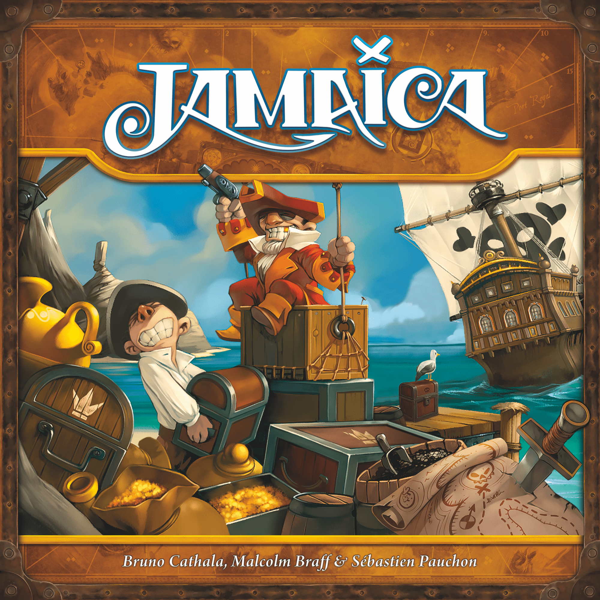

There's something universally compelling about pirate games. The promise of treasure, the open sea, a bit of treachery between friends — it's a theme that works at every weight class. Whether you want a quick filler to close out game night or an entire evening of plundering the Caribbean, there's a pirate game out there for your crew.

Here's a tour through the best the genre has to offer, ordered from lightest to heaviest.

---

## 🏴‍☠️ Jamaica — The Gateway Racer

*Image credit: Space Cowboys / GameWorks*

**Players:** 2–6 | **Time:** 30–60 min | **Weight:** 1.66/5 | **BGG Rating:** 7.06

[Jamaica](https://boardgamegeek.com/boardgame/28023/jamaica) is the pirate game you bring to a family gathering. It's a race around the island where players simultaneously select cards to load cargo, move forward, or — crucially — pick fights with whoever's on your space.

**Why it works:** The simultaneous card selection keeps downtime near zero, and the combat is just chaotic enough to create memorable moments without feeling punishing. Bruno Cathala co-designed it, which means it's mechanically tight despite its breezy exterior. The 2022 Space Cowboys edition is gorgeous, too — those miniature ships are a genuine table presence.

**Best for:** Families, gateway groups, anyone who wants pirate vibes without pirate complexity. Best at 5–6 players where the board gets crowded and the battles get personal.

---

## 💀 Skull King — The Trick-Taking Terror

*Image credit: Grandpa Beck's Games*

**Players:** 2–8 | **Time:** 30 min | **Weight:** 1.74/5 | **BGG Rating:** 7.53

[Skull King](https://boardgamegeek.com/boardgame/150145/skull-king) takes the bones of classic trick-taking (think Wizard or Oh Hell!) and wraps them in a pirate hierarchy that's both thematic and mechanically brilliant. Pirates beat Mermaids beat numbered cards — except when the Skull King himself shows up, and then the Mermaid captures *him*. It's rock-paper-scissors meets card counting.

**Why it works:** The simultaneous bidding creates delicious tension. You hold out your fist, count to three, and reveal how many tricks you'll take. Sometimes everyone bids high. Sometimes half the table bids zero. Either way, somebody's about to have a very bad round. At weight 1.74, it's barely heavier than Jamaica but delivers significantly more strategic depth per minute of play time.

**Best for:** Groups of 4–6 who want a proper game in 30 minutes. Excellent pub game, travel game, or "one more round" closer.

---

## 🌊 Forgotten Waters — The Narrative Voyage

*Image credit: Plaid Hat Games*

**Players:** 3–7 | **Time:** 120–240 min | **Weight:** 2.10/5 | **BGG Rating:** 7.73

[Forgotten Waters](https://boardgamegeek.com/boardgame/302723/forgotten-waters) isn't really a board game in the traditional sense. It's a choose-your-own-adventure book that happens to have a board and worker placement spots. An app narrates the story (with genuinely funny voice acting), and your crew collectively decides where to sail while individually pursuing ridiculous personal goals.

**Why it works:** This is the pirate game for people who don't care about optimising VP engines. It's about the moment your navigator decides to pet a mysterious sea creature instead of charting a safe course, or when your crew votes to detour to a haunted island because "it'll be fine." The semi-cooperative structure means you're all on the same ship, but you're absolutely sabotaging each other for personal glory.

**Best for:** Groups of 5 who love narrative games, laughing together, and don't mind a longer session. If your group loved Tales of the Arabian Nights or the Crossroads mechanic in Dead of Winter, this is your next purchase.

---

## 🏛️ Lost Ruins of Arnak — The Expedition With Edge

*Image credit: Czech Games Edition*

**Players:** 1–4 | **Time:** 30–120 min | **Weight:** 2.93/5 | **BGG Rating:** 8.08

[Lost Ruins of Arnak](https://boardgamegeek.com/boardgame/312484/lost-ruins-of-arnak) isn't *strictly* a pirate game — it's more Indiana Jones than Blackbeard — but the spirit of maritime exploration, uncharted islands, and ancient guardians puts it firmly in pirate-adjacent territory. And at BGG rank #30, it's comfortably the highest-rated game in this list.

**Why it works:** Arnak blends deck-building with worker placement in a way that feels genuinely fresh. Cards serve double duty — play them for their effect OR use them to fund worker placement actions. This creates agonising decisions every single turn. The research track adds a third dimension of progress that you simply can't ignore.

**Best for:** Gamers who want a meaty euro with an adventure theme. Solo players also get an excellent AI opponent. Best at 3 players where competition for exploration sites is tight but turns stay snappy.

---

## ⚓ Merchants & Marauders — The Sandbox Classic

*Image credit: Z-Man Games*

**Players:** 2–4 | **Time:** 180 min | **Weight:** 3.26/5 | **BGG Rating:** 7.39

[Merchants & Marauders](https://boardgamegeek.com/boardgame/25292/merchants-marauders) is the open-world pirate game. You choose a captain, pick up missions, trade goods between ports, upgrade your ship — or say sod it to legitimate commerce and start sinking everyone else. The Caribbean is your sandbox, and whether you play merchant or marauder is entirely up to you.

**Why it works:** Freedom. Pure, unstructured freedom. The game doesn't tell you to be a pirate — it gives you reasons *not* to be one (bounties, naval ships hunting you, loss of reputation) and then lets human nature do the rest. When someone finally snaps and attacks a merchant vessel, the table erupts. The combat system is gloriously swingy, the NPC naval patrols create genuine tension, and stashing your gold before someone sinks you is peak pirate anxiety.

**Best for:** Groups who love sandbox experiences, can handle 3 hours, and won't min-max the fun out of an emergent narrative game. The kind of group that creates stories, not optimises strategies.

---

## 🗡️ Dead Reckoning — The Modern Masterpiece

*Image credit: AEG*

**Players:** 1–4 | **Time:** 150 min | **Weight:** 3.44/5 | **BGG Rating:** 8.14

[Dead Reckoning](https://boardgamegeek.com/boardgame/276182/dead-reckoning) is what happens when you take the card-crafting innovation of Mystic Vale and apply it to a full pirate 4X game. You literally sleeve transparent cards over your crew members to upgrade them — giving your navigator better sailing or your gunner deadlier cannons. It's tactile, it's clever, and it's *satisfying* in a way that spreadsheet-style upgrades never are.

**Why it works:** The card-crafting makes every game feel different because your crew develops organically based on what upgrades you find. The area control layer means you're not just sailing in isolation — you're fighting over islands, establishing trade routes, and occasionally blowing your mate's frigate out of the water. At weight 3.44 it's the heaviest game here, but the mechanisms interlock so naturally that it never feels bloated.

**Best for:** Experienced gamers who want a pirate game with genuine strategic depth. If Merchants & Marauders is the sandbox, Dead Reckoning is the strategy game. Both are 3+ hours, but this one rewards long-term planning more than improvisation.

---

## Choosing Your Crew's Adventure

| Game | Weight | Time | Players | Vibe |
|------|--------|------|---------|------|
| Jamaica | 1.66 | 30–60 min | 2–6 | Family race night |
| Skull King | 1.74 | 30 min | 2–8 | Quick, vicious card game |
| Forgotten Waters | 2.10 | 2–4 hrs | 3–7 | Narrative comedy voyage |
| Lost Ruins of Arnak | 2.93 | 1–2 hrs | 1–4 | Euro with adventure skin |
| Merchants & Marauders | 3.26 | 3 hrs | 2–4 | Open-world sandbox |
| Dead Reckoning | 3.44 | 2.5 hrs | 1–4 | Strategic 4X |

The pirate theme is one of the most versatile in board gaming precisely because it covers so much ground — exploration, trade, combat, treachery, treasure. Whether you've got 30 minutes and six mates or an entire evening and a dedicated crew of four, there's a pirate game that'll make your table feel like the high seas.

Fair winds, captains. 🏴‍☠️
