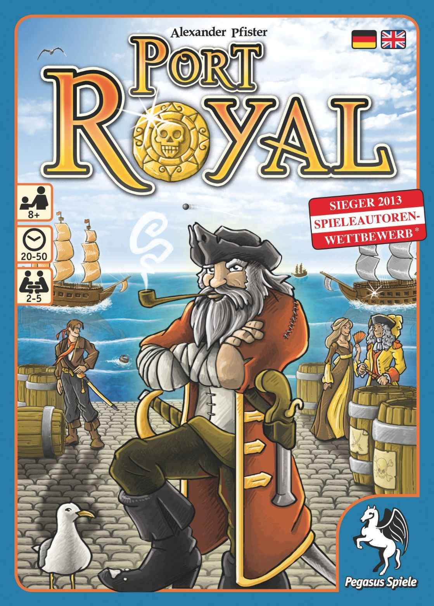
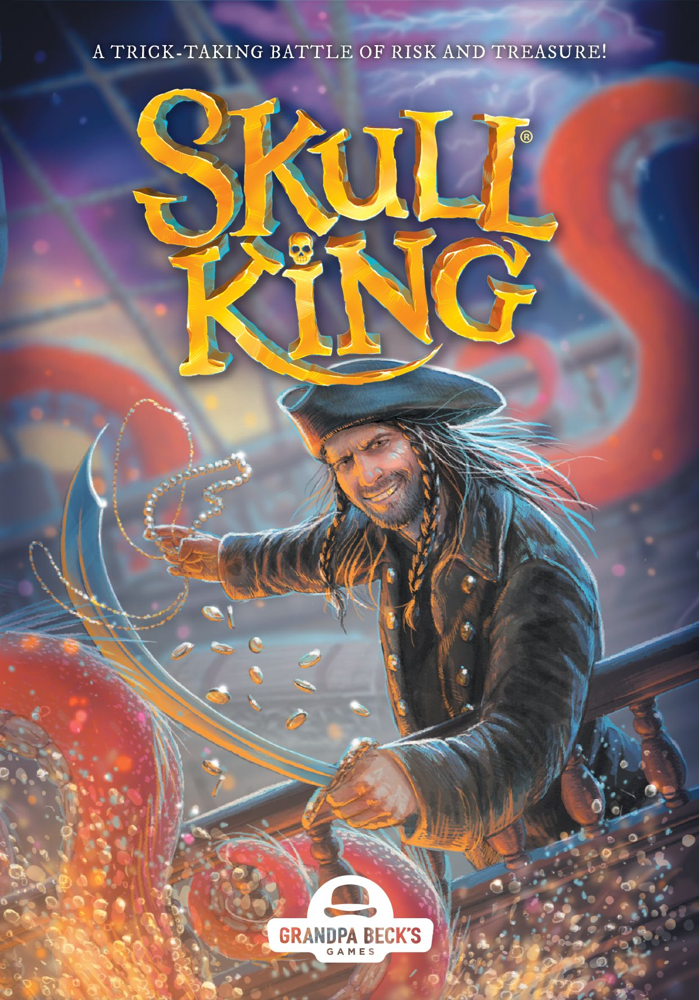
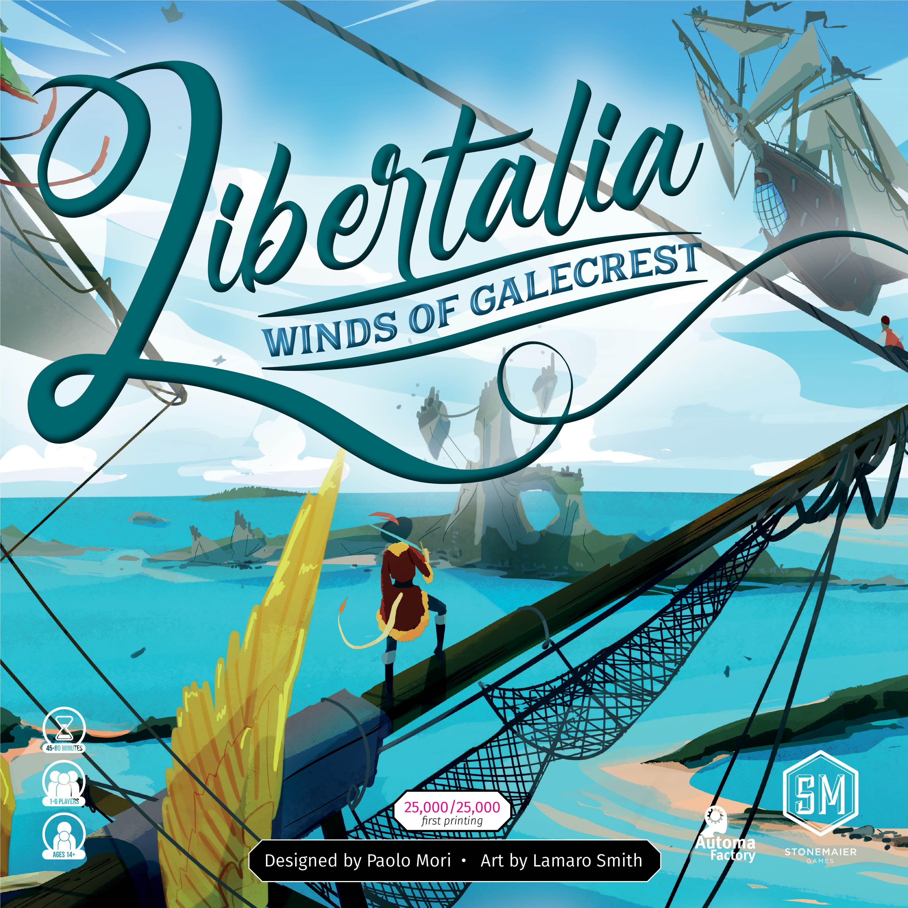
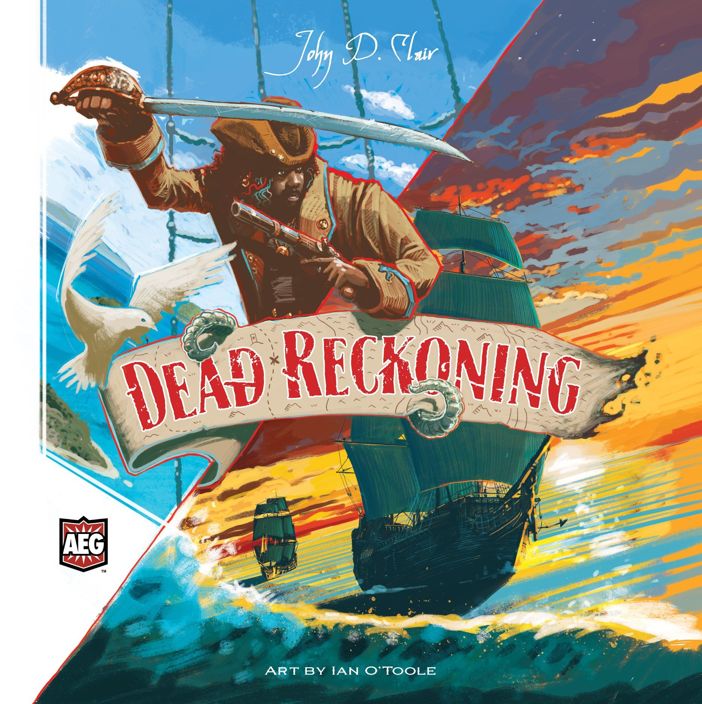
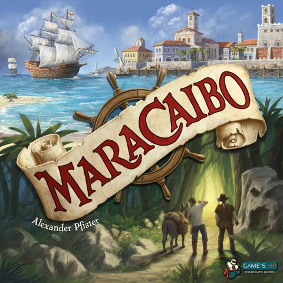

There's something about pirates in board games that just *works*. The tension of pushing your luck on the open seas, the thrill of plundering a loaded merchant ship, the impossible decision between playing it safe as a trader or going full Blackbeard. Pirate and seafaring themes have produced some of the hobby's most beloved games — and some of its most immersive experiences.

Whether you want a 30-minute card game you can play between rounds of something heavier, a narrative adventure that plays like a choose-your-own-pirate-novel, or a full-blown Caribbean sandbox where your choices define your legacy, this theme has you covered.

Here are seven games that do the nautical theme proud, arranged from lightest to heaviest.

---

## Port Royal — The Quick Draw

**[Port Royal](https://boardgamegeek.com/boardgame/156009)** (2014) | 2–5 players | 50 min | Weight: 1.63 | BGG Rating: 7.10 | Rank: #627

Alexander Pfister's [Port Royal](https://boardgamegeek.com/boardgame/156009) is deceptively simple: flip cards from the deck to reveal ships and people. Ships mean danger — flip a second ship of the same colour and you bust. Stop early and you get fewer options; push further and you risk everything. It's pure press-your-luck distilled into a deck of cards.

What makes Port Royal more than just a gambling exercise is the hiring mechanism. Characters you recruit give you ongoing abilities, discounts, and end-game points. There's a genuine economic engine lurking beneath the pirate theming. And at under an hour with setup, it's the perfect opener before something meatier.

**Best for:** Groups who want pirate vibes without committing an entire evening.

---

## Skull King — The Trick-Taking Terror

**[Skull King](https://boardgamegeek.com/boardgame/150145)** (2013) | 2–8 players | 30 min | Weight: 1.74 | BGG Rating: 7.53 | Rank: #294

If you've ever played a trick-taking game and thought "this needs more pirates and more chaos," Skull King is your answer. Players bid on how many tricks they'll win each round, with escalating hand sizes creating increasingly wild swings. The special characters — the Pirate, the Mermaid, the Skull King himself — add a rock-paper-scissors layer that turns predictable trick-taking on its head.

The genius is in the scoring. Bidding zero and nailing it is just as rewarding as bidding high. Capturing the Skull King with a Mermaid earns a massive bonus. Every round is a new gamble, and the game never outstays its welcome.

**Best for:** Large groups, family game nights, anyone who thinks trick-taking games are boring.

---

## Libertalia: Winds of Galecrest — The Simultaneous Pirate Mind Game

**[Libertalia: Winds of Galecrest](https://boardgamegeek.com/boardgame/356033)** (2022) | 1–6 players | 60 min | Weight: 2.19 | BGG Rating: 7.44 | Rank: #515

The 2022 reimplementation of Paolo Mori's original [Libertalia](https://boardgamegeek.com/boardgame/125618) takes the core concept — everyone has the same crew members but plays them differently — and polishes it into something genuinely special. Each round, you simultaneously choose a crew card to send to the island. Higher-ranked crew pick loot first, but lower-ranked ones activate their abilities first. Every card is a calculated risk.

What Stonemaier Games added with *Winds of Galecrest* is a cleaner ruleset, better components, and a solo mode. The original was excellent; this version is definitive. It's one of the few games at this weight that plays well at every count from 1 to 6.

**Best for:** Anyone who loves reading opponents and games that reward repeat plays.

---

## Forgotten Waters — The Narrative Voyage

**[Forgotten Waters](https://boardgamegeek.com/boardgame/302723)** (2020) | 3–7 players | 240 min | Weight: 2.10 | BGG Rating: 7.74 | Rank: #357

Forgotten Waters isn't really a strategy game. It's a collaborative storytelling experience that happens to use a board. Using a companion app, players crew a pirate ship through branching narrative scenarios filled with absurd characters, tough choices, and surprisingly emotional moments. Think *Crossroads* (from Dead of Winter) stretched into an entire game.

Each player has a personal pirate with their own story arc, stats, and constellation chart to complete. The group decisions — where to sail, when to fight, how to handle a mutinous crew — create genuine table talk. At up to 7 players and 4 hours, it's an event game. But it's the kind of event where everyone is laughing too hard to notice the time.

**Best for:** Groups who prioritise story and laughs over optimisation. People who loved *Stuffed Fables* or *Mice & Mystics* but want something for adults.

---

## Merchants & Marauders — The Caribbean Sandbox

**[Merchants & Marauders](https://boardgamegeek.com/boardgame/25292)** (2010) | 2–4 players | 180 min | Weight: 3.26 | BGG Rating: 7.39 | Rank: #415

This is the pirate sandbox. You start with a captain and a small sloop in the Caribbean. From there, you can trade goods between ports, hunt rumours for glory, complete missions, or — if you're feeling brave — turn pirate and start plundering. First to 10 glory points wins, but the path there is entirely yours.

The beauty of Merchants & Marauders is its freedom. You *can* win without ever firing a cannon. You can also win by being the most feared pirate in the Caribbean. NPC pirates and warships patrol the seas, creating constant tension even when you're "just" trading. When you go pirate, other nations hunt you and ports close. It's an open-world game that genuinely delivers on its promise.

The downside? It's long, swingy, and the dice-driven combat can produce frustrating results. But for players who value narrative emergence over tight mechanical balance, there's nothing else quite like it.

**Best for:** Players who want to *live* the pirate fantasy, not just play a game with a pirate skin.

---

## Dead Reckoning — The Modern Flagship

**[Dead Reckoning](https://boardgamegeek.com/boardgame/276182)** (2022) | 1–4 players | 150 min | Weight: 3.44 | BGG Rating: 8.14 | Rank: #362

Dead Reckoning might be the most ambitious pirate game ever made. It uses a card-crafting system where you physically slide upgrade cards into transparent sleeves, changing your crew's abilities as you play. Your navigator might start as a basic deckhand and end the game as a master cartographer with combat bonuses and trade skills — and you can see it all on the card.

Beyond the crafting gimmick (which is genuinely clever, not just a gimmick), Dead Reckoning offers area control, combat, exploration, and economic development across a modular hex map. It's a proper 4X-lite experience in a pirate setting, with a solo mode and campaign system adding longevity.

At 8.14 on BGG and a weight of 3.44, this is the highest-rated game on this list. If you want mechanical depth and pirate theming in equal measure, Dead Reckoning is the current gold standard.

**Best for:** Experienced gamers who want a crunchy, systems-rich pirate experience with genuine innovation.

---

## Maracaibo — The Strategist's Voyage

**[Maracaibo](https://boardgamegeek.com/boardgame/276025)** (2019) | 1–4 players | 120 min | Weight: 3.92 | BGG Rating: 7.94 | Rank: #87

Alexander Pfister bookends this list — he gave us the lightest game (Port Royal) and the heaviest (Maracaibo). Set in the 17th-century Caribbean, Maracaibo has players sailing around a rondel of Caribbean ports, taking actions to trade, fight, explore, and gain influence with three colonial nations. It has a legacy-style campaign with an evolving story, but it plays perfectly well as a standalone strategic euro.

At 3.92 weight, Maracaibo is a beast. The interlocking systems — card play, area influence, assistant upgrades, quest chains — demand full attention. But it rewards investment like few games can. Every decision ripples outward, and experienced players will find new strategic layers dozens of plays in. It's currently #87 on BGG, making it comfortably the highest-ranked game on this list.

**Best for:** Heavy euro enthusiasts who happen to love the Caribbean setting. Players who adored *Great Western Trail* and want Pfister to take them to sea.

---

## Charting Your Course

The pirate theme spans the full spectrum of modern board gaming. Here's a quick compass to help you navigate:

| If you want... | Play this |
|---|---|
| A quick filler | **Port Royal** (50 min, weight 1.63) |
| A party trick-taker | **Skull King** (30 min, weight 1.74) |
| Simultaneous bluffing | **Libertalia: Winds of Galecrest** (60 min, weight 2.19) |
| A narrative adventure | **Forgotten Waters** (240 min, weight 2.10) |
| An open-world sandbox | **Merchants & Marauders** (180 min, weight 3.26) |
| Card-crafting innovation | **Dead Reckoning** (150 min, weight 3.44) |
| A heavy strategic euro | **Maracaibo** (120 min, weight 3.92) |

Fair winds and following seas. 🏴‍☠️
