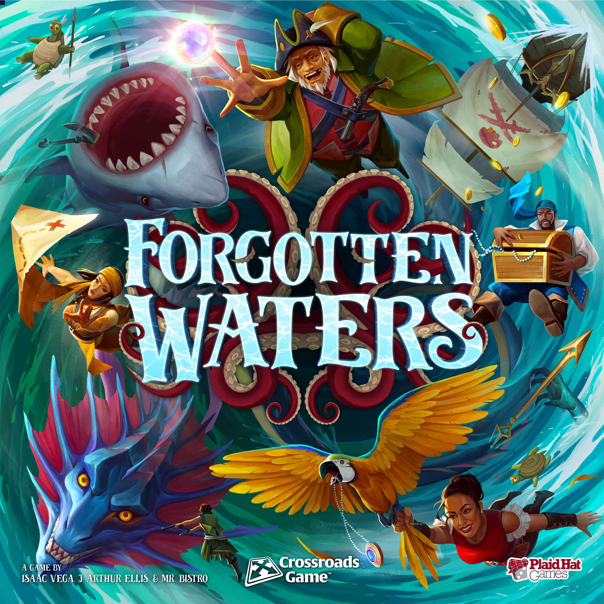
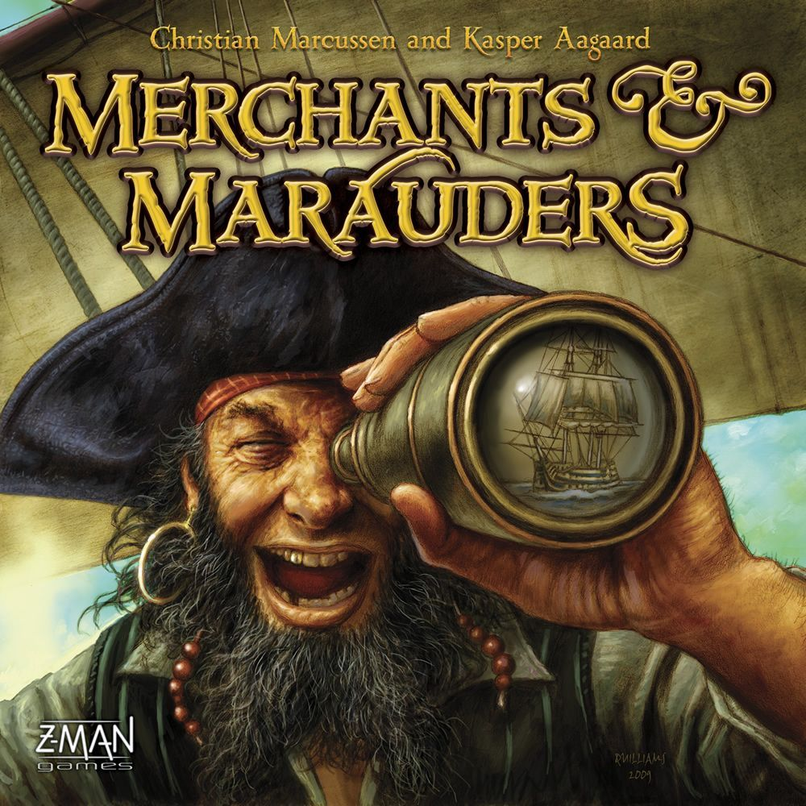

# Theme Park: Pirates & the High Seas
*Plunder, trade, and chase the horizon*

There is something about pirate games that no other theme quite replicates. The open map. The fork between honest trade and reckless piracy. The moment someone flips from friendly merchant to cannon-wielding nightmare because they spotted your loaded cargo hold two hexes away.

The best nautical board games lean into that tension. They give you a ship, a heading, and a choice — and then they let the table sort out who is a pirate, who is a merchant, and who is trying desperately to be both. It is a theme that scales beautifully from a fifteen-minute card game to a four-hour sandbox, and every weight has standout titles worth owning.

This guide charts a course from easy-entry gateway games up through mid-weight adventures and heavyweight simulations, then closes with a hidden gem, a sample game-night lineup, and the one title that best captures the pirate fantasy.

---

## Gateway pick: the game that makes everyone laugh

The best gateway pirate game is [Jamaica](https://boardgamegeek.com/boardgame/28023) (2007, Space Cowboys).

Jamaica is a racing game around the island of Jamaica where players load cargo, fire cannons at each other, and occasionally discover treasure — all driven by a simple card-play mechanism. On your turn you play one card from your hand to determine how much you move and how much you load (or unload) from your ship. The twist: the active player rolls dice that determine which card slot is the "day action" and which is the "night action," so everyone at the table is affected by the same roll.

It works because the decisions are meaningful but fast. Do you load gold now or push ahead in the race? Do you fight the player ahead of you for their treasure or save your gunpowder for later? Games finish in 45 minutes, the art is gorgeous (illustrated by Mathieu Leyssenne), and the component quality — chunky ship tokens, a beautiful board — sells the theme instantly.

**Players:** 2–6 · **Time:** 30–60 min · **Weight:** 1.6/5 · [BGG Link](https://boardgamegeek.com/boardgame/28023)

---

## The trick-taking treasure: Skull King

If you want pirate theme in a pocket-sized card game, [Skull King](https://boardgamegeek.com/boardgame/150145) (2013, Grandpa Beck's Games) is the answer.

Skull King is a trick-taking game where you bid on exactly how many tricks you will win each round — and then try to hit that number precisely. Bid zero and sweep the round? Big points. Bid three and only take two? Painful penalty. The pirate theme lives in the special cards: the Pirate card beats everything except the Mermaid, who beats the Pirate, and the Skull King himself beats all Pirates but falls to any Mermaid. It creates wild swings and table-talk moments that feel genuinely nautical.

The genius is in the escalation. Round one deals one card each. Round ten deals ten. By the endgame, bids are sweat-inducing and every card played shifts the table dynamics. It handles up to six players, plays in 30 minutes, and packs enough depth for seasoned gamers while staying accessible to anyone who has played a trick-taking game before.

**Players:** 2–6 · **Time:** 30 min · **Weight:** 1.7/5 · [BGG Link](https://boardgamegeek.com/boardgame/150145)

---

## Mid-weight adventure: Forgotten Waters

For groups that want narrative and laughter over optimisation, [Forgotten Waters](https://boardgamegeek.com/boardgame/302723) (2020, Plaid Hat Games) is exceptional.

Forgotten Waters is a crossroads-style adventure game where the entire table plays the crew of a pirate ship. You sail to different locations, vote on decisions, and listen to fully voice-acted story segments delivered through a companion app. Each player has a personal story — your pirate has goals, flaws, and a character arc that develops across the scenario. The cooperative/competitive split is elegant: the ship needs to succeed for anyone to win, but individual objectives mean people are constantly pulling in slightly different directions.

What makes it land is the writing. The scenarios are genuinely funny, the voice acting is excellent, and the choices feel consequential without being paralysing. It plays three to seven (fantastic for bigger groups), runs about two to three hours per scenario, and has five scenarios in the base box plus free downloadable ones. If you have ever wanted a board game that feels like a pirate comedy movie, this is it.

**Players:** 3–7 · **Time:** 120–180 min · **Weight:** 2.2/5 · [BGG Link](https://boardgamegeek.com/boardgame/302723)

---

## The pirate sandbox: Merchants & Marauders

If you want the full open-world pirate simulation, [Merchants & Marauders](https://boardgamegeek.com/boardgame/25292) (2010, Z-Man Games) remains the gold standard.

This is the game where you genuinely choose your path. Start as a merchant, buy goods in one port, sell them in another, upgrade your ship, and try to accumulate ten glory points through peaceful trade. Or start robbing NPC merchants. Or attack other players. Or hunt bounties on pirates. Or do all of those things in the same game depending on how the wind blows.

The sandbox design is the draw. The Caribbean map is dotted with ports, each with fluctuating demand for different goods. NPC pirate ships roam the sea lanes. Naval vessels patrol for wanted captains. Storms roll in. Rumours point to buried treasure. Every game tells a different story because the systems interact in emergent ways — you might plan a quiet trading run and end up in a desperate sea battle because an NPC frigate caught you carrying contraband.

It is not short (expect three hours), and the rules have some rough edges that the *Seas of Glory* expansion smooths out. But nothing else in board gaming captures the "I am a pirate captain making my fortune" fantasy this completely.

**Players:** 2–4 · **Time:** 180 min · **Weight:** 3.2/5 · [BGG Link](https://boardgamegeek.com/boardgame/25292)

---

## Modern heavyweight: Dead Reckoning

.")

For players who want the sandbox pirate experience with modern design sensibilities, [Dead Reckoning](https://boardgamegeek.com/boardgame/276182) (2022, AEG) is the evolution.

Dead Reckoning uses a card-crafting system where you physically sleeve cards to upgrade your crew members. Recruit a navigator and slide a navigation upgrade into their card sleeve — now they are better at exploration. Add a combat upgrade and they hit harder in battle. It is tactile, clever, and makes every crew upgrade feel personal.

The game layer is area control meets pick-up-and-deliver on an exploration map. You sail out, discover islands, claim them for income, trade goods, and fight other players for territory. Combat uses a cube-tower system that creates uncertainty without being purely random. The whole package runs tighter than Merchants & Marauders (about two hours) while keeping the sandbox feeling of charting your own course.

**Players:** 1–4 · **Time:** 90–150 min · **Weight:** 3.4/5 · [BGG Link](https://boardgamegeek.com/boardgame/276182)

---

## Hidden gem: Libertalia — Winds of Galecrest

[Libertalia: Winds of Galecrest](https://boardgamegeek.com/boardgame/356033) (2022, Stonemaier Games) does not get talked about enough.

The premise is brilliant: every player starts each round with the same hand of character cards. You simultaneously choose one to play, then resolve them in order. The twist is that previous rounds leave you with different leftover cards, so identical starting hands diverge into wildly different tactical positions by round two. It is simultaneous selection meets bluffing meets timing, and the pirate theme (you are rival pirate captains dividing loot) gives every decision flavour.

Libertalia is fast (45–60 minutes), plays up to six, and has enormous replayability thanks to a modular character deck that changes which forty characters appear each game. The Stonemaier production quality is excellent, the art is vibrant, and the gameplay has a "one more round" pull that heavier games rarely match.

**Players:** 1–6 · **Time:** 45–60 min · **Weight:** 2.2/5 · [BGG Link](https://boardgamegeek.com/boardgame/356033)

---

## Sample game night: Pirates Edition

Running a pirate-themed evening? Here is a lineup that works:

1. **Skull King** (30 min) — warm-up trick-taker, gets everyone in the pirate mood
2. **Libertalia: Winds of Galecrest** (45–60 min) — simultaneous play keeps downtime low, perfect mid-evening energy
3. **Forgotten Waters** (120+ min) — close the night with a narrative adventure that will have the table laughing

For a heavier group, swap Forgotten Waters for **Dead Reckoning** or **Merchants & Marauders** and block out a full evening.

---

## The one to get: Merchants & Marauders

If you buy one pirate board game, make it Merchants & Marauders. It is not the most polished. It is not the shortest. But it is the game that most completely delivers on the pirate fantasy — the open sea, the moral choice between trade and plunder, the emergent stories that you will retell for years. Nothing else in the genre gives you that same feeling of standing at the helm and choosing your own heading.

Fair winds and following seas. 🏴‍☠️
