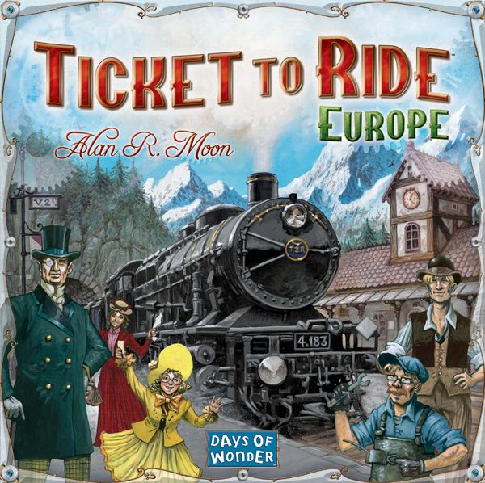
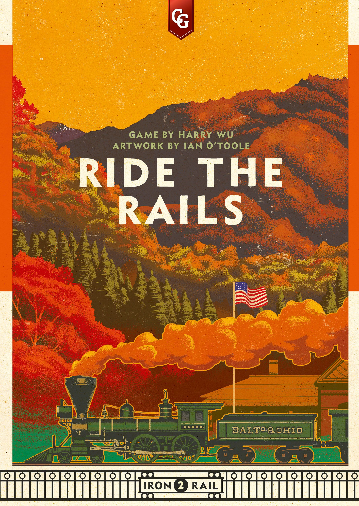
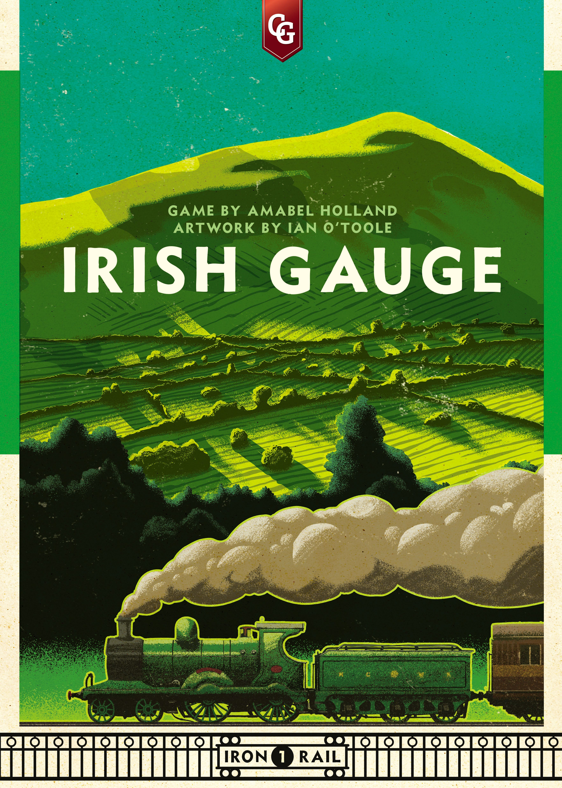
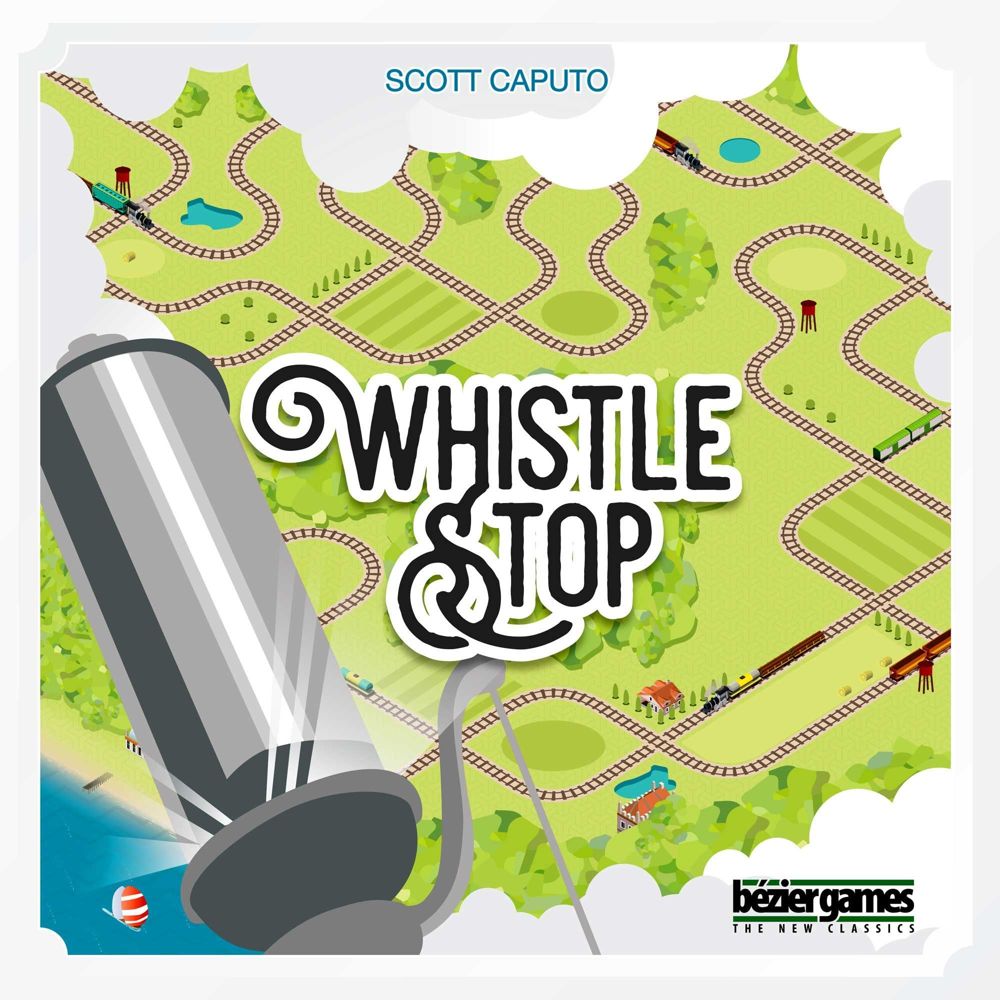
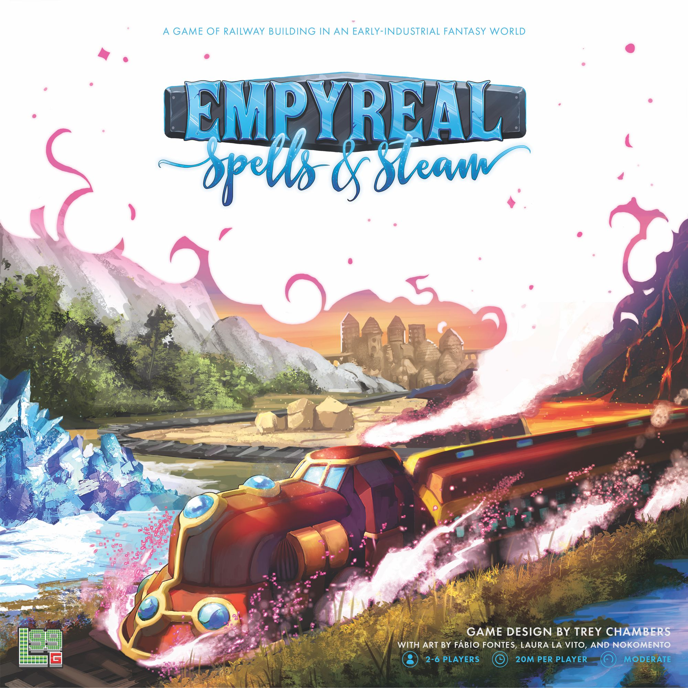
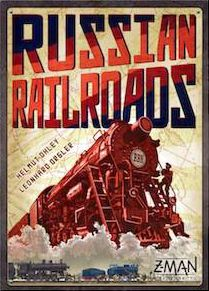

Trains are the backbone of modern board gaming. The 18xx genre literally predates most of what we'd recognise as "hobby gaming," and the simple act of connecting two points on a map with a coloured line has launched a thousand designs. There's something primal about railways — the expansion, the competition for limited routes, the satisfying click of infrastructure falling into place.

But "train games" aren't one thing. They span the entire complexity spectrum, from games you can teach your parents in five minutes to economic simulations that make spreadsheets look casual. The theme bends to fit everything from gentle tourism to robber baron capitalism, from fantasy steam-magic to pure abstract stock manipulation.

Here are seven games that ride the rails from lightest to heaviest, each offering something genuinely different.

---

## Ticket to Ride: Europe — The Gateway Drug

**[Ticket to Ride: Europe](https://boardgamegeek.com/boardgame/14996)** (2005) | 2–5 players | 60 min | Weight: 1.92 | BGG Rating: 7.52 | Rank: #177

You know this game. Everyone knows this game. And there's a reason it's sold millions of copies — the core loop is *perfect*. Draw cards, claim routes, complete tickets. The tension builds beautifully as the map fills up and your carefully planned route through the Balkans gets blocked by someone who apparently needed to connect Madrid to Danzig for reasons known only to them.

Europe improves on the original with stations (a safety valve for blocked routes), tunnels (push-your-luck on mountain passes), and ferries (requiring wild cards). It's the definitive entry point for the hobby, and honestly? It still holds up twenty years later. The map is tighter than the US version, forcing more player interaction, and the long-route bonuses reward ambition.

**Why it's here:** If someone says "I like trains" and has never played a modern board game, this is where you start. No exceptions.

---

## Ride the Rails — Investing in Other People's Networks

**[Ride the Rails](https://boardgamegeek.com/boardgame/297486)** (2020) | 3–5 players | 60 min | Weight: 2.29 | BGG Rating: 7.12 | Rank: #1,850

Harry Wu's cube-rails design has a fascinating twist: you score by *using* railways, not just owning them. Each round introduces a new railroad company. You buy shares, build track, then score by moving passengers along routes — using anyone's track. Every segment you traverse pays dividends to whoever owns shares in that company.

This creates a wonderfully parasitic dynamic. You might build minimal track for the green railroad while heavily investing in blue, then route your passengers through as much blue track as possible. The five-era structure (each introducing a new company) means the map evolves dramatically, and early investments compound as the network grows.

**Why it's here:** The passenger-riding mechanism makes this feel completely different from other train games. You're not just building — you're *using* the infrastructure in clever ways.

---

## Irish Gauge — The 60-Minute Stock Market

**[Irish Gauge](https://boardgamegeek.com/boardgame/161882)** (2014) | 3–5 players | 60 min | Weight: 2.33 | BGG Rating: 7.16 | Rank: #1,225

Amabel Holland's cube-rails masterpiece packs an astonishing amount of decision space into an hour. You're buying shares in railway companies, then collectively deciding where those companies build track — but the dividends go to *all* shareholders, not just whoever triggered the payout. So you're constantly calculating: do I grow this company I own 2 shares in, knowing my opponent holds 3?

The auction mechanism is deliciously nasty. Each share starts at a set price but subsequent shares in the same company get more expensive. The map of Ireland is small enough that every rail placement matters, and the special dividend cubes create mini-puzzles about route optimisation.

**Why it's here:** This is the gateway to "economic train games" — all the stock manipulation and shared incentives of an 18xx in a fraction of the time. If Ticket to Ride is the gateway to board gaming, Irish Gauge is the gateway to train gaming.

---

## Whistle Stop — The Tile-Laying Race

**[Whistle Stop](https://boardgamegeek.com/boardgame/221318)** (2017) | 2–5 players | 75 min | Weight: 2.76 | BGG Rating: 7.03 | Rank: #1,486

Scott Caputo's Whistle Stop is the train game that feels most like a race. You're laying tiles to build the rail network westward across America, then running your trains along it to pick up resources, complete contracts, and reach the lucrative western towns. The trick: you're building the map *as you play*, and any tile you place can be used by anyone.

There's a push-your-luck element in how far west you push — towns further out score more, but the network might not connect there yet. The stock mechanism lets you invest in companies that own specific towns, adding an economic layer without overwhelming the spatial puzzle. Upgrades for your train (more carrying capacity, extra moves) create satisfying engine-building.

**Why it's here:** If you want a train game that's more "adventure across the frontier" than "manipulate stock prices," Whistle Stop delivers that westward-expansion fantasy beautifully.

---

## Empyreal: Spells & Steam — The Fantasy Dispatcher

**[Empyreal: Spells & Steam](https://boardgamegeek.com/boardgame/220367)** (2020) | 2–6 players | 75 min | Weight: 2.86 | BGG Rating: 7.43 | Rank: #2,232

What if train games, but *magic*? Empyreal strips out the economic layer entirely and replaces it with asymmetric spell-powered engines. Each player controls a railway company in a fantasy world, using unique specialist cards to lay track, pick up goods, and deliver them to cities. Your "train" is powered by mana crystals, and each company plays completely differently.

The worker-placement-on-your-own-tableau mechanism means you're building a personal combo engine while competing on a shared map. One company might teleport track across the board while another lays cheap track in bulk. The demand system (cities want specific goods, and fulfilled demands disappear) creates a race to deliver before your opponents strip the board.

**Why it's here:** It's proof that the train-game skeleton — pick up, deliver, optimise routes — works brilliantly even when you replace coal with crystals and locomotives with magic.

---

## Russian Railroads — The Worker Placement Engine

**[Russian Railroads](https://boardgamegeek.com/boardgame/144733)** (2013) | 2–4 players | 120 min | Weight: 3.40 | BGG Rating: 7.72 | Rank: #151

Here's the thing about Russian Railroads: there are no trains on the board. There's barely a map. What there is, is one of the tightest, most satisfying worker-placement games ever designed. You're building three rail lines — the Trans-Siberian, the St. Petersburg line, and the Kiev line — but they're abstracted to personal player boards where you advance coloured markers along tracks.

The genius is in the cascading upgrades. Your rail lines score points based on how far they extend AND what colour they've upgraded to (black → grey → brown → natural → white, each worth more). Engineers provide game-breaking bonuses. The industry track offers an alternative scoring path. Every round, the decision space is enormous — do you push one line to the end, diversify across all three, or rush industry?

**Why it's here:** This is what happens when a designer asks "what if the *feeling* of efficient railway expansion was the game, rather than the geography?" Pure optimisation bliss.

---

## Age of Steam — The Merciless Classic

**[Age of Steam](https://boardgamegeek.com/boardgame/4098)** (2002) | 1–6 players | 120 min | Weight: 3.86 | BGG Rating: 7.87 | Rank: #139

Martin Wallace's Age of Steam is the train game that wants you to suffer. You start in debt (you must issue shares to fund anything), the operating costs are punishing, and if you can't pay expenses at round's end, you lose shares — permanently tanking your income. The auction for turn order is brutal. The action selection (first player picks first) creates agonising priority decisions. And the map? Unforgiving.

But here's why it's a masterpiece: every cube delivered *matters*. Every link built is a calculated bet. Every dollar spent is a dollar you might desperately need next round. The game creates tension from scarcity in a way almost nothing else does. The hundreds of expansion maps (literally hundreds) mean you'll never run out of new puzzles. The base game's rust belt America map teaches you that Age of Steam rewards planning three rounds ahead and punishes the merely reactive.

**Why it's here:** This is the mountain. If Ticket to Ride is the gentle slope that gets new gamers walking, Age of Steam is the technical climb that tests whether you love train games or merely like them. Come prepared.

---

## The Spectrum

What makes train games special as a theme is the range. No other theme spans from Weight 1.9 to Weight 3.9 so naturally, because the core fantasy — connecting places, moving things efficiently, competing for limited infrastructure — scales infinitely. You can make it gentle (Ticket to Ride), cutthroat (Age of Steam), abstract (Russian Railroads), fantastical (Empyreal), or economically ruthless (Irish Gauge).

If you've only tried Ticket to Ride and dismissed "train games" as family fare, you owe it to yourself to try something from the heavier end. And if you've only played 18xx and think lighter train games are beneath you — Irish Gauge might change your mind about what sixty minutes can accomplish.

All aboard.
