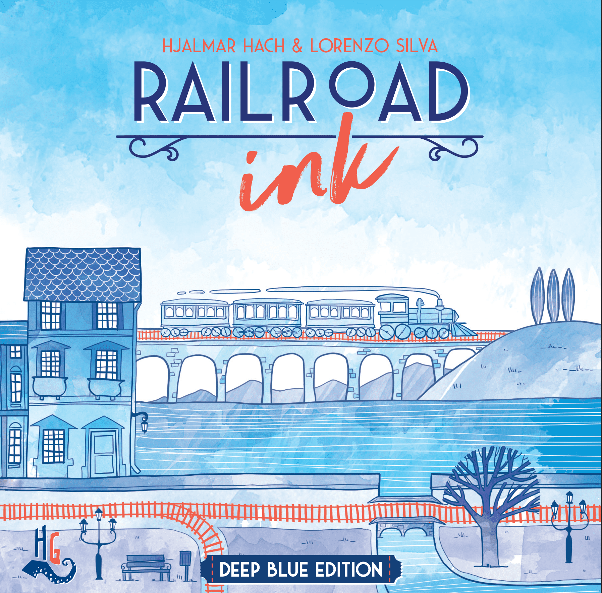
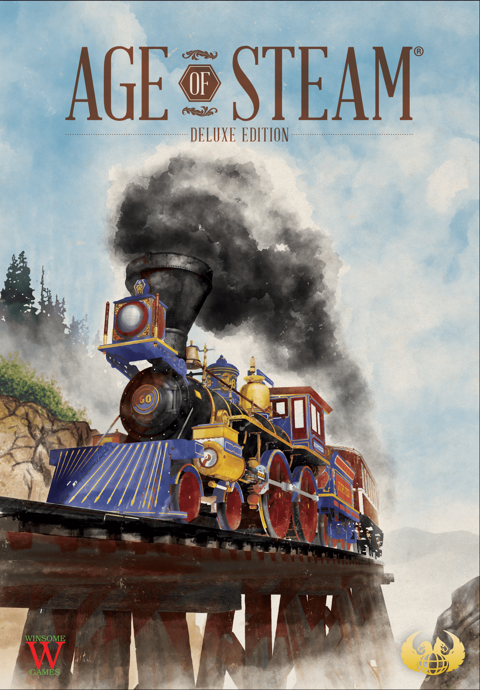
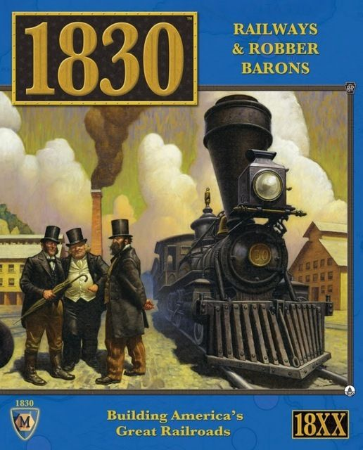

Few themes in board gaming have the range that trains do. You can sit down with a six-year-old and draw squiggly rail lines on a dry-erase board, or you can spend five hours manipulating stock prices in a Victorian rail empire while your opponents slowly realise they've been financially ruined. Same theme. Completely different games.

That range is what makes trains one of the richest veins in the hobby. The theme isn't decoration  -  it's structural. Routes need to connect. Networks need to grow. Resources need to move from somewhere to somewhere else. These are problems that naturally create interesting decisions, and designers have been mining them since the hobby's earliest days.

Here are six train games worth knowing, from the lightest to the heaviest. Whether you want a breezy 20-minute filler or a marathon of economic warfare, there's a train game for you.

---

## 1. Railroad Ink: Deep Blue Edition

**The 20-minute route-drawing puzzle**

*Box art via BoardGameGeek. Railroad Ink by CMON / Horrible Guild.*

| Stat | Value |
|------|-------|
| **BGG Rating** | 7.14 |
| **Weight** | 1.47 / 5 |
| **Players** | 1-6 |
| **Play Time** | 20-30 min |
| **BGG Rank** | #628 |
| **Year** | 2018 |

[Railroad Ink: Deep Blue Edition](https://boardgamegeek.com/boardgame/245654/railroad-ink-deep-blue-edition) is barely a train game in the traditional sense, but it captures something essential about railways: the satisfaction of watching a network come together.

Everyone rolls the same dice, everyone draws the same results onto their personal board. The puzzle is spatial  -  how do you connect your exits, avoid dead ends, and squeeze the most out of every roll? The Deep Blue edition adds rivers and lakes that cross your rail lines, creating a second network to manage.

It's almost meditative. There's no direct interaction, no blocking, no conflict. Just you, your board, and the quiet agony of rolling three curves when you desperately need a straight. At weight 1.47, this is the gentlest on-ramp to train games you'll find. Perfect for non-gamers, perfect for a quick opener, and surprisingly satisfying solo.

**Who it's for:** Anyone. Literally anyone who can hold a marker.

---

## 2. Ticket to Ride

**The gateway that launched a thousand collections**

*Box art via BoardGameGeek. Ticket to Ride by Days of Wonder.*

| Stat | Value |
|------|-------|
| **BGG Rating** | 7.39 |
| **Weight** | 1.82 / 5 |
| **Players** | 2-5 |
| **Play Time** | 30-60 min |
| **BGG Rank** | #256 |
| **Year** | 2004 |

[Ticket to Ride](https://boardgamegeek.com/boardgame/9209/ticket-to-ride) needs no introduction, but it deserves one anyway. Alan Moon's 2004 Spiel des Jahres winner is the game that proved you could sell millions of copies of a board game by making the rules fit on a single page while hiding real tension underneath.

You collect coloured cards. You claim routes. You try to complete your secret tickets before someone blocks the one connection you absolutely needed. That's it. And yet the game produces genuine drama  -  the agonising decision between drawing more cards (safe, slow) and claiming a route (risky, committed), the gut punch when someone takes Denver to Santa Fe before you, the gamble of drawing extra tickets late in the game.

At weight 1.82, Ticket to Ride sits comfortably above Railroad Ink but remains firmly in gateway territory. It's the game most likely to already be on your shelf, and there's a good reason for that.

**Who it's for:** Families, new gamers, anyone who wants a proper game in under an hour.

---

## 3. Ticket to Ride: Europe

**The better version (yes, I said it)**

*Box art via BoardGameGeek. Ticket to Ride: Europe by Days of Wonder.*

| Stat | Value |
|------|-------|
| **BGG Rating** | 7.52 |
| **Weight** | 1.92 / 5 |
| **Players** | 2-5 |
| **Play Time** | 30-60 min |
| **BGG Rank** | #178 |
| **Year** | 2005 |

[Ticket to Ride: Europe](https://boardgamegeek.com/boardgame/14996/ticket-to-ride-europe) takes the original formula and adds just enough: stations (a safety valve for blocked routes), tunnels (a push-your-luck element when claiming alpine routes), and ferries (which require locomotive wildcards). The map is also more interesting, with tighter bottlenecks in the Balkans and Scandinavia that create more blocking opportunities.

The weight bump from 1.82 to 1.92 is marginal, but the higher BGG rating (7.52 vs 7.39) and rank (#178 vs #256) tell the story. Europe is the version most hobbyists recommend if you're only buying one. The original USA map is cleaner and arguably better for absolute beginners, but Europe has more game in the box.

**Who it's for:** Everyone the original is for, plus anyone who wants a touch more depth without a rulebook expansion.

---

## 4. Russian Railroads

**Worker placement with a train theme bolted on (and it works)**

*Box art via BoardGameGeek. Russian Railroads by Hans im Glück.*

| Stat | Value |
|------|-------|
| **BGG Rating** | 7.72 |
| **Weight** | 3.40 / 5 |
| **Players** | 2-4 |
| **Play Time** | 120 min |
| **BGG Rank** | #151 |
| **Year** | 2013 |

[Russian Railroads](https://boardgamegeek.com/boardgame/144733/russian-railroads) is where we leave gateway territory and enter hobbyist country. This is a worker placement game first and a train game second  -  your trains don't actually go anywhere. Instead, you advance track markers along three rail lines (the Trans-Siberian, the St. Petersburg line, and the Kiev line), each with different scoring profiles. The further you push, the more points you score, but extending tracks requires workers, and workers are brutally scarce.

The genius is in how the three tracks interact with industrialisation, engineers, and bonus tiles. You can't do everything. You can barely do two things. Every round forces genuine sacrifice, and the cascading combos in the final rounds  -  when your engine suddenly fires and you leap 80 points in a single turn  -  are among the most satisfying moments in euro gaming.

At weight 3.40, this is a significant step up from Ticket to Ride. Expect a 20-minute teach and a two-hour game that demands your full attention. But if you like the satisfaction of building an efficient engine and watching it pay off, Russian Railroads delivers.

**Who it's for:** Euro gamers who want a tight, crunchy optimisation puzzle with a rail theme.

---

## 5. Age of Steam

**The economic knife fight**

*Box art via BoardGameGeek. Age of Steam by Eagle-Gryphon Games.*

| Stat | Value |
|------|-------|
| **BGG Rating** | 7.87 |
| **Weight** | 3.86 / 5 |
| **Players** | 1-6 |
| **Play Time** | 120 min |
| **BGG Rank** | #139 |
| **Year** | 2002 |

[Age of Steam](https://boardgamegeek.com/boardgame/4098/age-of-steam) is Martin Wallace at his most unforgiving. You build track, deliver goods along routes, and try to generate enough income to service your mounting debt. It sounds dry. It is not dry. It's a white-knuckle economic survival game where a single misjudged auction can bankrupt you by round three.

Everything costs money. Building track costs money. Upgrading your engine costs money. And at the end of every round, you pay maintenance on your shares  -  which you issued to get the money to build the track in the first place. The debt spiral is real and it is merciless. Age of Steam doesn't care about your feelings.

What elevates it beyond mere cruelty is the map system. There are hundreds of expansion maps, each changing the geography and often adding unique rules. The base game is tight and excellent, but the ecosystem of community maps gives Age of Steam near-infinite replayability.

At weight 3.86, this is not a casual evening game. But for players who want their train games to have financial teeth, nothing else comes close (except the next entry on this list).

**Who it's for:** Experienced gamers who want economic tension, player interaction, and the constant threat of ruin.

---

## 6. 1830: Railways & Robber Barons

**The granddaddy of 18xx  -  and it bites**

*Box art via BoardGameGeek. 1830 by Avalon Hill / Lookout Games.*

| Stat | Value |
|------|-------|
| **BGG Rating** | 7.86 |
| **Weight** | 4.17 / 5 |
| **Players** | 2-7 |
| **Play Time** | 180-360 min |
| **BGG Rank** | #311 |
| **Year** | 1986 |

[1830: Railways & Robber Barons](https://boardgamegeek.com/boardgame/421/1830-railways-robber-barons) is the entry point to the 18xx genre  -  a family of games about building railway companies, manipulating their stock prices, and (crucially) understanding that the companies are not you. You are an investor. The companies are tools. And sometimes the best move is to run a company into the ground after you've sold your shares and bought into something better.

That distinction is what makes 18xx games unlike anything else in board gaming. The train-buying mechanism is the engine of destruction: when new trains arrive, old ones become obsolete. If a company can't afford a new train, the president (whoever owns the most shares) pays out of pocket. Dump your presidency on someone else at the right moment and you've executed the most satisfying backstab in all of gaming.

At weight 4.17 and a play time that can stretch past five hours, 1830 is not for everyone. But it has endured since 1986 for a reason. The game is almost entirely driven by player decisions  -  there's no luck beyond initial share order. Every outcome is earned. The 18xx community is passionate, welcoming to newcomers (despite the reputation), and produces a steady stream of new titles.

**Who it's for:** Dedicated gamers ready for a deep, long, player-driven economic game. The kind of people who read this far and felt their pulse quicken.

---

## The Full Track

Here's the complete ladder at a glance:

| Game | Weight | Time | Players | BGG Rating | BGG Rank |
|------|--------|------|---------|------------|----------|
| [Railroad Ink: Deep Blue](https://boardgamegeek.com/boardgame/245654/railroad-ink-deep-blue-edition) | 1.47 | 20-30 min | 1-6 | 7.14 | #628 |
| [Ticket to Ride](https://boardgamegeek.com/boardgame/9209/ticket-to-ride) | 1.82 | 30-60 min | 2-5 | 7.39 | #256 |
| [Ticket to Ride: Europe](https://boardgamegeek.com/boardgame/14996/ticket-to-ride-europe) | 1.92 | 30-60 min | 2-5 | 7.52 | #178 |
| [Russian Railroads](https://boardgamegeek.com/boardgame/144733/russian-railroads) | 3.40 | 120 min | 2-4 | 7.72 | #151 |
| [Age of Steam](https://boardgamegeek.com/boardgame/4098/age-of-steam) | 3.86 | 120 min | 1-6 | 7.87 | #139 |
| [1830](https://boardgamegeek.com/boardgame/421/1830-railways-robber-barons) | 4.17 | 180-360 min | 2-7 | 7.86 | #311 |

From doodling routes on a whiteboard to bankrupting your friends through stock manipulation  -  that's the range trains give you. No other theme in board gaming covers this much ground. Whatever your weight class, there's a train game waiting at the station.

*All stats from [BoardGameGeek](https://boardgamegeek.com/), verified April 2026.*
