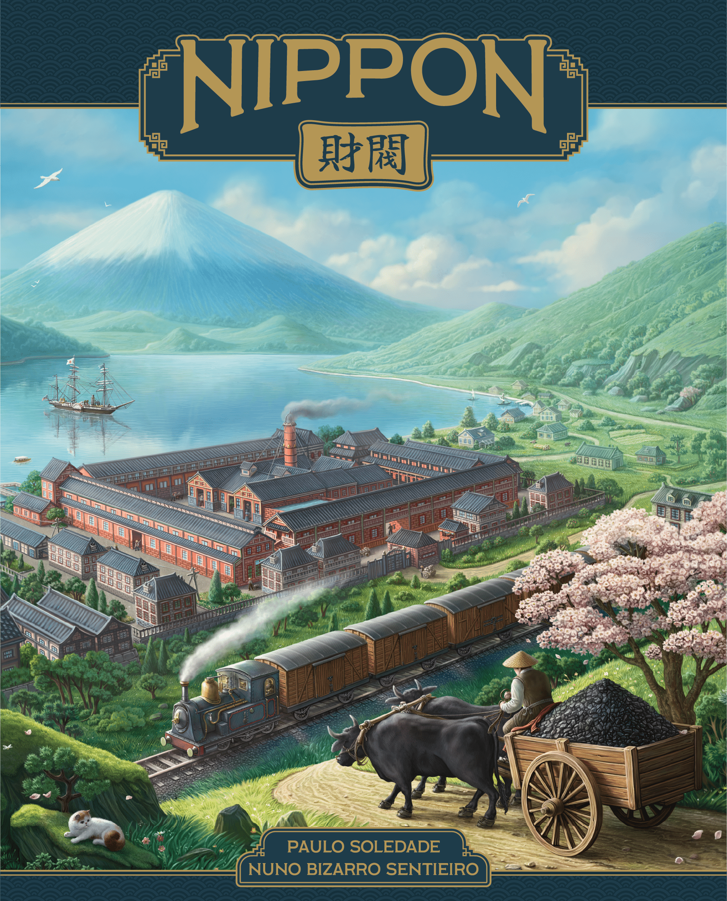
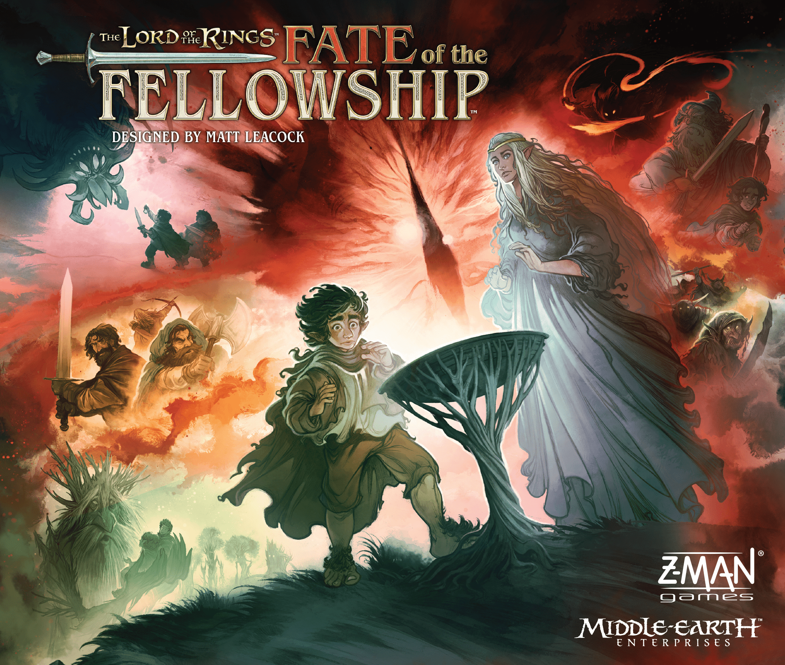

This week’s Hotness is doing two very hobby things at once. First, it is completely losing its mind over established brands. Second, it is still making room for sharp new designs that can cut through the noise if they show even a whiff of momentum.

The result is a list split between giant familiar names and fresh arrivals trying to prove they belong. That tension is the story of the week’s movement: a new [Brass: Pittsburgh](https://boardgamegeek.com/boardgame/452264) campaign powers to the top, Middle-earth refuses to leave the room, and a cluster of new entries suggests people are still hungry for discovery, provided the pitch is immediate and the table presence is obvious.

## [Brass: Pittsburgh](https://boardgamegeek.com/boardgame/452264) takes #1, and yes, the Brass machine is still ridiculous

## This Week's Top 20

| # | Game | Trend |
|---|------|-------|
| 1 | [Brass: Pittsburgh](https://boardgamegeek.com/boardgame/452264) | 🔺 +2 |
| 2 | [The Lord of the Rings: The King's Gambit](https://boardgamegeek.com/boardgame/467694) | 🔻 -1 |
| 3 | [The Lord of the Rings: Fate of the Fellowship](https://boardgamegeek.com/boardgame/436217) | 🔺 +1 |
| 4 | [Gods & Mortals](https://boardgamegeek.com/boardgame/447306) | 🆕 NEW |
| 5 | [Arcs](https://boardgamegeek.com/boardgame/359871) | 🔺 +6 |
| 6 | [The Great Sea](https://boardgamegeek.com/boardgame/453699) | 🆕 NEW |
| 7 | [Brass: Birmingham](https://boardgamegeek.com/boardgame/224517) | 🔻 -2 |
| 8 | [Nippon: Zaibatsu](https://boardgamegeek.com/boardgame/434367) | 🔻 -1 |
| 9 | [SETI: Search for Extraterrestrial Intelligence](https://boardgamegeek.com/boardgame/418059) | 🔺 +1 |
| 10 | [Eternal Decks](https://boardgamegeek.com/boardgame/424981) | 🆕 NEW |
| 11 | [Arkham Horror: The Card Game](https://boardgamegeek.com/boardgame/463126) | 🆕 NEW |
| 12 | [Ark Nova](https://boardgamegeek.com/boardgame/342942) | ➡️ = |
| 13 | [Heat: Pedal to the Metal](https://boardgamegeek.com/boardgame/366013) | ➡️ = |
| 14 | [Slay the Spire: The Board Game](https://boardgamegeek.com/boardgame/338960) | 🔻 -5 |
| 15 | [The Old King's Crown](https://boardgamegeek.com/boardgame/357873) | 🔻 -9 |
| 16 | [Spirit Island](https://boardgamegeek.com/boardgame/162886) | 🔺 +4 |
| 17 | [Magical Athlete](https://boardgamegeek.com/boardgame/454103) | ➡️ = |
| 18 | [Cozy Stickerville](https://boardgamegeek.com/boardgame/456440) | 🆕 NEW |
| 19 | [Flip 7](https://boardgamegeek.com/boardgame/420087) | 🆕 NEW |
| 20 | [Dune: Imperium - Uprising](https://boardgamegeek.com/boardgame/397598) | 🆕 NEW |

**Dropped off:** Star Wars: The Queen's Gambit, Grimcoven, Concordia: Special Edition, Phantom Epoch, Voidfall

A move from #3 to #1 was always on the cards once the Gamefound campaign landed. [Brass: Pittsburgh](https://boardgamegeek.com/boardgame/452264) has the easiest elevator pitch in the world. “What if [Brass: Birmingham](https://boardgamegeek.com/boardgame/224517), but new?” That alone would get the hobby frothing. Add pipelines, expanded resource systems, American Gilded Age industry, and a more dynamic loan setup, and suddenly every euro player with a spreadsheet brain is leaning forward.

The current BGG numbers are exactly what you would expect from a hot crowdfunding project still in the prototype-glow stage. A 6.77 rating from 299 ratings, weight 3.73, overall rank #8733. Those numbers barely matter right now. People are not clicking because they think it is already fully judged. They are clicking because they want to know whether this is the next great Brass or just a very expensive attempt to stand next to [Brass: Birmingham](https://boardgamegeek.com/boardgame/224517).

My read? The interest is real because the design pitch is real. This is not a lazy reskin. The talk around oil, steel, pipelines, and multiple network types suggests a game that actually wants to push the system somewhere different. That matters. The worst thing a follow-up can do is feel like “same meal, different plate”. This one seems more ambitious than that.

The danger, of course, is expectation. You don’t casually walk into the shadow of a game sitting at BGG rank #1 with an 8.57 rating from 57,723 ratings. That is not a shadow. That is total eclipse.

Still, this week belongs to Brass. No question.

## [Brass: Birmingham](https://boardgamegeek.com/boardgame/224517) returns to the conversation at #7

That top spot also creates a ripple effect further down the list. [Brass: Birmingham](https://boardgamegeek.com/boardgame/224517) falls two spots to #7, but this is not a decline story. This is collateral [hype](/posts/hype-vs-reality-march-2026-edition-2026-03-29/). Whenever a new Brass appears, everyone revisits the king.

And yes, it is still the king. BGG rank #1, 8.57 rating, 57,723 ratings, weight 3.86. Those are absurd numbers. The game is so entrenched at this point that every new economic design gets measured against it whether that is fair or not.

What I find more interesting is what this says about current hobby taste. For all the talk about accessibility and shorter games, people still go feral for tightly wound interaction, shared incentives, and systems that punish sloppy planning. Economic games are not dead. They just need a clean pitch and enough tension.

That also helps explain why [Nippon: Zaibatsu](https://boardgamegeek.com/boardgame/434367) is still hanging around at #8. An 8.51 rating from 887 ratings is no joke. A weight of 3.57 and a 1 to 4 player count puts it right in that “serious but manageable” zone that a lot of regular groups actually play.

## [The Lord of the Rings: The King's Gambit](https://boardgamegeek.com/boardgame/467694) drops to #2, but the curiosity is doing a lot of work

If Brass is the week’s clearest prestige story, Middle-earth is the clearest licence story. The funniest thing about [The Lord of the Rings: The King's Gambit](https://boardgamegeek.com/boardgame/467694) is that it barely needs details to stay hot. Restoration Games plus Space Cowboys reviving the spirit of The Queen’s Gambit in Tolkien’s world? That sentence does a lot of heavy lifting.

It slips from #1 to #2, which is barely a slip at all. People are clearly still circling it on concept alone. And fair enough. Big table presence, cinematic conflict, a beloved licence, and a title that instantly triggers nostalgia for one of the hobby’s most discussed spectacle games. That is premium Hotness fuel.

The current BGG page is still basically all promise. Year 2027, player count 2 to 4, and a 5.00 rating from 3 ratings, which is obviously meaningless at this stage. Nobody sensible is reading much into that. The real story is anticipation. This is one of those projects where every new image, component shot, or rules tease will keep it buoyant for weeks.

But there is a real challenge here. The original Queen’s Gambit reputation is built on event status. A giant, dramatic, absurdly memorable production. If this adaptation does not create that same “everyone in the room comes over to stare at the table” effect, the BGG comments will turn into a blood sport.

## Middle-earth is not done. [The Lord of the Rings: Fate of the Fellowship](https://boardgamegeek.com/boardgame/436217) climbs to #3

If [The Lord of the Rings: The King's Gambit](https://boardgamegeek.com/boardgame/467694) is powered by curiosity, [The Lord of the Rings: Fate of the Fellowship](https://boardgamegeek.com/boardgame/436217) is powered by actual approval. Up from #4 to #3, carrying an 8.32 rating from 7,836 ratings, weight 3.06, and already sitting at overall rank #109. That is not hype alone. That is people playing the thing and sticking around.

The player count helps too. One to five is a sweet spot, especially for a thematic co-op in a licence this big. A 60 to 150 minute playtime also tells you this is willing to be an evening game without demanding your entire Saturday. That matters more than hobby internet likes to admit.

There is also a broader pattern here. Middle-earth games keep finding traction when they focus on fellowship, pressure, and escalating threat rather than just trading on artwork and names. Players want the feeling of the story. If this one captures that, the staying power makes sense.

Two Lord of the Rings games in the top three is not normal weekly noise. That is a proper trend.

## New entry: [Gods & Mortals](https://boardgamegeek.com/boardgame/447306) arrives at #4

After the biggest names at the top, the next part of the list is where fresh arrivals start trying to force their way into the conversation. A debut at #4 is no small thing. [Gods & Mortals](https://boardgamegeek.com/boardgame/447306) clearly has people poking around, and I can see why. Ancient Greek gods, armies, temples, divine powers, direct confrontation. That pitch is immediate. You do not need three paragraphs to explain why someone clicks.

What we know is enough to sketch the shape. It is a 2 to 4 player game, 40 to 80 minutes, weight 3.00, with a 6.68 rating from 17 ratings. So this is still early-days attention, not settled consensus. But the lane is obvious: mythological conflict with enough heft to appeal beyond pure family-game territory.

That middle-weight space is crowded, though. If your game asks me to be Athena or Hades, I want powers that feel unfair in a fun way. I want board states that turn messy. I want players muttering “that is absolute nonsense” as Zeus does something appalling. If it ends up too restrained, people will bounce off fast. The theme is making a huge promise.

Still, a debut this high means it has cut through. Plenty of mythology games never manage that.

## [Arcs](https://boardgamegeek.com/boardgame/359871) jumps six spots, because of course it does

Not every mover this week is brand new. Up from #11 to #5, [Arcs](https://boardgamegeek.com/boardgame/359871) is this week’s biggest climber among established heavy hitters. And it keeps proving the same point: people cannot stop talking about games that create stories at the table while also being [mechanically](/posts/mechanic-deep-dive-tableau-building/) nasty.

An 8.01 rating from 16,449 ratings and overall rank #102 is already serious territory. Weight 3.43 means it is not feather-light, but it also is not some inaccessible monster. That middle space is where a lot of the best modern strategy games live. Enough bite to matter. Enough pace to get replayed.

What pushes [Arcs](https://boardgamegeek.com/boardgame/359871) up the Hotness is that it inspires arguments. Good ones. “Brilliant design” versus “too sharp for my group”. “Elegant” versus “why did this game punch me in the throat on turn three”. The BGG forums and Reddit both love a game that makes people sound slightly exasperated. That’s usually a sign there’s something there.

I love that this one still feels dangerous. Not random. Dangerous. There’s a difference.

## New entry: [The Great Sea](https://boardgamegeek.com/boardgame/453699) sails in at #6

A new entry at #6 says the historical strategy crowd is eating well right now. [The Great Sea](https://boardgamegeek.com/boardgame/453699) puts players in the role of Phoenicians expanding trade and naval reach across the Mediterranean, and that alone gives it a stronger identity than a lot of generic “age of trade” euros.

The stats suggest something a shade more approachable than the week’s Brass chatter. Rating 7.32 from 11 ratings, weight 2.86, 2 to 4 players, 90 to 120 minutes. That could be a very nice lane. There is a lot of appetite for games that feel substantial without requiring a full rewire of your evening.

The theme helps. Trading, navigation, maritime competition, and ancient history is a combo that tends to attract both euro players and history nerds who want something more grounded than fantasy empire-building. If the board actually creates tension over routes and positioning, this could stick around.

## New entry: [Eternal Decks](https://boardgamegeek.com/boardgame/424981) at #10 is the co-op card surprise

The new arrivals are not all big-box conflict games, either. [Eternal Decks](https://boardgamegeek.com/boardgame/424981) debuts at #10, and this is exactly the sort of game that can quietly build a devoted audience. A limited-communication co-operative card game for 1 to 4 players, 30 to 40 minutes, weight 2.83, with an 8.25 rating from 1,865 ratings. Those are healthy numbers.

That combination is catnip for people who want repeatable, thinky co-op without setting aside half a day. Small box energy. Big brain decisions. One more go syndrome.

This is also where the hobby keeps showing some maturity. Not every Hotness surge has to be giant miniatures, giant campaigns, or giant licences. Sometimes a clever card system with a clean rules footprint gets there because people actually play it ten times in a week and start evangelising.

I would not be shocked if this one hangs around longer than some flashier entries.

## The rest of the new arrivals and returns

Beyond the headline movers, the lower half of the list fills in the week’s broader shape.

[Arkham Horror: The Card Game](https://boardgamegeek.com/boardgame/205637) returning at #11 feels almost inevitable whenever there is a fresh cycle, renewed discussion, or one particularly persuasive thread about “best investigator pairings”. Arkham players do not merely recommend Arkham. They recruit for it. The game’s reappearance tracks with that pattern.

[Cozy Stickerville](https://boardgamegeek.com/boardgame/456440) at #18 is the kind of late-list arrival I always watch carefully. A cosy title breaking into a week dominated by Brass, Tolkien, and space conflict says there is still room for softer aesthetics if the game finds the right audience. The hobby does not only want stress.

[Flip 7](https://boardgamegeek.com/boardgame/420087) at #19 is another reminder that quick, social, easy-to-explain games can cut through if people are actually having fun with them at tables. Good. They should.

[Dune: Imperium - Uprising](https://boardgamegeek.com/boardgame/397598) at #20 is less “surprise return” and more “this game lives here now”. Once a title gets that combination of broad approval and regular discussion momentum, it can hover around the Hotness almost indefinitely.

## One to Watch: [Spirit Island](https://boardgamegeek.com/boardgame/162886)

One more established name is worth flagging before getting to the week’s declines. Up four spots to #16, [Spirit Island](https://boardgamegeek.com/boardgame/162886) is doing that thing it does every so often, creeping back into the conversation because people remember it is still one of the best co-ops ever made.

I love this game. Full stop. It is demanding, sometimes exhausting, and the teach can be a bit of a beast if your group is not used to layered powers and timing windows. But the payoff is immense. Few games make players feel this clever while also making the invaders feel this rude.

A rise from #20 to #16 may not sound dramatic next to [Arcs](https://boardgamegeek.com/boardgame/359871), but it is the kind of movement that can signal renewed life. Expansion chatter, strategy discussion, solo interest, whatever the spark is, I would keep an eye on it.

## The drops that matter

Not everything can rise in a week this crowded, and the games sliding down tell their own story.

[Slay the Spire: The Board Game](https://boardgamegeek.com/boardgame/338960) falling five spots to #14 feels like a natural cooldown rather than a rejection. It had a strong run. The excitement has not vanished, but this week’s list is crowded with shinier objects.

The bigger stumble is [The Old King's Crown](https://boardgamegeek.com/boardgame/357873), down nine spots to #15. That is the sort of move that usually means initial curiosity has worn off and the next wave of conversation has not arrived yet. Not fatal. But definitely a wobble.

As for the drop-offs, [Star Wars: The Queen's Gambit](https://boardgamegeek.com/boardgame/939), [Grimcoven](https://boardgamegeek.com/boardgame/415845), [Concordia: Special Edition](https://boardgamegeek.com/boardgame/465819), [Phantom Epoch](https://boardgamegeek.com/boardgame/345013), [Voidfall](https://boardgamegeek.com/boardgame/337627), and [Harmonies](https://boardgamegeek.com/boardgame/414317) leaving the list is a reminder of how brutal Hotness churn can be. One week you are the discourse. The next week you are old news.

## What this week means

This week says the hobby still runs on two engines: prestige and curiosity.

Prestige puts [Brass: Pittsburgh](https://boardgamegeek.com/boardgame/452264), [Brass: Birmingham](https://boardgamegeek.com/boardgame/224517), [Arcs](https://boardgamegeek.com/boardgame/359871), [SETI: Search for Extraterrestrial Intelligence](https://boardgamegeek.com/boardgame/418059), and [Nippon: Zaibatsu](https://boardgamegeek.com/boardgame/434367) in the conversation because players trust the names, the [designers](/posts/designer-spotlight-cole-wehrle/), or the quality bar. Curiosity pulls in [Gods & Mortals](https://boardgamegeek.com/boardgame/447306), [The Great Sea](https://boardgamegeek.com/boardgame/453699), and [Eternal Decks](https://boardgamegeek.com/boardgame/424981) because people still want to find the next thing before everyone else starts talking about it.

The other headline is obvious. Big licences are not slowing down. Two Lord of the Rings games in the top three is a statement. But the healthier sign is that they are not alone. Economic games, co-op card games, historical designs, and tactical sci-fi are all still getting oxygen.

That is what this week actually covered, and it is why the list feels so lively. A punishing economic network game, a Middle-earth spectacle box, a proven co-op adventure, a historical trade design, and a 30-minute co-op card puzzler can all feel relevant at the same time. That is not confusion. That is range.