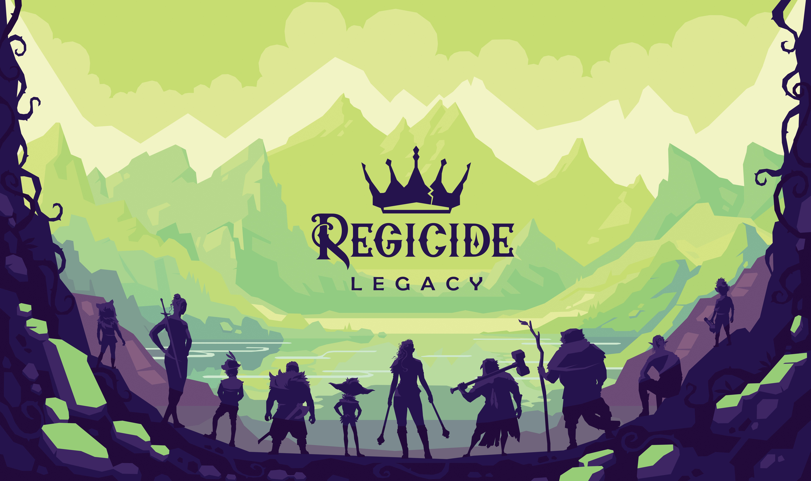
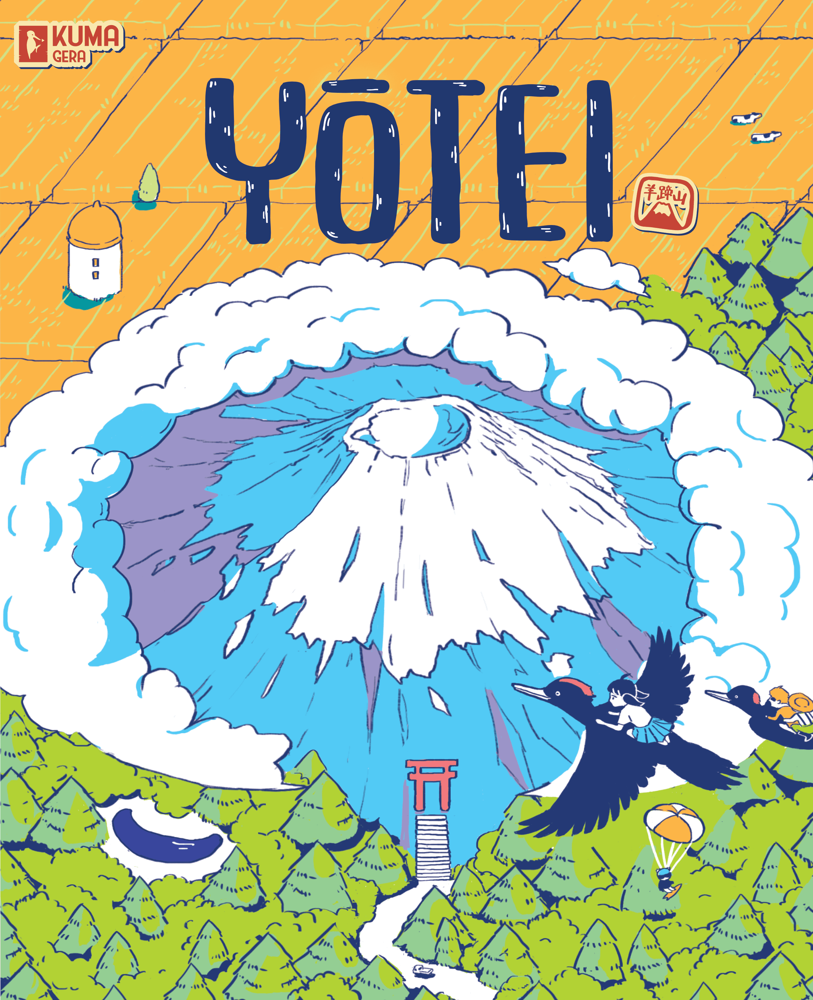

There has been a coup. [Regicide Legacy](https://boardgamegeek.com/boardgame/412963) has torn through the Hotness like a blade through a royal court, seizing the #1 spot out of nowhere and dragging its predecessor [Regicide](https://boardgamegeek.com/boardgame/307002) along for the ride at #9. Two slots for the same franchise in the top 10 is a statement  -  and a rare one.

This week's list is the most volatile we've seen in a month. **Eight new entries.** [Brass: Pittsburgh](https://boardgamegeek.com/boardgame/452264) drops from #1 to #4. Both Lord of the Rings titles that dominated for weeks have either dropped or vanished entirely. The lesson? The Hotness doesn't care about your campaign stretch goals from last week. It only cares about what landed today.

## This Week's Top 20

| # | Game | Trend |
|---|------|-------|
| 1 | [Regicide Legacy](https://boardgamegeek.com/boardgame/412963) | 🆕 NEW |
| 2 | [Nippon: Zaibatsu](https://boardgamegeek.com/boardgame/434367) | 🔺 +6 |
| 3 | [Yotei](https://boardgamegeek.com/boardgame/456860) | 🆕 NEW |
| 4 | [Brass: Pittsburgh](https://boardgamegeek.com/boardgame/452264) | 🔻 -3 |
| 5 | [Goa](https://boardgamegeek.com/boardgame/9216) | 🆕 NEW |
| 6 | [The Lord of the Rings: Fate of the Fellowship](https://boardgamegeek.com/boardgame/436217) | 🔻 -3 |
| 7 | [Ostia](https://boardgamegeek.com/boardgame/347767) | 🆕 NEW |
| 8 | [Mechs vs. Minions](https://boardgamegeek.com/boardgame/209010) | 🆕 NEW |
| 9 | [Regicide](https://boardgamegeek.com/boardgame/307002) | 🆕 NEW |
| 10 | [Brass: Birmingham](https://boardgamegeek.com/boardgame/224517) | 🔻 -3 |
| 11 | [SETI: Search for Extraterrestrial Intelligence](https://boardgamegeek.com/boardgame/418059) | 🔻 -2 |
| 12 | [Arcs](https://boardgamegeek.com/boardgame/359871) | 🔻 -7 |
| 13 | [Ark Nova](https://boardgamegeek.com/boardgame/342942) | ➡️ = |
| 14 | [Eternal Decks](https://boardgamegeek.com/boardgame/424981) | 🔻 -4 |
| 15 | [Wondrous Creatures](https://boardgamegeek.com/boardgame/400366) | 🆕 NEW |
| 16 | [Heat: Pedal to the Metal](https://boardgamegeek.com/boardgame/366013) | 🔻 -3 |
| 17 | [Spirit Island](https://boardgamegeek.com/boardgame/162886) | 🔻 -1 |
| 18 | [Speakeasy](https://boardgamegeek.com/boardgame/375459) | 🆕 NEW |
| 19 | [Dune: Imperium - Uprising](https://boardgamegeek.com/boardgame/397598) | ➡️ = |
| 20 | [Slay the Spire: The Board Game](https://boardgamegeek.com/boardgame/338960) | 🔻 -6 |

**Dropped off:** The Lord of the Rings: The King's Gambit, Gods & Mortals, The Great Sea, The Old King's Crown, Magical Athlete, Cozy Stickerville, Flip 7, Arkham Horror: The Card Game (Revised)

## Regicide Legacy takes the throne  -  and brings Regicide back from the dead

*Box art via BoardGameGeek. Regicide Legacy.*

The original [Regicide](https://boardgamegeek.com/boardgame/307002) was one of those games that shouldn't have worked. A cooperative card game played with a standard deck of playing cards, asking you to defeat the twelve face cards using suits as abilities. It was portable, brutal, clever, and it spread like wildfire during lockdown. The kind of game that costs nothing, fits in a pocket, and makes you hate the King of Spades with genuine intensity.

[Regicide Legacy](https://boardgamegeek.com/boardgame/412963) takes that foundation and does something ambitious: a full legacy campaign wrapping the cooperative card play in an overarching narrative. A corruption has spread through the world of Deccaria, the royalty have fallen under its influence, and a 40-strong band of adventurers  -  the Golden Blade Syndicate  -  has been called to fight back.

This is interesting territory. Legacy games are typically associated with heavy euros or sprawling campaign boxes. Wrapping legacy mechanics around what was essentially a trick-taking co-op suggests real design confidence. The question is whether the legacy arc adds genuine decision-space or just staples a story onto a game that didn't need one. Either way, the hobby has voted with its clicks  -  #1 on the Hotness is not something you stumble into.

The halo effect is real, too. [Regicide](https://boardgamegeek.com/boardgame/307002) itself has climbed back into the top 10 at #9, presumably because people are discovering Legacy and going "wait, I haven't played the original yet." That's the best marketing a game can have: a sequel that sends people backwards.

## Nippon: Zaibatsu surges to #2  -  the biggest mover of the week

*Box art via BoardGameGeek. Nippon: Zaibatsu.*

From #8 to #2 is a serious jump, and [Nippon: Zaibatsu](https://boardgamegeek.com/boardgame/434367) has been building momentum quietly for weeks. This is a new edition of [Nippon](https://boardgamegeek.com/boardgame/154809), the area-majority economic game set during Japan's Meiji-era industrialisation. Players run massive conglomerates  -  zaibatsu  -  building factories, shipping goods, and influencing regions across Japan.

The original was well-regarded but never quite broke through to the mainstream. This new edition seems designed to fix that: updated art, refined rules, and the kind of production values that modern Kickstarter campaigns have conditioned people to expect. The jump from #8 to #2 suggests the campaign is hitting its stride, possibly driven by a key stretch goal unlock or a strong review landing at the right time.

What's notable is that this is now sitting above [Brass: Pittsburgh](https://boardgamegeek.com/boardgame/452264) at #4. Two weeks ago, Brass looked untouchable. Today it's been leapfrogged by both Regicide Legacy and Nippon. The Hotness is merciless.

## Yotei arrives at #3  -  Iwari's spiritual successor from Mt Fuji

*Box art via BoardGameGeek. Yotei.*

[Yotei](https://boardgamegeek.com/boardgame/456860) is a brand new entry at #3, which is a striking debut. Set at the foot of Mt Yotei in Hokkaido (also known as Ezo Fuji), this is a town-building game where you expand your land with limited manpower, win bids using potatoes  -  yes, potatoes  -  and develop your settlement into something worth visiting.

The art appears gorgeous, leaning into the kind of serene Japanese aesthetic that the hobby has shown enormous appetite for recently (see: [Botanical](https://boardgamegeek.com/boardgame/421095), the Kanban EV expansion, the continued love for anything with a calming colour palette). A #3 debut suggests strong pre-release buzz, possibly from a Japanese publisher with a growing international reputation.

This is the kind of game that wins the Hotness on vibes alone  -  and sometimes that's exactly the right reason.

## Goa returns from the vault  -  a 2004 classic gets the reprint treatment

*Box art via BoardGameGeek. Goa.*

[Goa](https://boardgamegeek.com/boardgame/9216) at #5 is fascinating. This is a Rüdiger Dorn design from 2004  -  a strategy game of auctions and resource management set in the 16th-century spice trade. It was a major title in its era, sitting comfortably in the BGG top 100 for years before gradually receding as the hobby's output accelerated.

Its reappearance on the Hotness almost certainly means a reprint announcement. The new box art (visible in the BGG listing) confirms this  -  it's been given the modern treatment while keeping the core design intact. For collectors and euro enthusiasts, this is event-level news. Goa's auction mechanism is still one of the best implementations of competitive bidding in the hobby, and a new edition means a generation of players who missed it the first time around can finally experience what the fuss was about.

The hobby loves a comeback story, and Goa is exactly that.

## The rest of the new blood

**[Ostia](https://boardgamegeek.com/boardgame/347767) at #7**  -  A 1-4 player strategy game using a Mancala mechanism. You lead a fleet to explore oceans, trade goods, and develop a port. The Mancala-as-engine-builder pitch is distinctive enough to cut through the noise, and the current position suggests steady organic interest rather than a campaign spike.

**[Mechs vs. Minions](https://boardgamegeek.com/boardgame/209010) at #8**  -  Riot Games' cooperative campaign game is back on the Hotness, which almost certainly means a restock or new print run. This has been one of the hobby's best-value propositions since 2016  -  a massive box with miniatures, a full campaign, and programming mechanics, at a price point subsidised by League of Legends money. If it's back in stock, buy it. You won't see it again for a while.

**[Wondrous Creatures](https://boardgamegeek.com/boardgame/400366) at #15**  -  Build the world's leading creature reserve. The art looks gorgeous and the creature-collection theme is evergreen. New entry suggests a campaign launch or key preview.

**[Speakeasy](https://boardgamegeek.com/boardgame/375459) at #18**  -  1920s Prohibition-era Manhattan. Lucky Luciano. Mobsters. Territory control. The theme alone does half the work, and it's carved out a spot despite this week's chaotic shuffling.

## What fell off  -  and what it means

The most dramatic exit is **The Lord of the Rings: The King's Gambit**, which went from #2 last week to completely off the list. That's a hard fall for a game that had been clinging to the top 3 for weeks. [Fate of the Fellowship](https://boardgamegeek.com/boardgame/436217) survives at #6, but Middle-earth's grip on the Hotness is clearly loosening now that the initial announcement hype has burned through.

**Gods & Mortals** and **The Great Sea** also vanished  -  both were new entries last week and are already gone. That's the classic "one-week spike" pattern: a strong launch, a burst of clicks, and then the crowd moves on.

**The Old King's Crown** dropping from #15 to #33 continues a multi-week slide that suggests the campaign buzz has peaked. Meanwhile, **Cozy Stickerville** and **Flip 7** proved to be exactly the kind of lightweight titles that the Hotness chews up and spits out in a single cycle.

## The big picture

This is the most disruptive week in over a month. Eight new entries out of twenty is essentially a 40% roster change. The narrative has shifted from "big brands dominate" to "anything goes if the pitch is right."

[Regicide Legacy](https://boardgamegeek.com/boardgame/412963) at #1 is the headline, but the deeper story is about variety. We've got a legacy co-op card game, a Meiji-era economic sim, a Japanese town-builder with potato bidding, a 20-year-old euro reprint, a mancala port game, a League of Legends mech game coming back from the dead, a creature collection game, and a Prohibition mob game  -  all in the same top 20.

That's a healthy hobby. That's a list that says there's room for everything, provided you show up with something interesting to say.

The stalwarts  -  [Ark Nova](https://boardgamegeek.com/boardgame/342942), [Spirit Island](https://boardgamegeek.com/boardgame/162886), [Dune: Imperium - Uprising](https://boardgamegeek.com/boardgame/397598)  -  are still here, holding their ground like they always do. But this week belongs to the newcomers. And that's exactly how it should be.

---

*Data sourced from [BoardGameGeek Hotness](https://boardgamegeek.com/hotness) on April 13, 2026. Trends compared against last week's article. Box art images via BGG, credited to respective publishers.*
