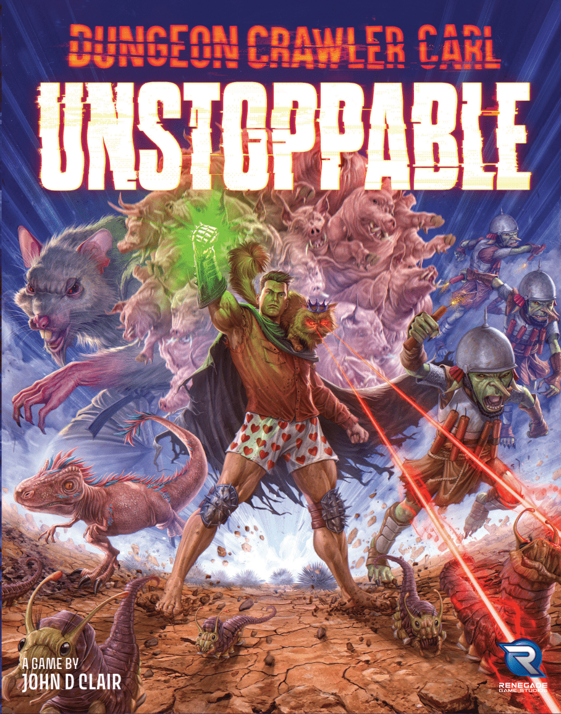
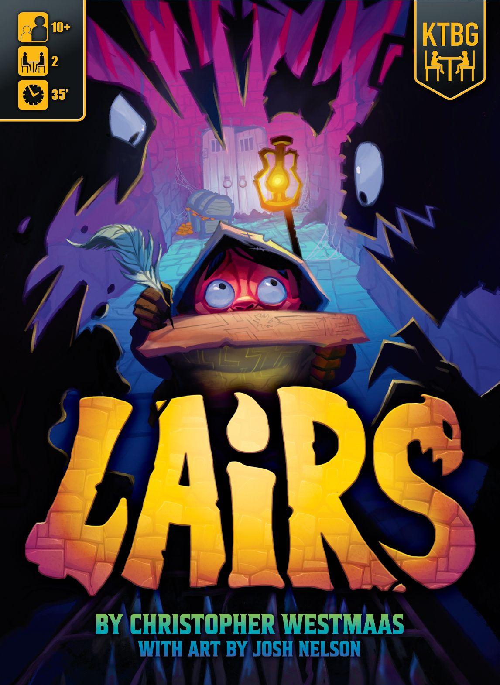
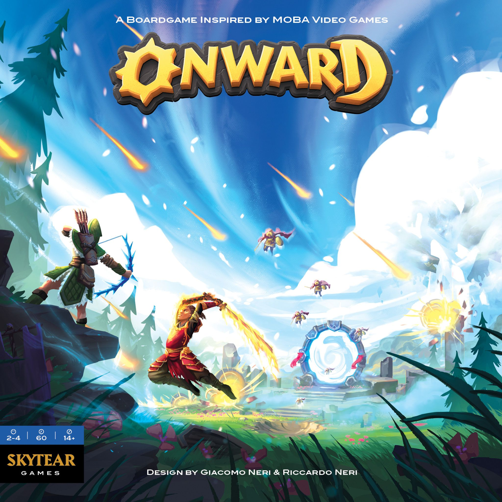
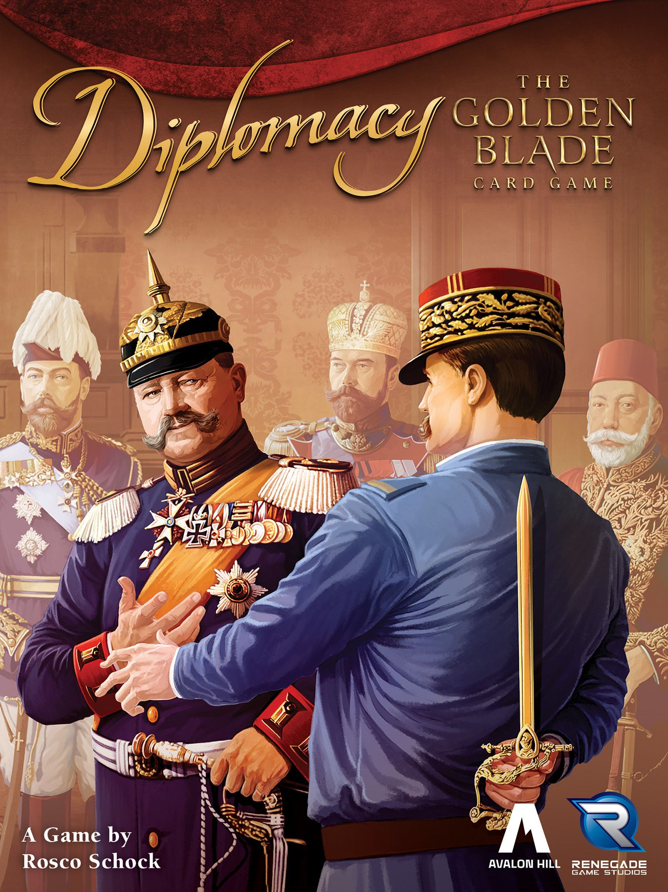

The dungeon has opened and the hobby is sprinting down the stairs. [Dungeon Crawler Carl: Unstoppable](https://boardgamegeek.com/boardgame/459928) has claimed the #1 spot on the BGG Hotness, riding the wave of one of the most beloved LitRPG franchises in modern fiction straight into the board game space. Last week's entire top 3  -  Regicide Legacy, Nippon: Zaibatsu, Yotei  -  have all been pushed down or out entirely. The crown changes hands fast on this list, and this week it belongs to Carl and Princess Donut.

Seven new entries have muscled into the top 20. [Excursions](https://boardgamegeek.com/boardgame/468800) arrives at #2 as a Galactic Cruise spin-off, [Lairs](https://boardgamegeek.com/boardgame/404883) takes #3 with its competitive dungeon-building pitch, and [Onward](https://boardgamegeek.com/boardgame/431929) at #9 brings MOBA-inspired skirmishing. Meanwhile, the evergreen heavyweights  -  Brass, Ark Nova, SETI  -  refuse to leave the building.

## This Week's Top 20

| # | Game | Trend |
|---|------|-------|
| 1 | [Dungeon Crawler Carl: Unstoppable](https://boardgamegeek.com/boardgame/459928) | 🆕 NEW |
| 2 | [Excursions](https://boardgamegeek.com/boardgame/468800) | 🆕 NEW |
| 3 | [Lairs](https://boardgamegeek.com/boardgame/404883) | 🆕 NEW |
| 4 | [Unstoppable](https://boardgamegeek.com/boardgame/420498) | 🆕 NEW |
| 5 | [Brass: Pittsburgh](https://boardgamegeek.com/boardgame/452264) | 🔻 -1 |
| 6 | [The Lord of the Rings: Fate of the Fellowship](https://boardgamegeek.com/boardgame/436217) | ➡️ = |
| 7 | [Nippon: Zaibatsu](https://boardgamegeek.com/boardgame/434367) | 🔻 -5 |
| 8 | [Arcs](https://boardgamegeek.com/boardgame/359871) | 🔺 +4 |
| 9 | [Onward](https://boardgamegeek.com/boardgame/431929) | 🆕 NEW |
| 10 | [SETI: Search for Extraterrestrial Intelligence](https://boardgamegeek.com/boardgame/418059) | 🔺 +1 |
| 11 | [Ark Nova](https://boardgamegeek.com/boardgame/342942) | 🔺 +2 |
| 12 | [Yotei](https://boardgamegeek.com/boardgame/456860) | 🔻 -9 |
| 13 | [Brass: Birmingham](https://boardgamegeek.com/boardgame/224517) | 🔻 -3 |
| 14 | [Eternal Decks](https://boardgamegeek.com/boardgame/424981) | ➡️ = |
| 15 | [Diplomacy: The Golden Blade](https://boardgamegeek.com/boardgame/455903) | 🆕 NEW |
| 16 | [Galactic Cruise](https://boardgamegeek.com/boardgame/391137) | 🆕 NEW |
| 17 | [Root](https://boardgamegeek.com/boardgame/237182) | 🆕 RE-ENTRY |
| 18 | [Barrage: Earned Authority](https://boardgamegeek.com/boardgameexpansion/467954) | 🆕 NEW |
| 19 | [20 Strong](https://boardgamegeek.com/boardgame/373167) | 🆕 RE-ENTRY |
| 20 | [Nemesis: Retaliation](https://boardgamegeek.com/boardgame/381248) | 🆕 RE-ENTRY |

**Dropped off:** Regicide Legacy, Goa, Ostia, Mechs vs. Minions, Regicide, Wondrous Creatures, Heat: Pedal to the Metal, Spirit Island, Speakeasy, Dune: Imperium - Uprising, Slay the Spire: The Board Game

## Dungeon Crawler Carl conquers the Hotness  -  LitRPG meets deck-building

*Box art via BoardGameGeek. Dungeon Crawler Carl: Unstoppable.*

If you haven't encountered [Dungeon Crawler Carl](https://boardgamegeek.com/boardgame/459928) as a book series, the pitch is this: aliens destroy Earth and turn the remnants into a reality TV dungeon crawl. Carl, a regular guy in boxer shorts, and his ex-girlfriend's cat Princess Donut must fight their way through increasingly absurd floors while the galaxy watches for entertainment. It's violent, funny, surprisingly emotional, and it has one of the most devoted fanbases in modern genre fiction.

The board game adaptation  -  subtitled *Unstoppable*  -  is a solo or 2-player co-op card-crafting deck-builder. You pick a hero, gear up, level through neighbourhood, borough, and city bosses, and try to reach the next floor. The card-crafting angle is key: this isn't just "draw and play," it's modifying your deck as you go, building the engine that keeps you alive.

What's remarkable is the velocity of this debut. Straight to #1 on the Hotness is rare for any game, let alone one attached to a franchise that most non-readers have never heard of. But that's the power of a passionate community  -  the Dungeon Crawler Carl subreddit, Discord, and Audible listeners have been waiting for this, and they showed up in force.

The connection to [Unstoppable](https://boardgamegeek.com/boardgame/420498) at #4 is worth noting  -  that's the base card-crafting system that DCC: Unstoppable builds upon. Both hitting the top 5 simultaneously is the same halo effect we saw with Regicide and Regicide Legacy last week. A strong IP lifts all boats.

## Excursions docks at #2  -  Galactic Cruise expands its universe

*Box art via BoardGameGeek. Excursions.*

[Excursions](https://boardgamegeek.com/boardgame/468800) is an expansion or standalone companion to [Galactic Cruise](https://boardgamegeek.com/boardgame/391137)  -  which itself has entered the top 20 this week at #16. The premise: you're a cruise director on a state-of-the-art space station, planning itineraries to thrill guests on out-of-this-world vacations.

A #2 debut is extraordinary for what is essentially a spin-off, but it speaks to how well Galactic Cruise has been received. The base game has clearly built enough goodwill that an expansion announcement sends people scrambling to click. Both games appearing in the top 20 simultaneously  -  Excursions at #2, Galactic Cruise at #16  -  is another instance of the franchise halo effect that's been a recurring theme these past few weeks.

The space tourism theme feels distinctly of-the-moment. With every SpaceX launch and Blue Origin announcement, the fantasy of casual space travel moves a little closer to cultural consciousness. Board games have always been good at letting us play in futures we can't quite reach yet.

## Lairs at #3  -  build a dungeon, then dare someone to survive it

*Box art via BoardGameGeek. Lairs.*

[Lairs](https://boardgamegeek.com/boardgame/404883) is a competitive dungeon-building game where you construct a devious dungeon and then explore your rival's creation. You're an Adventurers Guild hopeful taking a final exam  -  a head-to-head test of who can build the nastier labyrinth while surviving what the other person throws at you.

The "build-then-explore" structure is clever because it gives you both halves of the dungeon fantasy. You're the dungeon master *and* the adventurer, just not at the same time. It's the kind of symmetrical asymmetry that makes for natural rivalries: you know exactly how hard you made your dungeon, so watching someone struggle through it carries a specific, delicious schadenfreude.

At #3 with an 8.4 BGG rating already, Lairs is arriving with serious credentials. The dungeon-building genre has been underserved  -  most dungeon-crawl games put you on one side or the other, not both. This dual identity could be exactly the hook that gives it staying power.

## Onward at #9  -  the MOBA board game returns with a vengeance

*Box art via BoardGameGeek. Onward.*

[Onward](https://boardgamegeek.com/boardgame/431929) is the spiritual successor to Skytear, the competitive card-driven game inspired by MOBA video games like League of Legends and DOTA2. Players split into teams, each controlling two or more champions. The goal: destroy the enemy nexus. If that sounds like a tabletop translation of League, that's because it is  -  and it's the most direct attempt at that translation the hobby has produced.

The #9 debut suggests either a campaign hitting its stride or a strong review wave. MOBAs are one of the most popular video game genres on the planet, and the board game space has struggled to capture that energy. Skytear had its fans but never broke through to the mainstream. Onward seems designed to be the second attempt with lessons learned  -  tighter rules, better components, a clearer pitch.

An 8.5 BGG rating at this stage is ambitious but not unheard of for a game with an enthusiastic early backer community.

## Diplomacy: The Golden Blade at #15  -  Diplomacy in 15 minutes per player

*Box art via BoardGameGeek. Diplomacy: The Golden Blade.*

[Diplomacy: The Golden Blade](https://boardgamegeek.com/boardgame/455903) is doing something that sounds impossible: taking Diplomacy  -  the infamous 6-hour backstabbing marathon  -  and condensing it to 15 minutes per player. The original Diplomacy, first published in 1959, is one of the most important and most feared games ever designed. It has ended friendships, defined game theory discussions, and inspired more war stories than most actual wars.

The question is whether you can keep the knife-edge negotiation that makes Diplomacy *Diplomacy* while cutting the runtime by 80%. Strategy, negotiation, and backstabbing in a condensed format  -  the prelude to World War I, the seven great European powers, alliances that you know will be broken. If they've pulled it off, this could be one of the most significant reimaginings of a classic the hobby has seen. If they haven't, it'll be another "Diplomacy but shorter" attempt that misses what makes the original transcendent.

Either way, the Hotness is paying attention.

## The rest of the new blood

**[Unstoppable](https://boardgamegeek.com/boardgame/420498) at #4**  -  The base card-crafting system that Dungeon Crawler Carl builds upon. Darkest-timeline science fiction with gear-up-and-survive mechanics. Its #4 position is almost entirely driven by the DCC effect  -  people discovering the franchise through Carl and working backwards.

**[Galactic Cruise](https://boardgamegeek.com/boardgame/391137) at #16**  -  The base game that launched Excursions. Space tourism worker-placement with a luxury cruise aesthetic. Build and launch ships to send guests on lavish space vacations. The dual appearance with Excursions at #2 confirms this franchise is building real momentum.

**[Barrage: Earned Authority](https://boardgamegeek.com/boardgameexpansion/467954) at #18**  -  Sixteen community-driven Executive Officers for one of the hobby's most celebrated heavy euros. Barrage has one of the most passionate fanbases in modern gaming, and an expansion built from player ideas is exactly the kind of thing that energises a community. This is fan service done right.

**[Root](https://boardgamegeek.com/boardgame/237182) at #17, [20 Strong](https://boardgamegeek.com/boardgame/373167) at #19, [Nemesis: Retaliation](https://boardgamegeek.com/boardgame/381248) at #20**  -  Three re-entries from perennial favourites. Root is Root  -  the asymmetric woodland war game that never truly leaves the conversation. 20 Strong continues to find new solo players. And Nemesis: Retaliation keeps the alien-infested horror alive.

## What fell off  -  and what it means

The most striking exit is **Regicide Legacy**, which went from #1 last week to completely off the top 20. That's a brutal one-week reign. The entire Regicide franchise  -  both Legacy and the original  -  has vanished from the list after dominating last week. The Hotness giveth and the Hotness taketh away, and this week it taketh with particular enthusiasm.

**Goa** drops from #5 to #26, confirming that the reprint announcement spike has settled into background interest. Still on the broader top 50, but no longer commanding attention. **Ostia** and **Mechs vs. Minions** are both gone after single-week appearances  -  the classic spike-and-fade pattern.

The bigger story is the casualties among the stalwarts. **Spirit Island** drops from #17 to #21, **Heat: Pedal to the Metal** from #16 to #22, **Dune: Imperium - Uprising** from #19 to #25, and **Slay the Spire: The Board Game** from #20 to #27. None are far from the top 20, but the influx of new entries has squeezed them all out simultaneously. When seven new games arrive at once, something has to give  -  and this week it was the reliable mid-table residents.

**Speakeasy** drops from #18 to #30  -  the Prohibition-era mob game is fading faster than a bathtub gin supply.

## The big picture

Two weeks in a row with 7+ new entries is unusual and suggests the hobby is in a particularly active phase. Spring campaign season is in full swing, and publishers are clearly timing their announcements to stack on top of each other.

The franchise halo effect continues to be the dominant pattern. Last week it was Regicide and Regicide Legacy. This week it's Dungeon Crawler Carl: Unstoppable and Unstoppable, plus Excursions and Galactic Cruise. Games that arrive as part of an ecosystem  -  a sequel, an expansion, a spin-off  -  drag their predecessors into the spotlight. It's the most reliable way to claim multiple Hotness slots simultaneously.

[Dungeon Crawler Carl: Unstoppable](https://boardgamegeek.com/boardgame/459928) at #1 also signals something broader: the hobby is increasingly drawing from adjacent fandoms. LitRPG is a massive community that overlaps naturally with board gaming, and a well-executed adaptation can bring thousands of new eyes to BGG. The same way Dune: Imperium brought the sci-fi film crowd and Slay the Spire brought the roguelike video game crowd, DCC could be the game that introduces the LitRPG audience to cardboard.

The evergreens remain remarkable. [Brass: Pittsburgh](https://boardgamegeek.com/boardgame/452264) at #5 is now in its fourth consecutive week in the top 5. [Ark Nova](https://boardgamegeek.com/boardgame/342942) at #11 has been on the Hotness for what feels like geological time. [SETI](https://boardgamegeek.com/boardgame/418059) at #10 continues its quiet, consistent presence. These are the bedrock  -  the games that outlast every weekly upheaval.

Next week: Will Dungeon Crawler Carl hold the throne, or will the next wave wash it away? If the past month has taught us anything, it's that #1 is the loneliest number  -  everyone's gunning for it, and nobody stays long.

---

*Data sourced from [BoardGameGeek Hotness](https://boardgamegeek.com/hotness) on April 20, 2026. Trends compared against last week's article. Box art images via BGG, credited to respective publishers.*
