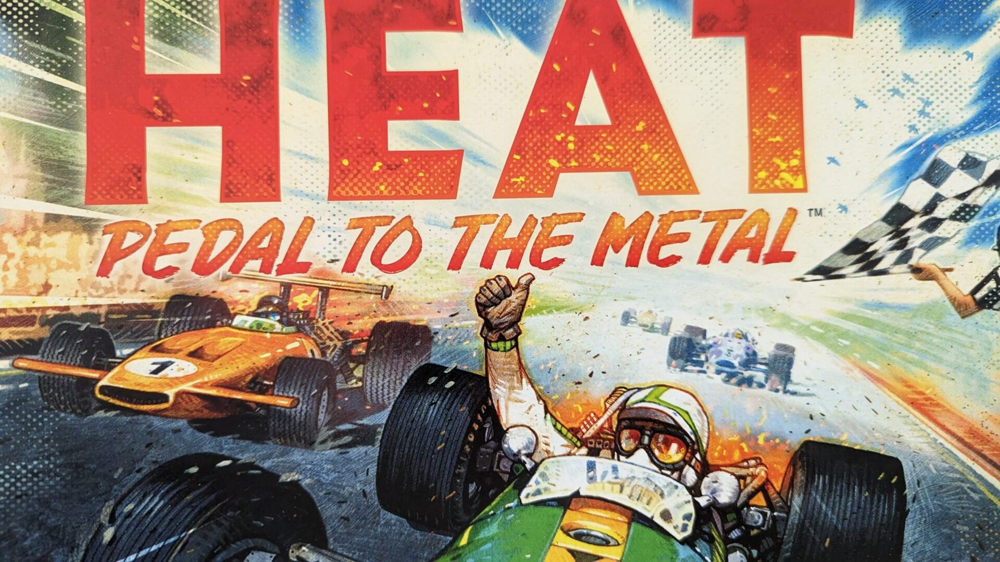
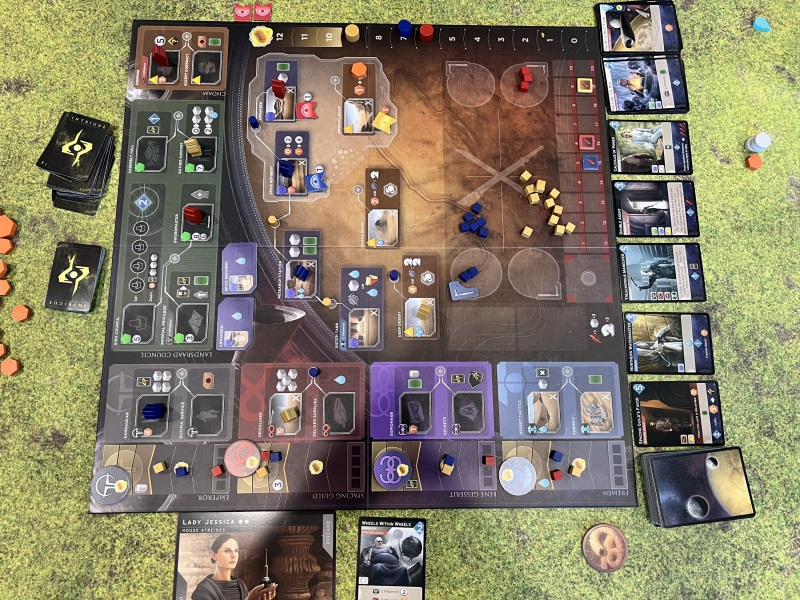

# BGG Hotness Review, Week of March 23, 2026

This week’s Hotness is saying something pretty loud. The hobby wants spectacle, yes. But it also wants familiarity. It wants the shiny new sci-fi campaign monster and the comfy old euro in fancy clothes. It wants cyberpunk robots, Roman merchants, cosmic dread, train-era economics, and apparently at least one cozy village-builder trying to elbow its way into the conversation.

That mix matters.

Because this week’s list is not just “new stuff good.” It’s a snapshot of a hobby that keeps bouncing between two instincts. One is novelty. The other is trust. People are chasing the unknown with [Phantom Epoch](https://boardgamegeek.com/boardgame/345013/phantom-epoch) at #1 and [Roborover 2077 Last Hope](https://boardgamegeek.com/boardgame/428359/roborover-2077-last-hope) at #4, but they’re doing it while keeping one hand firmly on [Concordia Special Edition](https://boardgamegeek.com/boardgame/465819/concordia-special-edition), [Arkham Horror: The Card Game](https://boardgamegeek.com/boardgame/205637/arkham-horror-the-card-game), [Heat: Pedal to the Metal](https://boardgamegeek.com/boardgame/366013/heat-pedal-to-the-metal), and [Dune: Imperium Uprising](https://boardgamegeek.com/boardgame/397598/dune-imperium-uprising).

So that’s what this article is really about: the tension between the week’s loudest new releases, the evergreen games that keep holding their ground, and the fringe titles that hint at where attention might go next. New hotness is winning attention. Evergreen systems are winning loyalty.

## The big picture: sci-fi is everywhere, but not all sci-fi is doing the same job

Count the list. [Phantom Epoch](https://boardgamegeek.com/boardgame/345013/phantom-epoch), [Roborover 2077 Last Hope](https://boardgamegeek.com/boardgame/428359/roborover-2077-last-hope), [Voidfall](https://boardgamegeek.com/boardgame/337627/voidfall), [Seti: Search for Extraterrestrial Intelligence](https://boardgamegeek.com/boardgame/418059/seti-search-for-extraterrestrial-intelligence), and arguably [Dune: Imperium Uprising](https://boardgamegeek.com/boardgame/397598/dune-imperium-uprising) are all living in the broad sci-fi neighborhood. That’s not a coincidence.

But here’s the thing: they’re not chasing the same audience.

[Phantom Epoch](https://boardgamegeek.com/boardgame/345013/phantom-epoch) is the big cinematic mystery box. Time travel, epoch-spanning narrative, preorder buzz. This is the “what even is this thing and why is everyone talking about it?” slot. [Roborover 2077 Last Hope](https://boardgamegeek.com/boardgame/428359/roborover-2077-last-hope) is cyberpunk co-op survival. Different flavor entirely. More direct, more tactical, easier pitch. [Voidfall](https://boardgamegeek.com/boardgame/337627/voidfall) is for the heavy crowd that sees a 4.4 weight and says, “Good. Make it worse.” [Seti: Search for Extraterrestrial Intelligence](https://boardgamegeek.com/boardgame/418059/seti-search-for-extraterrestrial-intelligence) goes the opposite direction, leaning accessible and fast with a real-time puzzle hook.

That spread tells me sci-fi isn’t trending because one game hit. It’s trending because publishers have figured out it can carry everything from family-adjacent tension to all-day brain melt. Fantasy used to dominate this lane by default. Not this week.

What jumps out once you stop treating sci-fi as one blob is how different the player fantasies are. [Voidfall](https://boardgamegeek.com/boardgame/337627/voidfall) is not asking you to feel wonder. It is asking you to feel pressure. Your faction board is a problem set. Your hand management is a tax code. The pleasure there comes from wrestling a giant machine into submission. Compare that to [Seti: Search for Extraterrestrial Intelligence](https://boardgamegeek.com/boardgame/418059/seti-search-for-extraterrestrial-intelligence), which is chasing immediacy. Thirty minutes, sliding-puzzle tension, everybody leaning forward because real-time mechanisms create that lovely little panic where your hands move faster than your brain. Same broad theme. Completely different night.

That matters for publishers too. Sci-fi used to be a risk because people assumed it meant complexity, chrome, and a table full of lore dumps. This list says the market has split wide open. You can sell sci-fi as premium campaign drama, as co-op survival, as heavy euro conflict, or as approachable pattern recognition. That is a huge shift. It means the theme is no longer the product. The mode of engagement is.

Look at [Roborover 2077 Last Hope](https://boardgamegeek.com/boardgame/428359/roborover-2077-last-hope). A cyberpunk co-op with an emerging rating around 7.8 and a 3.2 weight lives in a very different lane from [Phantom Epoch](https://boardgamegeek.com/boardgame/345013/phantom-epoch). One is likely to succeed because the table can talk through danger together. “You go left, I’ll cover the objective, somebody please deal with the drone before it ruins us.” The other is selling the big campaign hook, the sense that you are uncovering structure and consequence over time. Co-op tactical urgency versus narrative accumulation. Again, same shelf section at the store. Totally different emotional payoff.

I also think this is part of why fantasy feels a little less dominant right now. Fantasy remains huge, obviously, but sci-fi gives designers permission to justify mechanisms more flexibly. Real-time signal decoding makes sense in [Seti: Search for Extraterrestrial Intelligence](https://boardgamegeek.com/boardgame/418059/seti-search-for-extraterrestrial-intelligence). Brutal systems overhead makes sense in [Voidfall](https://boardgamegeek.com/boardgame/337627/voidfall). Timeline manipulation makes sense in [Phantom Epoch](https://boardgamegeek.com/boardgame/345013/phantom-epoch). The theme can carry wildly different mechanical moods without feeling forced. That’s powerful. And it’s why this week doesn’t read like a trend. It reads like a toolbox.

## Spotlight 1: [Phantom Epoch](https://boardgamegeek.com/boardgame/345013/phantom-epoch)

At #1 with a hotness score of 0.9, [Phantom Epoch](https://boardgamegeek.com/boardgame/345013/phantom-epoch) is the headline. No question.

And the hype makes sense. Time-travel sci-fi adventure is catnip for this hobby. Give people branching narrative, giant lore implications, and the promise that your choices ripple across eras, and the forums basically write themselves. The BGG threads for games like this always split into two camps. Camp one says, “This is the future of thematic gaming.” Camp two says, “Cool, but how many hours of setup are we talking?” Both are probably right.

What’s pushing it so hard right now is that sweet spot of release buzz plus preorder energy. People aren’t just discussing what it is. They’re projecting what it could be. That’s rocket fuel for the Hotness.

But does the hype feel justified? Mostly, yes.

The comparison point in the chatter is [Voidfall](https://boardgamegeek.com/boardgame/337627/voidfall), and that’s useful because it highlights what [Phantom Epoch](https://boardgamegeek.com/boardgame/345013/phantom-epoch) seems to be selling. Not just scale. Story. [Voidfall](https://boardgamegeek.com/boardgame/337627/voidfall) is admired because it’s enormous and demanding. [Phantom Epoch](https://boardgamegeek.com/boardgame/345013/phantom-epoch) sounds like it wants that same sense of grandeur but filtered through campaign immersion. Less “calculate this galactic position perfectly,” more “remember when we broke the timeline in session three?”

That’s a powerful pitch. If it lands, this could stick around well beyond launch-week chatter. If it doesn’t, this is exactly the kind of game the hobby overhypes because the concept is doing half the work.

Still. Right now? I get it.

## Spotlight 2: [Concordia Special Edition](https://boardgamegeek.com/boardgame/465819/concordia-special-edition)

I love this being at #2.

Not because I think every game needs a deluxe makeover. The hobby has absolutely lost its mind on premium editions. We do not need metal coins for every game about grain. But [Concordia Special Edition](https://boardgamegeek.com/boardgame/465819/concordia-special-edition) trending this high is a reminder that clean euro design still has serious pull.

The original [Concordia](https://boardgamegeek.com/boardgame/124361/concordia) has always had that magic trick quality. Your turn is simple. The consequences are not. You play a card, do the one thing it says, and somehow three rounds later you realize you’ve built a scoring engine so elegant it feels smug. It’s one of the best gateway-plus euros ever made because it respects your intelligence without making you eat a 28-page rulebook first.

So why is the special edition popping now with a 0.9 score? Production value, sure. But also rediscovery.

A lot of newer hobbyists came in through louder games: campaigns, miniatures, app integration, giant faction boards covered in icon soup. Then they finally sit down with [Concordia](https://boardgamegeek.com/boardgame/124361/concordia) and have that moment. “Wait, that’s it? That’s the whole ruleset?” Then the scoring hits and they start staring into the middle distance.

That’s how classics survive.

This also says something important about 2026. The hobby is maturing past the phase where old euros get treated like homework. Great systems are being repackaged and reintroduced, and people are realizing some of them still run circles around trendier designs. Not because they’re nostalgic. Because they’re good.

## Spotlight 3: [Brass: Pittsburgh](https://boardgamegeek.com/boardgame/452264/brass-pittsburgh)

At #13 with a 0.5 score, [Brass: Pittsburgh](https://boardgamegeek.com/boardgame/452264/brass-pittsburgh) is lower than the top cluster, but this is my favorite kind of Hotness entry. It doesn’t need to be #1 to feel important. It just needs to exist and make euro players start posting deranged map analyses at 1 a.m.

Early average rating around 8.3. Weight 3.8. Roxley. Martin Wallace lineage. Yeah, this was always going to hit.

The reason [Brass: Pittsburgh](https://boardgamegeek.com/boardgame/452264/brass-pittsburgh) matters is not just that people love Brass. It’s that the Brass formula has become one of the hobby’s most reliable tests for whether a new economic design has real teeth or just nice art. If you say your euro has interaction, network pressure, timing tension, and painful opportunity cost, somebody in the comments is going to ask, “Okay, but is it better than Brass?”

That’s the standard now.

So the hype here is less chaotic than [Phantom Epoch](https://boardgamegeek.com/boardgame/345013/phantom-epoch). It’s more exacting. People want to know what Pittsburgh changes. How the industries feel. Whether the map creates fresh incentives or just remixes known rhythms. Whether this is a true sibling to [Brass: Lancashire](https://boardgamegeek.com/boardgame/28720/brass-lancashire) and [Brass: Birmingham](https://boardgamegeek.com/boardgame/224517/brass-birmingham), or just another legacy extension.

I know, I know. Another Brass map. Hear me out. If the network incentives and industry tempo really do create a different strategic texture, that’s enough. Brass fans do not need fireworks. They need one route to matter one turn earlier than expected, and suddenly they’re in heaven.

## The evergreen crew is still bullying the algorithm

After the spotlights on the week’s biggest conversation pieces, it’s worth looking at the games that keep showing up because people are still actively invested in them. A lot of weekly Hotness lists get framed as a race between new releases. That’s too shallow. This week, the older games on the list are doing real work.

[Voidfall](https://boardgamegeek.com/boardgame/337627/voidfall) at #5 with 0.8 is the heavy-game crowd refusing to move on. Good. The game’s complexity complaints are real. The rules load is brutal. This is the kind of game where your first turn takes 20 minutes and you still don’t know what happened. But people are sticking with it because there’s actual substance there. Expansion chatter or post-release content only works if the foundation is strong.

[Arkham Horror: The Card Game](https://boardgamegeek.com/boardgame/205637/arkham-horror-the-card-game) at #9 with 0.7 is doing what Arkham always does. It rises whenever a new cycle gives players an excuse to go fully feral over investigator builds. Every few months the community remembers that this game still produces some of the best scenario storytelling in the hobby, then everyone starts arguing about taboo lists again.

[Heat: Pedal to the Metal](https://boardgamegeek.com/boardgame/366013/heat-pedal-to-the-metal) at #14 with 0.5 is maybe the healthiest sign on the whole list. Racing games used to get treated like side dishes. Now [Heat: Pedal to the Metal](https://boardgamegeek.com/boardgame/366013/heat-pedal-to-the-metal) gets expansions, organized play energy, and sustained buzz because it actually earns repeat plays. It’s fast, tense, readable, and dramatic. That matters.

And [Dune: Imperium Uprising](https://boardgamegeek.com/boardgame/397598/dune-imperium-uprising) at #16 with 0.4 is just proof that if you make a deck-building worker placement game this sharp, people will keep showing up.

## One to Watch: [Speakeasy](https://boardgamegeek.com/boardgame/375459/speakeasy)

If you want the riser that could jump from “oh neat” to “actually, this is sticking,” it’s [Speakeasy](https://boardgamegeek.com/boardgame/375459/speakeasy).

A 2026 release, 0.4 score, average rating around 7.7, medium weight, short runtime, accessible theme. That combination is sneaky dangerous. Not every game needs to dominate discourse with complexity. Sometimes a game climbs because people can get it played. Prohibition-era dice drafting and bar-building is exactly the kind of premise that gets pitched successfully to mixed groups. Easier teach. Better table presence. Lower commitment. More likely to hit the table twice in one night.

And that matters more than some BGG diehards want to admit.

If the early reaction stays positive, [Speakeasy](https://boardgamegeek.com/boardgame/375459/speakeasy) could become one of those “wait, this is actually everywhere now” titles by summer.

The reason I keep circling [Speakeasy](https://boardgamegeek.com/boardgame/375459/speakeasy) is that medium-weight, 45-minute games live or die on turn quality. If a dice drafting game gives you one obvious pick every round, people bounce off fast. If every die creates a tiny little argument in your head, now we’re talking. Do you grab the result that helps your own bar engine, or hate-draft the one your neighbor clearly needs to close a scoring burst? That tension is where games in this weight class earn repeat plays.

And the theme helps more than people admit. Prohibition-era bar-building gives the game a social texture that abstract euros can struggle to create. Players immediately understand why they are collecting ingredients, staffing up, and trying to draw a crowd. You do not need a ten-minute thematic preamble. The table gets it. That means the teach can focus on incentives. “These dice fuel your actions. This track rewards timing. This upgrade makes your later rounds much better.” Clean. Efficient. More importantly, playable with a wider range of groups.

Here’s the sort of thing that could make [Speakeasy](https://boardgamegeek.com/boardgame/375459/speakeasy) stick. In a good 45-minute euro, round two decisions should already be setting traps for round four. Maybe you take a weaker die now because it opens a better engine tile before the draft snakes back. Maybe you spend this turn improving your bar capacity instead of scoring because you can see the final round payoff coming. Those are the decisions people remember. Not because they are complicated, but because they feel smart.

The obvious comparison lane is accessible tableau and drafting games that punch above their weight. Not because [Speakeasy](https://boardgamegeek.com/boardgame/375459/speakeasy) necessarily plays like them, but because it seems built for the same role in a collection. The game you can teach after dinner without apology. The game that works with three hobbyists and one skeptical cousin. The game that gets suggested because nobody wants to spend 40 minutes rereading setup instructions.

Tactical tip, assuming the design follows the usual dice-drafting arc. Early flexibility is often better than early points. New players see a quick score and lunge. Experienced players look for action efficiency. If [Speakeasy](https://boardgamegeek.com/boardgame/375459/speakeasy) has any sort of engine ramp, the player who improves conversion options in the first half will often look quiet until the final turns, then suddenly pass everyone. That’s the kind of arc that gets people saying, “Okay, run that back.”

## The weird fringe of the list

If the top and middle of the Hotness show where attention is concentrated, the lower end shows where curiosity is forming. The lower entries are a mess in the fun way.

[Cozy Stickerville](https://boardgamegeek.com/boardgame/456440/cozy-stickerville) popping up, twice in the list no less, points to the ongoing cozy-game push. That trend is real, even if the Hotness scores are tiny. There’s an audience hungry for lower-conflict, softer presentation, village-building comfort food. The question is whether these games can maintain attention once the novelty wears off.

[Slay the Spire: The Board Game](https://boardgamegeek.com/boardgame/338960/slay-the-spire-the-board-game) hanging around on adaptation hype also fits the moment. Video game crossovers are no longer novelty acts. They’re expected. Some work. Some absolutely faceplant. The hobby has gotten much harsher about cash-in adaptations, which is good.

Then there’s [Grimcoven](https://boardgamegeek.com/boardgame/415845/grimcoven) and [All In Predictions](https://boardgamegeek.com/boardgame/457436/all-in-predictions), both sitting in that “people are clearly talking, but not enough data here to draw blood” zone. Sometimes the Hotness is less a verdict than a radar ping.

This lower band is where you can see hobby subcultures colliding. [Cozy Stickerville](https://boardgamegeek.com/boardgame/456440/cozy-stickerville) is the obvious example. A cozy village-builder by Corey Konieczka showing up on the Hotness would have sounded bizarre a few years ago, mostly because the market used to assume “cozy” meant “lightweight and forgettable.” That assumption is breaking down. Players are getting more comfortable asking for low-conflict games that still give them meaningful decisions. Not every weeknight game needs betrayal, warfare, or an apocalypse timer. Sometimes people want pleasant production, soft pacing, and enough engine-building to feel clever without feeling attacked.

But the cozy label can also become camouflage. That’s the trap. If [Cozy Stickerville](https://boardgamegeek.com/boardgame/456440/cozy-stickerville) is going to stick, it needs more than charming art and a village theme. It needs decision texture. Think about why games with gentle presentation sometimes fail after two plays. The first game is discovery. The second is comfort. By the third, if the choices are obvious, the whole thing collapses into routine. So seeing it on the fringe is interesting, but not yet convincing. The audience is there. The staying power still has to be earned.

[Slay the Spire: The Board Game](https://boardgamegeek.com/boardgame/338960/slay-the-spire-the-board-game) sits in a different kind of danger zone. Adaptations have a built-in conversation starter, which is great for Hotness. They also get judged twice. Once as a board game, once as a translation of the source material. Fans want the feeling of the video game run. Not just the iconography. They want that tempo where a build starts messy, then suddenly coheres into nonsense. If the adaptation captures that escalation, people evangelize it. If it just ports relic names and enemy art onto a generic deck-builder chassis, the internet gets mean very quickly. Deservedly.

Then you have titles like [Grimcoven](https://boardgamegeek.com/boardgame/415845/grimcoven) and [All In Predictions](https://boardgamegeek.com/boardgame/457436/all-in-predictions), which are useful reminders that the Hotness often rewards curiosity before consensus. A game can be trending because people are intrigued, confused, optimistic, skeptical, or all four at once. The BGG comments section for those games is often less a review space and more a weather report. You are not reading verdicts. You are reading pressure systems forming.

## So what does this week mean?

This week says the hobby is broadening without flattening.

The blockbuster campaign game is alive and well. So is the elegant euro reprint. So is the heavyweight space beast. So is the evergreen LCG. So is the fast racing game. So is the medium-light thematic release that might quietly become a staple.

That’s healthy.

If there’s one clear directional signal, it’s this: theme matters more than ever, but only when it’s attached to a structure people trust. That’s why [Phantom Epoch](https://boardgamegeek.com/boardgame/345013/phantom-epoch) and [Roborover 2077 Last Hope](https://boardgamegeek.com/boardgame/428359/roborover-2077-last-hope) can surge, but [Concordia Special Edition](https://boardgamegeek.com/boardgame/465819/concordia-special-edition) can sit right beside them. People want to be excited. They also want to know the game won’t collapse on turn four.

My bold take? The most justified hype this week is [Concordia Special Edition](https://boardgamegeek.com/boardgame/465819/concordia-special-edition). The loudest hype is [Phantom Epoch](https://boardgamegeek.com/boardgame/345013/phantom-epoch). The one euro players will still be debating six months from now is [Brass: Pittsburgh](https://boardgamegeek.com/boardgame/452264/brass-pittsburgh).

And the hobby overall? It looks curious, confident, and very, very willing to go to space.

It also looks more stable in its variety than it used to. The hobby used to lurch harder from one dominant fashion to the next. Zombies everywhere. Then giant campaign boxes everywhere. Then nature themes. Then every third announcement was a roll-and-write. You still get waves, sure, but this week’s Hotness suggests the market is less monoculture than it used to be. Multiple lanes are healthy at once, and that is good for players because it lowers the pressure to pretend one style of game is the future.

That same pattern shows up in how older designs are being brought back into the conversation. Reprints and special editions are no longer just nostalgia bait. [Concordia Special Edition](https://boardgamegeek.com/boardgame/465819/concordia-special-edition) being up at 0.9 beside [Phantom Epoch](https://boardgamegeek.com/boardgame/345013/phantom-epoch) tells you presentation upgrades now function as curation. They are signals to newer players. “Hey, this older game still matters. Come look.” That can be cynical, sure. Some deluxe editions are pure shelf-candy inflation. But when it works, it keeps great designs alive in the conversation instead of letting them get buried under weekly launch churn.

There’s another takeaway too. Weight is fragmenting in a healthy way. This list has [Seti: Search for Extraterrestrial Intelligence](https://boardgamegeek.com/boardgame/418059/seti-search-for-extraterrestrial-intelligence) around 2.2, [Concordia Special Edition](https://boardgamegeek.com/boardgame/465819/concordia-special-edition) around 2.5, [Arkham Horror: The Card Game](https://boardgamegeek.com/boardgame/205637/arkham-horror-the-card-game) at 3.0, [Dune: Imperium Uprising](https://boardgamegeek.com/boardgame/397598/dune-imperium-uprising) at 3.3, [Brass: Pittsburgh](https://boardgamegeek.com/boardgame/452264/brass-pittsburgh) at 3.8, and [Voidfall](https://boardgamegeek.com/boardgame/337627/voidfall) at 4.4. That spread is not random. It tells you publishers are getting better at targeting specific play situations instead of trying to sand every design into broad appeal. Some nights you want a 30-minute puzzle race. Some nights you want to disappear into a two-hour engine war. The best publishers know which promise they are making.

And finally, this week reinforces something I keep coming back to. Hype is not the enemy. Empty hype is. If a game trends because it gives players a clear fantasy, a coherent rules identity, and enough table stories to sustain discussion, great. That’s healthy excitement. What kills momentum is vagueness. This week’s strongest games all have a clean sentence attached to them. Time-travel narrative epic. Deluxe classic euro. Cyberpunk co-op survival. Heavy space empire-builder. Lovecraft campaign card game. Industrial economic sequel. Racing game with heat management. You can picture the night before the box is even open. That clarity is where the hobby is heading, and frankly, I love it.