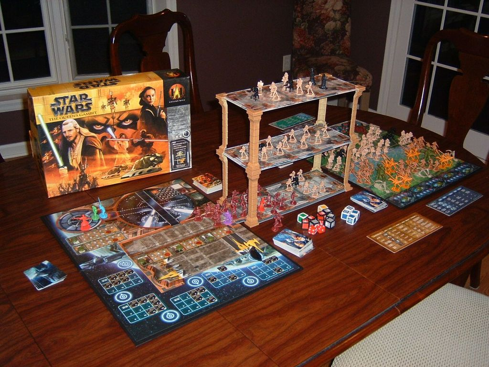
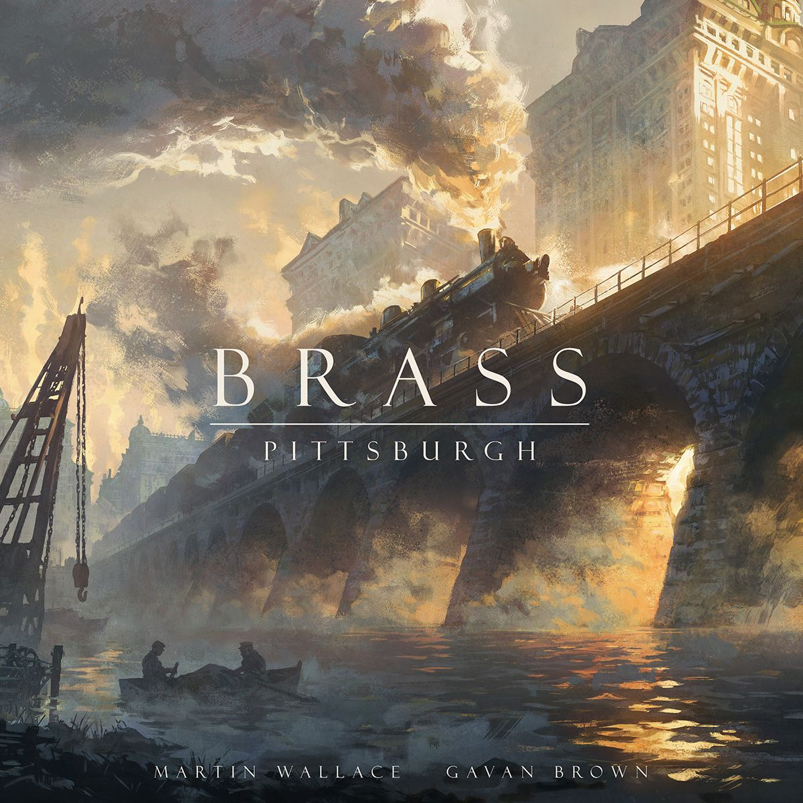
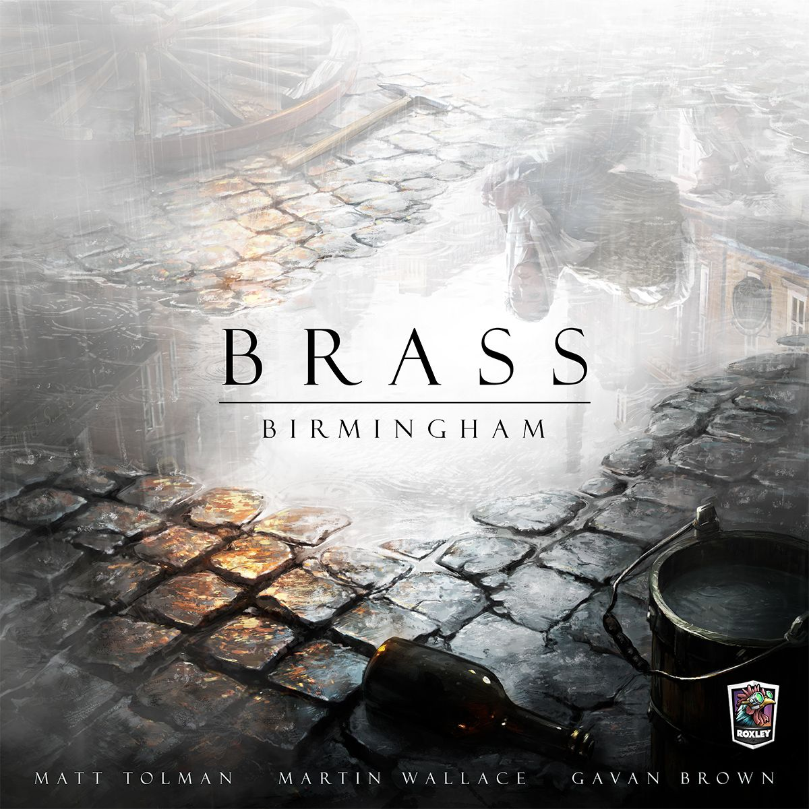

# BGG Hotness Review: Week of March 30, 2026

## This Week's Top 20

| # | Game | Trend |
|---|------|-------|
| 1 | [The Lord of the Rings: The King's Gambit](https://boardgamegeek.com/boardgame/467694) | 🆕 NEW |
| 2 | [Star Wars: The Queen's Gambit](https://boardgamegeek.com/boardgame/939) | 🆕 NEW |
| 3 | [Brass: Pittsburgh](https://boardgamegeek.com/boardgame/452264) | 🔺 +10 |
| 4 | [The Lord of the Rings: Fate of the Fellowship](https://boardgamegeek.com/boardgame/436217) | 🔺 +4 |
| 5 | [Brass: Birmingham](https://boardgamegeek.com/boardgame/224517) | 🔺 +6 |
| 6 | [The Old King's Crown](https://boardgamegeek.com/boardgame/357873) | 🔺 +1 |
| 7 | [Nippon: Zaibatsu](https://boardgamegeek.com/boardgame/434367) | 🔻 -1 |
| 8 | [Grimcoven](https://boardgamegeek.com/boardgame/415845) | 🔺 +11 |
| 9 | [Slay the Spire: The Board Game](https://boardgamegeek.com/boardgame/338960) | 🆕 NEW |
| 10 | [SETI: Search for Extraterrestrial Intelligence](https://boardgamegeek.com/boardgame/418059) | ➡️ = |
| 11 | [Arcs](https://boardgamegeek.com/boardgame/359871) | 🔺 +4 |
| 12 | [Ark Nova](https://boardgamegeek.com/boardgame/342942) | ➡️ = |
| 13 | [Heat: Pedal to the Metal](https://boardgamegeek.com/boardgame/366013) | 🔺 +1 |
| 14 | [Concordia: Special Edition](https://boardgamegeek.com/boardgame/465819) | 🔻 -12 |
| 15 | [Phantom Epoch](https://boardgamegeek.com/boardgame/345013) | 🔻 -14 |
| 16 | [Voidfall](https://boardgamegeek.com/boardgame/337627) | 🔻 -11 |
| 17 | [Magical Athlete](https://boardgamegeek.com/boardgame/454103) | 🆕 NEW |
| 18 | [Harmonies](https://boardgamegeek.com/boardgame/414317) | 🆕 NEW |
| 19 | [Arkham Horror: The Card Game](https://boardgamegeek.com/boardgame/205637) | 🔻 -10 |
| 20 | [Spirit Island](https://boardgamegeek.com/boardgame/162886) | 🆕 NEW |

**Dropped off:** One Piece Dawn Of Liberation, Roborover 2077 Last Hope, Dune Imperium Uprising, All In Predictions, Speakeasy

This week’s Hotness is dominated by two clear trends.

First, IP still moves mountains.  
Second, heavy euros are not going anywhere.

You can see it immediately. At #1 and #2, we’ve got franchise-fueled revival [hype](/posts/hype-vs-reality-march-2026-edition-2026-03-29/) with [The Lord of the Rings: The King's Gambit](https://boardgamegeek.com/boardgame/467694) and [Star Wars: The Queen's Gambit](https://boardgamegeek.com/boardgame/939). Then right behind them, the brass-knuckled euro crowd shows up with [Brass: Pittsburgh](https://boardgamegeek.com/boardgame/452264) and [Brass: Birmingham](https://boardgamegeek.com/boardgame/224517). Mix in a co-op Tolkien hit, a couple of buzzy heavy strategy games, and two modern monsters in [Slay the Spire: The Board Game](https://boardgamegeek.com/boardgame/338960) and [SETI: Search for Extraterrestrial Intelligence](https://boardgamegeek.com/boardgame/418059), and you get a Hotness list that feels very 2026.

So this week isn’t just about who is ranked where. It’s about why these particular games are rising together: revival nostalgia, durable heavy strategy, and polished productions that give players something to talk about before the box even hits the table.

People want spectacle. They also want systems that bite back.

## The week’s big story: nostalgia is back, but dressed for 2026

The top of the list is basically one giant “remember this?” aimed at two of the biggest fandoms on Earth. But the reason it’s landing is not just nostalgia. It’s nostalgia plus restoration, nostalgia plus event production, nostalgia plus hobby polish.

That dynamic starts with the new headline-grabber, then loops back to the older game that gave it its shape.

## 1) [The Lord of the Rings: The King's Gambit](https://boardgamegeek.com/boardgame/467694)

This is the headline act. A revived classic, rethemed from *The Queen’s Gambit*, now wrapped in Tolkien grandeur and aimed squarely at people who want their bluffing games to feel theatrical.

The pitch is filthy good. A bluffing memory game for **2-4 players**, stones in a line, claims, challenges, instant-win swagger, instant-loss humiliation. That core is already proven. What’s driving the current surge is the September 2026 crowdfunding launch from Restoration Games and Space Cowboys, plus the promise of a deluxe edition with towering 3D Minas Tirith and Mordor elements.

That matters. Of course it matters. BGG loves a game that sounds like it could dominate a coffee table from orbit.

But the part I actually like is that this isn’t just giant plastic nonsense stapled onto a dead design. The original pitch here, as a tense social memory duel with high-stakes reveals, has real table appeal. This is the kind of game where everybody suddenly becomes very certain about information they absolutely do not have. Somebody taps a stone, squints, and starts talking like they’ve seen the face of God. Then they flip it and explode. Great stuff.

Is the hype justified? Right now, yes. Cautiously.  
The danger is obvious. Spectacle can bury clarity. If this thing turns into a deluxe shrine for collectors and loses the sharpness that makes bluffing games sing, the comments section will turn into a bonfire. For now, though, it deserves the #1 spot because it has the one thing the Hotness rewards more than anything else: people can already imagine the table moment.

## 2) [Star Wars: The Queen's Gambit](https://boardgamegeek.com/boardgame/939)

Right behind LOTR is the old legend itself. Or at least the version people know.

Published in **2000**, rated **7.58/10** from **2,310 ratings**, sitting at **2.48/5** weight and overall rank **#1285**, [Star Wars: The Queen's Gambit](https://boardgamegeek.com/boardgame/939) is suddenly back in the discourse because the new LOTR revival has reminded everybody this design exists. That’s how BGG works. One shiny announcement and suddenly people are digging through twenty-year-old forum threads and posting blurry shelf photos like they’ve uncovered the Dead Sea Scrolls.

The funny part is that this game has always had a weird aura around it. Some of it is deserved. Some of it is collector mythology. Some of it is just people being unable to separate “I loved seeing this as a kid” from “this is a clean modern design.” Those are not the same thing.

Still, the current buzz makes sense. A memory-bluffing structure with a huge franchise skin is catnip for hobby spectators, and the **2-4 player**, **120 minute** footprint gives it that old-school “event game” energy. You don’t bring this up because you want efficiency. You bring it up because you want the room to care.

My take? The renewed attention is deserved, but mostly as context. This is less “everyone should hunt down a copy immediately” and more “now we understand why publishers think this design family can work again.”

## The euro block is as strong as ever

If the top of the list is driven by fandom heat, the middle and lower half are driven by the old reliable truth of board gaming: euro players never sleep. They just compare maps, argue about incentives, and ask if the new version is tighter.

That shows up both in the week’s newest contender and in the games that have already become benchmarks.

## 3) [Brass: Pittsburgh](https://boardgamegeek.com/boardgame/452264)

This is the week’s most interesting “prove it” game.

[Brass: Pittsburgh](https://boardgamegeek.com/boardgame/452264) is sitting at **6.56/10** from **255 ratings**, weight **3.75/5**, overall rank **#9663**, for **2-4 players**. Those numbers are the definition of early turbulence. Tiny rating pool. Huge name. Immediate comparison to one of the most beloved euros ever made. Brutal conditions.

And that’s exactly why it’s hot.

Any new game carrying the *Brass* label is going straight into a firing squad of hobby expectations. People want fresh map decisions, sharper timing questions, and a reason for this to exist beyond “what if Birmingham, but elsewhere?” The early buzz suggests players are intrigued by the Gilded Age Pittsburgh setting and the possibility of a different industrial texture. Steel and rail fit the series perfectly. No problem there.

The problem is obvious too. If your game enters the world standing next to [Brass: Birmingham](https://boardgamegeek.com/boardgame/224517), you are not being judged fairly. You are being judged by people who have memorized link bottlenecks and can smell a weak market from across the room.

I’m glad it’s here. I’m not ready to crown it. But as a Hotness story, it makes complete sense.

## The evergreens are still punching everybody in the throat

Some games do not leave the conversation. They just wait for an excuse to return.

That matters this week because the Hotness is not only rewarding newness. It’s also rewarding games that have become standards, reference points, or modern canon.

[Brass: Birmingham](https://boardgamegeek.com/boardgame/224517) at #5 remains absurd. **8.57/10** from **57,559 ratings**. Weight **3.86/5**. Overall rank **#1**. There are games that are popular, and then there are games that become measuring sticks. Birmingham is a measuring stick. Every economic euro with interaction gets dragged into its orbit eventually.

[Slay the Spire: The Board Game](https://boardgamegeek.com/boardgame/338960) at #9 is also now firmly in that modern canon lane. **8.66/10** from **12,006 ratings**, rank **#18**, weight **2.91/5**. That’s wild. A video game adaptation this clean was never guaranteed. Most adaptations show up, wave a familiar logo around, and leave. This one actually translated the compulsion loop. You can feel that in the reception.

[SETI: Search for Extraterrestrial Intelligence](https://boardgamegeek.com/boardgame/418059) at #10 is the other giant. **8.42/10** from **18,418 ratings**, weight **3.83/5**, rank **#17**. This game has graduated from “hot new euro” to “yeah, this is one of the defining games of the moment.” Science themes used to be a niche flex. Now a game about probes, signals, and alien research can sit in the top 10 and nobody blinks.

## New blood with real traction

Alongside those evergreens, the rest of the top 10 has a healthy amount of “recent games that are no longer just buzz, they’re sticking.”

[The Lord of the Rings: Fate of the Fellowship](https://boardgamegeek.com/boardgame/436217) at #4 is the strongest proof that Tolkien isn’t just moving copies on theme alone. This thing has a **8.32/10** rating from **7,671 ratings**, a **3.07/5** weight, and an overall rank of **#119**. That is not curiosity. That is staying power. A **1-5 player**, **60-150 minute** co-op with narrative weight and meaningful pressure was always going to find an audience. The fact that it’s still this hot says players are actually keeping it in rotation.

[The Old King's Crown](https://boardgamegeek.com/boardgame/357873) at #6, with **8.09/10** from **2,402 ratings**, **3.64/5** weight, rank **#923**, fits a similar pattern from a different angle. The title sounds like it should be some dusty abstract discovered in a monastery, but the description points to a card-driven conquest game about heirs fighting over an overgrown kingdom. That explains the climb. It’s got that “mid-heavy strategy game with a big identity” lane that hobby players love to champion once it starts clicking.

[Nippon: Zaibatsu](https://boardgamegeek.com/boardgame/434367) at #7 is another sign that reprints and refreshed editions are having a moment. **8.53/10** from **734 ratings**, **3.61/5** weight, rank **#2324**. That’s a very healthy start for a game with this much economic crunch. People clearly wanted this back.

And [Grimcoven](https://boardgamegeek.com/boardgame/415845) at #8 is the dark-horse mood piece. **8.41/10** from **777 ratings**, **3.60/5** weight, rank **#3040**, **1-4 players**, **90-270 minutes**. A dark Victorian boss battler with miniatures was always going to pull attention. The real question is whether it becomes a campaign staple or just a gorgeous shelf idol. The BGG forums for games like this are usually split between “masterpiece” and “why is setup my part-time job?”

## One to Watch: [The Old King's Crown](https://boardgamegeek.com/boardgame/357873)

This is my pick.

Not because it’s the biggest game here. It isn’t. Not because it has the loudest marketing. It doesn’t. But because it has the profile of a game that can climb from “people are curious” to “people are evangelical” very fast. An **8.09/10** rating from **2,402 ratings** is already serious. Rank **#923** means there’s room to surge. And “card-driven conquest with asymmetry over a fallen kingdom” is exactly the sort of phrase that gets repeated in group chats until someone caves and buys it.

Watch this one.

## What this week means for the hobby

Three things.

First, licensed games are no longer expected to coast on theme alone. If you want the top spot, you need a hook, a table presence, and some reason hobby players can defend their excitement beyond “I like Star Wars.” That’s why [The Lord of the Rings: The King's Gambit](https://boardgamegeek.com/boardgame/467694) is getting real traction.

Second, the appetite for heavy strategy remains ridiculous. [Brass: Birmingham](https://boardgamegeek.com/boardgame/224517), [Brass: Pittsburgh](https://boardgamegeek.com/boardgame/452264), [Nippon: Zaibatsu](https://boardgamegeek.com/boardgame/434367), [SETI: Search for Extraterrestrial Intelligence](https://boardgamegeek.com/boardgame/418059), even [The Old King's Crown](https://boardgamegeek.com/boardgame/357873), this is not a lightweight list. The hobby keeps growing, but it’s growing upward too. People want denser games. Not everybody, obviously. But enough to keep these monsters hot.

Third, polish matters more than ever. New editions, revived classics, deluxe productions, refined adaptations. Players are rewarding games that feel considered. Not just bigger. Better shaped.

That’s the real story this week. The hobby is still chasing novelty, sure. But it’s increasingly chasing novelty with pedigree. New games that echo old classics. Old systems rebuilt with modern expectations. Familiar worlds attached to designs that can survive the first play.

That’s a pretty healthy place to be.