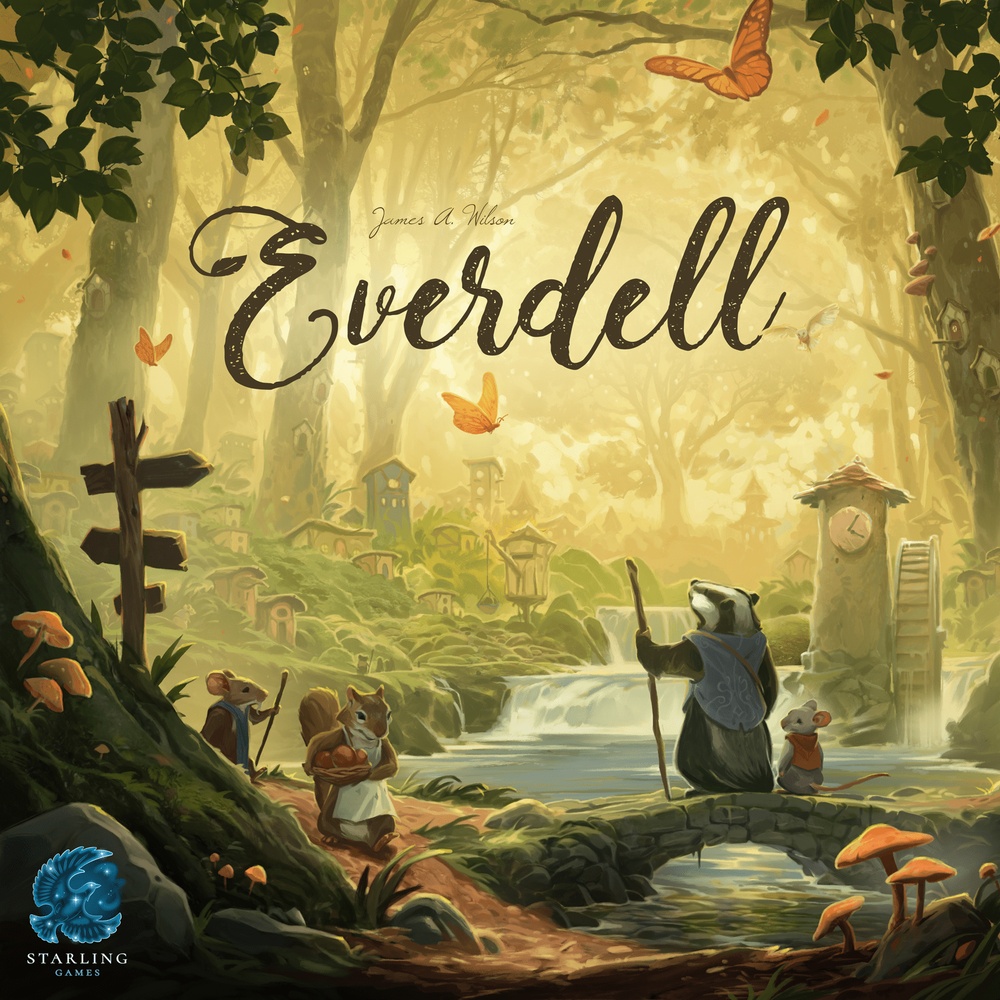

They're the two games most likely to convert someone from "I don't play board games" to "I have a shelf problem." Both dripping with natural beauty. Both engine builders at heart. Both sitting in BGG's top 50 with enormous, passionate fanbases.

[Wingspan](https://boardgamegeek.com/boardgame/266192/wingspan) and [Everdell](https://boardgamegeek.com/boardgame/199792/everdell) are the gateway drugs of the modern board gaming renaissance — and they're remarkably similar on paper. Nature themes. Tableau building. Card-driven engines. Gorgeous production. A welcoming complexity that says "you can do this" while hiding genuine strategic depth underneath.

But play them back to back and the differences become clear fast. One is a quiet, almost meditative puzzle. The other is a bustling woodland economy. If you're choosing between them — or wondering whether both deserve shelf space — here's the full breakdown.

## At a Glance

| Category | Wingspan | Everdell | Edge |
|---|---|---|---|
| BGG Rating | 8.00 (#38 overall) | 7.98 (#42 overall) | 🏆 Wingspan (marginal) |
| Weight | 2.48 / 5 | 2.83 / 5 | Depends on taste |
| Players | 1–5 | 1–4 | Wingspan (higher count) |
| Play Time | 40–70 min | 40–80 min | Similar |
| Year | 2019 | 2018 | — |
| Family Game Rank | #6 | #9 | 🏆 Wingspan |
| Strategy Game Rank | #48 | #50 | Similar |

Two games so close in ratings and rankings that the numbers barely matter. The differences are in how they *feel*.

## The Core Loop

### Wingspan: Elegant Efficiency

Wingspan gives you a personal board divided into three habitats — forest, grassland, and wetland — each mapped to a core action: gain food, lay eggs, or draw cards. On your turn, you pick one action and activate an entire row of birds from right to left, triggering their powers as you go.

That's it. One choice per turn. But the beauty is in how your engine compounds. Early game, placing a bird in the forest might net you one food. By round four, that same action cascades through five birds, each triggering different powers, generating a chain of resources that would've taken three turns to assemble earlier.

The constraint is brutal and elegant: you have just 26 actions across four rounds (8, 7, 7, 4). Every single placement matters. Every bird you *don't* play is a choice too.

### Everdell: Bustling Economy

Everdell gives you workers to place and a tableau of up to 15 cards — a mix of critters and constructions that form your woodland city. Workers go to shared board locations or into your own played cards. Cards chain together: build an Inn and you can recruit an Innkeeper for free. Construct a Dungeon and you can toss underperforming critters inside for points.

The rhythm feels completely different. Where Wingspan is "one clean action, watch the chain react," Everdell is "juggle three currencies, hunt for combos, and figure out when to recall your workers to trigger the next season." There's more *stuff* happening — more decisions per turn, more paths to stumble into (or down).

## Where Wingspan Wins

### 1. Accessibility

Wingspan is one of the most teachable mid-weight games ever made. The three-row board is intuitive. The action selection is dead simple. New players grasp the flow within two rounds and start making genuine strategic choices by round three. The Automa solo mode is clean enough to learn the game without another human present.

Everdell's teach takes longer. The seasonal structure, worker recall timing, the construction-to-critter pairing system, special events, forest locations — there's more to absorb before the game clicks. Not *hard*, but noticeably more layered.

### 2. Downtime

With experienced players, Wingspan moves quickly. One action, resolve your chain, done. Even at five players, turns rarely drag because everyone's mostly building in their own space. There's interaction — competing for bird cards, end-of-round goals, bonus cards — but it's indirect enough that you can plan ahead.

Everdell at four players can bog down. More shared spaces to evaluate, more card combinations to consider, and the seasonal asymmetry means players sometimes have wildly different numbers of available actions in a given round.

### 3. Production (Eggs, Specifically)

The egg miniatures. The dice tower bird feeder. The card art featuring 170+ unique bird species illustrated by Natalia Rojas and Ana Maria Martinez Jaramillo. Wingspan's production is iconic and part of why it broke into mainstream consciousness. It's a game that non-gamers pick up off a shelf because it's *beautiful*.

## Where Everdell Wins

### 1. Depth and Replayability

This is where Everdell pulls ahead for experienced gamers. The 128-card base deck offers vastly more combinatorial variety than Wingspan's bird cards. The construction-critter pairing system means you're not just building an engine — you're building *architecture*, where the relationships between cards matter as much as the cards themselves.

Wingspan can start to feel samey after 30+ plays if you're not mixing in expansions. The three habitats always work the same way. Your strategic choices boil down to "which row do I invest in and when?" Everdell's branching card combos mean two games with identical starting hands can play out completely differently.

### 2. Theme Integration

Here's the controversial take: Everdell's theme works *better mechanically* despite Wingspan having the more educational, real-world theme.

In Everdell, building a Farm to grow berries to feed critters who work in your Monastery makes intuitive sense. The card abilities map to what the buildings and creatures *do*. In Wingspan, the connection between a bird's real-world behaviour and its game power is often tenuous. The Eastern Bluebird doesn't really care about your egg economy. You're appreciating the art and trivia, not living the theme.

### 3. The Evertree

Everdell's table presence is absurd. That massive 3D tree centrepiece dominating the table — it's impractical, it's unnecessary, and it's *glorious*. It turns every game night into an event. Wingspan is beautiful in a restrained, sophisticated way. Everdell is beautiful in a "wait, that's a BOARD GAME?" way.

### 4. Expansion Ecosystem

Both games have strong expansions, but Everdell's feel more transformative. Spirecrest adds a mountaintop exploration layer. Bellfaire adds player powers and a modular board. Pearlbrook adds an underwater tableau. Each one fundamentally changes how the game plays.

Wingspan's expansions (European, Oceania, Asia) primarily add new birds and minor mechanism tweaks (nectar in Oceania being the biggest). They're good — Oceania especially — but they're more "more of the same, slightly different" rather than "here's a whole new dimension."

## Solo Mode Showdown

Both have excellent solo modes, but they work differently:

**Wingspan's Automa** uses a simple card-driven AI that mimics an opponent. It's fast to run, adds tension through competition for end-of-round goals, and the difficulty scales well. It's widely considered one of the best solo modes in board gaming — efficient, challenging, and satisfying.

**Everdell's Rugwort** (solo opponent) is more thematic but fiddlier to manage. You're running a simplified version of the game for an AI opponent, which means more upkeep per round. The experience is good, but the Automa's elegance is hard to beat.

**Solo edge: Wingspan.** Less overhead, more focused puzzle, faster to play.

## Who Should Buy Which?

**Buy Wingspan if you:**
- Want something you can teach to literally anyone
- Play regularly at 4–5 players
- Value low downtime and clean turns
- Love real-world nature and bird trivia
- Want a top-tier solo experience
- Prefer elegance over complexity

**Buy Everdell if you:**
- Want more strategic depth in a similar weight class
- Love discovering card combos and building engines that surprise you
- Play mostly at 2–3 players
- Want a game that grows dramatically with expansions
- Value table presence and wow factor
- Don't mind a slightly longer teach

**Buy both if you:** can recognise that they scratch different itches despite surface similarities. Wingspan is your weeknight game, your "introduce someone new" game, your solo afternoon game. Everdell is your weekend afternoon game, your "we've played 50 games this year and want something deeper" game.

## The Verdict

These games are so close in quality that declaring a winner feels almost dishonest. They're both modern classics. They both deserve their spots in the BGG top 50.

But pressed to choose: **Wingspan is the better *game*. Everdell is the better *hobby*.**

Wingspan delivers a more consistent, more elegant, more accessible experience every single time you play it. Everdell rewards investment — the more you play, the more you expand, the more combos you discover, the richer it becomes.

If you're building a collection and can only start with one, Wingspan is the safer pick. If you already love board games and want something that'll grow with you, Everdell might be the one that stays on your shelf longer.

Either way, you're getting something beautiful.

---

*Have strong feelings about this one? We'd love to hear which side of the Wingspan vs Everdell debate you land on. Find us on [Twitter/X](https://x.com/TheDiceDrop).*
