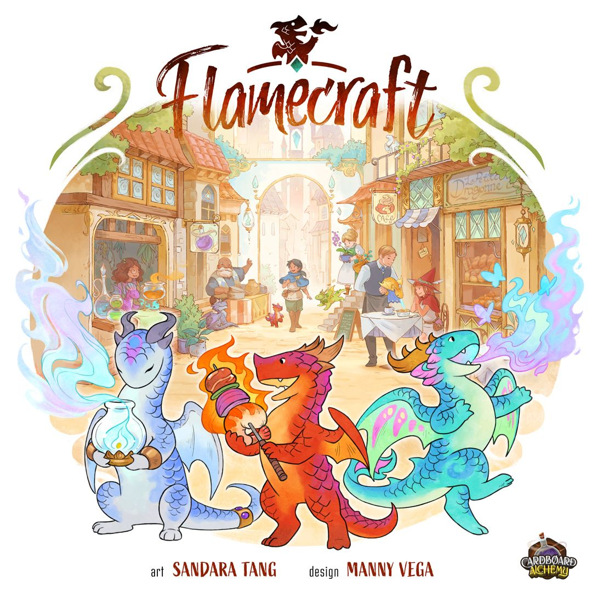
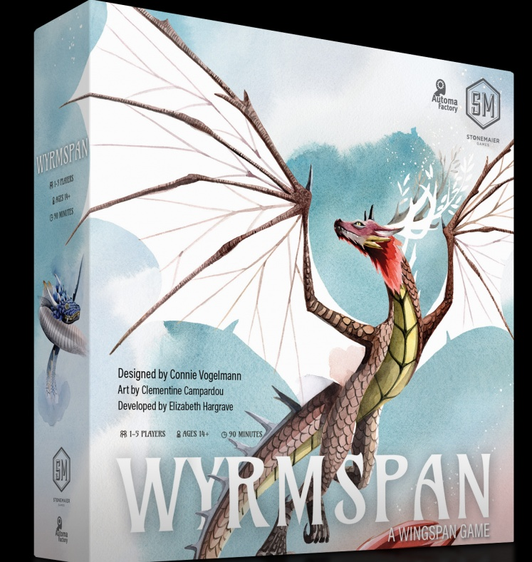
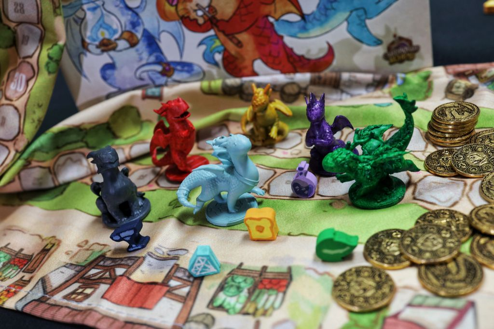
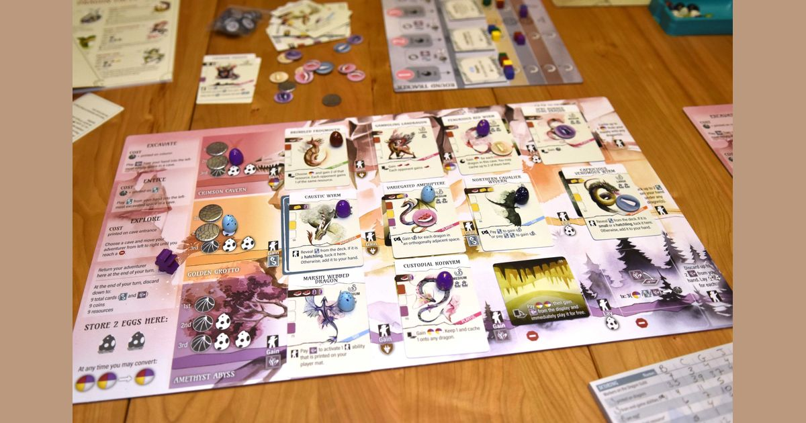

Two dragon games. Two very different moods.

One says, "Come build a clever engine in your private cave system and spend the next 90 minutes trying to feel smarter than your own cards." The other says, "Come to the village, put adorable artisan dragons in shops, and have a lovely time." Both work. Only one is the better buy for most people.

If you're deciding between [Wyrmspan](https://boardgamegeek.com/boardgame/410201/wyrmspan) and [Flamecraft](https://boardgamegeek.com/boardgame/336986/flamecraft), the real question is not theme. They're both dragon games. The question is what kind of evening you want: brain-burny engine planning, or breezy shared-board charm.

This comparison looks at exactly that. Below, we'll compare complexity, theme, replayability, value for money, player count, table presence, and learning curve to show which game fits which kind of group, and which one is the stronger overall buy.

## Quick comparison

| Category | Wyrmspan | Flamecraft | Winner |
|---|---|---|---|
| Complexity | 2.82/5 weight, 90 min | 2.18/5 weight, 60 min | 🏆 Flamecraft |
| Theme & Immersion | Big fantasy dragons, cave excavation, dracology | Cosy artisan dragons helping village shops | 🏆 Flamecraft |
| Replayability | Deeper card planning, more combo space | More accessible, but engines can blur together | 🏆 Wyrmspan |
| Value for Money | More game to dig into over time | Easier to table, broader audience | 🏆 Wyrmspan |
| Player Count Sweet Spot | Best at 2-3 | Best at 2-4 | 🏆 Flamecraft |
| Table Presence | Attractive cave tableau and dragon art | One of the cutest tables in modern board gaming | 🏆 Flamecraft |
| Learning Curve | More systems, more icon friction | Much easier teach | 🏆 Flamecraft |

[Wyrmspan](https://boardgamegeek.com/boardgame/410201/wyrmspan) was published in 2024, plays 1-5, runs about 90 minutes, carries a 7.96 rating from 15,216 ratings, and sits at #123 on BGG. [Flamecraft](https://boardgamegeek.com/boardgame/336986/flamecraft) came out in 2022, also plays 1-5, runs about 60 minutes, has a 7.37 rating from 20,985 ratings, and sits at #396. That already tells part of the story. Wyrmspan is the more highly regarded game in hobby circles. Flamecraft is the easier one to get to the table.

## The core difference: private puzzle versus shared village

This is where the decision starts.

In [Wyrmspan](https://boardgamegeek.com/boardgame/410201/wyrmspan), you're building your own little dragon economy. Before you even get to the fun part of stuffing dragons into your tableau, you need to excavate cave spaces. That matters. It means progression is gated. You are not simply playing a good card because you drew it. You are asking, can I open the right cave, in the right row, get the right resources, and line up the ability timing so this dragon actually pays off?

That extra layer is the whole point. Your tableau develops in stages. The cave itself is part of the puzzle.

[Flamecraft](https://boardgamegeek.com/boardgame/336986/flamecraft) goes the other way. It's a shared village worker placement game. You place your dragon on a shop, gather resources, maybe trigger dragons there, maybe enchant the shop for points and bonuses. The board is communal, the actions are visible, and the turn-to-turn rhythm is much friendlier. You look at the village, spot a shop that gives what you need, and off you go.

This makes Flamecraft more interactive in a light-touch way. People care about what shops are available and which dragons are sitting where. But it also means your engine belongs less to you. It lives in the town. Everyone is dipping into the same ecosystem.

Wyrmspan feels more strategic because your choices stack. Flamecraft feels more sociable because the board keeps everyone looking in the same direction.

With that baseline in place, the rest of the comparison becomes much easier to follow. Most of the differences below come back to that same split: Wyrmspan asks more of you, while Flamecraft gives more back immediately.

## Complexity

🏆 **Winner: Flamecraft**

The numbers back this up. Wyrmspan sits at **2.82/5** on BGG weight. Flamecraft is **2.18/5**. That gap is real at the table.

Flamecraft is the kind of game you can teach to non-hobby friends without watching their souls leave their bodies. Place a dragon. Use a shop. Collect resources. Enchant shops for bigger rewards and points. The iconography is manageable, the turns are readable, and new players usually understand what a good turn looks like pretty quickly.

Wyrmspan is not brutal, but it is definitely more involved. Excavation, dragon placement restrictions, resource costs, row activation, the Dragon Guild rondell, round goals. None of these systems alone are scary. Put together, they create the sort of first play where someone says, "Right, I think I get it," and then spends two rounds discovering that they did not, in fact, get it.

If your group likes medium-weight engines, that's a feature. If your group wants dragon-themed comfort food, it isn't.

## Learning curve

🏆 **Winner: Flamecraft**

That complexity gap also shows up in how each game teaches.

Wyrmspan's biggest weakness is not complexity by itself. It is friction. The ability symbology is less immediately readable than it ought to be, especially compared with cleaner modern engine builders. You can feel players pausing to parse what a card is asking them to do.

Flamecraft teaches cleaner and lands faster. New players can make reasonable decisions without understanding every wrinkle. That's a huge strength. A game that respects the first play earns goodwill.

Wyrmspan is worth learning. But Flamecraft is easier by a country mile.

## Theme and immersion

🏆 **Winner: Flamecraft**

Once the rules question is out of the way, theme is the next obvious divider.

[Wyrmspan](https://boardgamegeek.com/boardgame/410201/wyrmspan) gives you the grander fantasy. You're an amateur dracologist excavating a hidden labyrinth and enticing dragons into it. It's imaginative, and the fact that the dragons are all invented gives the design room to be playful. There is something satisfying about opening up cave slots and populating them with increasingly weird beasts.

But [Flamecraft](https://boardgamegeek.com/boardgame/336986/flamecraft) absolutely nails its setting. Tiny artisan dragons helping bakers, smiths, and potion shops is such a ridiculous pitch, and it works immediately. People sit down, see the art, and smile. Not a polite "that's nice" smile. A real one. The sort that gets the game bought in the first place.

Theme in Flamecraft isn't just art either. The idea of dragons specialising in different crafts maps cleanly onto the resource and shop system. The village feels inhabited. Cosy sells, yes, but this one earns it.

## Table presence

🏆 **Winner: Flamecraft**

That thematic appeal also carries over to the table.

Wyrmspan is attractive. The cave tableau grows nicely, the dragons are eye-catching, and there is real satisfaction in seeing your personal board fill out.

Flamecraft, though, is a show-off. In the best way. It has that rare quality where people across the room ask what you're playing. The shops, the tiny dragons, the whole cosy village presentation. It lands.

This matters more than hobby lifers like to admit. A game with strong table presence gets played more. Flamecraft absolutely has that magic.

## Replayability

🏆 **Winner: Wyrmspan**

If Flamecraft wins on approachability and presentation, Wyrmspan starts pulling away once repeated plays matter more.

The card play is simply more demanding. Dragons can only go in certain rows. You need the correct cave progression. You need the right resources. Then you need those abilities to matter when activated from left to right. Add the Dragon Guild rondell and round objectives, and suddenly you're planning across multiple layers at once.

That creates real variety. Not fake variety where the cards are different colours but the decisions feel identical. Real variety, where one game pushes you toward heavy cave development, another leans on ability chaining, and another is shaped by awkward dragon requirements that force you into a weird but rewarding line.

Flamecraft has variety too, but its engines can feel samey after a while. Why? Because many turns boil down to a familiar loop: go to the shop that gives the resources you need, trigger dragons there, line up an enchantment if possible, score a tidy bundle, repeat. Different shops and dragon mixes change the texture, but the strategic arc often feels similar. You're still working the village efficiently and trying to time enchantments well.

The problem is not that Flamecraft lacks decisions. It doesn't. The problem is that those decisions often live in the same register. Wyrmspan gives you more room to build something strange.

## Value for money

🏆 **Winner: Wyrmspan**

That deeper replayability feeds directly into value.

This category is not just box size and bits. It is how much game you get for your spend, and how long that interest lasts.

Flamecraft gives strong value because it is easy to teach, attractive on the table, and broadly appealing. If you buy games for mixed groups, families, or people who usually bounce off heavier hobby stuff, that matters a lot. A game that actually gets played is worth more than a clever one gathering dust.

But Wyrmspan gives more long-term value for a strategy-minded buyer. More depth, more room to improve, more satisfying discovery over repeated plays. I've seen plenty of games where the first play is the best play because the charm does all the heavy lifting. Wyrmspan has enough [mechanical](/posts/mechanic-deep-dive-tableau-building/) bite to keep paying out once the novelty wears off.

If you know you want a dragon engine builder and not just a dragon-themed good time, Wyrmspan is the stronger purchase.

## Player count sweet spot

🏆 **Winner: Flamecraft**

Another practical difference is how comfortably each game scales.

Both games support **1-5**, and both are better below the top end. No shock there. Scheduling five adults is already a co-op boss battle.

Wyrmspan shines at **2-3 players**. At that count, you get enough space to think, enough pace to stay engaged, and the game doesn't overstay its welcome. Push it to four or five and the downtime becomes more noticeable, especially with newer players puzzling through card text and turn sequencing.

Flamecraft is more forgiving. I'd happily play it at **2-4**, and even five is less alarming because turns are shorter and the shared village keeps everyone more connected to the action. You care about where people go. You watch enchantments appear. The board state remains readable.

For regular two-player households, both work. For groups that regularly hit four, Flamecraft is the safer bet.

## Verdict

[Wyrmspan](https://boardgamegeek.com/boardgame/410201/wyrmspan) is the better game for most hobby gamers, period.

It has the deeper engine, the more interesting long-term planning, and the better replayability. The excavation system gives your tableau real shape. Dragon placement restrictions force harder decisions. The combo-building has more bite. If you enjoy medium-weight strategy games and want a dragon-themed engine builder with actual teeth, this is the one to buy.

[Flamecraft](https://boardgamegeek.com/boardgame/336986/flamecraft) wins where this article says it wins: accessibility, theme, table presence, easier teaching, and a friendlier player-count range. It is delightful. I like it. I'd happily play it. But I would not choose it over Wyrmspan for my own shelf unless I specifically needed a welcoming game for lighter groups.

So yes, clear answer.

Buy **Wyrmspan** if you want the stronger game.

Buy **Flamecraft** if you want the easier game.